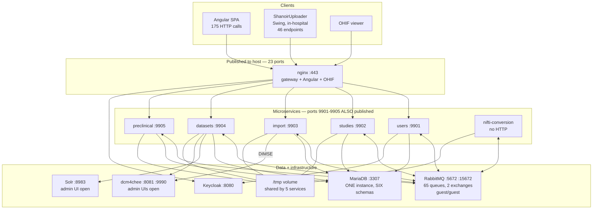

# Shanoir-NG — Whole-System Analysis and Synthesis

**Scope**: every microservice, shared library, client and infrastructure component in this repository.
**Method**: ten independent deep audits (one per component), plus independent verification of every Critical
finding by a coordinating reviewer. Static analysis only — no builds, no containers, no network calls, no
source modifications.
**Baseline**: commit `867e53290`, Maven version `3.4.0`, image namespace `NG_v2.12.0`.
**Date**: 2026-08-13.

---

## 1. Executive summary

Shanoir-NG is a mature, genuinely capable neuroimaging data platform: 17 runtime services, ~250k lines of
application code, a rich imaging domain model, DICOM/NIfTI/BIDS/EEG support, PACS integration, Solr search,
and a real user base in clinical research (OFSEP, Neurinfo). The domain modelling is thoughtful and the
imaging expertise embedded in the code is substantial and hard to replicate.

The defects are almost entirely **not** in the services. They are in the **seams between them**.

Every single Critical finding across all ten audits sits on a boundary: the authorization filter that sits
between a controller and its data, the audit trail that spans all services, the message fabric that carries
consistency between schemas, the anonymization library shared between the in-hospital client and the server,
the `/tmp` volume shared by five containers, the cross-schema migrations, and the API contract between the
frontend and the backend. Individually each service is a competent Spring Boot application. Collectively they
form a distributed system with no reliability primitives, no dependable audit trail, and an authorization
layer with verified holes.

**Overall verdict**: the application layer is *mature*; the distributed-systems layer and the operational
layer are *development-grade*. In its shipped default configuration this platform should not be operated
unattended on identifiable patient data without the remediation in §11.

### The seven findings that matter most

Each was independently verified against source by the coordinating reviewer, not merely reported.

| # | Finding | Severity | Where |
|---|---|---|---|
| 1 | De-identification is defeated by the channel next to it: the imaging files are anonymized, but the JSON import job travelling alongside them carries full patient identity in cleartext | Critical | `shanoir-uploader/.../ImportUtils.java:110-118` |
| 2 | Message broker published to the host with default credentials, Java deserialization enabled, and listeners that self-elevate to `ROLE_ADMIN` | Critical | `docker-compose.yml:80-82`, `SecurityContextUtil.java:50` |
| 3 | Subject-listing authorization filters do nothing — they compute the correct filtered list, then discard it | Critical | `StudySecurityService.java:420,446,472,499,522` |
| 4 | SQL injection on an endpoint with no authorization annotation at all | Critical | `ProcessingDownloaderServiceImpl.java:266,270` |
| 5 | TLS hostname verification silently bypassed in the in-hospital client | Critical | `CustomHostnameVerifier.java:34-36` |
| 6 | The audit trail cannot attribute actions: 29 of 43 security contexts are fabricated as `ROLE_ADMIN`, and cleared once | Critical | `SecurityContextUtil.java:50`, 15 files |
| 7 | No backups of any datastore, and two documented flags destroy all data | Critical | repo-wide absence; `bootstrap.sh` |

### What is genuinely good

It is worth being explicit, because a defect-focused audit distorts the picture:

- **The domain model.** The imaging hierarchy (Study → Subject → Examination → DatasetAcquisition → Dataset →
  DatasetExpression → DatasetFile) is well-factored and reflects real DICOM semantics.
- **Anonymization is shared, not forked.** The desktop client instantiates the *server's* anonymization
  library rather than reimplementing it. This is the single best architectural decision in the codebase, and
  it means fixing the engine fixes every import path at once.
- **Token handling in the frontend is correct.** Authorization Code + PKCE, tokens in memory only, never in
  `localStorage` and never in a URL. This is frequently done wrong and is right here — preserve it.
- **The frontend framework layer is current.** Angular 21.2, TypeScript 5.9, standalone components, new
  control flow, ESLint enforced in CI.
- **Container builds are well-engineered.** Multi-stage, cache-mounted, `COPY --link`, self-documenting.
- **All inter-service traffic is asynchronous.** There is not a single outbound REST call between
  microservices — the fabric is uniformly AMQP. The topology is sound; only its reliability primitives are
  missing.

---

## 2. Component inventory and per-service verdicts

| Component | LOC | Main / Test | Verdict | Report |
|---|---|---|---|---|
| `shanoir-ng-datasets` | 68,706 | 466 / 47 | Poor / at risk | [datasets.md](datasets.md) |
| `shanoir-ng-front` | 46,281 | 424 `.ts` | Moderate | [front.md](front.md) |
| `shanoir-ng-studies` | 28,101 | 188 / 52 | Poor / at risk | [studies.md](studies.md) |
| `shanoir-uploader` | 26,349 | 163 / 10 | Unsafe to ship | [shanoir-uploader.md](shanoir-uploader.md) |
| `shanoir-ng-preclinical` | 20,570 | 152 / 58 | Poor — weakest backend | [preclinical.md](preclinical.md) |
| `shanoir-ng-users` | 12,325 | 80 / 22 | At risk | [users.md](users.md) |
| `shanoir-ng-import` | 12,296 | 73 / 7 | Poor | [import.md](import.md) |
| shared libraries (×6) | 11,877 | 127 / 4 | Poor, structurally | [ms-common-and-shared-libraries.md](ms-common-and-shared-libraries.md) |
| `shanoir-ng-nifti-conversion` | 2,829 | 26 / 0 | Poor / high risk | [nifti-conversion.md](nifti-conversion.md) |
| infrastructure & CI/CD | — | — | Unfit for unattended production | [infrastructure-and-platform.md](infrastructure-and-platform.md) |

The shared-library group covers `ms-common` (7,691), `storage` (1,319), `anonymization` (1,199),
`study-rights` (746), `exchange` (636) and `keycloak-auth` (286).

**Note on `datasets`.** At 68,706 LOC and 466 classes it holds datasets, examinations, study cards, quality
cards, Solr indexing, BIDS export, download/zip export, DICOMWeb, dataset processing and VIP pipeline
execution. Three independent audits — datasets, frontend and platform — each concluded it is a monolith
wearing a microservice label. That convergence is the strongest architectural signal in this analysis.

---

## 3. Service interactions: the verified topology

### 3.1 Runtime shape



### 3.2 The message fabric, quantified

65 queue-name constants, 64 central `Queue` beans, 2 exchanges (`events-exchange` topic,
`study-user-exchange` fanout), plus 2 declared outside the "centralised" config. Every queue is
`new Queue(name, true)` — durable, with **zero arguments**.

| Property | State |
|---|---|
| Dead-letter queues | **None** |
| Message TTLs | **None** |
| Retry policies | **None** |
| Publisher confirms | **None** |
| Quorum queues | **None** |
| Tracing / correlation IDs | **None** |
| Message versioning | **None** |
| Synchronous RPC queues | **30 of 65** |
| Reply timeout configured | **Only `studies` (60s)**; elsewhere Spring's 5s default |

Verified listener counts per service: `datasets` 22, `studies` 20, `users` 9, `nifti-conversion` 3,
`preclinical` 2, `import` 1.

That last number is the shape of the whole system. **`import` consumes exactly one queue** — the rights
fanout — and publishes 13. Ingestion is fire-and-forget into `datasets`, across a fabric with no
dead-lettering and no retry.

### 3.3 The rights fanout, and who is missing from it

`studies` owns `study_user` and broadcasts every mutation over the `study-user-exchange` **fanout** to three
subscribers:

| Subscriber | Queue |
|---|---|
| `datasets` | `study-user-queue-dataset` |
| `import` | `study-user-queue-import` |
| `users` | `study-user-queue-users` |

**`preclinical` is not a subscriber, and does not depend on `shanoir-ng-study-rights` at all.** It carries
2–4 `@PreAuthorize` annotations across 152 main classes, against 224 in `datasets`. It therefore cannot
evaluate study-level rights even if someone added the annotations. Animal-imaging data is not protected by
the access-control model that protects clinical data. This was found independently by the coordinating
reviewer and confirmed by the preclinical audit.

### 3.4 How the fabric fails

Six distinct failure modes, each verified in a different audit:

1. **Lost revocations are permanent.** Rights replication is a dual write inside a JPA transaction, published
   *before* commit, with failures caught and logged while the HTTP call still returns 200. No outbox, no
   confirms, no DLQ, no reconciliation job.
2. **Commands apply out of order.** The three rights-replication queues use 10 concurrent consumers, so a
   `DELETE` can be processed before its `CREATE`.
3. **A dropped message erases data.** In `datasets`, the `importer-queue-dataset` listener throws
   `AmqpRejectAndDontRequeueException` while its `finally` block deletes the source work folder — the message
   is discarded *and* the data erased, after `import` already reported `FINISHED` to the user.
4. **RPC timeouts throw `NullPointerException`.** Four call sites unbox a `null` reply into a primitive
   `boolean`/`int`. With a 5s default against conversions that take minutes, this is the normal path, not the
   edge case. `datasets` works around it by mutating the shared singleton `RabbitTemplate` from
   `@PostConstruct`, silently changing the timeout for every RPC in that service.
5. **Orphaned topology.** 6 dead constants, 4 consumers with no publisher, and 1 publisher with no consumer
   (`ms_users_to_ms_studies_user_delete`) growing without bound.
6. **Contract tests are impossible by construction.** `@Profile("!test")` on `RabbitMQConfiguration:35` means
   the topology cannot be instantiated in a test context.

### 3.5 Undocumented coupling: the shared filesystem

A single `tmp` Docker volume is mounted by `import`, `studies`, `preclinical`, `datasets` and
`nifti-conversion`, and used as an IPC channel — one service writes files, another reads them, coordinated by
`;`-delimited positional strings in AMQP payloads parsed by index. There is no ownership contract, no quota
and no sweeper, so PHI-bearing DICOM accumulates there after every failure. This is invisible in the service
diagram and appears in no documentation.

---

## 4. Security and patient-data protection

This is the most serious section of the analysis, because Shanoir-NG's purpose is to handle identifiable
medical images.

### 4.1 The de-identification chain is broken at four independent points

The intent is sound: strip PHI in-hospital before data leaves the site, using a shared library so client and
server agree. Each stage has a verified defect.

**(a) Identity bypasses anonymization entirely.** The desktop client anonymizes the DICOM files, then copies
every identifying field verbatim into the JSON import job that travels beside them:

```java
// shanoir-uploader/.../ImportUtils.java:110-118
Patient newPatientForJob = new Patient();
newPatientForJob.setPatientName(patient.getPatientName());
newPatientForJob.setPatientID(patient.getPatientID());
newPatientForJob.setPatientLastName(patient.getPatientLastName());
newPatientForJob.setPatientFirstName(patient.getPatientFirstName());
newPatientForJob.setPatientBirthDate(patient.getPatientBirthDate());
newPatientForJob.setPatientBirthName(patient.getPatientBirthName());
newPatientForJob.setPatientSex(patient.getPatientSex());
importJob.setPatient(newPatientForJob);
```

No `@JsonIgnore` on any field; `setPatient` is never called with `null`; the object is serialized whole and
POSTed. It is also written to `import-job.json` on the hospital workstation and never deleted. A stale comment
and `git log -S` evidence indicate this is a regression introduced during an `ImportJobBase` migration, not a
design decision.

**(b) The anonymizer fails open, per file.** In the shared library:

```java
// shanoir-ng-anonymization/.../AnonymizationServiceImpl.java:329-334
dos = new DicomOutputStream(dicomFile);
dos.writeDataset(metaInformationAttributes, datasetAttributes);
} catch (final IOException exc) {
    LOG.error("performAnonymization : error while anonimizing file " + ... , exc);
}
```

The write target is the file just read, so this is an in-place overwrite. An `IOException` mid-write leaves
the file still identified or truncated, the method returns `void`, and the batch reports success.

**(c) The tag profile is incomplete.** Verified independently by two audits: nested sequences are never
traversed; all five compound PS3.15 action codes (`X/Z`, `X/D`, `Z/D`, `X/Z/D`, `X/Z/U*`) are unimplemented
and silently blank the tag; `(0012,0062) PatientIdentityRemoved` and `(0012,0063)` are absent, so output never
declares itself de-identified; there is no pixel-data or burned-in-annotation handling. Both shipped
profiles — **OFSEP and Neurinfo** — set `K` (keep) for *all* private tags, guarded only by a substring
heuristic that cannot inspect binary values such as Siemens CSA headers, and retain study/series/acquisition
dates, device serial number and institution.

**(d) Whole ingestion paths skip it.** Anonymization is bypassed for EEG, BIDS, processed datasets, VIP
uploads, and **all ShanoirUploader traffic** — the last gated on a client-supplied JSON boolean.

**Residual re-identification risk: high.** Exact timestamps plus scanner serial plus institution plus patient
characteristics is already a strong quasi-identifier set, before adding unscanned private tags, untraversed
sequences and uninspected burned-in text. Under GDPR the outputs are pseudonymised personal data, and nothing
in the files says so.

### 4.2 Data in transit

TLS hostname verification is disabled in the in-hospital client. Confirmed at the bytecode level rather than
inferred: `TlsSessionValidator.verifySession` in httpclient5 checks
`instanceof HttpClientHostnameVerifier` and, when true, dispatches to the `verify(String, X509Certificate)`
overload and returns. `CustomHostnameVerifier` implements that interface and leaves the method empty. The
sibling method that correctly delegates to the JDK verifier is dead code. Certificate *chain* validation still
applies; certificate-to-*hostname* binding does not. The same dispatch exists in 5.1 and 5.4.x, so the finding
is version-independent.

### 4.3 Authorization: eight verified holes

| Service | Defect | Effect |
|---|---|---|
| `studies` | 5 filter helpers assign to their own parameter, return `true` | `GET /subjects` returns every subject in the platform to any authenticated user |
| `studies` | `/dua/**` in `permitAll()`, no method guard on GET/PUT | Unauthenticated read *and* overwrite of Data User Agreement drafts |
| `studies` | Create-authz checks `subject.study`, service persists `subjectStudyList[0].study` | Confused deputy on subject creation |
| `datasets` | `complexMassiveDownload` has no `@PreAuthorize` | Any authenticated user, plus SQL injection (§4.4) |
| `datasets` | BIDS export does `filePath.startsWith(dir + "/study-" + id)` | Path traversal, and `study-1` prefix-matches `study-10` |
| `import` | `POST /importer/import_dicom/` has no `@PreAuthorize` | Arbitrary server file read **and delete** from a request body path |
| `preclinical` | 2–4 `@PreAuthorize` in 152 classes, no `study-rights` dependency | No study-level access control on animal data |
| `users` | `AccessRequestApi`, `EventsApi`, `RoleApi` unannotated | Any user can approve study access requests and dump others' PII |

Two systemic patterns underlie these rather than eight unrelated slips:

- **`hasRightOnOneStudy` used as a resource guard.** It answers "does this user have this right on *any*
  study?", yet guards 10 of 14 `import` endpoints — including `GET /importer/get_dicom/?path=`, which takes a
  raw filesystem path.
- **Authorization split across two layers.** Guards are declared on both the API interface and the service
  interface. The studies audit notes this split is exactly where its confused-deputy findings hide.

### 4.4 Injection and untrusted input

- **SQL injection**, `ProcessingDownloaderServiceImpl.java:266,270`. Two of three filter branches interpolate
  request JSON into a native query: the date branch with no quoting at all, the `REGEXP` branch rewriting
  commas but never escaping the delimiting quote. The `type` field is a second vector — `correctFilterType`
  looks like a whitelist but every branch ends `default -> type`.
- **Shell injection**, `ShanoirExec.java:238`. An AMQP-supplied path concatenated into `/bin/bash -c`, in a
  container running as root, reachable from an authenticated upload that preserves the client filename.
- **Zip-slip**, `import/utils/ImportUtils.java:163-172` and `preclinical/BrukerApiController.java:195,198`.
  Raw entry names concatenated onto the destination, with parent directories pre-created.
- **JPQL injection** in the audit-log search, `ShanoirEventRepositoryImpl.java:72-74,98-100`.
- **Java deserialization**, platform-wide: `SPRING_AMQP_DESERIALIZATION_TRUST_ALL=true` in all five service
  entrypoints, with no `MessageConverter` bean anywhere in the repository.

### 4.5 The verified privilege chain

Three independently-confirmed conditions compose into one path:

1. `docker-compose.yml:80-82` publishes `5672` (AMQP) and `15672` (management UI) to the host.
2. No `RABBITMQ_DEFAULT_USER`/`_PASS` is set and `application.yml` configures only host and port, so both
   broker and clients use `guest`/`guest`. That the services connect successfully over the Docker network
   confirms the image's loopback restriction on `guest` is not in effect.
3. **29 of 43** `initAuthenticationContext` calls pass `"ROLE_ADMIN"`, while `clearAuthentication()` is called
   exactly **once** in the entire codebase.

An attacker who can reach 5672 authenticates with default credentials, enumerates the 65 durable queues via
the management UI, publishes a crafted payload, and the consumer deserializes it as a Java object with class
allow-listing disabled, under a fabricated `ROLE_ADMIN` context.

*Caveat on severity*: exploitation requires network reachability of port 5672, which is a firewall question
the repository does not control. What the repository controls is the default posture it ships, and that
posture publishes an unauthenticated broker to the host.

### 4.6 Network exposure

23 published host ports. Three unauthenticated admin UIs hold or index patient data: dcm4chee `8081` and its
WildFly management console `9990`, and Solr `8983` (whose index stores `subjectName`, `examinationComment`,
`username`). Keycloak's full admin console is exposed because `.env:133` ships `SHANOIR_KEYCLOAK_API=full`
while `README.md:252` documents `limited` as the default — an operator trusting the documentation would not
know. Ports `9901`–`9905` publish all five microservices directly, bypassing whatever the gateway enforces;
`users/last_login_date` is `permitAll()` in Spring and blocked only by an exact-match nginx `return 404`,
which port 9901 renders moot.

### 4.7 Secrets

`.env` is tracked in git at mode `100755` with working defaults for every credential. Ten distinct secrets
across roughly 42 locations in 20 files, including a Keycloak master-admin credential reprinted verbatim in
`README.md` and re-declared in `deploy.sh`. Every database user holds `GRANT ALL ON *.*`, so any single leaked
credential is equivalent to root. `.gitignore` ignores `.env.bak`, documenting an "edit the tracked file in
place" workflow that makes accidental credential commits likely.

### 4.8 PHI leakage into logs and browsers

- A `²` keypress dumps DICOM patient data to the browser console, from 7 handlers — two in
  `entity.component.abstract.ts` and `table.component.ts`, base classes inherited across the app, so the
  behaviour is not confined to import screens.
- The anonymizer logs the suspected PHI *value* at WARN; `ShanoirEventService` logs full event messages at
  INFO.
- The uploader logs raw patient names at INFO and full PHI JSON on error, and passes the Pseudonymus secret
  key as `argv[3]`, visible in `ps`.
- nginx logs at `debug` into an unrotated volume shared with all microservice logs — simultaneously a
  disk-exhaustion and a PHI-retention problem.
- PHI persists in browser `localStorage` and is not cleared on logout.

---

## 5. The audit trail does not work

For a platform under GDPR and clinical-research governance, this deserves its own section. Four independent
defects compose:

1. **Attribution is fabricated.** 29 of 43 security contexts are synthesised as `ROLE_ADMIN` with a hardcoded
   `userId = 92233720L` and `preferred_username = "shanoir"`. Every event originating from an AMQP listener,
   scheduled task, importer or VIP runner is attributed to a phantom user — which is precisely the set of
   operations (imports, deletions, rights propagation) an auditor would need to trace.
2. **Contexts leak across threads.** With one `clearAuthentication()` call against 43 installations, and
   pooled listener/scheduler threads, the elevated context survives after a handler returns.
3. **Records are mutable.** Audit rows carry producer-chosen ids with no `@GeneratedValue`, so `save()` is an
   upsert — any producer can overwrite an existing audit record. There is no hash chain and no source-service
   column.
4. **Records are lost.** Events are rejected-and-dropped with no DLQ anywhere, so a `users`-database outage
   silently destroys every audit event produced platform-wide. The 361-day purge job calls a derived
   `deleteBy…` query with no `@Transactional`.

The log is also barely queryable — only by `studyId`, which user events never set, on an unindexed column —
and incomplete, with no events for user creation, account approval, role changes, password resets or mass
email. Combined with §4.4's JPQL injection in the search path, the audit trail cannot currently support the
regulatory role it exists to serve.

---

## 6. Testing: the coverage is materially lower than it appears

### 6.1 Tests that exist but never run

Discovered by the coordinating reviewer and verified repo-wide. There is no `maven-failsafe-plugin` anywhere
and no surefire `<includes>` override, so `*TestIT.java` matches none of surefire's default patterns
(`Test*.java`, `*Test.java`, `*Tests.java`, `*TestCase.java`):

| Module | Files stranded | `@Test` methods never executed |
|---|---|---|
| `preclinical` | 13 | 112 |
| `studies` | 8 | 65 |
| `datasets` | 4 | 22 |
| **Total** | **25** | **199** |

199 test methods are written, maintained and counted in the apparent suite, and have never run in CI.

### 6.2 Coverage measurement is non-functional

JaCoCo is pinned at **0.7.9** (2017, predating Java 9) against a Java 21 codebase, with no `check` goal, no
threshold and no report publication. Coverage has therefore never been measured anywhere on this platform.
This is the mechanism by which everything else in this section survived review.

### 6.3 Where coverage is effectively zero

| Component | Nominal | Reality |
|---|---|---|
| Frontend | 5 specs / 175 components (2.9%) | **Suite cannot execute** — `karma`/`jasmine-core` absent from `package.json`, the declared entry `src/test.ts` does not exist, `e2e` still points at Protractor, CI never runs `npm test` |
| Shared libraries | 4 test classes / 11,877 LOC | **9 executable methods.** `study-rights`, `storage`, `keycloak-auth` have zero. `anonymization`'s only "test" is a `main()` pointing at `/Users/mkain/Desktop/` |
| `nifti-conversion` | 0 / 26 classes | Zero. Directly caused its top four bugs, each one assertion away from detection |
| `shanoir-uploader` | 28 methods / 10 classes | All live-server integration tests, all skipped by `Assumptions.assumeTrue` with empty shipped credentials; release builds use `-DskipTests` |
| `import` | 7 classes, 16 methods | One entirely commented out. Zero tests on zip handling, DICOM parsing, anonymization, PACS, or any of 13 AMQP interactions |
| `preclinical` | 58 files — highest ratio in the backend | 13 never run; sibling service tests 83% identical line-for-line; **all 13 controller tests set `addFilters = false`**, so nothing tests authorization — which is why §4.3's gap went unnoticed |
| System / E2E | `shanoir-ng-tests` | **Abandoned.** Last functional commit 2021-08-11; broken on import; Selenium 3 APIs removed in 2021; no `requirements.txt`, no CI hook. SoapUI needs a GUI. **No working E2E test exists** |

### 6.4 Test libraries ship in production

`spring-boot-starter-test` and `spring-security-test` are declared at **compile scope** in
`shanoir-ng-back/pom.xml`, so JUnit, Mockito and AssertJ are inside every production container. This exists to
let `@WithMockKeycloakUser` be applied to production code — where **it has no runtime effect**, so the method
appears secured and is not. `MockMultipartFile` is used in two live request paths.

### 6.5 The single highest-leverage testing investment

Not more unit tests. In priority order:

1. Add `maven-failsafe-plugin` — recovers 199 existing tests for roughly an hour of work.
2. Upgrade JaCoCo to a Java-21-capable version and publish a report — makes everything else visible.
3. Golden-file tests for `anonymization`, including a nested-sequence fixture and a compound-action fixture.
   This is the safety-critical path and has effectively no coverage.
4. Fail-closed tests for `study-rights` — security-critical, zero tests, 746 LOC.
5. One end-to-end import → anonymize → index → download smoke test on Testcontainers.

---

## 7. Bugs by theme

Beyond the security findings, recurring correctness patterns across services:

**Concurrency and shared state.** `DicomDirGeneratorService` is a stateful `@Service` whose per-invocation
fields live on a shared singleton, so two concurrent uploads mix patients into each other's DICOMDIR.
`NIfTIConverterService` holds a shared mutable `HashMap` keyed by the literal `"serieId"`, mutated by up to 100
consumers, with a delete loop that re-targets previous jobs' files. `RabbitMqStudyUserService` calls
`registerModule` on the shared `ObjectMapper` on every message.

**Silent success.** `nifti-conversion` determines success with
`!logs.contains("an error has probably occured")`, but that sentinel is only ever passed to the logger, never
into the returned string — so failed conversions report success. Two handlers return hardcoded `true`. In
`datasets`, an unparseable STOW-RS response counts as success, so Shanoir records DICOM the PACS never stored.

**External processes without discipline.** No timeouts, no `destroy()`, child stdin never closed. One hung
Anima conversion permanently disables that path, since it has a single consumer.

**Transactions that do not apply.** Six `@Transactional protected` methods invoked via `this.`, so the
annotation is inert — including the AMQP replication listeners a code comment claims to be fixing. `datasets`
leaves `open-in-view` at the default `true` while `import`, `users` and `studies` set it `false`.

**Frontend correctness.** `getToken()` has an `if` with no `else`, so the promise never settles; and
`gettingToken` is cleared only on success, so after one failed refresh every later call returns the same
already-rejected promise for the rest of the session. `buildImportJob()` destructively mutates live wizard
state, so a retried import silently imports a subset. All `Date` fields serialise to local-time
`YYYY-MM-DD`, so a record round-trips to a different calendar date per operator timezone. DICOM name parsing
splits on `\^` instead of `^`.

**Cross-user collision.** `datasets` writes DICOM metadata CSV exports to the hard-coded shared path
`/tmp/metadataExtraction.csv`, so concurrent users receive each other's data.

---

## 8. Dependencies and supply chain

| Item | State |
|---|---|
| RabbitMQ 3.10.7 | EOL |
| Solr 8.1 | Long superseded |
| JaCoCo 0.7.9 | 2017; cannot instrument Java 21 |
| `log4j-bom` | Pinned **downward** to 2.17.1 |
| Dependabot | Covers **only git submodules** — which is why the above persist |
| `weasis-dicom-tools` | Resolved from an **unsigned personal GitHub raw repository** |
| jQuery 1.7.2 (2012), JSZip 3.1.5 (2017) | Vendored under `src/assets/`, outside npm, invisible to `npm audit`. JSZip parses user-supplied DICOM zips |
| Uploader Jackson 2.13.4 vs server 2.18.x | Same DTOs, different serializers |
| Installers | Unsigned — no Authenticode, no notarization, no GPG, no checksums |
| Images | No scanning, no SBOM, `provenance: mode=min` (explicitly downgraded) |
| GitHub Actions | Unpinned and inconsistent (`checkout` at v2/v3/v4/v5) |
| `package-lock.json` | Both tracked *and* gitignored; release path uses `npm install`, lint uses `npm ci` |

The uploader additionally declares its five shared Shanoir modules with a **wildcard exclusion of every
transitive dependency**, so a server-side refactor that adds a library dependency produces a runtime
`NoClassDefFoundError` in the hospital client that nothing would catch.

---

## 9. Architecture: a distributed monolith

The "microservices" are not independently deployable, and the coupling is structural rather than incidental.

**One database, six schemas, cross-schema migrations.** All services share a single MariaDB instance;
`shanoir-entrypoint.sh` states they must. **33 of 132 migrations reach across schema boundaries**
(`datasets` ↔ `studies` ↔ `users`), which is why every DB user needs `GRANT ALL ON *.*`.

**The same table exists four times.** `study_user` (plus its rights and center tables) is one logical table
with **four physical copies** — in the `studies` (master), `users`, `datasets` and `import` schemas — mapped by
two different Java classes with different id strategies. Divergence has historically been repaired by
hand-written cross-schema SQL migrations.

**Shared code forces lockstep.** `AbstractEntity` governs the id strategy for ~70 entities across four
services. `StudyUserRight` throws on unknown ids, so introducing a new right value breaks all checks on any
replica not yet upgraded. `ShanoirEventType` values are AMQP routing keys. Every shared DTO shape is a silent
contract because `FAIL_ON_UNKNOWN_PROPERTIES=false`. `RabbitMQConfiguration` makes **every** service declare
all 65 platform queues at startup.

**Versioning is fragile.** `shanoir-ng-back/pom.xml` declares no `<version>`, so backend artifacts inherit
`spring-boot-starter-parent`'s 3.4.0 — and nine poms hardcode `3.4.0`. The next Spring Boot upgrade renames
every artifact and breaks all nine references.

**Duplication across the "clinical" and "preclinical" halves.** `TherapyApiController` and
`AnestheticApiController` are 92% identical after normalising entity names; roughly 45% of the preclinical
module is mechanical boilerplate. `nifti-conversion` is ~50% unreachable dead code copied from `import`, with
`StreamGobbler` and `DiffusionUtil` byte-identical to their originals. `ms-common` contains two classes that
import `org.shanoir.ng.preclinical.*` — a shared library depending on a leaf service.

**Configuration drift.** Two nginx config trees exist. `shanoir-ng-nginx/files/etc/nginx/nginx.conf` is stale
and not deployed — it routes everything to port 9900 and contains a `/dtm/` route to a service that does not
exist. The live gateway is `docker-compose/nginx/shanoir.template.conf`, using ports 9901–9905. An engineer
reading the obvious-looking file gets the wrong answer.

**Version-skew for installed clients.** The desktop client has no version negotiation of any kind — it never
sends its version and never queries an API version. `endpoint.properties` is refreshed from the installed jar
on every start, so a server path change requires reinstalling on every hospital workstation, and the update
check is manual-only.

**Release tags ship stale images.** `docker-compose.yml` image tags are bumped by hand *after* a tag is cut,
so `git show NG_v2.13.1:docker-compose.yml` references `users:NG_v2.12.0`. Separately, `3.4.0` is the Maven
artifact version tracking Spring Boot, while `NG_vX.Y.Z` is the release namespace — two unrelated schemes,
plus one real bug.

---

## 10. Operations

**No backups exist.** No scripts, no cron, no sidecar, no documentation, no Keycloak export automation, for
any datastore. RPO and RTO are undefined and, absent out-of-band infrastructure, unbounded. `bootstrap.sh
--clean` runs `docker compose down -v` and `--force` re-runs migrations with `ddl-auto=create`; **both flags
silently destroy all data**, and there is no migration rollback. The project concedes this at `README.md:18`.

**No observability.** Zero repo-wide matches for actuator, micrometer, prometheus, opentelemetry or zipkin.
There is no shared request or trace ID, so diagnosing a failed import means shelling into three containers and
correlating plain-text logs by timestamp. No queue-depth visibility, no aggregate health signal, no alerting.
An operator cannot answer "is the platform healthy?" or "why did this import fail?" today.

**Container posture.** 17 services on one flat bridge network. 2 healthchecks. **Zero** resource limits. Zero
restart policies on long-running services. All containers run as **root**. `SHANOIR_MIGRATION=dev` ships as
the default, meaning `hibernate.ddl-auto=update` against production schemas with migrations skipped. The
`users` entrypoint overwrites the shared Java CA truststore with a single-cert keystore, breaking all outbound
public-CA TLS.

**CI.** Five workflows. `maven.yml` runs unit tests on PRs to `develop`, with `-Dcheckstyle.skip=true` — so
tests *can* gate merges, though branch protection is not visible in the repo. The frontend is not tested at
all. Coverage is never measured. No image scanning, no SBOM, no signing. There is **no PR CI for
`shanoir-uploader`**; its only workflow is a manual release that skips tests and omits the `-Pofsep` profile
the OFSEP deployment requires.

---

## 11. Remediation roadmap

Ordered by risk reduction per unit of effort, not by size.

### Immediate — days, and mostly configuration

1. **Rotate every credential in `.env`, remove it from git history, and switch to a secret mechanism.** It is
   committed, executable, and its Keycloak master-admin credential is also printed in `README.md`.
2. **Unpublish 22 of 23 host ports and segment the network** into `edge` / `data` / `broker`, the latter two
   `internal: true`. A few hours of work that eliminates four Critical findings, including the broker chain in
   §4.5 and all three exposed admin UIs.
3. **Set `SHANOIR_KEYCLOAK_API=limited`** to match the documented default.
4. **Set `SHANOIR_MIGRATION` to a production value** so `ddl-auto=update` cannot touch production schemas.
5. **Add authorization annotations to the six unguarded endpoints** in §4.3 — particularly
   `complexMassiveDownload` and `import_dicom`.
6. **Fix the five subject filter helpers** — `dtos.clear(); dtos.addAll(newList);`. Three lines, closes a
   platform-wide subject leak.
7. **Parameterise the two injectable query branches** and remove the `default -> type` fall-through.
8. **Remove the 7 `²` debug handlers.**
9. **Stop serialising identity in `ImportJobBase`** — restore the null-out that `git log` shows was lost.
10. **Add `maven-failsafe-plugin`** — recovers 199 existing tests.

### Short term — weeks

11. **Set `RABBITMQ_DEFAULT_USER`/`_PASS`, remove `SPRING_AMQP_DESERIALIZATION_TRUST_ALL`, and register a
    `Jackson2JsonMessageConverter`.** Closes the deserialization vector properly rather than by firewall.
12. **Add dead-letter queues, TTLs and a retry policy** to all 65 queues, and fix the
    `AmqpRejectAndDontRequeueException`-plus-`finally`-delete path that erases data.
13. **Set explicit reply timeouts** on all 30 RPC queues and stop unboxing replies into primitives.
14. **Build backups plus a scripted, timed restore drill.** Untested backups are not backups, and right now a
    bad migration is unrecoverable.
15. **Fix the anonymizer**: propagate `IOException`, traverse sequences, implement the five compound action
    codes, write `(0012,0062)`/`(0012,0063)`, and add golden-file tests. This one library serves every import
    path.
16. **Fix TLS hostname verification** in the uploader, and stop passing the Pseudonymus key via `argv`.
17. **Upgrade JaCoCo** and publish coverage; add SpotBugs or Error Prone, which would have caught four
    `studies` findings mechanically.
18. **Give `preclinical` the `study-rights` dependency and real guards**, and stop disabling security filters
    in its controller tests.
19. **Move test libraries to `test` scope** and remove `@WithMockKeycloakUser` from production code.
20. **Minimum-viable observability**: Actuator health, Micrometer, and a propagated correlation ID through
    AMQP headers.

### Medium term — quarters

21. **Contract-first API generation.** springdoc on the controllers → `openapi-generator` for the TypeScript
    client. The specs currently document 40 paths while the UI calls ~175 (~20% coverage), are frozen at
    `version: 0.0.1`, and include a fully-documented `scores` service with no consumer. Nothing detects a
    breaking change until runtime.
22. **A transactional outbox** for rights propagation and Solr indexing, with per-row sequence numbers so
    replicas can detect gaps, plus a reconciliation job.
23. **Split `datasets`.** Extract `shanoir-ng-pacs` (~5,800 LOC, cleanest seam, isolates the memory-heavy
    workload) and `shanoir-ng-export` (removes the OSIV and connection-pool coupling the team is already
    instrumenting around).
24. **Persist import state in the database.** It currently lives in a JVM-local `ConcurrentHashMap`, on
    `/tmp`, and in the client's memory — a restart mid-import loses everything, with no resume and no
    idempotency key.
25. **Re-architect `nifti-conversion` as an async job worker.** Keep the container — Miniconda, GTK2+xvfb and
    2010-era image libraries genuinely do not belong in `import` — but a synchronous RPC facade with a 5s
    default timeout is the wrong protocol for a job that takes minutes.
26. **Turn on TypeScript `strict` incrementally.** The frontend has only `fullTemplateTypeCheck` and
    `strictInjectionParameters`; 386 `: any` occurrences are the downstream symptom, and several High findings
    are enabled by it.
27. **Give the frontend a working test setup**, then Playwright E2E for import, download and rights.
28. **Retire the abandoned `shanoir-ng-tests`** and replace with Testcontainers-based integration tests plus
    AMQP contract tests — which first requires removing `@Profile("!test")` from `RabbitMQConfiguration`.

---

## 12. Future directions

### Services worth extracting

| Candidate | Rationale |
|---|---|
| `shanoir-ng-pacs` | ~5,800 LOC in `datasets`, cleanest seam, isolates memory-heavy DICOM work |
| `shanoir-ng-export` | Download/zip/BIDS; removes OSIV and connection-pool coupling from `datasets` |
| `shanoir-ng-notification` | Email has no business in the identity service; `users` currently owns both |
| `shanoir-ng-deidentification` | A service that emits a signed `DeIdentificationReport` (profile, library version, tags modified/kept) which the server **verifies before creating datasets** — this converts today's invisible fail-open bugs into a detectable boundary condition |
| `shanoir-ng-rights` | A rights-lookup service backed by a policy engine (OPA/Cedar/Keycloak Authorization Services), removing the need to replicate `study_user` into four schemas at all |

### Platform direction

Kubernetes/Helm — or Swarm as a lighter step — resolves the missing probes, restart policies, resource
isolation and secret management *structurally* rather than as eighteen individual fixes. A real job engine
(Temporal, Argo) replaces the ~50 fire-and-forget queues that today have no DLQ, no retry and no visibility,
and would naturally absorb imports, conversions and VIP executions. OpenTelemetry propagated through AMQP
message properties turns a cross-service import from five log files into one trace.

### Product opportunities the code suggests

- **Consolidate the two viewers.** A viewer already exists twice: embedded Papaya (1.74 MB vendored, requiring
  the jQuery 1.7.2) and an external OHIF deep-link. Retiring Papaya for embedded OHIF/Cornerstone3D
  simultaneously removes the jQuery exposure, drops ~1.8 MB from the initial bundle, and unlocks MPR plus
  overlaying VIP segmentation outputs on source images.
- **Adopt the CDK already installed.** `@angular/cdk` is a dependency used only for `ClipboardModule`.
  Rebuilding the custom select/tree/dialog/table on `cdk/overlay`, `cdk/a11y`, `cdk/tree`, `cdk/dialog` and
  `cdk/scrolling` fixes most accessibility and large-list problems at zero dependency cost — relevant given
  **zero** `aria-*` or `role=` attributes across 171 templates.
- **Reproducibility as a feature.** Converter binaries are unpinned or vendored without version metadata, and
  NIfTI conversion output differs measurably between `dcm2niix` versions. Persisting provenance — converter
  version, argv, exit code, input/output checksums — on the `DatasetExpression` turns a hygiene problem into a
  scientific-validity guarantee, which is a genuine differentiator for a research platform.
- **Resumable chunked upload** with a stable `tempDirId` and per-file SHA-256 manifest. A 9 GB study that
  fails at 95% currently restarts at zero and orphans a server-side temp directory on every retry.
- **DICOMweb-native ingestion** (STOW-RS/QIDO-RS) to replace AE-title-only, TLS-less DIMSE and eliminate the
  single global C-STORE landing directory that makes concurrent PACS imports race.
- **Headless `shup-core` plus a CLI**, extracted from the Swing client's static configuration singletons.
  Unlocks unit testing, batch operation for high-volume sites, and an eventual UI replacement.
- **Index preclinical metadata into Solr** — species, strain, pathology are exactly the facets researchers
  filter on, and none are searchable today.

---

## 13. Closing assessment

The engineering instinct visible in this codebase is good. Anonymization is shared rather than forked. All
inter-service communication is asynchronous. The frontend's token handling is textbook-correct. The domain
model reflects real understanding of medical imaging. Container builds are careful. Someone has thought hard
about the hard parts of the problem domain.

What is missing is not skill but **systemic verification**. Coverage has never been measured because JaCoCo
cannot instrument this Java version. 199 tests do not run because a plugin is absent. Authorization holes
persist because the controller tests that would catch them disable the security filter chain. The
frontend/backend contract drifts because nothing compares them. Consistency between six schemas rests on a
message fabric with no dead-letter queues and no reconciliation. Each of these is individually small; together
they mean the system has no way to tell you when it is wrong.

That is also the encouraging conclusion. The top ten remediation items are mostly configuration changes and
three-line fixes, and they retire four Critical findings. The highest-leverage work here is not a rewrite —
it is installing the feedback loops that would have surfaced these problems years ago.

---

## 14. Report index

| Report | Lines | Component |
|---|---|---|
| [datasets.md](datasets.md) | 1,614 | Datasets, examinations, Solr, BIDS, DICOMWeb, VIP, export |
| [infrastructure-and-platform.md](infrastructure-and-platform.md) | 1,741 | Compose, nginx, Keycloak, migrations, CI/CD, E2E |
| [shanoir-uploader.md](shanoir-uploader.md) | 1,511 | In-hospital Swing desktop client |
| [front.md](front.md) | 1,440 | Angular SPA |
| [users.md](users.md) | 1,325 | Identity, accounts, email, audit log |
| [ms-common-and-shared-libraries.md](ms-common-and-shared-libraries.md) | 1,263 | ms-common, study-rights, anonymization, exchange, storage, keycloak-auth |
| [nifti-conversion.md](nifti-conversion.md) | 971 | DICOM→NIfTI, Bruker, Anima conversion |
| [studies.md](studies.md) | 960 | Studies, rights, centers, equipment, subjects, DUA |
| [import.md](import.md) | 774 | DICOM/EEG/BIDS ingestion, PACS |
| [preclinical.md](preclinical.md) | 765 | Animal subjects, references, Bruker upload |

12,364 lines across the ten component reports, 13,102 including this synthesis. Every Critical finding in this
synthesis was verified against source independently of the audit that reported it.
