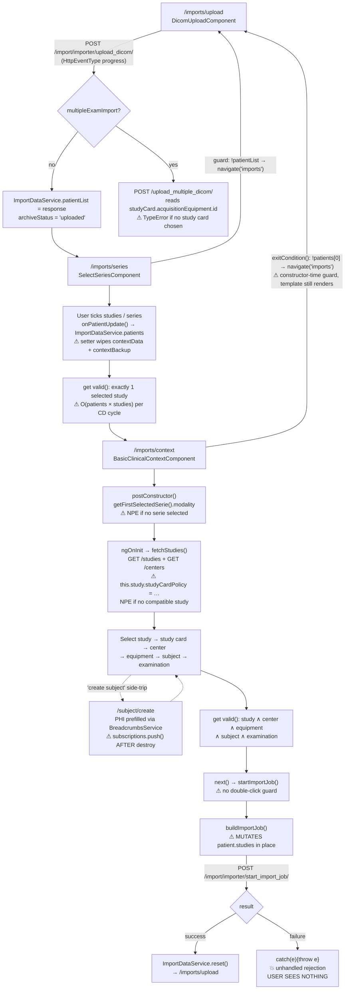

# Shanoir-NG Frontend (`shanoir-ng-front`) — Engineering Audit

**Audit target:** `/home/jamesbardet/Documents/code/shanoir-ng/shanoir-ng-front`
**Repo HEAD:** `867e53290` (develop line), Shanoir-NG 3.4.0
**Scope:** `src/` + build / lint / test configuration. `node_modules/`, `dist/`, `node/`, `.angular/`, `target/` excluded from analysis but read for installed versions.
**Method:** static reading of source + `rg` quantification. No `npm install`, no build, no test run. Every claim carries a `file:line` citation; inferences are marked as such.

---

## 1. Executive summary

Shanoir-NG's frontend is a single-page Angular application that is the entire human interface to a neuroimaging data platform holding real patient (PHI) data: it drives DICOM/EEG/BIDS/Bruker import, dataset search (Solr) and bulk download, study and per-study rights administration, study/quality cards, preclinical (animal) data management, and VIP pipeline execution. It is ~65,600 lines across 423 TypeScript files, 171 templates and 129 stylesheets, talking to six Spring microservices behind an nginx gateway.

**Health verdict: MODERATE, with two CRITICAL and several HIGH defects.**

The framework layer is in genuinely good shape — this is not a legacy Angular app. It runs Angular 21.2.x with TypeScript 5.9, standalone components (only 2 `@NgModule`s remain, both routing shims), the modern `@if`/`@for` control flow (1,426 uses vs. 5 legacy `*ngIf`/`*ngFor`), `bootstrapApplication`, and a maintained ESLint 9 flat config that is actually enforced on every PR. Somebody has done real, recent modernisation work.

What undermines it is everything *around* the framework: TypeScript strict mode is entirely off, there is no automated test execution of any kind (the Karma target is structurally broken and has been for a while), there is zero route-level code splitting, accessibility is effectively absent (zero ARIA attributes in 171 templates), and a set of debug affordances that log patient data to the browser console ship to production.

### Top findings, ranked

| # | Severity | Finding | Evidence |
|---|---|---|---|
| 1 | **Critical** | A global debug hotkey (`²`) dumps entities, DICOM patient lists and table contents — i.e. **PHI** — to the browser console in production builds. Present in 7 places, including the base class every entity screen inherits. | `entity.component.abstract.ts:753`, `select-series.component.ts:157`, `table.component.ts:593` |
| 2 | **Critical** | `KeycloakService.getToken()` can return a promise that **never settles**, permanently latching a `gettingToken` flag. Every dependent HTTP retry and the SSE notification channel then hang silently, with no error surfaced. | `keycloak.service.ts:101-117` |
| 3 | **High** | jQuery **1.7.2** (2012) and JSZip **3.1.5** (2017) are vendored as raw files under `src/assets/` and loaded globally, invisible to `npm audit`/Dependabot. JSZip parses user-supplied DICOM zips client-side. | `index.html:23-25`, `assets/papaya-nojquery/jquery.min.js:1`, `assets/jszip.min.js:3` |
| 4 | **High** | The test suite **cannot run**. `karma`, `karma-jasmine`, `jasmine-core` are absent from `package.json`; the Karma entry point `src/test.ts` does not exist; the `e2e` target still points at Protractor, removed from Angular years ago. 5 spec files exist for 175 components (2.9%), all `should create` smoke tests. | `package.json:42-61`, `karma.conf.js:23-27`, `angular.json:96,105-116` |
| 5 | **High** | TypeScript strict mode is completely off — no `strict`, `strictNullChecks`, `noImplicitAny`, or `strictTemplates`. 386 `: any` annotations, 166 `as any`/`<any>` casts. This directly permits several bugs found below. | `tsconfig.json:3-27` |
| 6 | **High** | Import failures are silent. `startImportJob()` rethrows into an unhandled promise rejection; the user sees nothing and stays on the page with no indication the import did not start. | `clinical-context.abstract.component.ts:641-652` |
| 7 | **High** | Production builds ship source maps: `npm run build` passes `--source-map`, overriding `sourceMap: false` in the production configuration. | `package.json:7` vs `angular.json:47` |
| 8 | **High** | Accessibility is essentially absent: **0** `aria-*`/`role=` attributes across 171 templates, 636 of 638 `<label>`s have no `for=`, 304 `(click)` handlers against 1 `tabindex`. The lint rules that would catch this are explicitly switched off. | `eslint.config.js:91-95` |
| 9 | **Medium-High** | The release build is not reproducible: the Maven/Docker path runs `npm install`, not `npm ci`, while `package-lock.json` is simultaneously tracked *and* listed in `.gitignore`. | `pom.xml:100-113`, `.gitignore:40` |
| 10 | **Medium-High** | Zero lazy loading. All ~200 routes are eagerly imported in a single 928-line routing module, with an initial-bundle budget of 5 MB before failure. | `app-routing.module.ts:19-112`, `angular.json:50-61` |
| 11 | **Medium** | The `docs/MicroservicesRESTAPI/*.yaml` OpenAPI specs describe **40** paths; the frontend calls **~175** endpoints. Whole services (Solr, VIP, BIDS, DUA, tasks, preclinical, access requests, quality cards) have no spec at all. The specs also document a "scores" service the UI knows nothing about. | §4 |
| 12 | **Medium** | A `/dev` scratchpad route (`TestComponent`) ships to production with no guard. | `app-routing.module.ts:888-891`, `utils/dev/test.component.ts` |

---

## 2. Framework, build & dependency health

### 2.1 Versions

| Item | Version | Note |
|---|---|---|
| Angular | `^21.2.8` declared, `21.2.16` locked | Modern. Angular's 6-month cadence implies v22 (~May 2026) is current as of Aug 2026, putting 21 one major behind and in its LTS window. *Inference — verify against the official support matrix; I could not check it offline.* |
| TypeScript | `~5.9.3` | Correct pairing for Angular 21. |
| RxJS | `^7.8.2` | Current major. |
| zone.js | `~0.15.0` | Still zone-based; `provideZoneChangeDetection()` at `main.ts:214`. Not zoneless. |
| Keycloak adapter | `keycloak-js ^26.1.5` | Matches the Keycloak 26.2.5 server. |
| ESLint | `^9.39.1` + `typescript-eslint 8.58.1` + `angular-eslint 20.3.0` | Flat config, current. Note `angular-eslint` 20 vs Angular 21 — one major behind. |
| Node (build) | v20.19.0 pinned in Maven, Node 22 in the ESLint CI job | Version skew between the lint pipeline and the release pipeline (`pom.xml:88-91` vs `checkstyle.yml` `node-version: 22`). |
| `frontend-maven-plugin` | 1.6 (2017) | Very old build plugin. |

`@angular/animations`, `@angular/cdk`, `@angular/localize` and the rest are all pinned to the same `^21.2.8` line — dependency hygiene within the Angular family is good.

### 2.2 TypeScript strictness — the single largest defect amplifier

```1:28:shanoir-ng-front/tsconfig.json
{
    "compileOnSave": false,
    "compilerOptions": {
        "baseUrl": "./",
        ...
        "target": "ES2022",
        "useDefineForClassFields": false
    },
    "angularCompilerOptions": {
        "fullTemplateTypeCheck": true,
        "strictInjectionParameters": true
    }
}
```

There is **no** `strict`, `strictNullChecks`, `noImplicitAny`, `noImplicitReturns`, `strictPropertyInitialization`, or `strictTemplates`. `fullTemplateTypeCheck` without `strictTemplates` is the weakest useful template-checking level: it checks expressions inside embedded views but not input bindings, `$event` types, or pipe arguments. `tsconfig.app.json` and `tsconfig.spec.json` only override `outDir`, so nothing tightens it anywhere.

Concrete bugs in this report that strict mode would have caught at compile time:

- `keycloak.http.interceptor.ts:48-66` — the `catchError` callback has a fall-through path that returns `undefined` where an `ObservableInput` is required. `noImplicitReturns` + `strictNullChecks` flags this.
- `entity.component.abstract.ts:443-469` — `modeSpecificSave()` returns `undefined` in `view` mode, and `save()` calls `.then()` on the result at `:474`.
- `entity.abstract.service.ts:132-133` — `mapPage` is declared `Promise<Page<T>>` but returns bare `null`.
- `dua-signing.component.ts:53-54` — `SafeResourceUrl` cast straight to `string`.

Also note `tsconfig.app.json:7` includes `./node_modules/ng-autosize/**/*.ts`, a package that is **not in `package.json` and not installed** — a dangling reference to a removed dependency.

### 2.3 Build configuration

`angular.json` uses the modern `@angular-devkit/build-angular:application` builder. Two real problems:

**Source maps ship to production.** The production configuration correctly sets `"sourceMap": false` (`angular.json:47`), but the npm script overrides it:

```7:7:shanoir-ng-front/package.json
    "build": "ng build --configuration production --source-map",
```

CLI flags win over configuration. Since `pom.xml:114-125` runs `npm run ${npm.build.task}` with `npm.build.task=build`, **the Docker/nginx image is built with source maps**. That publishes the full unminified TypeScript source, including comments and internal logic, to anyone who opens DevTools.

**`defaultConfiguration` is the empty string** (`angular.json:64`). A bare `ng build` therefore uses the base options — `optimization: false`, `sourceMap: true`, `namedChunks: true` — i.e. a development build with no warning. This is a trap for anyone who builds without `-c production`.

**Budgets are lax and incomplete** (`angular.json:50-61`): only `initial` (3 MB warning / 5 MB error) and `anyComponentStyle`. There is no `bundle` or `allScripts` budget. A 5 MB initial bundle before the build *fails* is an order of magnitude above a reasonable target for this app.

**Zero lazy loading.** `app-routing.module.ts` is 928 lines with roughly 200 route definitions, every component statically imported at the top (`:19-112`). There is not one `loadComponent` or `loadChildren` in the codebase. Consequences: every user downloads the preclinical module, the VIP pipeline UI, the DUA assistant, the study-card rule editor and the Solr search screen on first paint, regardless of role or task. Combined with the globally-loaded Papaya viewer (1.7 MB of raw JS) and jQuery, first load is heavy. The route tree partitions cleanly along the existing feature directories (`preclinical/`, `vip/`, `study-cards/`, `import/`, `dua/`), so this is a tractable fix rather than a rewrite.

### 2.4 Unmanaged third-party JavaScript — the biggest supply-chain gap

```23:25:shanoir-ng-front/src/index.html
        <script defer type="text/javascript" src="assets/papaya-nojquery/jquery.min.js"></script>
        <script defer type="text/javascript" src="assets/papaya-nojquery/papaya.js"></script>
        <script defer type="text/javascript" src="assets/jszip.min.js"></script>
```

Three libraries are committed as raw files under `src/assets/` and loaded as global scripts, not npm dependencies:

- **jQuery 1.7.2**, released March 2012 (`assets/papaya-nojquery/jquery.min.js:1`). This version predates the fixes for, among others, prototype pollution in `$.extend` (CVE-2019-11358), cross-domain-response XSS (CVE-2015-9251), and the 2020 HTML-manipulation XSS pair (CVE-2020-11022 / CVE-2020-11023). It is in global scope on every page.
- **JSZip 3.1.5**, 2016-2017 vintage (`assets/jszip.min.js:3`). Vulnerable to the path-traversal issue fixed in 3.7.0 and the prototype pollution fixed in 3.8.0. It is used to parse **user-supplied DICOM archives in the browser** at `dicom-archive.service.ts:42-43` — exactly the untrusted-input path those advisories concern.
- **Papaya** (1.7 MB, `assets/papaya-nojquery/papaya.js`), a vendored fork of the Papaya NIfTI/DICOM viewer with no discoverable version marker.

Because none of these are in `package.json`, `npm audit`, Dependabot, Snyk and every SBOM tool see nothing. This is the clearest single security-hygiene gap in the frontend.

### 2.5 Lint & CI enforcement

ESLint **is** enforced on every PR to `develop`:

```
- name: Install dependencies
  working-directory: ./shanoir-ng-front/
  run: npm ci
- name: Run ESLint
  working-directory: ./shanoir-ng-front/
  run: npm run lint
```
(`.github/workflows/checkstyle.yml`, `eslint` job)

That is a real strength and explains the codebase's consistent import ordering and the completed control-flow migration (`@angular-eslint/template/prefer-control-flow: 'error'`, `eslint.config.js:96`).

The config is otherwise deliberately permissive. `@typescript-eslint/no-explicit-any` is `'off'` with a bare `//` comment where the justification should be (`eslint.config.js:61`), `@angular-eslint/prefer-inject` is off (`:83`), and — most consequentially — four of the accessibility rules pulled in by `templateAccessibility` are switched off under a `/* TODO */`:

```89:96:shanoir-ng-front/eslint.config.js
        rules: {
            /* TODO */
            '@angular-eslint/template/eqeqeq': 'off',
            '@angular-eslint/template/label-has-associated-control': 'off',
            '@angular-eslint/template/click-events-have-key-events': 'off',
            '@angular-eslint/template/mouse-events-have-key-events': 'off',
            '@angular-eslint/template/interactive-supports-focus': 'off',
```

The accessibility preset is imported and then defeated. §9 quantifies the result.

**There is no frontend test job in CI at all.** `maven.yml` builds the frontend as part of `mvn install` (which runs `npm install` + `npm run build`) but never runs `ng test`. Given that `ng test` is broken anyway (§11), nothing would pass if it were added today.

### 2.6 Lockfile & reproducibility

The prompt flagged `package-lock.json` as gitignored. The situation is more subtle and, in one respect, worse:

- `.gitignore:40` does list `shanoir-ng-front/package-lock.json`.
- But the file **is tracked** (`git ls-files` returns it; last committed 2026-06-08), because it was added before the ignore rule. `.gitignore` has no effect on already-tracked files.
- So the CI lint job's `npm ci` works and is deterministic.
- **But the release build is not.** `pom.xml:100-113` runs the `npm` goal with `arguments: install` — plain `npm install`, which will happily resolve newer versions within the `^` ranges and rewrite the lockfile:

```103:112:shanoir-ng-front/pom.xml
					<execution>
						<id>npm install</id>
						<goals>
							<goal>npm</goal>
						</goals>
						<phase>generate-resources</phase>
						<configuration>
							<arguments>install</arguments>
						</configuration>
					</execution>
```

The net effect: the pipeline that *lints* is locked, the pipeline that *produces the shipped artifact* is not. Two builds of the same commit can produce different bundles. The contradictory `.gitignore` entry compounds this by signalling to developers that lockfile changes should not be committed, inviting `package.json`/lock drift over time.

**Fix (small):** delete `.gitignore:40`, change `pom.xml` to `arguments: ci`, and drop `--source-map` from the build script.

---

## 3. Architecture & code structure

### 3.1 Shape

```
src/
  main.ts                  bootstrapApplication + ~90 hand-listed providers
  polyfills.ts             zone.js + @angular/localize/init
  index.html               3 global <script> tags (jQuery, Papaya, JSZip) + env.js
  environments/            environment.ts / environment.prod.ts / version.ts (generated)
  assets/                  vendored JS, fonts, silent-check-sso.html, env.js
  app/
    app-routing.module.ts  928 lines, ~200 eager routes
    shared/                entity abstractions, table, select, dialogs, keycloak,
                           notifications, mass-download, console, session, roles
    <feature>/             studies, subjects, datasets, examinations, import, solr,
                           study-cards, preclinical, vip, users, centers, coils,
                           acquisition-equipments, dua, tags, tree, bids, files, ...
```

Counts: 175 `@Component`, 81 `@Injectable`, 15 `@Pipe`, 7 `@Directive`, 65 `*.service.ts`. Only 2 `@NgModule`s remain, both pure routing shims (`app-routing.module.ts:924`, `preclinical/preclinical-routing.module.ts`). Components are standalone-by-default with explicit `imports:` arrays.

The feature-directory layout mirrors the backend domain closely and is easy to navigate. The weak point is `shared/`, which has become a catch-all for the entity framework, the table, the select box, dialogs, auth, notifications, downloads, session management and utility pipes — there is no distinction between "design-system primitives" and "cross-cutting application services".

### 3.2 Modern-idiom scorecard

| Idiom | Status | Evidence |
|---|---|---|
| Standalone components | ✅ Adopted | 2 `@NgModule` total, both routing |
| `@if` / `@for` control flow | ✅ Migrated | 1,426 uses vs 5 legacy `*ngIf`/`*ngFor`; enforced by lint |
| `bootstrapApplication` | ✅ | `main.ts:214` |
| Signals (`signal`/`computed`/`effect`) | ❌ **Zero uses** | — |
| `inject()` | ~ Partial | 38 uses in 18 files; constructor injection elsewhere; `prefer-inject` lint rule off |
| Typed reactive forms | ❌ | `UntypedFormGroup` / `UntypedFormBuilder` throughout (`entity.component.abstract.ts:59,79`) |
| `async` pipe | ❌ **Zero uses** in 171 templates | — |
| RxJS as the data flow | ❌ Largely bypassed | 749 `.then(` vs 97 `.subscribe(`; 244 `firstValueFrom`/`lastValueFrom` |
| OnPush change detection | ❌ 1 of 175 components | `table.component.ts:45` |
| Zoneless | ❌ | `provideZoneChangeDetection()`, `main.ts:214` |

**The defining architectural choice is that RxJS is used as a transport, not as a programming model.** Almost every service wraps `HttpClient` in `firstValueFrom(...)` and returns a `Promise`. `toPromise()` (deprecated) has been fully migrated to `firstValueFrom` — good — but the underlying model is promise-based, and templates read plain fields rather than observables.

This has real trade-offs. On the plus side, promises auto-settle, so classic "subscription never torn down" leaks are rarer than the raw `.subscribe(` count suggests. On the minus side:

- **No request cancellation.** Navigating away from a screen does not abort its in-flight requests. There is no `switchMap`-style "latest wins" anywhere, so out-of-order responses can overwrite fresher state.
- **No `async` pipe** means no automatic subscription management and no `OnPush`-friendly template binding — which in turn is why 174 of 175 components must run Default change detection.
- **No shared caching or replay.** Two components needing the same study issue two requests.

### 3.3 Service layer ↔ microservice mapping

The service layer maps cleanly onto the backend, with all URLs centralised in two constants files: `app/utils/app.utils.ts` (`:34-167`) and `app/preclinical/utils/preclinical.utils.ts`. Base: `BACKEND_API_URL = protocol + "//" + hostname + "/shanoir-ng"` (`app.utils.ts:26`).

> **Bug in the base URL:** `app.utils.ts:26,28,29,30` build URLs from `url.hostname`, which **omits the port**. Any deployment not on the default port (dev servers, port-forwarded staging) will produce wrong API, logout, login and silent-SSO URLs. `url.host` is the correct property.

| Frontend service | Base constant | Backend microservice |
|---|---|---|
| `UserService`, `RoleService`, `AccessRequestService`, `ShanoirEventService`, `TaskService`, `MassEmailService` | `/shanoir-ng/users` | **users** |
| `StudyService`, `SubjectService`, `CenterService`, `CoilService`, `AcquisitionEquipmentService`, `ManufacturerService`, `ManufacturerModelService`, `StudyRightsService`, `CopyDataService`, `DuaService` | `/shanoir-ng/studies` | **studies** |
| `DatasetService`, `DatasetAcquisitionService`, `DatasetProcessingService`, `ExaminationService`, `SolrService`, `StudyCardService`, `QualityCardService`, `DicomService`, `ExecutionMonitoringService`, `ExecutionTemplateService`, `ExecutionTemplateFilterService`, `DownloadUtilsService` | `/shanoir-ng/datasets` | **datasets** |
| `ImportService`, `ImportBrukerService` | `/shanoir-ng/import` | **import** |
| 12 preclinical services (`AnimalSubjectService`, `ReferenceService`, `PathologyService`, `TherapyService`, `AnestheticService`, …) | `/shanoir-ng/preclinical` | **preclinical** |
| — | `/shanoir-ng/import/niftiConverters` | **nifti-conversion** (routed through import) |

Two mapping oddities worth noting:

- Study cards, quality cards, examinations and VIP all live under the **datasets** service, not **studies** — an architectural fact the URL constants make explicit (`app.utils.ts:123,148,149,162-167`) but which is easy to miss when reasoning about the system.
- `AnimalExaminationService` (preclinical) extends the generic entity service but points its `API_URL` at the **datasets** examinations endpoint (`animal-examination.service.ts:27`), while `ExaminationAnestheticService` and `ExtraDataService` point at `/preclinical/examination` (`preclinical.utils.ts`). Preclinical examinations are therefore split across two services with confusingly similar names.

### 3.4 Model / DTO layer

DTOs are **hand-written**, not generated. Each domain has a `*.model.ts` (the client entity) and often a `*.dto.ts` with an explicit `DTOService` that maps DTO → entity (`study.dto.ts` 405 lines, `dataset.dto.ts`, `examination.dto.ts`, `center.dto.ts`, `subject.dto.ts`, `study-card.dto.ts`, `quality-card.dto.ts`, `dataset-acquisition.dto.ts`, `dataset-processing.dto.ts`).

The base class does generic reconstruction:

```140:150:shanoir-ng-front/src/app/shared/components/entity/entity.abstract.service.ts
    protected toRealObject(entity: any): T {
        const trueObject = Object.assign(this.getEntityInstance(entity), entity);
        Object.keys(entity).forEach(key => {
            const value = entity[key];
            // For Date Object, put the json object to a real Date object
            if (String(key).indexOf("Date") > -1 && value) {
                trueObject[key] = new Date(value);
            }
        });
        return trueObject;
    }
```

Date handling is **heuristic and lossy**, and this matters for clinical data:

1. Any field whose name happens to contain the substring `Date` is coerced to a `Date`; any date field *not* matching (e.g. a field named `dob`, or a nested one) is left as a string. Silent, name-dependent behaviour.
2. On the way out, `datePattern` (`:167-173`) serialises **every** `Date` to `YYYY-MM-DD` using **local-time** `getFullYear/getMonth/getDate`, discarding time-of-day. For a client in UTC+2 holding a timestamp of `2026-01-01T00:30:00Z`, this serialises as `2026-01-01`; for a client in UTC-5 the same instant serialises as `2025-12-31`. **The same record round-trips to a different date depending on the operator's timezone.** For examination dates and subject birth dates in a multi-centre clinical study, that is a data-integrity defect, not a cosmetic one.

**Drift risk against the backend is structural**, not incidental: nothing generates or validates these DTOs against the backend. See §4.

### 3.5 Shared abstractions — the entity framework

Four base classes carry most of the CRUD surface:

| File | LOC | Role |
|---|---|---|
| `shared/components/entity/entity.abstract.ts` | 52 | `Entity` base + `EntityRoutes` URL builder |
| `shared/components/entity/entity.abstract.service.ts` | 180 | Generic REST CRUD + delete-with-confirm |
| `shared/components/entity/entity.component.abstract.ts` | 771 | Generic view/edit/create screen |
| `shared/components/entity/entity-list.component.abstract.ts` | 235 | Generic list screen |

**Verdict: the abstraction is too clever and has become a liability.** It saves real boilerplate across ~40 entity screens, but it achieves that through mechanisms that are hard to reason about and that are the source of several bugs in §7:

- **A `Proxy` that two-way-binds the entity to the form.** `wrapAsProxy()` (`:164-197`) intercepts every property `set` on the entity and pushes the value into the matching `FormControl`; `subscribeEntityPropsUpdatesFromForm()` (`:323-341`) subscribes to every control's `valueChanges` and writes back into the entity. This is a bidirectional binding built by hand on top of reactive forms — the exact thing reactive forms exist to avoid. Debugging a value that "changes by itself" here means tracing through a Proxy trap, a decorator-based field registry (`getDeclaredFields`), and a recursive form walk.
- **Lifecycle sequencing by `queueMicrotask`.** The constructor defers its route subscription with an explicit comment about ordering:

```108:108:shanoir-ng-front/src/app/shared/components/entity/entity.component.abstract.ts
        queueMicrotask(() => { // force it to be after child constructor, we need this.fetchEntity
```
  Correctness depends on microtask ordering relative to subclass construction. It works, but it is not something a new contributor can safely modify.
- **Direct DOM manipulation for form styling.** `styleRequiredLabelsFromForm()` (`:359-384`) reaches into `nativeElement` and runs `querySelector('li [formControlName="…"]')`, then walks `closest('li')` and `closest('fieldset')` to add asterisks to labels. This hard-codes a `<li>`/`<fieldset>` markup contract across every form in the app; any template restructuring silently breaks required-field indicators.
- **`this.subscriptions` grows monotonically.** `init()` is re-invoked on every route param change (`:117-129`) and each invocation pushes new `fragment` and form subscriptions (`:281-288`, `:310-315`) without clearing the old ones. See finding C-3 in §7.

`entity-list.component.abstract.ts` is better-behaved and genuinely useful.

### 3.6 State management

**There is none, by design.** No NgRx, no signal store, no facade layer. Cross-component state is shared through injectable singletons holding mutable public fields:

- `ImportDataService` (`import/shared/import.data-service.ts`) — the entire import wizard's state, including `PatientDicom[]` (patient names, birth dates, patient IDs) and `_contextData: any` (`:94`).
- `BreadcrumbsService` (291 lines) — navigation history *plus* an arbitrary key/value "prefill" store used to pass entities between screens (`addNextStepPrefilled`, `getPrefilledValue`) *plus* per-step table state (`table.component.ts:461`). This service has quietly become the app's de-facto state container, and it is keyed by navigation step, so state lifetime is tied to browser history rather than to any domain concept.
- `TreeService` (776 lines), `NotificationsService`, `SessionService`, `KeycloakSessionService`.

For an app this size the absence of a store is defensible, but `BreadcrumbsService` doing triple duty (history + inter-screen parameter passing + widget state) is not. It is also where PHI ends up sitting: `entity.component.abstract.ts:723` writes the current entity into the breadcrumb step on **every** component destroy.

Caching: none, except `DicomService` memoising the DICOM tag list (`dicom.service.ts:35`) and `EntityService.getAllAdvanced()` (`:48-61`), which returns a `{quick, complete}` promise pair — a clever but confusing two-phase mapping where `res.complete` is reassigned *inside* its own executor (`:55`).

### 3.7 Forms, tables, notifications, i18n

**Forms.** Reactive forms via `UntypedFormBuilder` everywhere — no typed forms. Every entity screen implements `buildForm(): UntypedFormGroup`. Server-side validation errors (422) are fed back into the form through a bespoke `registerOnSubmitValidator()` mechanism (`entity.component.abstract.ts:581-593`), which is a genuinely nice piece of design.

**Tables.** One `TableComponent` (763 lines) used across all list screens. Pagination is **server-side** (`Pageable`/`FilterablePageable` → `pageable.toParams()`, `table.component.ts:429-455`), which is the right call for the data volumes involved. Column widths and page size persist to `localStorage` (`:474-498`); sort/filter/selection persist into the breadcrumb step (`:457-472`). No virtual scrolling anywhere (0 uses of `cdk-virtual-scroll`), so a large page size renders every row.

**Notifications / errors.** Three layers: `ConsoleService` (the in-app message log), `MsgBoxService`, and `HandleErrorService` registered as the global `ErrorHandler` (`main.ts:123-126`). `HandleErrorService.handleError` logs to `console.error` **two or three times per error** (`:29`, then `:33` or `:37`) and surfaces only a generic string to the user:

```60:61:shanoir-ng-front/src/app/shared/utils/handle-error.service.ts
                const msg: string = 'Error from ' + this.extractServerNameFromUrl(error.url) + ' server';
                this.consoleService.log('error', msg, details);
```

"Error from datasets server" is what a researcher sees when a download fails. The real message is relegated to a details array.

**i18n — marked up but never built.** This is a notable finding. Templates carry **491** `i18n` attributes and `polyfills.ts:18` imports `@angular/localize/init`. But:

- There are **no** `.xlf`/`.xmb`/`.po` translation files anywhere in the repo.
- `angular.json` has an `extract-i18n` target (`:87-92`) but **no `i18n` block** declaring locales and no per-locale build configuration.
- No `LOCALE_ID` provider exists. `main.ts:101-103` calls `registerLocaleData(localeFr/De/Es)`, which ships three locale datasets into the bundle that nothing can currently select.

So the app is *instrumented* for localisation and *ships* the cost of it, but only ever builds in the source locale. The instrumentation is also incomplete — hardcoded French leaks into English screens, e.g.:

```169:169:shanoir-ng-front/src/app/dua/dua-assistant.component.html
                                            <tool-tip>Obligatoire avec tout CPP obtenu et accessible en ligne</tool-tip>
```

---

## 4. Backend API surface consumed

175 `HttpClient` calls across 40 files: **110 GET, 35 POST, 12 DELETE, 8 PUT, 1 generic `request`**. Generic CRUD (`GET /`, `GET /{id}`, `POST /`, `PUT /{id}`, `DELETE /{id}`) is inherited from `EntityService` (`entity.abstract.service.ts:43-122`) by every service with an `API_URL`; the table below lists the base and then the non-generic endpoints explicitly.

### users — `/shanoir-ng/users`

| Method | Path | Caller | Purpose | Spec? |
|---|---|---|---|---|
| CRUD | `/users` | `user.service.ts:35` | User management | ✅ `shanoir-ng-users.yaml:75` |
| GET | `/users/count` | `user.service.ts:93` | Public user count (welcome page) | ❌ |
| GET | `/users/accountRequests` | `user.service.ts:72` | Pending account requests | ❌ |
| PUT | `/users/{id}/confirmaccountrequest` | `user.service.ts:56` | Approve account request | ❌ |
| DELETE | `/users/{id}/denyaccountrequest` | `user.service.ts:60` | Reject account request | ❌ |
| POST | `/accountrequest` | `user.service.ts:64` | Self-service signup (**no bearer**) | ✅ `:21` |
| POST | `/extensionrequest` | `user.service.ts:68` | Account extension (**no bearer**) | ❌ |
| GET | `/accessrequest/byUser` | `user.service.ts:77` | My access requests | ❌ |
| GET | `/accessrequest/byAdmin` | `user.service.ts:84` | Requests I administer | ❌ |
| GET | `/accessrequest/byStudy/{studyId}` | `access-request.service.ts:60` | Requests for a study | ❌ |
| PUT | `/accessrequest/invitation/` | `access-request.service.ts:48` | Invite user to study | ❌ |
| PUT | `/accessrequest/resolve/{id}` | `access-request.service.ts:64` | Accept/deny request | ❌ |
| CRUD | `/accessrequest` | `access-request.service.ts:33` | Access requests | ❌ |
| GET | `/roles` | `role.service.ts:29` | Role list | ✅ `:294` |
| GET | `/events/{studyId}` | `shanoir-event.service.ts:39` | Paged audit events | ❌ |
| GET | `/events/count` | `user.service.ts:101` | 30-day event count | ❌ |
| GET | `/tasks` | `task.service.ts:39` | Async task list | ❌ |
| GET | `/tasks/updateTasks` | `notifications.service.ts:178` | **SSE** task stream | ❌ |
| GET | `/tasks/{…}` (blob) | `task.service.ts:62` | Task report download | ❌ |
| GET/POST | `/massemail`, `/massemail/count` | `mass-email.service.ts:31,35` | Bulk email to user groups | ❌ |

### studies — `/shanoir-ng/studies`

| Method | Path | Caller | Purpose | Spec? |
|---|---|---|---|---|
| CRUD | `/studies` | `study.service.ts:46` | Studies | ✅ `shanoir-ng-studies.yaml:21` |
| GET | `/studies/names` | `study.service.ts:83` | Id/name pairs | ✅ `:208` |
| GET | `/studies/light` | `study.service.ts:71` | Lightweight study list | ❌ |
| GET | `/studies/namesAndCenters` | `study.service.ts:87` | Study + centers | ❌ |
| GET | `/studies/draft` | `study.service.ts:180` | Draft studies (admin) | ❌ |
| GET | `/studies/public/data`, `/public/connected` | `study.service.ts:100,114` | Public catalogue (**no bearer** on `/data`) | ❌ |
| GET | `/studies/rights/{studyId}`, `/rights/all` | `study-rights.service.ts:45,50` | **Per-study rights** | ❌ |
| GET | `/studies/hasOneStudy` | `study-rights.service.ts:58` | Can-import check | ❌ |
| GET | `/studies/studyUser/{studyId}` | `study.service.ts:121` | Study members | ❌ |
| GET | `/studies/studyUser/right/{right}` | `study.service.ts:365` | Studies where I hold a right | ❌ |
| DELETE | `/studies/studyUser/{studyId}/{userId}` | `study.service.ts:265` | Remove member | ❌ |
| GET/PUT | `/studies/dua`, `/studies/dua/{id}`, `/studies/dua/study/{id}` | `study.service.ts:239,251,258` | DUA accept/check (**GET/PUT exempt from bearer**) | ❌ |
| POST | `/studies/copyDatasets` | `copy-data.service.ts:37` | Copy datasets between studies | ❌ |
| GET | `/studies/files`, `POST`/`DELETE` protocol files | `study.service.ts:96,203,216` | Study protocol files | ❌ |
| GET/POST | `/studies/detailedStorageVolume[/{id}]` | `study.service.ts:315,333` | Storage volume | ❌ |
| GET | `/studies/tags/{studyId}` | `study.service.ts:360` | Study tags | ❌ |
| GET | `/profiles/all` | `study.service.ts:92` | Anonymisation profiles | ❌ |
| GET | `/challenges` | `study.service.ts:107` | Challenge studies | ❌ |
| CRUD | `/subjects` | `subject.service.ts:31` | Subjects | ✅ `shanoir-ng-subject.yaml:21` |
| GET/POST | `/subjects/names` | `subject.service.ts:40,46` | Subject names | ❌ |
| GET | `/subjects/filter` | `subject.service.ts:60` | Paged subject filter | ❌ |
| GET | `/subjects/findByIdentifier/{id}` | `subject.service.ts:64` | **Lookup by hashed identifier** | ❌ |
| GET | `/subjects/nameExists/{name}/inStudy/{id}` | `subject.service.ts:70` | Uniqueness check | ❌ |
| GET | `/subjects/{studyId}/allSubjects` | `study.service.ts:128,133` | Subjects in study | ❌ |
| CRUD | `/subjectStudy` | `app.utils.ts:92` | Subject↔study link | ❌ |
| CRUD | `/centers`, `/centers/names[/{studyId}]`, `/centers/study/{id}` | `center.service.ts:38,42,46` | Centers | ✅ (base + `/names` only) |
| CRUD | `/acquisitionequipments`, `/byCenter/{id}`, `/byStudy/{id}` | `acquisition-equipment.service.ts:42,48` | Equipment | ✅ (base only) |
| CRUD | `/manufacturers`, `/manufacturermodels`, `/manufacturermodels/names`, `/centerManuModelsNames/{id}` | `manufacturer-model.service.ts:46,50` | Manufacturers | ✅ (base only) |
| CRUD | `/coils`, `/coils/byCenter/{id}` | `coil.service.ts:36` | Coils | ✅ (base only) |

### datasets — `/shanoir-ng/datasets`

| Method | Path | Caller | Purpose | Spec? |
|---|---|---|---|---|
| CRUD + paged | `/datasets` | `dataset.service.ts:45,78` | Datasets | ✅ `shanoir-ng-datasets.yaml:21` (`{datasetId}` only) |
| DELETE(body) | `/datasets/delete` | `dataset.service.ts:60` | Bulk delete | ❌ |
| GET | `/datasets/examination/{id}`, `/acquisition/{id}`, `/study/{id}`, `/find/subject/{s}/study/{st}` | `dataset.service.ts:89,94,99,107` | Dataset lookups | ❌ |
| POST | `/datasets/allById` | `dataset.service.ts:114` | Batch fetch | ❌ |
| GET | `/datasets/study/nb-datasets/{id}` | `dataset.service.ts:118` | Count | ❌ |
| POST | `/datasets/massiveDownload` | `dataset.service.ts:134` | **Bulk zip download** | ❌ |
| GET | `/datasets/download/{id}` | `dataset.service.ts:161` | Single download | ❌ |
| GET | `/datasets/downloadStatistics` | `dataset.service.ts:142` | Statistics export | ❌ |
| GET | `/datasets/dicom-metadata/{id}` | `dataset.service.ts:154` | DICOM metadata | ❌ |
| POST | `/datasets/getDownloadData` | `dataset.service.ts:171` | Per-item download rights | ❌ |
| GET | `/datasets/overallStatistics` | `dataset.service.ts:200` | Home stats (**no bearer**) | ❌ |
| POST | `/datasets/processedDataset` | `import.service.ts:87` | Register processed dataset | ❌ |
| CRUD | `/datasetProcessing` + `/study/{s}/subject/{su}`, `/inputDataset/{id}`, `/monitoring/{id}`, `/{id}/inputDatasets`, `/{id}/outputDatasets` | `dataset-processing.service.ts:41-61` | Processings | ❌ |
| CRUD | `/datasetacquisition` + `/examination/{id}`, `/byDatasetIds`, `/byStudyCard/{id}` | `dataset-acquisition.service.ts:65-97` | Acquisitions | ❌ |
| CRUD | `/examinations` + paged, `/count`, `/preclinical`, `/files` | `examination.service.ts:33-93` | Examinations | ✅ `shanoir-ng-examinations.yaml:21,71` |
| POST | `/solr`, `/solr/byIds` | `solr.service.ts:40,68` | **Faceted search** | ❌ |
| POST | `/solr/index` | `solr.service.ts:35` | Reindex | ❌ |
| GET | `/bids/bidsStructure/studyId/{id}`, `/refreshBids/…`, `/exportBIDS/studyId/{id}`, `/validateBidsStudy/{id}` | `dataset.service.ts:65,70`, `study.service.ts:270,280` | BIDS | ❌ |
| CRUD | `/studycards` + `/byStudy/{id}`, `/byAcqEq/{id}`, `/apply`, `/dicomTags` | `study-card.service.ts:35,55`, `dicom.service.ts:35` | Study cards | ✅ `shanoir-ng-studyCards.yaml:21` (partial) |
| CRUD | `/qualitycards` + `/byStudy/{id}`, `/apply/{id}`, `/test/{id}[/exam/{e}]` | `quality-card.service.ts:44-74` | Quality cards | ❌ |
| CRUD | `/vip/execution`, `/vip/pipeline` | `app.utils.ts:163-164` | VIP pipelines | ❌ |
| CRUD + PUT | `/execution-monitoring[/{id}?start=true]` | `execution-monitoring.service.ts:45` | Pipeline monitoring | ❌ |
| CRUD | `/execution-template`, `/execution-template-filter` | `app.utils.ts:165-166` | Auto-execution templates | ❌ |

### import — `/shanoir-ng/import`

| Method | Path | Caller | Purpose | Spec? |
|---|---|---|---|---|
| POST | `/importer/upload_dicom/` | `import.service.ts:32` | Upload DICOM zip (progress events) | ✅ `shanoir-ng-import.yaml:50` |
| POST | `/importer/upload_multiple_dicom/study/{id}…` | `import.service.ts:38` | Multi-exam upload | ❌ |
| POST | `/importer/start_import_job/` | `import.service.ts:69` | **Launch DICOM import** | ❌ |
| POST | `/importer/import_dicom/` | `importBruker.service.ts:37` | Bruker→DICOM import | ❌ |
| GET | `/importer/get_dicom/` | `import.service.ts:102` | Fetch image for preview | ❌ |
| POST | `/importer/query_pacs/` | `import.service.ts:113` | **PACS C-FIND** | ❌ |
| POST | `/importer/upload_eeg/`, `/start_analysis_eeg_job/`, `/start_import_eeg_job/` | `import.service.ts:49,55,78` | EEG import | ❌ |
| POST | `/importer/upload_processed_dataset/` | `import.service.ts:63` | Processed dataset upload | ❌ |
| POST | `/bidsImporter/{studyId}/{studyName}/{centerId}` | `import.service.ts:59` | BIDS import | ❌ |
| GET | `/niftiConverters` | `app.utils.ts:156` | Converter list (**nifti-conversion**) | ❌ |

### preclinical — `/shanoir-ng/preclinical`

CRUD across `/subject`, `/subject/find`, `/refs`, `/refs/categories`, `/refs/category/{c}/types`, `/pathology`, `/pathology/model`, `/pathology/model/download/specs/{id}`, `/pathology/model/files`, `/therapy`, `/anesthetic`, `/anesthetic/{id}/ingredient/{iid}`, `/contrastagent`, `/protocol`, `/examination`, `/examination/extradata/files`, `/extradata`, `/bloodgasdata`, `/upload/extradata/upload` — see `preclinical/utils/preclinical.utils.ts` and the 12 preclinical services. **Not one preclinical endpoint has an OpenAPI spec.**

### Drift analysis vs `docs/MicroservicesRESTAPI/*.yaml`

The specs total **40 documented paths** across 14 files. The frontend calls **~175 endpoints**. Coverage is roughly **20%**, and drift runs in both directions:

**Documented but never called by the UI** — an entire service the frontend has no knowledge of:
- `shanoir-ng-scores.yaml` (20 KB, 14 paths): `/score`, `/score/all/{studyId}`, `/score/all/xls/{studyId}`, `/metric`, `/metric/all`, `/challenger`, `/challenger/all`, `/patient`, `/patient/all`. **Zero references in the frontend.** This is either a dead spec or an undocumented-in-the-UI capability.
- `POST /login` (`shanoir-ng-users.yaml:51`) — obsolete; auth is Keycloak OIDC now.
- `/users/search` (`:264`), `/studies/listwithcards` (`shanoir-ng-studies.yaml:187`), `/subject/OFSEP/` (`shanoir-ng-subject.yaml:51`), `/subject/all` (`:148`), `/upload/` and `/select_series/` (`shanoir-ng-import.yaml:22,78`) — none called.

**Called but undocumented** — entire subsystems with no spec:
- **Solr search** (`/solr`, `/solr/byIds`, `/solr/index`) — the primary data-discovery feature.
- **VIP** (`/vip/execution`, `/vip/pipeline`, `/execution-monitoring`, `/execution-template`, `/execution-template-filter`).
- **Downloads** (`/datasets/massiveDownload`, `/datasets/download/{id}`, `/datasets/getDownloadData`, `/datasets/downloadStatistics`) — the highest-risk data-egress paths.
- **BIDS** (all four endpoints), **DUA** (all), **tasks/SSE** (all), **access requests** (all), **quality cards** (all), **study rights** (all), **preclinical** (all ~20).

**Called with a shape the spec does not describe:** `shanoir-ng-datasets.yaml` documents only `/datasets/{datasetId}`; the frontend calls 12 further `/datasets/*` paths including a `DELETE` with a request body (`dataset.service.ts:60` uses `http.request('delete', …, {body})`) — a pattern many gateways and clients handle inconsistently.

The specs were last touched 2025-02-26 and carry `version: 0.0.1`. **They should be treated as abandoned documentation, not as a contract.** Generating them from the Spring controllers (springdoc-openapi) and generating the frontend client from the result would close this gap permanently and is the single highest-leverage cross-cutting fix (§14).

---

## 5. Key user flows walked through

### 5.1 The DICOM import wizard



**Files:** `import/import.component.ts` (shell), `import/dicom-upload/dicom-upload.component.ts` (269), `import/select-series/select-series.component.ts` (162), `import/clinical-context/clinical-context.abstract.component.ts` (720), `import/basic-clinical-context/basic-clinical-context.component.ts` (199), `import/shared/import.data-service.ts` (168), `import/shared/import.service.ts` (115).

**Step 1 — Upload.** `DicomUploadComponent` posts the zip with `reportProgress` and tracks `HttpEventType.UploadProgress` (`:114-136`). Risks:

- The `.zip` extension check (`:107`) sets `extensionError` but does not abort — the upload proceeds regardless. If the filename has no `.`, `lastIndexOf('.')` returns `-1` and `substring(-1)` yields the last character, so the flag is meaningless for extensionless files.
- Progress uses `event.loaded / (event.total + 0.05)` (`:119`) — a fudge to avoid divide-by-zero. If the server sends no length, `event.total` is `undefined` and the progress bar shows `NaN`.
- In multi-exam mode, `:141-145` dereferences `this.studyCard.acquisitionEquipment.id` and `this.study.profile.profileName` with no null checks. If `useStudyCard` is true (the default, `:64`) and no study card has been picked, this throws before any request is sent.
- `studyService.getAll()` in the constructor (`:86-91`) has no `.catch()`: if the study list fails to load, the dropdown is silently empty with no explanation.
- The breadcrumb is configured inside a `setTimeout` in the constructor (`:79-84`) — lifecycle sequencing by timer.

**Step 2 — Select series.** Correctly guards a mid-wizard refresh by redirecting when `patientList` is absent (`:51-54`). Two issues: `get valid()` (`:136-147`) iterates all patients × studies on **every change-detection cycle** (Default CD, called from the template), which for a multi-hundred-series archive is meaningful work per tick; and `initPapaya` (`:124-134`) issues `serie.images.length` **parallel** HTTP GETs via `Promise.all` with no concurrency cap — a 500-image series fires 500 simultaneous requests.

**Step 3 — Clinical context.** The riskiest step.

- The "guard" is a constructor-time `router.navigate` with an early `return` (`clinical-context.abstract.component.ts:89-92`). Navigation is asynchronous, so Angular still completes construction, **still runs `ngOnInit`**, and still renders the template for at least one cycle — with `this.patient` undefined because `postConstructor()` was skipped. This should be a `CanActivate` guard.
- `BasicClinicalContextComponent.postConstructor()` (`:39-43`) calls `this.getFirstSelectedSerie().modality.toString()`. `getFirstSelectedSerie()` returns `null` when nothing is selected (`:170-178`) → `TypeError`.
- `ngOnInit` assigns `this.study.studyCardPolicy = policy` (`:108`, `:116`) unconditionally. When `fetchStudies(true)` finds no compatible study, `this.study` is never set → `TypeError` on `undefined`.
- `reloadSavedData()` (`:126-162`) has a **broken promise tree**: `promises.push(...)` is called *inside* the `.then()` of a promise already in the array (`:147`, `:153`). `Promise.all(promises)` at `:161` snapshots the array synchronously, so the inner pushes are never awaited. Restoring a saved context therefore resolves before the subject/examination selections have completed — a race that manifests as intermittently blank fields on back-navigation.
- Every side-trip (`openCreateSubject`, `openCreateExam`, `openCreateAcqEqt`, `editStudyCard`, `createStudyCard`, `:525-535`, `:557-568`, `:574-585`, `:691-711`) pushes a subscription into `this.subscriptions` **inside `router.navigate(...).then(...)`** — i.e. after the component has been destroyed and `ngOnDestroy` has already drained the array (`:714-719`). Those subscriptions are never released.

**Step 4 — Submit.** Two serious problems:

```641:652:shanoir-ng-front/src/app/import/clinical-context/clinical-context.abstract.component.ts
    startImportJob(): void {
        this.importData(this.stepTs)
            .then(() => {
                this.importDataService.reset();
                setTimeout(() => {
                    this.consoleService.log('info', 'Import successfully started for subject "' + this.subject.name + '" in study "' + this.study.name + '"');
                }, 0);
                this.router.navigate([this.getNextUrl()]);
            }).catch(error => {
            throw error;
        });
    }
```

The `.catch` rethrows into nothing. **On failure the user gets no message, no state change, and no indication that the import did not start** — the button just appears to do nothing. And `next()` (`:637-639`) has no in-flight guard, so double-clicking submits the job twice.

`buildImportJob()` (`basic-clinical-context.component.ts:58-83`) **mutates the wizard's own state**:

```65:68:shanoir-ng-front/src/app/import/basic-clinical-context/basic-clinical-context.component.ts
        filteredPatient.studies = this.patient.studies.map(study => {
            study.series = study.series.filter(serie => serie.selected);
            return study;
        }).filter(study => study.series?.length > 0);
```

`study.series` is reassigned on the live `PatientDicom` object. If the POST fails and the user navigates back, the unselected series are **permanently gone** from the in-memory model; a retry silently imports a subset. Combined with the silent-failure bug above, this is a plausible route to a partial import that nobody notices.

**PHI note:** `prefillSubject()` (`:97-119`) writes the raw DICOM `patientName`, birth date and sex into `BreadcrumbsService` prefill slots, where they persist for the browsing session.

**Name-parsing bug:**

```149:159:shanoir-ng-front/src/app/import/basic-clinical-context/basic-clinical-context.component.ts
    private computeNameFromDicomTag (patientName: string): string[] {
        let names: string[] = [];
        if (patientName) {
            names = patientName.split("\\^");
```

`"\\^"` is the two-character string `\^`. DICOM PN components are separated by a **single** `^`. `String.prototype.split` with a string argument does a literal match, so this never splits: the `length !== 2` branch always fires and pushes the full name twice, making `firstName === lastName === "DOE^JOHN"`. (The doc comment at `:145-148` also has the DICOM PN order backwards — the standard is `Family^Given`.)

### 5.2 Dataset search & download

**Files:** `solr/solr.search.component.ts` (750), `solr/solr.service.ts`, `shared/mass-download/mass-download.service.ts` (691), `shared/mass-download/download.utils.service.ts`, `shared/mass-download/single-download.service.ts`, `shared/components/table/table.component.ts` (763).

1. `SolrSearchComponent` builds a `SolrRequest` from a reactive form plus faceted criteria and POSTs to `/datasets/solr` with a `Pageable` (`solr.service.ts:40`). Facet open/sort preferences persist to `localStorage` keyed by a hash of facet name + route (`solr.paging-criterion.component.ts:243-257`).
2. Results render through `TableComponent` with server-side paging. Sensible for volume; no virtual scrolling, so page size directly determines DOM size.
3. Rights are computed client-side up front: `getRole()` reads the Keycloak token, `getRights()` fetches `/studies/rights/all`, and `hasDownloadRight(studyId)` (`solr.search.component.ts:432-435`) gates the download affordance.
4. Download goes through `MassDownloadService`. Two paths depending on browser capability:
   - **Modern path** — `window.showDirectoryPicker` (File System Access API, `mass-download.service.ts:83`): the browser streams datasets into a user-chosen directory, writes a `downloadReport.json`, and drives a `Queue` for concurrency.
   - **Fallback path** (`_downloadAlt`, `:166`): a single `POST /datasets/massiveDownload` returning one zip, capped at `MAX_DATASETS_IN_ZIP_DL`.
5. Progress is reported through `Task` objects fed into `NotificationsService`, mirrored to `localStorage`, and cross-tab-reconciled via `SessionService`.

**Risks.**

- **A 1-second `localStorage` JSON parse loop, forever.** `NotificationsService` starts a read interval in its constructor (`:51`, `:72-87`) that runs `JSON.parse` over the persisted task list every second for the entire session. The list is allowed to reach **4 MB** before entries are dropped (`:269`). There is no `ngOnDestroy` on this app-scoped service, so it never stops. A second 500 ms write loop (`:54-70`) runs whenever tasks are queued. This is a continuous CPU/GC cost and, because `emitTasks()` fires a `BehaviorSubject` on every tick, it wakes zone.js change detection across the whole app once a second.
- **The SSE channel dies silently when the token expires.** `connectToServer()` (`:176-201`) obtains one token and embeds it in the `EventSourcePolyfill` headers. There is no `error` listener, no reconnect, and no token refresh. Once the access token expires (minutes), the stream is dead and live task updates stop for the rest of the session — with no user-visible signal. The `.then()` also has no `.catch()`, so if `getToken()` never settles (§7 C-1) the stream is never created at all.
- `totalProgress()` (`:286-290`) divides by `tasksInProgress.length` — `NaN` when the list is empty.
- `pushToFreshCompleted`/`pushToFreshError` (`:144`, `:155`) overwrite `freshTimeouts[task.id]` without cancelling the previous 30-minute timer — a timer leak proportional to task churn.
- The storage key is `KeycloakService.auth.userId + 'downloadTasks'` (`:37`), evaluated as a field initialiser. On the unauthenticated bootstrap path (`main.ts:214`) `userId` is `undefined`, producing the shared key `"undefineddownloadTasks"`.
- **Download tasks are never purged on logout**, and task `message` fields carry dataset/subject descriptors. See §8.

### 5.3 Study & rights administration

**Files:** `studies/study/study.component.ts` (709), `studies/studyuser/studyuser-list.component.ts` (328), `studies/shared/study-rights.service.ts`, `shared/roles/*.ts`.

1. `/study/edit/:id` is protected by `AuthAdminOrExpertGuard` (`app-routing.module.ts:273`) — a pure token-role check (`auth-admin-or-expert-guard.ts:20-28`).
2. `StudyComponent` then computes finer-grained affordances from `StudyUserRight` values carried on the study object: `hasEditRight()`/`hasDeleteRight()` (`:389-398`), `hasAdministrateRight` (`:374-378`), `hasImportRight` (`:382-386`), plus `hasDownloadRight`/`hasCopyRight`/`hasEmailMembersRight` (`:189-195`).
3. `StudyUserListComponent` renders a member grid with a checkbox per right; `onEditRight()` (`:167-174`) mutates the local `studyUserRights` array, and the whole study is saved via the standard entity `PUT`.
4. On study creation the current user is granted the full set client-side (`study.component.ts:264`).

**Assessment.** These checks are UI affordances, not enforcement — which is correct as long as the server re-validates. The backend does have a dedicated `shanoir-ng-study-rights` module (it appears in the Checkstyle module list in `.github/workflows/checkstyle.yml`) and the frontend consumes a real `/studies/rights/*` API, so the server-side counterpart exists. I did not audit the backend, so I cannot confirm enforcement is complete on every mutating endpoint — that belongs in the system-wide synthesis.

What *is* a frontend defect is the **inconsistency of the guards** (§8.3): sibling routes with identical sensitivity are guarded differently, and `AuthAdminOrExpertGuard` returns `false` without redirecting (`auth-admin-or-expert-guard.ts:22-26`), leaving the user on a blank route with only a console message.

---

## 6. Code quality assessment

All figures from `rg` over `shanoir-ng-front/src`.

### 6.1 Type safety

| Metric | Count |
|---|---|
| `: any` annotations | **386** in 141 files |
| `as any` / `<any>` casts | **166** in 69 files |
| `any[]` | **94** in 62 files |
| Non-null assertions (`!.`) | 3 |
| `@typescript-eslint/no-explicit-any` | `'off'` (`eslint.config.js:61`) |

Where `any` actively hides bugs:

- `import.data-service.ts:94` — `private _contextData: any` is the **entire import wizard context**. The typed `ContextData` class is declared 60 lines above (`:31-48`) and then not used for the field. Any typo in a context property is silent.
- `select-series.component.ts:38-43` — `dataFiles`, `detailedPatient`, `detailedSerie`, `detailedStudy`, `studiesCheckboxes` all `any`, forcing string-literal property access (`this.detailedSerie["seriesInstanceUID"]`, `:65`).
- `keycloak.service.ts:38` — `static auth: any = {}`. Every consumer chains `KeycloakService.auth.authz.tokenParsed.canImportFromPACS` (`:174`) with no type or null safety. `canUserImportFromPACS()` returns `boolean | undefined | any` depending on path.
- `papaya.component.ts:28` and `select-series.component.ts:130-131` — `params: any[]` used as a **string-keyed dictionary** (`params['binaryImages'] = …`). Works in JS, defeats every tool.
- `dua-signing.component.ts:53-54` — `SafeResourceUrl` cast to `string`.

### 6.2 Asynchrony

| Metric | Count |
|---|---|
| `.then(` | **749** in 165 files |
| `firstValueFrom` / `lastValueFrom` | 244 in 49 files |
| `.subscribe(` | 97 in 55 files |
| `.catch(` | 82 in 48 files |
| `async` pipe in templates | **0** |
| `toPromise()` (deprecated) | 0 ✅ |
| `setTimeout(` | 68 in 49 files |
| `setInterval(` | 7 |

749 `.then()` against 82 `.catch()` is the headline ratio. Sampling confirms the pattern: fire-and-forget promise chains with no rejection handler are the norm, not the exception (`dicom-upload.component.ts:86`, `notifications.service.ts:89-97`, `notifications.service.ts:177`, `entity.component.abstract.ts:257,261`, `study.component.ts` passim). Angular's zone.js does route unhandled rejections to the global `ErrorHandler`, so most surface as a generic "Error from X server" toast — but several land in `HandleErrorService.handleDefaultError` and produce only the word "Error".

**68 `setTimeout` calls are a lifecycle smell.** They are used to sequence work that should be expressed in lifecycle hooks: `dicom-upload.component.ts:79` (breadcrumb setup in the constructor), `breadcrumbs.service.ts` `nameStep`/`markMilestone`, `entity.component.abstract.ts:317,396` (form styling), `table.component.ts:390,410` (arbitrary 200 ms loading-state delay), `clinical-context.abstract.component.ts:645`. Each is a latent `ExpressionChangedAfterItHasBeenCheckedError` workaround or an ordering hack.

### 6.3 Change detection & rendering

| Metric | Count |
|---|---|
| Components | 175 |
| Using `ChangeDetectionStrategy.OnPush` | **1** (`table.component.ts:45`) |
| `cdk-virtual-scroll` | **0** |
| `@for` with `track` / `trackBy` | 129 |
| `(click)` handlers | 304 |

Everything except the table runs Default change detection under zone.js. Combined with the heavy use of **getters called from templates** — `select-series.component.ts:136` (`get valid()`, O(patients×studies)), `clinical-context.abstract.component.ts:601,605,617` (`hasCompatibleCenters`, `hasCompatibleEquipments`, `valid` — each doing `Array.find` or building a context object), `basic-clinical-context.component.ts:188,193` (string concatenation) — this means non-trivial computation on every tick, on top of the 1 Hz `BehaviorSubject` emission from `NotificationsService`.

### 6.4 Debug code in production

| Metric | Count |
|---|---|
| `@HostListener('document:keypress')` `²` handlers | **7** |
| `console.log/error/warn/info/debug` | 34 in 20 files |
| Unguarded `/dev` route | 1 |

The seven `²` handlers are at `entity.component.abstract.ts:753`, `table.component.ts:593`, `select-series.component.ts:157`, `dicom-upload.component.ts:261`, `clinical-context.abstract.component.ts:628`, `breadcrumbs.component.ts:153`, `study-tree.component.ts:260`. Because two of them live in base classes (`EntityComponent`, `TableComponent`), the hotkey is live on essentially every screen. See §8.5.

### 6.5 Structural

Largest files (lines):

| File | Lines |
|---|---|
| `app/app-routing.module.ts` | 928 |
| `app/studies/study/tree.service.ts` | 776 |
| `app/shared/components/entity/entity.component.abstract.ts` | 771 |
| `app/shared/components/table/table.component.ts` | 763 |
| `app/solr/solr.search.component.ts` | 750 |
| `app/import/clinical-context/clinical-context.abstract.component.ts` | 720 |
| `app/studies/study/study.component.ts` | 709 |
| `app/shared/select/select.component.ts` | 701 |
| `app/shared/mass-download/mass-download.service.ts` | 691 |

Other structural notes: `main.ts` hand-lists ~90 providers in a flat array (`:110-205`) including commented-out blocks (`:135`, `:162-166`) — this should be a set of feature-scoped provider functions. `manufacturer/list`, `manufacturer-model/list` and `instrument/list` all route to `HomeComponent` (`app-routing.module.ts:485,510,535`), i.e. placeholder routes. `download-statistics` is declared twice (`:250` and `:554`) — the second is unreachable.

---

## 7. Correctness risks & bugs

| ID | Severity | Finding | Location |
|---|---|---|---|
| C-1 | **Critical** | `getToken()` returns a never-settling promise and latches permanently | `keycloak.service.ts:101-117` |
| C-2 | **Critical** | Debug hotkey logs PHI to console in production | 7 sites, see §6.4 |
| H-1 | **High** | Import failure is completely silent | `clinical-context.abstract.component.ts:641-652` |
| H-2 | **High** | `catchError` returns `undefined` for non-HTTP errors | `keycloak.http.interceptor.ts:48-66` |
| H-3 | **High** | 401 retry can hang the request forever | `keycloak.http.interceptor.ts:52-62` |
| H-4 | **High** | `buildImportJob()` destructively mutates wizard state | `basic-clinical-context.component.ts:65-68` |
| H-5 | **High** | Dates serialised to local-time `YYYY-MM-DD`, losing time and shifting day across timezones | `entity.abstract.service.ts:161-173` |
| H-6 | **High** | SSE notification channel dies on token expiry, silently | `notifications.service.ts:176-201` |
| H-7 | **High** | Wizard step 3 throws `TypeError` when no serie or no compatible study | `basic-clinical-context.component.ts:41`, `clinical-context.abstract.component.ts:108,116` |
| M-1 | Medium | Subscriptions accumulate across route param changes in `EntityComponent` | `entity.component.abstract.ts:117-130, 281-288, 306-321` |
| M-2 | Medium | `reloadSavedData()` `Promise.all` misses inner pushes | `clinical-context.abstract.component.ts:126-162` |
| M-3 | Medium | DICOM name parsing never splits | `basic-clinical-context.component.ts:152` |
| M-4 | Medium | 1 Hz 4 MB `localStorage` parse loop, never stopped | `notifications.service.ts:72-87, 269` |
| M-5 | Medium | Shared `FileReader` singleton races on concurrent zip reads | `dicom-archive.service.ts:23-35` |
| M-6 | Medium | `isSelected()` throws from inside change detection | `table.component.ts:562-568` |
| M-7 | Medium | Blob object URL for DUA PDF never revoked | `dua-signing.component.ts:53` |
| M-8 | Medium | Backend base URL drops the port | `app.utils.ts:26,28,29,30` |
| M-9 | Medium | Double-submit possible on import | `clinical-context.abstract.component.ts:637-639` |
| M-10 | Medium | Unbounded parallel image fetches for series preview | `select-series.component.ts:124-134` |
| L-1 | Low | `totalProgress()` returns `NaN` with no tasks | `notifications.service.ts:286-290` |
| L-2 | Low | `freshTimeouts` overwritten without cancel | `notifications.service.ts:144,155` |
| L-3 | Low | `isAlreadyAnonymized` branch on a freshly-constructed object is dead | `basic-clinical-context.component.ts:105` |
| L-4 | Low | `deepEquals` array branch unreachable | `entity.component.abstract.ts:202-208` |
| L-5 | Low | `papayaContainers` global reset breaks multiple viewers; `ngOnDestroy` unguarded | `papaya.component.ts:36,55` |
| L-6 | Low | Every error logged to console 2–3 times | `handle-error.service.ts:29,33,37` |

### Subscription-leak quantification

| Metric | Count |
|---|---|
| `.subscribe(` call sites | **97** across 55 files |
| Files with `.subscribe(` | 55 |
| …with own `ngOnDestroy` / `takeUntil` | 29 |
| …with neither | **26** |
| …of those 26, delegating to an inherited `this.subscriptions.push(...)` | 16 |
| `takeUntil` | 11 (5 files) |
| `takeUntilDestroyed` | 6 (3 files) |
| `.unsubscribe()` | 37 (28 files) |
| `async` pipe | **0** |

Comparing `.subscribe(` counts against `subscriptions.push` counts per file, roughly **20 subscribe sites across 13 files are genuinely unmanaged**:

`pathologyModel-form.component.ts` (3 of 4), `mass-download.service.ts` (3 of 3), `execution-template.component.ts` (2), `send-email.component.ts` (2), `download.utils.service.ts` (2), `anesthetic-form.component.ts` (1), `examination.component.ts` (1), `coil.component.ts` (1), `anestheticIngredient-form.component.ts` (1), `tree.service.ts` (1), `study.component.ts` (1), `single-download.service.ts` (1), `fileupload.component.ts` (1).

**This is a modest absolute number, and it is not the main risk.** Because the codebase converts almost everything to promises, classic leaks are rare. The four service-level cases (`mass-download`, `download.utils`, `single-download`, `tree.service`) are app-singletons, so "leaking" costs nothing extra — but the *download* observables they hold are long-lived HTTP streams that are never cancelled when the user navigates away, which is the real problem there.

The two structural leaks matter more than the raw count:

**M-1 — `EntityComponent` accumulates subscriptions per navigation.** `init()` is called from the `activatedRoute.params` subscription (`:128`) on every param change. Each call pushes a fresh `activatedRoute.fragment` subscription (`:281-288`) and, via `manageFormSubscriptions()` (`:306-321`), a fresh `form.statusChanges` subscription plus one `valueChanges` subscription **per control**. Nothing is unsubscribed until `ngOnDestroy`. Navigating `/study/details/1 → /2 → /3` (Angular reuses the component) therefore triples the handler count; by the tenth study every keystroke in the form fires ten write-backs into the entity.

**Leak in the wizard side-trips.** As described in §5.1, five methods in `clinical-context.abstract.component.ts` push subscriptions inside `router.navigate(...).then(...)`, which resolves *after* `ngOnDestroy` has drained the array. Those subscriptions live as long as the `Step` object holding the `waitFor` subject.

### Detailed findings

#### C-1 — `getToken()` can never settle, and latches on failure (Critical)

```101:117:shanoir-ng-front/src/app/shared/keycloak/keycloak.service.ts
    getToken(): Promise<string> {
        if (!this.gettingToken) {
            this.gettingToken = true;
            this.tokenPromise = new Promise<string>((resolve, reject) => {
                if (KeycloakService.auth?.authz?.token) {
                    KeycloakService.auth.authz.updateToken(5).then(() => {
                        this.gettingToken = false;
                        resolve(KeycloakService.auth.authz.token as string);
                    }).catch(() => {
                        console.error('Failed to refresh token');
                        reject();
                    });
                }
            });
        }
        return this.tokenPromise;
    }
```

Two defects in fifteen lines:

1. **If `KeycloakService.auth?.authz?.token` is falsy, the executor body does nothing** — neither `resolve` nor `reject` is called. The promise is permanently pending. This is reachable on the unauthenticated bootstrap path (`main.ts:214`), during the window before `init()` completes, and after a logout.
2. **`gettingToken` is set to `false` only on the success path** (`:107`). On rejection it stays `true` forever, so every subsequent `getToken()` returns the same already-rejected — or, per (1), permanently pending — promise for the rest of the session.

*How it manifests:* the SSE notification stream is never established and never errors (`notifications.service.ts:177`, no `.catch()`), so the Jobs panel silently stops updating. In the interceptor, a 401 retry produces an Observable that never emits, completes or errors (`keycloak.http.interceptor.ts:52-62`), so the originating HTTP call hangs indefinitely — spinner forever, no error toast, no timeout.

*Fix:* add an `else reject(new Error('no token'))` branch; move `this.gettingToken = false` into a `finally`; reject with a real `Error` so downstream handlers have something to log.

#### C-2 — `²` hotkey dumps PHI to the console (Critical)

```753:759:shanoir-ng-front/src/app/shared/components/entity/entity.component.abstract.ts
    @HostListener('document:keypress', ['$event']) onKeydownHandler(event: KeyboardEvent) {
        if (event.key == '²') {
            console.log('entity', this.entity);
            console.log('form controls:', this.mapFormControls(this.form),
                this.form.status, this.form.dirty, this.form.touched);
            console.log('footer state', this.footerState);
        }
    }
```

Seven of these. Because `EntityComponent` and `TableComponent` are base classes, the handler is live on virtually every screen. What gets logged:

- `entity.component.abstract.ts:755` — the current entity. On a Subject screen that is name, birth date, sex, and study identifiers.
- `select-series.component.ts:159` — `console.log('patients', this.patients)`: the **complete parsed DICOM patient list** with `patientName`, `patientBirthDate`, `patientID`, `patientSex` for every patient in the archive.
- `table.component.ts:595` — `console.log('table items', this.items)`: whatever the current list holds, including subject and dataset rows.

*Why it matters here specifically:* `²` is an unshifted key on AZERTY keyboards (top-left, next to `1`) — the layout used by the French clinical sites this platform serves. It is not a deliberate chord; it is a single keypress a user can hit by accident. `document:keypress` fires regardless of focus outside text inputs. Combined with source maps being shipped (§2.3), a screen-share, a support session, or browser-extension console capture becomes a PHI disclosure path.

*Fix:* delete all seven, or gate them behind `if (!environment.production)` so the production build tree-shakes them out.

#### H-1 — Import failure is silent

Covered in §5.1. `.catch(error => { throw error; })` (`clinical-context.abstract.component.ts:649-651`) rethrows asynchronously into no handler. Zone.js forwards it to `HandleErrorService`, but for a non-`HttpErrorResponse` rejection `handleDefaultError` (`:69-82`) produces the bare string `"Error"`. For an `HttpErrorResponse` it produces `"Error from import server"` — technically visible, but with no connection to the import the user just tried to start, and no state reset.

*Fix:* replace with a real handler that sets an error flag, surfaces the server message, and re-enables the submit button.

#### H-2 — `catchError` returns `undefined` for non-HTTP errors

```48:67:shanoir-ng-front/src/app/shared/keycloak/keycloak.http.interceptor.ts
        return next.handle(authReq).pipe(catchError((err: HttpErrorResponse): Observable<HttpEvent<any>> => {
            if (err instanceof HttpErrorResponse) {
                if (err.status === 401) {
                    ...
                }
                throw(err);
            }
        }
        ));
```

If `err` is not an `HttpErrorResponse` — a `TypeError` thrown by an upstream interceptor, an `AbortError` on connection teardown — control falls off the end and the callback returns `undefined`. RxJS then throws `TypeError: You provided 'undefined' where a stream was expected`, replacing the original error with a confusing one. `strictNullChecks` + `noImplicitReturns` would reject this at compile time.

Also note the bearer-token exemption list at `:35-40` is fragile string matching. `!req.url.endsWith('/data')` means **any** URL ending in `/data` is sent without an `Authorization` header. `/count` GETs likewise. Adding a new endpoint whose path happens to end that way silently disables auth on it.

#### H-3 — 401 retry can hang forever

```52:62:shanoir-ng-front/src/app/shared/keycloak/keycloak.http.interceptor.ts
                    return new Observable((observer) => {
                        this.keycloakService.getToken().then(() => {
                            authReq = this.setAuthHeader(authReq);
                            observer.next(null);
                            observer.complete();
                        }).catch(() => {
                            this.keycloakService.logout();
                        });
                    }).pipe(switchMap(() => {
                        return next.handle(authReq);
                    }))
```

The `.catch` branch calls `logout()` but never calls `observer.error()` or `observer.complete()`. If the logout redirect is slow, blocked, or a no-op (`logout()` at `keycloak.service.ts:97-99` silently does nothing when `auth.authz` is unset), the Observable never terminates and the request hangs. Add `observer.error(err)` to the catch.

#### H-5 — Timezone-dependent date serialisation

```161:173:shanoir-ng-front/src/app/shared/components/entity/entity.abstract.service.ts
    protected customReplacer(key, value) {
        if (EntityService.getIgnoreList().indexOf(key) > -1) return undefined;
        else if (this[key] instanceof Date) return EntityService.datePattern(this[key]);
        else return value;
    }

    private static datePattern(date: Date): string {
        return date.getFullYear()
            + '-'
            + ('0' + (date.getMonth() + 1)).slice(-2)
            + '-'
            + ('0' + date.getDate()).slice(-2);
    }
```

Applied to **every** `Date` field on **every** entity write, this (a) discards time-of-day and (b) uses local-time accessors. A value parsed from an ISO instant near midnight round-trips to a different calendar date depending on the operator's timezone. For examination dates and subject birth dates in a multi-centre study, that is silent data corruption. *Fix:* serialise with `toISOString()` and let the backend own the format, or at minimum use `getUTC*` accessors — and only apply the truncation to fields that are genuinely date-only.

#### M-5 — Shared `FileReader` races

```23:44:shanoir-ng-front/src/app/import/shared/dicom-archive.service.ts
	private fileReader: FileReader = new FileReader();

	importFromZip(blob: Blob): Promise<any> {
		this.fileReader.readAsArrayBuffer(blob);
		return new Promise((resolve, reject) => {
			this.fileReader.onload = () => { resolve(this.fileReader); }
			this.fileReader.onerror = error => reject(error);
		});
	}
```

One `FileReader` on an app-scoped singleton. `readAsArrayBuffer` is called **before** the handlers are attached, so a fast (cached) read can complete before `onload` is registered — the promise never resolves. Two concurrent calls overwrite each other's handlers and both resolve with the second file's contents. *Fix:* construct a `FileReader` per call and attach handlers before starting the read.

#### M-6 — `isSelected()` throws during change detection

```562:568:shanoir-ng-front/src/app/shared/components/table/table.component.ts
    isSelected(item: any): boolean {
        if (!item['id']) {
            this.selectionAllowed = false;
            throw new Error('TableComponent : if you are going to use the selectionAllowed input your items must have an id. (it\'s like in a night club)');
        }
        return this.selection.has(item['id']);
    }
```

Called from the template for every row on every cycle. One id-less row turns into an exception per row per tick, flooding the global `ErrorHandler` and the in-app console. It also mutates `selectionAllowed` from a template-invoked method, which is the textbook `ExpressionChangedAfterItHasBeenCheckedError` setup. *Fix:* validate once in `ngOnChanges` and return `false` here.

---

## 8. Security review

### 8.1 OIDC flow and token handling — **good**

The flow is **Authorization Code with PKCE**, not implicit. `keycloak-js` 26 defaults to `flow: 'standard'` with `pkceMethod: 'S256'`, and `KeycloakService.init()` (`keycloak.service.ts:44-95`) overrides neither. There is no `flow: 'implicit'` anywhere and no `response_type=token` construction. **No finding.**

Two adapter modes are supported, selected at deploy time (`keycloak.service.ts:34`): `login-required` (full redirect) or `check-sso` with a silent iframe at `assets/silent-check-sso.html`. The mode comes from `window.SHANOIR_KEYCLOAK_ADAPTER_MODE`, injected via a placeholder in `index.html:27` that Maven resource filtering substitutes. **If substitution fails, the literal string `'SHANOIR_KEYCLOAK_ADAPTER_MODE'` !== `'login-required'`, so the app silently falls back to `check-sso`** — a deployment failure mode that produces a working-but-different auth flow rather than an error.

**Token storage: in memory only.** Tokens live on `KeycloakService.auth.authz` (`:73`). No `localStorage`/`sessionStorage` write of any token, and `keycloak-js` is not configured with a persistent store. Grepping the 22 `localStorage` and 2 `sessionStorage` uses confirms none touch tokens — they hold tree-open state, table column widths, Solr facet preferences, side-menu state, session heartbeats, and the download-task list. **This is the right choice and should be preserved.**

Tokens are transmitted only as `Authorization: Bearer` headers (`keycloak.http.interceptor.ts:74`, `notifications.service.ts:180`). **No token appears in a URL or query string** anywhere.

**One concern — offline tokens.** `getOfflineToken()` (`:142-158`) spins up a throwaway adapter with `scope: 'offline_access'` to obtain a refresh token that **survives logout and SSO session expiry**, so VIP execution templates can run pipelines on the user's behalf indefinitely. The frontend does not persist it (it is sent to the backend), and the JSDoc is unusually clear about the intent. But this is a genuine standing-privilege grant: a stored offline token lets the platform act as that user on their data forever. Worth confirming that the backend encrypts these at rest, scopes them narrowly, and revokes them on account deactivation — a question for the system-wide synthesis, not resolvable from the frontend.

**Logout** (`:97-99`) uses the adapter's `logout({redirectUri})`, which hits the Keycloak end-session endpoint. Correct. But **application state is not cleared on logout**: the `kcsession-*` and `<userId>downloadTasks` `localStorage` entries and the in-memory `BreadcrumbsService` prefills (which hold entities) survive. See §8.6.

### 8.2 XSS

The Angular-side surface is genuinely small:

| Sink | Count | Location |
|---|---|---|
| `[innerHTML]` | **1** | `confirm-dialog.component.html:28` |
| `bypassSecurityTrust*` | **1** | `dua-signing.component.ts:53` |
| `DomSanitizer` injection | 1 | `dua-signing.component.ts` |
| `eval` / `new Function` / `document.write` | **0** | — |

**`[innerHTML]="message"`** in the confirm dialog. Angular's default sanitiser strips `<script>` and event-handler attributes, so this is not script execution. It *is* HTML injection: messages are built by concatenating entity names, e.g. `entity.abstract.service.ts:69-70` builds `'Are you sure you want to finally delete the ' + name + ' "' + entity['name'] + '" ?'`. A study or subject named `<a href="https://attacker.example">confirm here</a>` renders as a live link inside a trusted confirmation dialog — a workable phishing / UI-redress vector against an operator about to delete clinical data. **Severity: Medium.** Fix by escaping interpolated names or switching to text binding with a separate optional HTML slot.

**`bypassSecurityTrustResourceUrl`** on a `blob:` URL for a DUA PDF (`dua-signing.component.ts:53`). Same-origin blob, low risk. Two real problems though: the result is cast `as string` (`:54`), which is meaningless and likely defeats the `SafeResourceUrl` marker; and `URL.revokeObjectURL` is never called, so the PDF blob is pinned in memory for the page's lifetime.

**The larger XSS exposure is jQuery 1.7.2** (§2.4), loaded globally and predating every jQuery XSS fix from 2013 onward. It is not used by Angular code, but it is reachable from the Papaya viewer and from any injected script.

### 8.3 Client-side-only authorization

Four guards, all pure token-role checks with no server round-trip:

| Guard | Check | File |
|---|---|---|
| `AuthAdminGuard` | `hasRealmRole('ROLE_ADMIN')` | `auth-admin-guard.ts:19-27` |
| `AuthAdminOrExpertGuard` | `ROLE_ADMIN \|\| ROLE_EXPERT` | `auth-admin-or-expert-guard.ts:20-28` |
| `CanImportFromPACSGuard` | `tokenParsed.canImportFromPACS` | `auth-can-import-from-PACS-guard.ts:12-24` |
| `LoginGuard` | inverse — blocks `/welcome` when logged in | `login-guard.ts:14-21` |

Guards being advisory is normal and correct **provided the server enforces**. The server-side counterpart exists (a dedicated `shanoir-ng-study-rights` backend module, and a real `/studies/rights/*` API the frontend consumes). What is a frontend defect is the **inconsistency**:

- `user/edit/:id` has **no guard at all** (`app-routing.module.ts:468-472`) while `user/create` requires `AuthAdminGuard` (`:473-478`). Any authenticated user can navigate to the edit form for any user id and see it populate.
- `dataset-processing/create` is unguarded (`:375-379`) while `dataset-processing/edit/:id` requires admin (`:369-374`).
- `subject/create` (`:300-304`), `examination/edit/:id` (`:318-322`), `dataset/create` (`:351-355`), `dataset-acquisition/create` (`:640-644`) are all unguarded while their siblings are guarded.
- `study-card/list`, `quality-card/list`, `user/list`, `access-request/list` are unguarded.
- `AuthAdminOrExpertGuard` returns `false` **without navigating anywhere** (`:22-26`), unlike the other two which redirect to `/home`. A denied user is left on a blank page with only a console warning.

None of these is a vulnerability by itself if the backend rejects the corresponding calls, but each is a UI-visible affordance for an action the user should not see, and the inconsistency suggests the guard list grew ad hoc rather than from a policy.

**Also client-side-only:** the bootstrap decision itself.

```208:221:shanoir-ng-front/src/main.ts
if (window.location.href == window.origin + '/shanoir-ng/'
    || window.location.href.endsWith('/welcome')
    || window.location.href.includes('/account-request')
    ...
```

Whether Keycloak is initialised at all is decided by **string-matching the browser URL**. Anything matching those patterns bootstraps with no authentication. `KeycloakService.init()` is also called with `.then()` and **no `.catch()`** (`:218-221`), so if init rejects — Keycloak unreachable, silent-SSO iframe blocked by third-party-cookie policy — `bootstrapApplication` is never called and the user gets a **permanently blank page with no message**.

### 8.4 Secrets & configuration in the bundle

No credentials, API keys or secrets are hardcoded. Runtime config is externalised to `assets/env.js`, substituted at deploy time:

```
window["env"]["keycloakUrl"] = "SHANOIR_KEYCLOAK_URL";
window["env"]["viewerUrl"]   = "SHANOIR_VIEWER_OHIF_URL_SCHEME://SHANOIR_VIEWER_OHIF_URL_HOST";
window["env"]["vipUrl"]      = "VIP_URL_SCHEME://VIP_URL_HOST";
```

Only URLs and two email addresses — nothing sensitive. **No finding on secrets.**

One robustness issue: `environment.ts:22-26` reads `window["env"]["keycloakUrl"]` at **module-evaluation time**, but `env.js` is loaded with `defer` (`index.html:30`). If it has not executed, `window["env"]` is `undefined` and the property read throws before Angular starts — a hard boot failure. `window["env"]?.["keycloakUrl"] ?? fallback` would make this safe.

`src/version.ts` bakes the git describe output (including commit hash) into the bundle via the `prebuild` script (`package.json:11`). Standard build provenance; acceptable, but it does disclose the exact commit to anyone reading the bundle.

### 8.5 PHI in the browser

This is where the frontend has the most to answer for on a platform holding clinical imaging data.

| Vector | Assessment | Location |
|---|---|---|
| **Debug hotkey → console** | **Critical.** Full DICOM patient lists, subject entities, table rows logged to console on one keypress. See C-2. | 7 sites |
| **Error handler → console** | `console.error(error)` runs 2–3× per error including the full `HttpErrorResponse`, whose body can contain subject names in validation messages. Production-enabled. | `handle-error.service.ts:29,33,37` |
| **Download tasks in `localStorage`** | Up to **4 MB** of `Task` objects persisted under `<userId>downloadTasks`, retained 30 min in-session but **never cleared on logout** and not TTL-purged from storage. `Task.message`/`eventLabel` carry dataset descriptors. On a shared clinical workstation the next user can read them from DevTools. | `notifications.service.ts:37,269,273` |
| **PHI in `BreadcrumbsService`** | `ngOnDestroy` writes the current entity into the breadcrumb step on **every** component teardown; the wizard additionally stores raw DICOM `patientName`, first/last name and birth date as prefills. Retained for the whole SPA session. | `entity.component.abstract.ts:723`, `basic-clinical-context.component.ts:113-118` |
| **PHI in `ImportDataService`** | `patientList`/`patients` hold the full parsed DICOM patient tree until `reset()` — only called on successful import (`clinical-context.abstract.component.ts:644`). Abandoning a wizard leaves PHI resident for the session. | `import.data-service.ts:89-93` |
| **Source maps in production** | Amplifies every item above: full readable source in DevTools. | `package.json:7` |
| **Non-anonymised download** | The UI does not decide anonymisation; it passes `anonymisationProfileToUse` from the study profile (`basic-clinical-context.component.ts:80`) and downloads whatever `/datasets/massiveDownload` returns. Enforcement is server-side. **No frontend finding**, but worth confirming server-side in the synthesis. | — |

### 8.6 Session handling

`SessionService` (`shared/services/session.service.ts`) writes an `activeSession-<id>` heartbeat to `localStorage` and prunes stale entries; `KeycloakSessionService` stores `kcsession-*` records. Both are used to detect cross-tab activity and mark interrupted downloads. Neither is cleared on logout, so `localStorage` accretes `kcsession-*`, `activeSession-*`, `<userId>downloadTasks`, table-preference hashes and Solr facet preferences indefinitely.

**Recommended:** a single `clearAllAppStorage()` invoked from `KeycloakService.logout()` before the redirect, plus `ImportDataService.reset()` and a breadcrumb flush.

---

## 9. Accessibility & UX review

For a tool clinical researchers use daily, this is the weakest area in the codebase.

### Quantified

| Check | Result |
|---|---|
| `aria-*` or `role=` attributes across 171 templates | **0** |
| `<label>` elements | 638 |
| …with a `for=` attribute | **2** (0.3%) |
| `(click)` handlers | 304 |
| `tabindex` attributes | **1** |
| `` elements | 12 — **all 12 have `alt`** ✅ |
| Focus management / `cdkTrapFocus` / `.focus()` in dialogs | 0 |
| `cdk-virtual-scroll` | 0 |
| Accessibility lint rules enabled | preset imported, 4 key rules disabled |

### Findings, prioritised

**A11Y-1 (Critical) — Form labels are not associated with controls.** 636 of 638 labels have no `for=`. Screen readers announce inputs as unlabelled; clicking a label does not focus its field. This affects every create/edit form in the application — subject, examination, study, dataset, study card, all preclinical forms. The base class even *manipulates* those labels by DOM traversal (`entity.component.abstract.ts:366-373`, walking `closest('li')` to find `:scope > label`) to add required-field asterisks — proving the structural label↔input relationship exists in the markup but is never expressed programmatically. The asterisk itself is added as a CSS class with no `aria-required` or `required` attribute, so assistive tech has no way to know a field is mandatory.

**A11Y-2 (Critical) — Interactive elements are not keyboard-reachable.** 304 `(click)` handlers, one `tabindex` in the entire app. Sampling `table.component.ts`, `select.component.ts`, the tree components and `menu-item.component.ts` shows handlers on `<div>`, `<span>` and `<td>` with no `role`, no `tabindex="0"`, and no `(keydown.enter)`/`(keydown.space)`. Table row selection, tree navigation, the custom select box, dropdown menus, and tab switching are **mouse-only**. A keyboard-only or screen-reader user cannot select a dataset for download or navigate the study tree.

**A11Y-3 (High) — No ARIA anywhere.** Zero `role`, `aria-label`, `aria-live`, `aria-expanded`, `aria-selected`, `aria-describedby`. Consequences: the custom `SelectBoxComponent` (701 lines) presents as an unlabelled div cluster rather than a combobox; the custom tree has no `role="tree"`/`treeitem`; the confirm dialog is not `role="dialog"`/`aria-modal`; the async-task notification panel gives no `aria-live` announcement when a download completes; the in-app `ConsoleService` error messages are invisible to screen readers.

**A11Y-4 (High) — No focus management in dialogs.** `ConfirmDialogService` and `DatasetCopyDialogService` create components imperatively via `ServiceLocator.createComponent` (`utils/locator.service.ts`). There is no focus trap, no initial-focus assignment, and no focus restoration on close. Keyboard focus stays behind the modal, so a keyboard user tabs through the obscured page. There is no `Escape`-to-close handler.

**A11Y-5 (High) — Form errors are not programmatically associated.** `formErrors(field)` (`entity.component.abstract.ts:421-427`) returns error objects rendered adjacent to inputs, but with no `aria-describedby` linking them and no `aria-invalid` on the control. Validation failures are visual only.

**A11Y-6 (Medium) — The lint rules that would catch A11Y-1/2 are disabled.** `eslint.config.js:92-95` turns off `label-has-associated-control`, `click-events-have-key-events`, `mouse-events-have-key-events` and `interactive-supports-focus` under a `/* TODO */`. Re-enabling them as `warn` would immediately produce the full remediation backlog with exact locations, at zero analysis cost.

**A11Y-7 (Medium) — Colour contrast unverified.** 129 stylesheets with no design tokens and no contrast documentation. Not statically checkable; needs an axe-core pass. Related: `isDarkColor()` (`app.utils.ts:353-360`) picks text colour from a luminance threshold of 145 on the standard NTSC weighting — a reasonable heuristic but not a WCAG contrast-ratio calculation, so study tag colours can produce sub-4.5:1 text.

### Responsive behaviour & browser support

`browserslist` targets `last 2 versions` of Chrome, Edge, Firefox, Safari, iOS, plus Firefox ESR — modern and appropriate. `index.html:21` has the correct viewport meta tag. But the application is a dense, table- and tree-heavy desktop tool with fixed-width column persistence (`table.component.ts:474-498`) and a drag-to-resize implementation bound to `MouseEvent` only (`:599-608`, no pointer/touch events). It is desktop-only in practice. That is a defensible product decision for a research workstation tool, but the iOS/Safari browserslist entries imply an intent that the UI does not deliver.

### UX debt worth naming

- Error messages are generic (`"Error from datasets server"`, `handle-error.service.ts:60`) — a researcher cannot self-diagnose or write a useful bug report.
- The wizard's silent import failure (H-1) is the single worst UX defect in the app.
- Placeholder routes: `manufacturer/list`, `manufacturer-model/list`, `instrument/list` all render `HomeComponent` (`app-routing.module.ts:485,510,535`). A user following a "list" link lands on the dashboard with no explanation.
- `AuthAdminOrExpertGuard` denies without redirecting → blank page.
- Untranslated French in an otherwise English UI (`dua-assistant.component.html:169`).
- `"undefined - undefined"` renders when DICOM institution tags are absent (`basic-clinical-context.component.ts:188-197` concatenates without null checks).

---

## 10. Performance review

### Bundle

- **No lazy loading at all.** ~200 eager routes, all components imported at the top of a 928-line module. Every user downloads every feature.
- **Global scripts loaded before Angular:** `papaya.js` (1.74 MB raw), `jquery.min.js` (95 KB), `jszip.min.js` (100 KB) — ~1.9 MB of render-blocking-adjacent `defer`red JS on **every** page, including `/welcome`, whether or not a viewer is ever opened.
- **Initial budget is 3 MB warn / 5 MB error** (`angular.json:50-55`) — too permissive to catch regressions.
- `namedChunks: false` and `outputHashing: 'all'` in production are correct.
- Three locale datasets (`fr`, `de`, `es`) are registered but unusable (`main.ts:101-103`) — dead bundle weight.
- `allowCommonJsDependencies` lists `html2canvas`, `canvg`, `core-js`, `raf`, `rgbcolor` (`angular.json:26`), of which only `html2canvas` is in `package.json` — the rest are stale entries, likely transitive deps of `jspdf`/`html2pdf.js`. CommonJS deps defeat tree-shaking.

**Quick win:** lazy-load `preclinical/`, `vip/`, `dua/`, `study-cards/` and `import/` (five `loadChildren` boundaries following the existing directory structure), and load Papaya on demand rather than from `index.html`. Together these should remove well over half the initial payload for a typical user.

### Change detection

174 of 175 components run Default CD under zone.js. The aggravating factors:

1. **A 1 Hz global tick.** `NotificationsService` emits on its `BehaviorSubject` every second (`:74-87` → `emitTasks()`), inside a `setInterval` that zone.js patches — so the entire application tree is checked at least once per second, forever, whether or not anything changed.
2. **A 500 ms write loop** while any download task is queued (`:56-69`).
3. **Expensive template getters.** `select-series.component.ts:136` iterates the whole DICOM tree; `clinical-context.abstract.component.ts:601,605,617` run `Array.find` / object construction; `basic-clinical-context.component.ts:188,193` concatenate strings. All are invoked on every check.
4. **`isSelected()` per row per cycle** (`table.component.ts:562`), which additionally writes to a component field.

The single cheapest improvement is to raise the notification read interval to ~5 s and skip the emit when the serialised task list is unchanged.

### Large-data handling

**Good:** pagination is genuinely server-side (`Pageable`/`FilterablePageable` → `toParams()`, `table.component.ts:429-455`), and Solr facets are paged too (`FacetPageable`). The download path streams to disk via the File System Access API where available and enforces a `MAX_DATASETS_IN_ZIP_DL` cap on the fallback path (`mass-download.service.ts:142-147`).

**Bad:**

- **No virtual scrolling.** Page size is user-configurable and persisted (`table.component.ts:480`); a large value renders every row in the DOM with no windowing.
- **Unbounded parallel fetches** for the series preview: `select-series.component.ts:124-134` maps `serie.images` to one HTTP GET each and `Promise.all`s them. A 500-image series issues 500 concurrent requests.
- **A 4 MB `localStorage` payload parsed every second** (`notifications.service.ts:269`). `JSON.parse` of 4 MB is ~10-40 ms; at 1 Hz that is a persistent main-thread cost plus sustained GC pressure.
- **`getAll()` with no paging** is used for the study and centre lists in the import wizard (`clinical-context.abstract.component.ts:199`) — fine at current scale, unbounded by design.

### Network waterfalls

- `clinical-context.abstract.component.ts:199` correctly parallelises studies + centres with `Promise.all`. Good.
- But the context step is a **serial chain**: `fetchStudies()` → `onSelectStudy()` → `onSelectStudyCard()`/`onSelectCenter()` → `onSelectSubject()` → `onSelectExam()`, each a round trip. Restoring a saved context (`reloadSavedData()`, `:126-162`) walks the entire chain — five sequential round trips before the form is usable.
- **No caching.** Reference data that never changes within a session (centres, manufacturers, profiles, DICOM tags) is refetched on every screen that needs it. Only `DicomService` memoises (`dicom.service.ts:35`). A small `shareReplay`-backed reference-data cache would remove a lot of redundant traffic.

### Download / progress behaviour

Upload progress uses `HttpEventType.UploadProgress` correctly (`import.service.ts:32-38`, `dicom-upload.component.ts:116-126`). Download progress flows through `Task` objects and a `Queue`. Weaknesses:

- **No retry on any long operation.** No `retry`/`retryWhen` anywhere. A transient network blip during a multi-gigabyte study download fails the whole task.
- **No resumability.** A failed bulk download restarts from zero.
- Progress is `NaN` when `Content-Length` is absent (`dicom-upload.component.ts:119`).
- Interrupted downloads are detected only indirectly, by cross-tab session heartbeat (`notifications.service.ts:107-110`).

---

## 11. Test coverage analysis

### Numbers

| Metric | Value |
|---|---|
| `*.spec.ts` files | **5** |
| `@Component` classes | 175 |
| `@Injectable` classes | 81 |
| `@Pipe` | 15 |
| `@Directive` | 7 |
| Components with a spec | **5 / 175 = 2.9%** |
| All declarables/injectables with a spec | **5 / 278 = 1.8%** |
| Services with a spec | **1 / 65 = 1.5%** |
| E2E specs | **0** |

All five specs sit in one feature (`app/vip/`), the most recently added area — strongly suggesting they are Angular CLI schematic output that was never extended:

```
src/app/vip/execution-monitorings/execution-monitorings.component.spec.ts
src/app/vip/execution.data-service.spec.ts
src/app/vip/execution/execution.component.spec.ts
src/app/vip/pipelines/pipeline/pipeline.component.spec.ts
src/app/vip/pipelines/pipelines.component.spec.ts
```

### The suite cannot run

Three independent blockers:

1. **Missing packages.** `karma.conf.js:23-27` does `require('karma-jasmine')`, `require('karma-chrome-launcher')`, `require('karma-jasmine-html-reporter')`, `require('karma-coverage-istanbul-reporter')`. None of these — nor `karma` itself, nor `jasmine-core` — is in `package.json` (`:42-61`, which has only `@types/jasmine`, `@types/jasminewd2`, `jasmine-spec-reporter`). `node_modules` contains only `karma-source-map-support`, a transitive dep. `ng test` fails at config load with `MODULE_NOT_FOUND`.
2. **Missing entry point.** `angular.json:96` sets `"main": "src/test.ts"` and `tsconfig.spec.json:7` lists it in `files`. **`src/test.ts` does not exist.**
3. **Not CI-wired.** No workflow invokes `ng test` or `npm test`.

`karma.conf.js` is also not CI-shaped even if fixed: `singleRun: false`, `autoWatch: true`, `browsers: ['Chrome']` (`:42-44`) — it needs `ChromeHeadless` and `--watch=false`.

### E2E: two dead suites

- **Protractor.** `angular.json:105-116` declares `@angular-devkit/build-angular:protractor` pointing at `e2e/protractor.conf.js`. Protractor was deprecated in 2021 and the builder removed from Angular DevKit long before v21. There is **no `e2e/` directory** and `protractor` is not installed. `npm run e2e` fails immediately.
- **Python Selenium** (`shanoir-ng-tests/`, ~819 LOC). Uses `driver.find_element_by_xpath` (`tests/utils/selenium_util.py:22,29,35`), an API **removed in Selenium 4.3** (2022). It is also not referenced by any GitHub workflow or docker-compose service. Dead against any current Selenium.

**Conclusion: there is no automated verification of the frontend whatsoever, and there has not been for some time.** For software that manages patient data in production clinical research, this is the finding with the widest blast radius: every one of the correctness bugs in §7 would have been caught by a modest test suite.

### Test quality

The five specs are pure schematic output. Complete example:

```typescript
describe('PipelinesComponent', () => {
  beforeEach(async () => {
    await TestBed.configureTestingModule({ imports: [PipelinesComponent] }).compileComponents();
  });
  it('should create', () => { expect(component).toBeTruthy(); });
});
```

No behaviour is asserted. Even if they ran, they would catch only constructor-throwing regressions.

### Prioritised testing strategy

**Phase 0 — make the runner work (½ day, prerequisite for everything).**
1. `npm i -D karma karma-jasmine karma-chrome-launcher karma-jasmine-html-reporter karma-coverage jasmine-core`.
2. Recreate `src/test.ts`, or migrate to the builder's zoneless/auto entry point.
3. `karma.conf.js`: add a `ChromeHeadless` CI browser, `singleRun: true`, `autoWatch: false`.
4. Delete the dead `e2e` target from `angular.json` and the dead `e2e` script from `package.json`.
5. Add a `test` job to `.github/workflows/checkstyle.yml` — `npm ci && npm run test -- --watch=false --browsers=ChromeHeadless`. Start with **no** coverage gate; introduce a ratchet once a baseline exists.

**Phase 1 — pure-logic unit tests (~3 days, highest value per hour).** No `TestBed`, no DI, fast:
- `EntityService.toRealObject` / `customReplacer` / `datePattern` — pin the timezone bug (H-5) with a failing test first.
- `computeNameFromDicomTag` (M-3) — a two-line test that fails today.
- `app.utils.ts`: `getSizeStr`, `isDarkColor`, `sanitizeFilename`, `objectsEqual`, `arraysEqual`, `findLastIndex`, `getFilename`.
- All 15 pipes.
- `Pageable`/`FilterablePageable.toParams()`, `SolrRequest` serialisation.
- `KeycloakService.getToken()` with a mocked adapter — assert it **settles** in every branch (C-1).

**Phase 2 — service tests with `HttpTestingController` (~1 week).** For the 12 highest-traffic services (`dataset`, `study`, `subject`, `examination`, `import`, `solr`, `study-rights`, `study-card`, `task`, `access-request`, `dataset-acquisition`, `mass-download`): assert exact URL, method, body and mapping for every method. This doubles as **executable documentation of the API surface in §4** and is what makes contract testing possible.

**Phase 3 — component tests for critical flows (~1.5 weeks).**
- The import wizard end-to-end at component level with mocked services: happy path; upload failure; **import POST failure must surface an error** (H-1); no-serie-selected must not throw (H-7); back-navigation must restore context (M-2); double-click must not submit twice (M-9).
- `TableComponent`: paging, sorting, filtering, selection across pages, id-less rows must not throw (M-6).
- `EntityComponent`: repeated route-param navigation must not accumulate subscriptions (M-1).
- The 401-refresh interceptor path: must not hang (H-3), must handle non-HTTP errors (H-2).

**Phase 4 — E2E with Playwright (~1 week to stand up).** Delete Protractor and the Python Selenium suite; do not try to revive either. Playwright over Cypress: better multi-tab support (needed for the cross-tab session logic), native download-event assertions (needed for the mass-download flow), and first-class file-chooser handling for the File System Access API. Four journeys against a seeded docker-compose stack:
1. Login → DICOM zip import → verify examination created.
2. Solr search → select datasets → download → verify the zip lands and the task reaches DONE.
3. Study rights: admin grants `CAN_DOWNLOAD`; second user's session sees the download affordance appear.
4. Negative authorization: a plain user hitting `/user/edit/1` and `/send-email` directly.

**Phase 5 — contract tests (~3 days, but see the caveat).** Generate OpenAPI from the Spring controllers (springdoc-openapi), then validate the recorded request/response fixtures from Phase 2 against it in CI. **Do not** contract-test against `docs/MicroservicesRESTAPI/*.yaml` — those specs cover 20% of the surface and are stale (§4); testing against them would encode the drift rather than fix it.

**Suggested coverage targets:** services 70% (achievable and high-value), shared components 60%, feature components 30%, overall 40%. Enforce via ratchet, never by a hard gate on day one.

---

## 12. Technical debt inventory

| # | Item | Impact | Effort | Priority |
|---|---|---|---|---|
| 1 | Test infrastructure non-functional; 1.8% spec coverage | Every change is unverified | Phase 0: ½ d; meaningful coverage: 4–6 w | **P0** |
| 2 | Debug `²` hotkeys logging PHI (7 sites) | PHI disclosure | **1 h** | **P0** |
| 3 | `getToken()` never-settling promise (C-1) | Silent hangs, dead SSE | **2 h** | **P0** |
| 4 | Source maps in production | Amplifies all disclosure | **5 min** | **P0** |
| 5 | Silent import failure (H-1) | Users believe imports started | **2 h** | **P0** |
| 6 | jQuery 1.7.2 / JSZip 3.1.5 vendored outside npm | Known CVEs; invisible to SCA | 1–2 d (npm-ify + upgrade + smoke-test Papaya) | **P0** |
| 7 | TypeScript strict mode off; 386 `any` | Whole classes of bug permitted | 3–6 w incremental (per-flag, per-directory) | **P1** |
| 8 | Zero lazy loading | Slow first load for all users | 2–3 d (5 route boundaries) | **P1** |
| 9 | Zero ARIA, 636 unlabelled labels, 1 tabindex | Unusable with assistive tech; likely legal exposure for a public research platform | 3–4 w | **P1** |
| 10 | 1 Hz 4 MB localStorage parse + global CD tick | Sustained CPU/GC cost all session | **4 h** | **P1** |
| 11 | Timezone-dependent date serialisation (H-5) | Silent clinical-data corruption | 1 d + migration audit | **P1** |
| 12 | Build not reproducible (`npm install` in Maven, contradictory `.gitignore`) | Unrepeatable releases | **1 h** | **P1** |
| 13 | OpenAPI specs 20% complete and stale | Contract drift, no client generation | 1 w backend + 1 w frontend regeneration | **P1** |
| 14 | `EntityComponent` complexity (Proxy binding, `queueMicrotask`, DOM label styling) | High change cost; source of M-1 | 2–3 w to simplify | **P2** |
| 15 | Promise-everywhere; 0 `async` pipe; 1 OnPush component | Blocks OnPush/zoneless; no cancellation | 4–6 w | **P2** |
| 16 | `BreadcrumbsService` as de-facto state store | Coupling; PHI retention | 2 w | **P2** |
| 17 | i18n marked up but never built; hardcoded French | Ships cost, delivers nothing | 1 w to wire; ongoing to translate | **P2** |
| 18 | Route guard inconsistency; `/dev` route in prod | UI-visible unauthorised affordances | **3 h** | **P2** |
| 19 | Untyped forms (`UntypedFormGroup` everywhere) | No compile-time form safety | 2–3 w (after strict mode) | **P3** |
| 20 | No signals anywhere | Diverging from Angular's direction | Incremental | **P3** |
| 21 | Dead config: `ng-autosize` tsconfig include, Protractor target, stale `allowedCommonJsDependencies`, duplicate `download-statistics` route, placeholder `*/list` routes | Confusion | **2 h** | **P3** |
| 22 | 14 TODO/FIXME markers | Known gaps | Varies | **P3** |

---

## 13. Improvement roadmap

### Quick wins — under a day each

1. **Delete the 7 `²` handlers.** One hour, closes the Critical PHI leak. `entity.component.abstract.ts:753`, `table.component.ts:593`, `select-series.component.ts:157`, `dicom-upload.component.ts:261`, `clinical-context.abstract.component.ts:628`, `breadcrumbs.component.ts:153`, `study-tree.component.ts:260`.
2. **Drop `--source-map`** from `package.json:7`. Five minutes.
3. **Fix `getToken()`** — add the missing `reject`, move `gettingToken = false` into a `finally`. Two hours. Add `observer.error()` to the interceptor's catch (`keycloak.http.interceptor.ts:57-59`) and an explicit `return throwError(() => err)` for the non-`HttpErrorResponse` path.
4. **Fix the silent import failure** — replace `catch(e => {throw e})` at `clinical-context.abstract.component.ts:649` with real error surfacing + button re-enable, and add an in-flight guard to `next()`.
5. **Make the build reproducible** — `pom.xml` `arguments: install` → `ci`; delete `.gitignore:40`.
6. **Throttle the notification loops** — read interval 1 s → 5 s, skip `emitTasks()` when the serialised list is unchanged, cap stored tasks by count as well as bytes, and add `ngOnDestroy` clearing both intervals (`notifications.service.ts:54-87`).
7. **Delete the `/dev` route** and `utils/dev/test.component.ts`; add `AuthAdminGuard` to `user/edit/:id`; make `AuthAdminOrExpertGuard` redirect like its siblings.
8. **Re-enable the a11y lint rules as `warn`** (`eslint.config.js:92-95`) to generate the exact remediation backlog for free.
9. **Clear storage on logout** — one `clearAllAppStorage()` in `KeycloakService.logout()` covering `kcsession-*`, `activeSession-*`, `*downloadTasks`, plus `ImportDataService.reset()`.
10. **Remove dead config** — the `ng-autosize` include (`tsconfig.app.json:7`), the Protractor target (`angular.json:105-116`), the `e2e` script, the duplicate `download-statistics` route (`app-routing.module.ts:554`), stale `allowedCommonJsDependencies` entries.
11. **Tighten budgets** — initial 3 MB error / 2 MB warning, and add a `bundle` budget once lazy loading lands.
12. **Guard `window["env"]`** with `?.` in both environment files.
13. **Fix the base URL** — `url.hostname` → `url.host` in `app.utils.ts:26,28,29,30`.

### Medium — one to two weeks each

**M1. Restore the test suite and wire it into CI** (Phase 0 + Phase 1 of §11). Nothing else on this list is safe without it. Start here.

**M2. Replace the vendored libraries.** `npm i jszip@^3.10 jquery@^3.7`, import them as modules, drop the `<script>` tags. Papaya has no maintained npm package, so either vendor it deliberately (pin a commit, document the provenance, add it to the SBOM manually) or — better, see §14 — replace it with a maintained viewer. Smoke-test the DICOM preview and both download paths.

**M3. Introduce lazy loading.** Five `loadChildren` boundaries following the existing directories: `preclinical/`, `vip/`, `study-cards/`, `dua/`, `import/`. Move Papaya to a dynamic import triggered by the preview component. Measure before and after; set a budget that locks in the gain.

**M4. Begin strict mode, incrementally.** Enable in this order, fixing as you go, one PR per flag: `noImplicitReturns` → `strictNullChecks` (the big one) → `noImplicitAny` → `strictTemplates`. Use `// @ts-expect-error` with a tracking comment to stage the migration rather than blocking on a big-bang fix. Expect `strictNullChecks` alone to surface several hundred sites and several real bugs.

**M5. Accessibility remediation, pass one.** Add `for`/`id` pairs to all 638 labels (largely mechanical, and the base class's DOM traversal already proves the pairing exists), `aria-required`/`aria-invalid`/`aria-describedby` on form controls, `tabindex="0"` + keyboard handlers on the ~20 most-used interactive non-buttons (table rows, tree nodes, select box, tabs, dropdown items), and a focus trap in the dialog service. Verify with axe-core in CI.

**M6. Fix date serialisation.** Change `datePattern` to UTC or full ISO, audit which fields are genuinely date-only, and check whether existing records need correction.

### Large — a quarter or more

**L1. Angular upgrade cadence.** The codebase is close to current, so this is about *staying* there. Adopt `ng update` on Angular's 6-month cadence; keep `angular-eslint` in step (currently 20 vs Angular 21). Given the app is already standalone with modern control flow, each hop should be days, not weeks — **provided the test suite from M1 exists**.

**L2. Adopt signals and OnPush, feature by feature.** The realistic sequence: (1) get `async`-pipe or signal-based bindings into templates so state changes are observable to Angular; (2) flip leaf components to `OnPush`; (3) convert shared services to signal-based state; (4) evaluate `provideZonelessChangeDetection()`. This is what removes the app-wide cost of the 1 Hz notification tick permanently. Do not attempt it before strict mode.

**L3. Deliberate state management.** Not necessarily NgRx. The concrete need is: (a) extract inter-screen parameter passing out of `BreadcrumbsService` into a typed navigation-state service; (b) add a reference-data cache with `shareReplay` for centres, manufacturers, profiles and DICOM tags; (c) give the import wizard a proper typed state machine with explicit step guards, replacing the `any`-typed singleton and the constructor-time `router.navigate` guards. (c) alone would eliminate five findings from §7.

**L4. A real design system.** 129 stylesheets, no tokens, no component library, custom implementations of select, tree, table, tabs, dialog and dropdown — all with the accessibility gaps in §9. Angular CDK is **already a dependency** (`package.json:16`) and is currently used only for `ClipboardModule`. Rebuilding the custom select on `cdk/overlay` + `cdk/a11y`, the tree on `cdk/tree`, the dialog on `cdk/dialog`, and the table on `cdk/scrolling` for virtualisation would fix most of §9 and §10's large-list problems as a side effect, using a dependency that costs nothing to add.

**L5. Generate the API client.** See §14.

---

## 14. Future work & feature directions

**A DICOM/NIfTI viewer already exists — two, in fact.**
- **Papaya** is embedded: `shared/components/papaya/papaya.component.ts` wraps the vendored `assets/papaya-nojquery/papaya.js`, used for the DICOM series preview in the import wizard (`select-series.component.ts:124-134`) and for dataset previews.
- **An external OHIF viewer** is configured via `environment.viewerUrl` ← `SHANOIR_VIEWER_OHIF_URL_*` (`assets/env.js`), i.e. deep-linking out to a separate OHIF deployment.

So the gap is not "add a viewer" but "consolidate two". Papaya is unmaintained, drags in jQuery 1.7.2, and its component resets a global array on init (`papaya.component.ts:36`), breaking multiple instances. The strongest direction is to **retire Papaya and standardise on an embedded OHIF or Cornerstone3D viewer** — modern, maintained, WebGL-accelerated, multi-planar reconstruction, segmentation overlay support, and no jQuery. That single change closes the jQuery CVE exposure, removes 1.8 MB from the initial bundle, and unlocks genuinely better clinical review (side-by-side comparison, overlaying VIP segmentation outputs on source images, measurement tools).

**Resumable and offline-tolerant uploads.** Multi-gigabyte DICOM archives currently upload as one `POST` with no retry and no resume (`import.service.ts:32`). A dropped connection at 90% loses everything. Chunked upload with a resumable protocol (tus.io, or S3-style multipart) plus a Service Worker for background upload would materially change the day-to-day experience at import-heavy sites. The same applies to downloads: `_downloadAlt` restarts from zero on failure.

**Better search UX.** Solr faceting is already there but the UI is a criteria-builder. Worth exploring: saved/named searches shared across a study team, a query DSL with autocomplete over indexed fields, search-result "collections" that persist as a working set across sessions, and a diff view between two searches. The `TODO` at `solr.search.component.ts:127` for handling an inbound `input` navigation state suggests cross-app search entry was intended and never finished.

**Dashboards.** `DownloadStatisticsComponent` and `getOverallStatistics()` exist but are thin. A study-level dashboard — import volume over time, quality-card pass rates, storage consumption per subject, pipeline execution status — would use data the backend already exposes (`/studies/detailedStorageVolume`, `/qualitycards/apply/{id}`, `/execution-monitoring`, `/events/{studyId}`) and is mostly a frontend exercise.

**Real notifications.** The SSE channel exists (`/tasks/updateTasks`) but is fragile (H-6) and drives only an in-app panel. Fixing the reconnect/refresh logic and adding the Web Notifications API for long-running jobs would let researchers start a large export and walk away.

**Contract-first API generation.** The highest-leverage architectural change. Generate OpenAPI from the Spring controllers with springdoc-openapi, then generate the TypeScript client with `openapi-generator`. This would delete the ~10 hand-written `*.dto.ts` files and the `DTOService` mapping layer, eliminate the drift documented in §4 permanently, and make backend contract changes a compile error in the frontend rather than a runtime 400.

**Offline / degraded-mode read access.** Clinical sites do not always have reliable connectivity. A Service Worker caching study metadata and recently-viewed dataset descriptors for read-only browsing would be valuable — though it needs careful thought given the PHI-caching concerns in §8.5.

---

## 15. Appendix

### 15.1 Largest files

| Lines | File |
|---|---|
| 928 | `app/app-routing.module.ts` |
| 776 | `app/studies/study/tree.service.ts` |
| 771 | `app/shared/components/entity/entity.component.abstract.ts` |
| 763 | `app/shared/components/table/table.component.ts` |
| 750 | `app/solr/solr.search.component.ts` |
| 720 | `app/import/clinical-context/clinical-context.abstract.component.ts` |
| 709 | `app/studies/study/study.component.ts` |
| 701 | `app/shared/select/select.component.ts` |
| 691 | `app/shared/mass-download/mass-download.service.ts` |
| 580 | `app/tree/tree.model.ts` |
| 494 | `app/preclinical/animalSubject/edit/animal-subject-form.component.ts` |
| 483 | `app/study-cards/study-card-rules/condition/condition.component.ts` |
| 432 | `app/welcome/welcome.component.ts` |
| 405 | `app/studies/shared/study.dto.ts` |
| 390 | `app/utils/app.utils.ts` / `app/studies/shared/study.service.ts` |

### 15.2 Complexity hotspots

| File | Why |
|---|---|
| `entity.component.abstract.ts` | Proxy-based two-way binding, `queueMicrotask` lifecycle sequencing, recursive form↔entity mapping, DOM label manipulation, breadcrumb prefill protocol. Inherited by ~40 screens. |
| `clinical-context.abstract.component.ts` | Six-level dependent selection chain, context backup/restore, five navigate-and-wait side-trips, three subclasses each overriding different hooks. |
| `table.component.ts` | Server paging + sorting + filtering + cross-page selection + column resize + dual persistence (localStorage and breadcrumb) in one component. |
| `tree.service.ts` | 776 lines of imperative tree state with global open/close persistence. |
| `mass-download.service.ts` | Two download strategies, a queue, File System Access API, report generation, task lifecycle. |
| `notifications.service.ts` | SSE + two polling intervals + localStorage sync + cross-tab session reconciliation + freshness timers. |

### 15.3 Metric table

| Metric | Value | Command |
|---|---|---|
| `.ts` files | 423 | `find src -name '*.ts' \| wc -l` |
| `.html` / `.css` | 171 / 129 | `find src -name '*.html' \| wc -l` |
| Total LOC (ts+html+css) | 65,589 | `find src … \| xargs wc -l` |
| `@Component` | 175 | `rg -c '@Component'` |
| `@Injectable` | 81 | `rg -c '@Injectable'` |
| `@Pipe` / `@Directive` | 15 / 7 | `rg -c '@Pipe'` |
| `*.service.ts` | 65 | `find src -name '*.service.ts'` |
| `*.spec.ts` | **5** | `find src -name '*.spec.ts'` |
| Spec coverage (components) | **2.9%** | 5/175 |
| `.subscribe(` | 97 (55 files) | `rg -c '\.subscribe\('` |
| Files with subscribe + no teardown | 26 (16 use inherited array) | `comm -23` of file lists |
| Genuinely unmanaged subscribe sites | ~20 (13 files) | per-file subscribe vs `subscriptions.push` |
| `takeUntil` / `takeUntilDestroyed` | 11 / 6 | `rg -c 'takeUntil'` |
| `.unsubscribe()` | 37 (28 files) | `rg -c '\.unsubscribe\('` |
| `async` pipe in templates | **0** | `rg -c '\| *async' --glob '*.html'` |
| `.then(` | 749 (165 files) | `rg -c '\.then\('` |
| `.catch(` | 82 (48 files) | `rg -c '\.catch\('` |
| `firstValueFrom`/`lastValueFrom` | 244 (49 files) | `rg -c 'firstValueFrom\|lastValueFrom'` |
| `toPromise()` | 0 ✅ | `rg -c 'toPromise\('` |
| `: any` | **386** (141 files) | `rg -c ': *any\b'` |
| `as any` / `<any>` | 166 (69 files) | `rg -c 'as any\b\|<any>'` |
| `any[]` | 94 (62 files) | `rg -c 'any\[\]'` |
| Non-null assertions | 3 | `rg -c '!\.\w'` |
| `innerHTML` | **1** | `rg -n 'innerHTML'` |
| `bypassSecurityTrust*` | **1** | `rg -n 'bypassSecurityTrust'` |
| `eval` / `new Function` / `document.write` | **0** | `rg -n '\beval\(\|new Function\('` |
| `localStorage` | 22 (7 files) | `rg -c 'localStorage'` |
| `sessionStorage` | 2 | `rg -c 'sessionStorage'` |
| `console.*` | 34 (20 files) | `rg -c 'console\.(log\|error\|warn\|info\|debug)'` |
| `²` debug handlers | **7** | `rg -n "event.key == '²'"` |
| `setTimeout` / `setInterval` | 68 / 7 | `rg -c 'setTimeout\('` |
| `signal(`/`computed(`/`effect(` | **0** | `rg -c '\bsignal\('` |
| `= inject(` | 38 (18 files) | `rg -c '= inject\('` |
| `@NgModule` | 2 | `rg -l '@NgModule'` |
| `@if`/`@for`/`@switch` | 1,426 (129 files) | `rg -c '@if\|@for\|@switch'` |
| `*ngIf`/`*ngFor` | 5 (4 files) | `rg -c '\*ngIf\|\*ngFor'` |
| `ChangeDetectionStrategy` | 1 component | `rg -n 'ChangeDetectionStrategy'` |
| `cdk-virtual-scroll` | **0** | `rg -c 'cdk-virtual-scroll'` |
| `@for … track` / `trackBy` | 129 | `rg -c 'trackBy\|@for.*track'` |
| `loadChildren` / `loadComponent` | **0** | verified manually |
| `aria-*` / `role=` | **0** | `rg -c 'aria-\|role='` |
| `<label>` / with `for=` | 638 / **2** | `rg -c '<label'` |
| `` / with `alt=` | 12 / 12 ✅ | `rg -c '<img'` |
| `tabindex` | **1** | `rg -c 'tabindex'` |
| `(click)` | 304 | `rg -c '\(click\)'` |
| HTTP calls | 175 (40 files) | `rg -c 'this\.http\.'` |
| — by verb | 110 GET / 35 POST / 12 DELETE / 8 PUT / 1 request | `rg -o 'this\.http\.(get\|post\|…)'` |
| Documented OpenAPI paths | 40 | `rg -c '^\s{2}/' docs/MicroservicesRESTAPI/*.yaml` |
| TODO/FIXME/XXX/HACK | 14 | `rg -c 'TODO\|FIXME\|XXX\|HACK'` |

### 15.4 Complete TODO / FIXME / XXX / HACK inventory

| File:line | Marker |
|---|---|
| `app/vip/models/pipelineParameter.ts:24` | `TODO specify the tyoe` — `defaultValue?: any` because the Java swagger client types it as `Object` |
| `app/vip/models/execution.ts:46` | `TODO : parameterResources` |
| `app/vip/execution/execution.component.ts:187` | `TODO: Propose another possible order (by ID?)` |
| `app/vip/execution/execution.component.ts:238` | `TODO : this should be selected automatically if all datasets have the same study` |
| `app/vip/execution/execution.component.ts:239` | `TODO : this should be selected by the user` — `processingType` hardcoded to `SEGMENTATION` |
| `app/dataset-acquisitions/shared/dataset-acquisition.service.ts:74` | `TODO : services shouldn't return dtos` |
| `app/dataset-acquisitions/shared/dataset-acquisition.model.ts:33` | `TODO : other types` — the acquisition-type union may be incomplete vs the backend |
| `app/datasets/dataset/mr/dataset.mr.component.html:55` | `TODO : 'enum'` |
| `app/dataset-acquisitions/dataset-acquisition/dataset-acquisition.component.ts:140` | `TODO` on `hasEditRight` returning a bare `isUserAdminOrExpert()` — an acknowledged rights gap |
| `app/datasets/dataset/dataset.component.html:64` | `TODO : other types` |
| `app/shared/checkbox-list/checkbox-list.component.html:15` | `TODO: search bar` |
| `app/solr/solr.search.component.ts:127` | `TODO` — inbound navigation-state `input` is read then ignored |
| `app/subjects/subject/subject.component.ts:343` | `TODO : select study` |
| `app/shared/components/dropdown-menu/menu-item/menu-item.component.ts:44` | `TODO : THE IF INDEX != 0 HAS TO BE REMOVED ONCE THE BUG IS FIXED` → angular/angular#10098 (open since 2016) |

Plus the un-marked `/* TODO */` block disabling four accessibility lint rules at `eslint.config.js:90-95`.

### 15.5 Dependency table

**Runtime (`package.json` dependencies)**

| Package | Declared | Note |
|---|---|---|
| `@angular/*` (11 packages) | `^21.2.8` (21.2.16 locked) | Current line; ~1 major behind head. Consistent across the family. |
| `rxjs` | `^7.8.2` | Current. RxJS 8 not yet required. |
| `zone.js` | `~0.15.0` | Correct for Angular 21. Removable if zoneless is adopted. |
| `keycloak-js` | `^26.1.5` | Matches Keycloak 26.2.5. Code+PKCE by default. ✅ |
| `@angular/cdk` | `^21.2.8` | **Barely used** — only `ClipboardModule`. Big untapped opportunity (§13 L4). |
| `@angular/localize` | `^21.2.8` | Loaded; no translations exist (§3.7). |
| `@types/node` | `^25.5.0` | A **runtime** dependency that should be a devDependency. |
| `angular-device-information` | `^4.0.0` | Small third-party lib used once, for `os` detection in `mass-download.service.ts:93`. Replaceable with `navigator.userAgentData`. |
| `buffer` | `^6.0.3` | Node polyfill in a browser bundle. Verify it is still needed. |
| `fs-extra` | `^11.2.0` | Node-only; used by the `prebuild` script. Should be a devDependency. |
| `git-describe` | `4.0.4` (pinned) | Build-time only. Should be a devDependency. |
| `html2canvas` | `^1.4.1` | Last release 2022; effectively unmaintained. Drags in CommonJS. |
| `html2pdf.js` | `^0.14.0` | Thin wrapper over html2canvas + jsPDF; low maintenance activity. |
| `jspdf` | `^4.1.0` | Actively maintained. |
| `http-status-codes` | `^2.1.4` | Used once, in `handle-error.service.ts:85`. Trivially replaceable. |
| `ng-event-source` | `^1.0.14` | **Abandoned** — last publish ~2018. Provides `EventSourcePolyfill` for SSE-with-headers (`notifications.service.ts:178`). A single-purpose, unmaintained dependency on the notification-channel critical path. Replace with `event-source-polyfill` or a `fetch`-based SSE reader. |
| `ngx-json-viewer` | `3.2.1` (pinned) | Low activity; verify Angular 21 compatibility. |
| `reflect-metadata` | `^0.2.2` | Needed for `experimentalDecorators`; removable with the modern decorator transform. |
| `sha.js` | `^2.4.12` | Used for the table/facet `localStorage` hashes. |

**Development**

| Package | Declared | Note |
|---|---|---|
| `typescript` | `~5.9.3` | Correct pairing. |
| `eslint` + `typescript-eslint` | `^9.39.1` / `8.58.1` | Current, flat config, CI-enforced. ✅ |
| `angular-eslint` | `20.3.0` | One major behind Angular 21. |
| `@angular/cli`, `@angular-devkit/build-angular` | `^21.2.7` | Current. |
| `@types/jasmine` | `~5.1.4` | Types present, **runner absent**. |
| `@types/jasminewd2` | `~2.0.13` | **Protractor-era**. Dead — remove. |
| `jasmine-spec-reporter` | `~7.0.0` | Protractor-era reporter. Dead. |
| `karma`, `karma-jasmine`, `karma-chrome-launcher`, `karma-jasmine-html-reporter`, `karma-coverage-istanbul-reporter`, `jasmine-core` | **ABSENT** | Required by `karma.conf.js:23-27`. **This is why `ng test` cannot run.** |
| `protractor` | **ABSENT** | Required by `angular.json:105-116`. Dead target. |
| `ts-node` | `~10.9.2` | For the `prebuild` script. |
| `browserslist`, `caniuse-lite` | `^4.28.1`, `^1.0.30001769` | Explicit pins; fine. |

**Unmanaged (not in `package.json` — invisible to `npm audit`, Dependabot and every SBOM tool)**

| Library | Version | Location | Risk |
|---|---|---|---|
| **jQuery** | **1.7.2** (Mar 2012) | `src/assets/papaya-nojquery/jquery.min.js` | Predates fixes for CVE-2019-11358 (prototype pollution), CVE-2015-9251 (XSS), CVE-2020-11022/11023 (XSS). Global scope on every page. **Upgrade to 3.7.x or eliminate.** |
| **JSZip** | **3.1.5** (2016-17) | `src/assets/jszip.min.js` | Path traversal (fixed 3.7.0), prototype pollution (fixed 3.8.0). **Parses user-supplied DICOM archives** at `dicom-archive.service.ts:42`. **Upgrade to 3.10.x via npm.** |
| **Papaya** | unversioned fork | `src/assets/papaya-nojquery/papaya.js` (1.74 MB) | Unmaintained upstream; requires the jQuery above; global-state bugs (`papaya.component.ts:36,55`). **Candidate for replacement by OHIF/Cornerstone3D.** |

---

*Audit performed by static analysis of `shanoir-ng-front` at commit `867e53290`. No build, install or test execution. Claims about backend enforcement behaviour are marked as inference where the frontend alone cannot confirm them and should be validated against the backend audits in the system-wide synthesis.*
