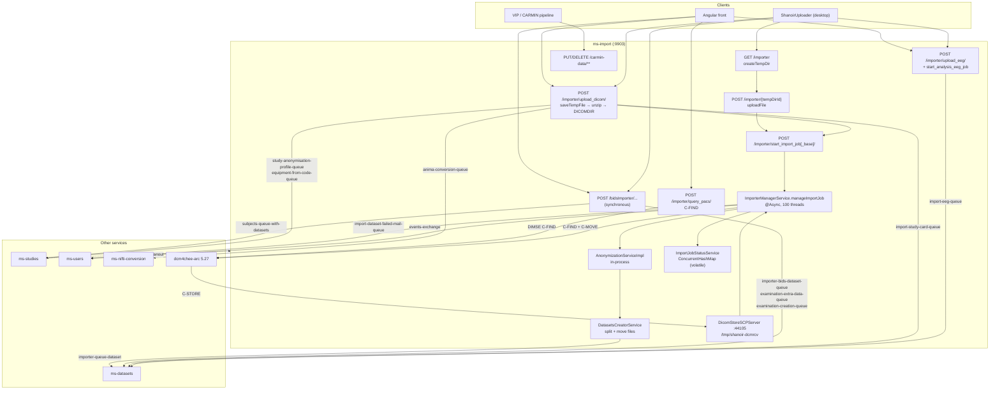

# `shanoir-ng-import` — Engineering Audit

**Audit target:** `/home/jamesbardet/Documents/code/shanoir-ng/shanoir-ng-import`
**Repo HEAD:** `867e53290` (develop line), Shanoir-NG 3.4.0
**Scope:** static, read-only. No build/tests were executed. Every claim below is anchored to `path:LINE`.
**Method note:** where behaviour depends on runtime configuration or on servlet-container normalisation that cannot be verified statically, this is stated explicitly as *unverified*.

---

## 1. Executive summary

`shanoir-ng-import` is the **untrusted-input front door** of the whole platform. Every DICOM archive, EEG archive, BIDS dataset, PACS retrieval and every ShanoirUploader (ShUp) desktop-client upload enters Shanoir through this service. It parses hostile-by-definition binary formats (DICOM, DICOMDIR, BrainVision, EDF), writes them to a shared `/tmp` volume, invokes pseudonymisation, and hands the result to `ms-datasets` over RabbitMQ.

It is 12,296 LOC across 73 main classes with **7 test classes containing 16 `@Test` methods, one of which is entirely commented out** (`DicomDirGeneratorServiceTest.java:38-41`). The tested surface is BIDS TSV date parsing, BrainVision header parsing, and two shallow controller smoke tests. **Zip extraction, DICOM parsing, anonymisation invocation, PACS querying, the import state machine and every RabbitMQ handoff have zero test coverage.**

**Health verdict: POOR — not safe to expose to semi-trusted users without remediation.** The service is functionally mature and clearly battle-worn (301 commits by the lead maintainer, active work as of 2026-08-03), but it carries a classic zip-slip, several path-traversal sinks reachable from client-controlled JSON and query parameters, one unauthenticated-by-annotation endpoint, a Spring singleton with mutable per-request state that will corrupt concurrent imports, and an anonymiser that can silently no-op on I/O failure.

### Top findings (ranked)

| # | Severity | Finding | Anchor |
|---|---|---|---|
| 1 | **Critical** | **Zip-slip.** `ImportUtils.unzip` concatenates the raw zip entry name onto the destination directory with no canonicalisation. A crafted `.zip` writes anywhere the JVM user can write. Reachable from 4 endpoints. | `utils/ImportUtils.java:163,170,172` |
| 2 | **Critical** | **Anonymisation silently skipped on I/O error.** `performAnonymization` catches `IOException` and just logs it; the original PHI-bearing file is then shipped to `ms-datasets` as if pseudonymised. | `shanoir-ng-anonymization/.../AnonymizationServiceImpl.java:332-334` |
| 3 | **Critical** | **`DicomDirGeneratorService` is a stateful Spring singleton.** Fields `in`/`out` are per-invocation state on a shared bean; two concurrent zip uploads corrupt each other's DICOMDIR, mixing patients. | `dicom/DicomDirGeneratorService.java:52-54,65-66,186-195` |
| 4 | **High** | **Arbitrary file read via `GET /importer/get_dicom/?path=`.** Query parameter is concatenated into a `file://` URL with no validation and no stream close. | `ImporterApiController.java:768-791` |
| 5 | **High** | **`POST /importer/import_dicom/` has no `@PreAuthorize`** and takes a *server-side absolute path* from the request body, reads it, and `delete()`s it in `finally`. | `ImporterApi.java:132-134`, `ImporterApiController.java:374-387` |
| 6 | **High** | **Broken authorisation on `upload_multiple_dicom`**: guarded only by `hasRightOnOneStudy('CAN_IMPORT')` (any study) while `studyId` is a path variable; it then calls `startImportJobBase` via `this.`, bypassing that method's per-study + non-draft checks (Spring self-invocation). | `ImporterApi.java:92`, `ImporterApiController.java:926` |
| 7 | **High** | **PHI survives pseudonymisation in the two production profiles.** `Profile OFSEP` and `Profile Neurinfo` (the only two rows in the studies DB seed) set `K` (keep) for **all private attributes**, `SeriesDescription`, `StudyDescription`, `StudyDate`, `SeriesDate`, `AcquisitionDate`, `DeviceSerialNumber` and (OFSEP) `InstitutionName`/`InstitutionAddress`. Nested sequences are never walked. | `anonymization.xlsx` sheet `Profiles`; `AnonymizationServiceImpl.java:275-323` |
| 8 | **High** | **No DLQ, no retry, and the work folder is deleted on failure.** The `ms-datasets` consumer of `importer-queue-dataset` throws `AmqpRejectAndDontRequeueException` and its `finally` block calls `cleanTempFiles(workFolder)` — the message is dropped *and* the source data erased. Unrecoverable partial imports. | `shanoir-ng-datasets/.../DatasetAcquisitionApiController.java:151-164` |
| 9 | **Medium** | **`ImportJobStatusService` is an unbounded, never-evicted, non-ownership-checked in-memory map.** Memory leak plus cross-user PHI disclosure by tempDirId guessing. | `ImportJobStatusService.java:40,68-70`; `ImporterApi.java:180` |

---

## 2. Purpose & domain responsibilities

The service owns everything between "a human or a robot has some imaging data" and "`ms-datasets` has a `DatasetAcquisition`". Concretely:

1. **Ingest** — accept a DICOM `.zip`, an EEG `.zip` (BrainVision/EDF), a BIDS `.zip`, a NIfTI/Analyze pair, individual DICOM files streamed by ShUp, or a VIP/CARMIN pipeline result.
2. **Analyse** — read (or synthesise) a `DICOMDIR`, build the DICOM hierarchy `Patient → Study → Serie → Instance`, then re-open every `.dcm` to extract metadata the DICOMDIR lacks (`AcquisitionNumber`, `EchoTime`, `ImageOrientationPatient`, `TransferSyntaxUID`, equipment, institution).
3. **Classify & filter** — mark series as ignored (non-imaging modality, empty instance list, `BurnedInAnnotation == YES`), enhanced, multi-frame, spectroscopy, compressed.
4. **Retrieve from PACS** — C-FIND at patient/study/series/image level against dcm4chee-arc, then C-MOVE into an embedded C-STORE SCP.
5. **Pseudonymise** — invoke `shanoir-ng-anonymization` in-process with the study's anonymisation profile.
6. **Reorganise on disk** — split each series into `dataset0..N` folders based on acquisition number / echo times / image orientation, and move the files.
7. **Hand off** — publish the `ImportJob` JSON to `ms-datasets`; create subjects and examinations synchronously via RPC to `ms-studies`/`ms-datasets`; publish `ShanoirEvent`s for the UI progress bar.

What it explicitly does **not** own: dataset persistence, NIfTI conversion execution, study-card application, subject/examination persistence. Those live in `ms-datasets`, `ms-nifti-conversion` and `ms-studies`.

---

## 3. Architecture & code structure

### 3.1 Package tree

```
src/main/java/org/shanoir/ng/                              73 files / 12,296 LOC (main+test)
├── ShanoirImportApplication.java                          1f /    57 LOC  @EnableAsync + taskExecutor bean
├── configuration/
│   ├── amqp/RabbitMQImportService.java                    1f /    45 LOC  only inbound listener
│   └── security/SecurityConfiguration.java                1f /   105 LOC  OAuth2 RS, CORS, CSRF off
├── importer/                                              5f / 1,917 LOC  ← controller + orchestrator
│   ├── ImporterApiController.java                              938 LOC   largest class
│   ├── ImporterApi.java                                        229 LOC   REST contract + @PreAuthorize
│   ├── ImporterManagerService.java                             395 LOC   @Async import pipeline
│   ├── DatasetsCreatorService.java                             275 LOC   series→datasets splitting
│   └── ImportJobStatusService.java                              80 LOC   in-memory status map
├── importer/bids/                                         4f /   655 LOC
├── importer/dicom/                                        8f / 1,154 LOC  DICOMDIR read/write, analysers, sorters
├── importer/dicom/query/                                  3f / 1,023 LOC  C-FIND/C-MOVE + Store SCP
├── importer/dto/                                          4f /   534 LOC
├── importer/eeg/brainvision/BrainVisionReader.java        1f /   623 LOC
├── importer/eeg/edf/                                     10f / 1,272 LOC
├── importer/model/                                       22f / 2,660 LOC  ImportJobBase/ImportJob/Serie/...
├── importer/vip/                                          6f /   600 LOC  CARMIN result upload
├── model/ExaminationDTO.java                              1f /   182 LOC  duplicate of importer/dto version
├── shared/exception/                                      2f /   107 LOC
└── utils/                                                 4f /   819 LOC  ImportUtils, ImportSecurityService,
                                                                           DiffusionUtil*, StreamGobbler*  (*dead)
src/test/java/                                             7f /   500 LOC / 16 @Test (1 empty)
```

### 3.2 Layering

Nominally `Api` (interface, carries mappings + `@PreAuthorize`) → `ApiController` (`@Controller` implementing it) → `@Service`. In practice the layering is thin and leaky:

- `ImporterApiController` (938 LOC) contains business logic, filesystem manipulation, AMQP RPC calls, EEG parsing loops and an entire multi-examination orchestration workflow (`uploadMultipleDicom`, `ImporterApiController.java:793-936`).
- `DatasetsCreatorService.createDatasets` carries `@PreAuthorize("hasAnyRole('ADMIN','EXPERT','USER')")` (`DatasetsCreatorService.java:59`) on an internal service method invoked only from an `@Async` thread — a role check with no object scope, present only to avoid `AuthenticationCredentialsNotFoundException`. The maintainer documents this workaround at `ShanoirImportApplication.java:35-38`.
- `BidsImporterApiController` does the whole BIDS walk + 3 kinds of AMQP call inline (`BidsImporterApiController.java:99-231`).

### 3.3 Key abstractions

| Type | Role | Notes |
|---|---|---|
| `ImportJobBase` (`model/ImportJobBase.java`, 455 LOC) | The one object that travels end-to-end: HTTP request body → in-memory async job → RabbitMQ JSON payload → `ms-datasets`. 30+ mutable fields. | Explicitly documented as the migration target replacing `ImportJob` (`ImportJobBase.java:46-52`). |
| `ImportJob extends ImportJobBase` (152 LOC) | Legacy variant retaining `patients` and `selectedSeries`. Marked `@todo: remove` three times (`ImportJob.java:34,51`). | Two parallel shapes still live simultaneously. |
| `Serie` (370 LOC) | Carries `selected`/`ignored`/`erroneous` flags **set by the client** and honoured by the server. | `ImporterManagerService.cleanSeries:209-217` trusts them. |
| `ImportJobStatus` | 3-state machine `IN_PROGRESS/FINISHED/ERROR` + the terminal `ImportJobBase`. | Held only in a `ConcurrentHashMap`. |

### 3.4 Persistence and where state lives

This is the critical architectural fact: **there is no import entity in the database.**

- A MariaDB datasource *is* configured (`application.yml:26-31`, `ddl-auto: validate`), but the only JPA entities on the classpath come from `shanoir-ng-study-rights` (`StudyUser`, `UserRights`), replicated from `ms-studies` over the `study-user-exchange` fanout. `import.sql` is 100% commented out; `populate.sql` still targets `shanoir_ng_template` — leftover scaffolding.
- **Import state lives in three volatile places:**
  1. **On disk**: `${shanoir.import.directory}/{userId}/{randomLong}/…` — `shanoir.import.directory` defaults to `/tmp` (`application.yml:110`), backed by a Docker named volume `tmp` shared with `studies`, `preclinical` and `nifti-conversion` (`docker-compose.yml:186,217,267,307,338`).
  2. **In the client's browser/ShUp memory**: the `ImportJob` returned by `upload_dicom` is POSTed back verbatim to `start_import_job`. The server keeps nothing between the two calls.
  3. **In a JVM-local `ConcurrentHashMap`**: `ImportJobStatusService.statuses` (`ImportJobStatusService.java:40`).

**Consequence:** a restart mid-import loses everything. The `@Async` thread dies, the status map is wiped (poll returns 404 → ShUp cannot distinguish "never existed" from "crashed"), no `ShanoirEvent` terminal state is emitted, the exam created earlier via `examination-creation-queue` is orphaned in `ms-datasets`, and the temp folder is never cleaned. There is **no idempotency key and no resume**. The class comment at `ImportJobStatusService.java:29-33` acknowledges the horizontal-scaling half of this, but not the durability half.

---

## 4. The import workflows

### 4.1 DICOM zip upload (web UI)

| Step | Endpoint / call | State transition |
|---|---|---|
| 1 | `POST /importer/upload_dicom/` (`ImporterApiController.java:162`) | `.zip` → `{importDir}/{userId}/{rand}.upload` (`ImportUtils.saveTempFile:307`) |
| 2 | `ImportUtils.checkZipContainsFile("DICOMDIR", tempFile)` (`:183`) | probes for DICOMDIR |
| 3 | `ImportUtils.saveTempFileCreateFolderAndUnzip` (`:186`) | unzip into `{importDir}/{userId}/{rand}/`, `tempFile.delete()` |
| 4 | if no DICOMDIR: `dicomDirGeneratorService.generateDicomDirFromDirectory` (`:191`) | writes `DICOMDIR` into the work folder |
| 5 | `dicomDirToModel.readDicomDirToPatients` (`:264`) | `Patient→Study→Serie→Instance` model |
| 6 | reject if >1 patient or >1 study (`:201-209`) | 422 |
| 7 | `imagesCreatorAndDicomFileAnalyzer.createImagesAndAnalyzeDicomFiles(..., false, null, false)` (`:235`) | `Instance[] → Image[]`, per-serie metadata |
| 8 | return `ImportJob` with `workFolder = importJobDir.getName()` only (`:218`) | **state handed to the client** |
| 9 | user picks series/context in Angular; `POST /importer/start_import_job/` (`:270`) | server re-resolves `{userImportDir}/{tempDirId}` |
| 10 | `importerManagerService.manageImportJob` `@Async` (`ImporterManagerService.java:112`) | status `IN_PROGRESS` |
| 11 | `cleanSeries` ×2, `pseudonymize`, `datasetsCreatorService.createDatasets` | files moved into `SERIES/{SeriesInstanceUID}/dataset{N}/` |
| 12 | `convertAndSend(IMPORTER_QUEUE_DATASET, json)` (`:181`) | status `FINISHED` |

### 4.2 PACS query-based import

`POST /importer/query_pacs/` → `QueryPACSService.queryCFIND` (patient-root or study-root depending on `dicomQuery.isStudyRootQuery()`), returns an `ImportJob` with `workFolder = ""` and `fromPacs = true` (`ImporterApiController.java:345-364`). The client selects series and POSTs `start_import_job`; `manageImportJob` then creates a fresh work folder, issues `queryCFINDInstances` + `queryCMOVE` per serie, and moves files out of the shared C-STORE landing zone `/tmp/shanoir-dcmrcv/{SeriesInstanceUID}/{SOPInstanceUID}.dcm` (`ImporterManagerService.java:317-348`).

### 4.3 EEG

`upload_eeg` (unzip only) → `start_analysis_eeg_job` (parse `.vhdr` via `BrainVisionReader`, or `.edf` via `EDFParser`, build `EegDataset[]`) → `start_import_eeg_job` (`ImporterApiController.java:694-712`). **No pseudonymisation** — commented as unnecessary (`:699`). Handoff is a *synchronous RPC* `convertSendAndReceive(IMPORT_EEG_QUEUE, …)` whose `Integer` reply is unboxed unchecked (`:705,707`).

### 4.4 BIDS

`POST /bidsImporter/{studyId}/{studyName}/{centerId}` runs the **entire** walk synchronously on the HTTP thread (`BidsImporterApiController.java:99-231`): unzip → find `sub-*` → RPC create subject → per `ses-*` RPC create examination → per data folder publish to `importer-bids-dataset-queue`, per loose file publish to `examination-extra-data-queue`. **No anonymisation, no DICOM inspection.**

### 4.5 ShanoirUploader-driven

ShUp uses a per-file streaming protocol (`shanoir-uploader/src/main/resources/endpoint.properties:36-44`):
`GET /importer` (create temp dir) → N × `POST /importer/{tempDirId}` (one file each) → `POST /importer/start_import_job_base/` → poll `GET /importer/status/{tempDirId}`.
Crucially, when `importJob.isFromShanoirUploader()` is true, **the server skips pseudonymisation entirely** (`ImporterManagerService.java:174-176`) — ShUp is trusted to have anonymised client-side. That boolean is a plain field of the client-supplied JSON body (`ImportJobBase.java:67,158-160`).

### 4.6 Diagram



---

## 5. External interfaces

### 5.1 REST API

All paths are prefixed `/shanoir-ng/import` by nginx (`shanoir-ng-nginx/files/etc/nginx/nginx.conf:128`, `client_max_body_size 6000M`, `proxy_read_timeout 1000s`).

| Method | Path | `@PreAuthorize` | Purpose | Callers |
|---|---|---|---|---|
| GET | `/importer` , `/importer/` | `ADMIN` or (`EXPERT`/`USER` + `hasRightOnOneStudy('CAN_IMPORT')`) | create temp dir, return random name | ShUp |
| POST | `/importer/{tempDirId}` | same | upload one file into temp dir | ShUp |
| POST | `/importer/upload_dicom/` | same | upload+unzip+analyse DICOM zip | front, ShUp |
| POST | `/importer/upload_multiple_dicom/study/{studyId}/studyName/{studyName}/studyCard/{studyCardId}/center/{centerId}/equipment/{equipmentId}/` | same — **not** scoped to `studyId` | multi-exam import | front, ShUp |
| POST | `/importer/upload_eeg/` | same | upload+unzip EEG zip | front, ShUp |
| POST | `/importer/upload_processed_dataset/` | same | NIfTI or Analyze `.hdr`/`.img` | front |
| POST | `/importer/import_dicom/` | **NONE** | read a server-side path as a zip, then `delete()` it | front (`importBruker.service.ts`) |
| POST | `/importer/start_import_job/` | `!isDraftStudy(#importJob.studyId)` and (`ADMIN` or `hasRightOnStudy(#importJob.studyId,'CAN_IMPORT')`) | start legacy import | front, ShUp |
| POST | `/importer/start_import_job_base/` | same | start ImportJobBase import | ShUp |
| GET | `/importer/status/{tempDirId}` | `hasRightOnOneStudy('CAN_IMPORT')` — **no ownership check** | poll async status | ShUp |
| POST | `/importer/start_analysis_eeg_job/` | `hasRightOnOneStudy('CAN_IMPORT')` | parse vhdr/edf | front, ShUp |
| POST | `/importer/start_import_eeg_job/` | `!isDraftStudy` + `hasRightOnStudy(...)` | hand EEG to datasets | front, ShUp |
| POST | `/importer/query_pacs/` | `hasRightOnOneStudy('CAN_IMPORT')` **and** `canImportFromPACS()` | C-FIND | front |
| GET | `/importer/get_dicom/?path=` | `hasRightOnOneStudy('CAN_IMPORT')` | stream a DICOM preview | front |
| POST | `/bidsImporter/{studyId}/{studyName}/{centerId}` | `hasAnyRole(ADMIN,EXPERT,USER)` and `!isDraftStudy(#studyId)` — **no `CAN_IMPORT`, no per-study right** | BIDS import | front, ShUp |
| PUT | `/carmin-data/**` | `ADMIN` or (`EXPERT`/`USER`) — no study scope | VIP result upload (base64) | VIP |
| DELETE | `/carmin-data/**` | same | recursive delete | VIP |

Dangling front-end constants with **no matching backend endpoint anywhere in the repo**: `/import/importer/import_eeg/` and `/import/niftiConverters` (`shanoir-ng-front/src/app/utils/app.utils.ts`).

### 5.2 RabbitMQ

**Consumed (inbound) — exactly one:**

| Queue | Exchange | Payload | Handler |
|---|---|---|---|
| `study-user-queue-import` | `study-user-exchange` (fanout, durable) | JSON `StudyUser[]` commands | `RabbitMQImportService.receiveMessage:41` → `RabbitMqStudyUserService` (ms-common) |

**Published (outbound):**

| Queue / exchange | Pattern | Payload | Consumer | Site |
|---|---|---|---|---|
| `importer-queue-dataset` | fire-and-forget | `ImportJob`/`ImportJobBase` JSON (full series+datasets+file paths) | ms-datasets `DatasetAcquisitionApiController:147` | `ImporterManagerService.java:181` |
| `importer-bids-dataset-queue` | fire-and-forget | `ImportJob` JSON per BIDS data folder | ms-datasets `BidsImporterService` | `BidsImporterApiController.java:250` |
| `examination-extra-data-queue` | fire-and-forget | `IdName(examId, absolutePath)` JSON | ms-datasets `RabbitMqExaminationService` | `BidsImporterApiController.java:254` |
| `import-eeg-queue` | **RPC** (`convertSendAndReceive`) | `EegImportJob` JSON → `Integer` status | ms-datasets `DatasetAcquisitionApiController` | `ImporterApiController.java:705` |
| `examination-creation-queue` | **RPC** → `Long examId` | `ExaminationDTO` JSON | ms-datasets `RabbitMqExaminationService` | `ImporterApiController.java:897`; `BidsImporterApiController.java:184,214` |
| `subjects-queue-with-datasets` | **RPC** → `Long subjectId` | `Subject` JSON | ms-studies `RabbitMQSubjectService` | `ImporterApiController.java:856`; `BidsImporterApiController.java:142` |
| `study-anonymisation-profile-queue` | **RPC** → `String` profile name | `Long studyId` | ms-studies `RabbitMQStudiesService:218` | `ImporterApiController.java:905` |
| `study-draft-state-queue` | **RPC** → `String` | `String studyId` | ms-studies `RabbitMQStudiesService` | `ImportSecurityService.java:84` |
| `equipment-from-code-queue` | **RPC** → `Long` | `DeviceSerialNumber` string | ms-studies `RabbitMqCenterService` | `ImporterApiController.java:867` |
| `import-study-card-queue` | **RPC** → `Long` | `{EQUIPMENT_ID_PROPERTY, STUDY_ID_PROPERTY, STUDYCARD_ID_PROPERTY}` JSON | ms-datasets `RabbitMqStudyCardService` | `ImporterApiController.java:874` |
| `anima-conversion-queue` | **RPC** → `boolean` | absolute image path string | ms-nifti-conversion `RabbitMqNiftiConversionService` | `ImporterApiController.java:486` |
| `import-dataset-failed-mail-queue` | fire-and-forget | `EmailDatasetImportFailed` JSON | ms-users `RabbitMQUserService` | `ImporterManagerService.java:273` |
| `events-exchange` (topic, routing key = event type) | fire-and-forget | `ShanoirEvent` JSON | ms-users | `ShanoirEventService.publishEvent:60` (ms-common) |

**Zero DLQ, zero retry policy, zero `x-dead-letter-*` argument** exists anywhere in `ms-common`, `ms-import` or `ms-datasets` (verified by grep for `dead.letter|DeadLetter|RetryTemplate|defaultRequeueRejected|maxAttempts`).

### 5.3 Outbound non-AMQP calls

- **DIMSE to dcm4chee-arc**: C-ECHO/C-FIND/C-MOVE from `QueryPACSService` (`:139-322`), calling AET `SHANOIR-SCU`, called AET `DCM4CHEE` at `${SHANOIR_PREFIX}dcm4chee-arc:11112` (`application.yml:113-123`).
- **DIMSE inbound**: embedded C-STORE SCP `SHANOIR-SCP` on `0.0.0.0:44105`, storage `/tmp/shanoir-dcmrcv` (`DicomStoreSCPServer.java:67-90`, `application.yml:124-130`).
- **No STOW-RS / WADO / QIDO client code exists in this service.** The task brief mentions STOW; the only DICOMweb-adjacent artefact is `shanoir-ng-anonymization/.../SendToPacs.java`, which is not referenced from `ms-import`.
- **No direct REST calls to other Shanoir services.** Everything is AMQP. A `RestTemplate` is mocked in the test but never used in main code.

### 5.4 Filesystem layout

```
/tmp                                          ← shanoir.import.directory (Docker volume "tmp",
                                                 shared with studies, preclinical, nifti-conversion)
 ├── {userId}/
 │    ├── {randomLong}.upload                 ← raw multipart, deleted after unzip
 │    ├── {randomLong}/                       ← work folder (tempDirId)
 │    │    ├── DICOMDIR                       ← original or generated
 │    │    ├── <original zip tree>
 │    │    └── SERIES/{SeriesInstanceUID}/dataset{N}/*.dcm   ← post-DatasetsCreatorService
 │    └── {randomLong}/<image>.nii.gz         ← upload_processed_dataset
 ├── shanoir-dcmrcv/{SeriesInstanceUID}/{SOPInstanceUID}.dcm ← C-STORE landing zone (global, shared)
 └── vip_uploads/<request URI tail>           ← CARMIN
```

No S3 usage in this service. No TTL, no scheduled sweeper: the *only* cleanup is `ms-datasets`' `cleanTempFiles` (`shanoir-ng-datasets/.../ImporterService.java:403-420`) after the handoff message is consumed. Everything that fails before that point leaks forever.

### 5.5 Shared code from ms-common / study-rights / anonymization

`RabbitMQConfiguration`, `AbstractEntity`, `IdName`, `DateTimeUtils`, `LocalDateAnnotations`, `DicomUtils`, `EchoTime`, `EquipmentDicom`, `InstitutionDicom`, `SerieToDatasetsSeparator`, `EmailBase`, `EmailDatasetImportFailed`, `ShanoirEvent`, `ShanoirEventService`, `ShanoirEventType`, `QualityTag`, `ErrorModel`, `RestServiceException`, `ShanoirException`, `ShanoirImportException`, `EntityNotFoundException`, `KeycloakUtil`, `MDCFilter`, `Utils`; from `study-rights`: `StudyRightsService`, `StudyUser`, `StudyUserRightsRepository`, `RabbitMqStudyUserService`; from `anonymization`: `AnonymizationServiceImpl`, `UIDGeneration`.

`shanoir-ng-exchange` is declared as a dependency (`pom.xml:46-50`) but **never imported** — as are `httpmime` (`pom.xml:71-75`) and `jackson-module-kotlin` (`pom.xml:52-55`).

### 5.6 Contract with `shanoir-uploader`

ShUp declares `shanoir-ng-import` as a **compile dependency** (`shanoir-uploader/pom.xml:74`) and reuses its classes directly rather than a generated client. Most-used: `Serie` (18 refs), `ImportJobBase` (18), `Study` (14), `Patient` (13), `UploadState` (12), `ImagesCreatorAndDicomFileAnalyzerService` (12), `Subject` (9), `DicomDirToModelService` / `DicomDirGeneratorService` (4 each), `QueryPACSService`, `DicomQuery`, `ImportJobStatus`, `PseudonymusHashValues`, `StreamGobbler`. This is why `QueryPACSService.queryCMOVEs` takes a **`javax.swing.JProgressBar`** parameter (`QueryPACSService.java:31,258,272`) — a Swing type in a headless server-side `@Service`, dead on the server, alive in ShUp. It is also why `ImagesCreatorAndDicomFileAnalyzerService` carries an `isFromShUpQualityControl` flag that flips paths between relative and absolute (`:240-244`).

The coupling is bidirectional and undeclared: any change to `Serie`/`ImportJobBase` field names silently breaks deployed ShUp installations, and the code already carries compatibility hacks for "old versions of ShUp v7.0.1, still installed and running" (`ImagesCreatorAndDicomFileAnalyzerService.java:167-171`).

---

## 6. Anonymisation & PHI handling deep-dive

Pseudonymisation is delegated to `shanoir-ng-anonymization` (1,199 LOC, 1 test class), invoked in-process from a `static final` singleton (`ImporterManagerService.java:79`) at `ImporterManagerService.pseudonymize:219-240`.

### 6.1 Rule source

`shanoir-ng-anonymization/src/main/resources/anonymization.xlsx`, sheet `Profiles`: 623 tag rows × 4 profiles (`Profile Basic`, `Profile MR`, `Profile OFSEP`, `Profile Neurinfo`). Actions: `X` delete, `Z` blank, `D` random dummy, `U` regenerate UID, `K` keep.

**Only two profiles exist in the studies database seed** (`shanoir-ng-studies/src/main/resources/scripts/import.sql:19`): `Profile Neurinfo` and `Profile OFSEP`. `Basic` and `MR` are unreachable in a default deployment.

### 6.2 What is reliably removed

Patient name/ID/birth date are forced by `anonymizePatientMetaData` (`AnonymizationServiceImpl.java:148-168`): `PatientName` and `PatientID` are overwritten with the Shanoir subject name, `PatientBirthDate` is truncated to `YYYY0101`. `AccessionNumber`, `ReferringPhysicianName`, `OperatorsName`, all `Physician*` tags, `OtherPatientIDs/Names`, `PatientComments`, `MedicalAlerts`, `Allergies`, `EthnicGroup`, `Occupation`, `AdditionalPatientHistory`, `AdmissionID`, `CurrentPatientLocation`, `VisitComments`, `ImageComments`, `RequestAttributesSequence`, `OriginalAttributesSequence`, `ReferencedPatientSequence`, `StationName` are `X`/`Z` in all profiles. UIDs (`SOPInstanceUID`, `SeriesInstanceUID`, `StudyInstanceUID`, `FrameOfReferenceUID`, `ReferencedSOPInstanceUID`) are `U` and remapped **consistently within one job** via the four `Map<String,String>` caches (`:121-124`, `anonymizeUID:616-641`), so intra-study referential integrity is preserved. `MediaStorageSOPInstanceUID` is regenerated first and then copied into `SOPInstanceUID` (`:234-235, 493-498`) — a deliberate fix for the dcm4chee "Affected SOP Instance UID differs" rejection.

### 6.3 What survives — enumerated

**(a) Everything marked `K` in the two production profiles.** OFSEP keeps: `AcquisitionDate`, `AcquisitionTime`, `ContrastBolusAgent`, `DeviceSerialNumber`, `InstitutionAddress`, `InstitutionName`, `PatientSex`, `PatientWeight`, **all private attributes**, `ProtocolName`, `RequestedContrastAgent`, `SeriesDate`, `SeriesDescription`, `StudyDate`, `StudyDescription`. Neurinfo additionally keeps `PatientAge`, `PatientSize`, `ContrastBolusStart/StopTime` but drops `InstitutionName/Address`.

`SeriesDescription` and `StudyDescription` are free-text fields routinely used by radiographers to type patient identifiers, ward names and clinical indications. Full acquisition dates plus sex/age/weight is a re-identification quasi-identifier set. `DeviceSerialNumber` uniquely identifies the scanner and therefore the site.

**(b) Private attributes wholesale.** `0xggggeeee = K` for OFSEP and Neurinfo. The only mitigation is `checkForPHIInPrivateTags` (`:389-405`), a **substring match** of the private tag's string value against `PatientName` parts, `PatientID`, `PatientBirthName`, `PatientBirthDate`. Three ways it fails:
- It is gated on `value != null && !value.isEmpty()` (`:283`). For binary VRs (`OB`, `UN`) `Attributes.getString()` returns null, so **the check and the manufacturer-deletion list are both skipped**. Siemens CSA headers `(0029,1010)`/`(0029,1020)` are `OB` and are known to embed `PatientName`. They survive untouched.
- The substring test requires `compareValuePHI.length() > 2` (`:408`), so 1–2 character name parts never match.
- It only compares against DICOM-declared PHI; a private tag containing the hospital MRN in a different format, or the referring physician, matches nothing.

**(c) The manufacturer allow-list is effectively inert.** `AnonymizationRulesSingleton` reads sheet 2 columns 0 and 1 only (`AnonymizationRulesSingleton.java:112-117`). The `SIEMENS` entry in that sheet lives in **columns C/D** and is never read. What remains is two GE tags (`0x00331013`, `0x0033101C`) matched by exact-string manufacturer equality (`getTagsToDeleteForManufacturer:368-371`) — `"GE Healthcare"` or a trailing space defeats it. The `0x00xxxxxx` wildcard form is not supported by `Set.contains`.

**(d) Nested sequences are never walked.** The rule loop iterates `datasetAttributes.tags()` (`:275`), i.e. top-level tags only. Sequence *containers* listed in the sheet with `X` are removed wholesale, which covers `RequestAttributesSequence`, `OriginalAttributesSequence`, `SourceImageSequence`, `ReferencedImageSequence`. But any PHI in a sequence **not** enumerated in the 623-row sheet — vendor-specific SQs, `SharedFunctionalGroupsSequence`/`PerFrameFunctionalGroupsSequence` of enhanced multi-frame MR, structured-report `ContentSequence` children — is invisible to the anonymiser. For enhanced DICOM this is significant: dates and device info live in per-frame functional groups.

**(e) Burned-in pixel annotation.** No pixel scrubbing exists. There is a partial defence at `DicomSerieAndInstanceAnalyzer.checkInstanceIsIgnored:76-80` — an instance whose `BurnedInAnnotation == "YES"` is excluded from the import — but `(0028,0301)` is **absent from the anonymisation sheet** and is optional/frequently wrong in practice. Secondary captures, dose reports and screenshots that omit or lie about the tag are imported with pixel-burned PHI intact.

**(f) The output never declares itself de-identified.** `PatientIdentityRemoved (0012,0062)`, `DeidentificationMethod (0012,0063)` and `DeidentificationMethodCodeSequence (0012,0064)` are **not in the sheet** and are never written. This violates PS3.15 Annex E and is self-inconsistent: `ImagesCreatorAndDicomFileAnalyzerService.checkPatientData:440-446` reads `PatientIdentityRemoved` to decide whether to display "identity removed" in the UI — a tag Shanoir itself never sets.

**(g) Composite action strings silently degrade to "blank".** 25 rows carry `X/D`, `X/Z`, `X/Z/D`, `Z/D` or `X/Z/U*`. `getFinalValueForTag` (`:527-549`) matches none of these, so `result` stays at its initialiser `""` (`:528`) and `anonymizeTag` treats it as a blank rather than a delete (`:438-442`). Affected tags include `InstanceCreationDate/Time`, `ObservationDateTime`, `BarcodeValue`, `LabelText`, `TreatmentMachineName`, `SourceSerialNumber`. The values are cleared, so this is not a PHI leak — but any future numeric-VR row with a composite action will throw `NumberFormatException` from `Integer.decode("")` (`:570`), and the same fallback silently swallows typos in the spreadsheet.

### 6.4 Where anonymisation can be bypassed entirely

| Path | Mechanism | Anchor |
|---|---|---|
| **ShUp imports** | `if (!importJob.isFromShanoirUploader()) pseudonymize(...)` — a client-controlled JSON boolean disables server-side pseudonymisation | `ImporterManagerService.java:174-176`; `ImportJobBase.java:67` |
| **I/O error** | `catch (IOException) { LOG.error(...) }` — the file keeps its original content and the batch reports success | `AnonymizationServiceImpl.java:332-334` |
| **EEG imports** | never anonymised by design | `ImporterApiController.java:699` |
| **BIDS imports** | never anonymised; files go straight to `ms-datasets` | `BidsImporterApiController.java:246-256` |
| **`upload_processed_dataset`** | NIfTI/Analyze written verbatim, path returned to client | `ImporterApiController.java:499-545` |
| **VIP/CARMIN** | base64 body written verbatim | `ExecutionResultApiController.java:101-102` |

### 6.5 Residual risk

For DICOM imported through the web UI or PACS with a study configured to `Profile OFSEP`/`Profile Neurinfo`, **direct identifiers are removed but the output is pseudonymised, not de-identified**: dates, descriptions, device serial and (OFSEP) institution remain, all private tags remain, binary private tags are not even heuristically scanned, and pixel-burned text is not addressed. For EEG, BIDS, processed datasets and all ShUp traffic, the server applies **no** de-identification at all. This is likely a conscious research trade-off for the "keep" list, but the private-tag and sequence gaps look unintentional, and the silent-skip-on-IOException path is unambiguously a defect.

---

## 7. Robustness & untrusted-input review

### 7.1 Zip handling

`ImportUtils.unzip:145-180` is the single extraction routine used by DICOM, EEG, BIDS and multi-DICOM uploads.

```145:180:shanoir-ng-import/src/main/java/org/shanoir/ng/utils/ImportUtils.java
    public static void unzip(String zipFilePath, String destDirectory) throws IOException {
        ...
                name = entry.getName();
                String filePath = destDirectory + File.separator + name;
                if (!entry.isDirectory()) {
                    directoryFile = getDirectoryPart(name);
                    if (directoryFile != null) {
                        createDirectory(destDir, directoryFile);
                    }
                    extractFile(entry, zipFile, filePath);
```

- **Zip-slip**: no `getCanonicalPath().startsWith(destDir)` check. `../../../../etc/cron.d/x` is extracted verbatim; `createDirectory` even creates the traversed parents for you (`:238-243`). `extractFile` then opens `new FileOutputStream(filePath)` (`:260`).
- **No entry-count, per-entry-size, or total-size limit** → zip bomb. With `max-file-size: 5000MB` (`application.yml:75`) and nginx `client_max_body_size 6000M`, a modest ratio fills the shared `tmp` volume, taking down `studies`, `preclinical` and `nifti-conversion` with it.
- **No symlink guard**: a zip entry that is a symlink is written as a regular file by this code (`ZipFile`/`FileOutputStream`), so symlink-follow is not directly exploitable here, but nothing checks for it.
- `checkZipContainsFile:123-135` opens a `ZipFile` **without try-with-resources**; any exception between `new ZipFile` and `close()` leaks the handle. Called on every DICOM upload (`ImporterApiController.java:183`).
- `isZipFile:223-226` dereferences `getOriginalFilename()` and `getContentType()` unguarded → NPE on a multipart part with no filename or no content type. It also accepts `application/octet-stream`, i.e. anything.
- `saveTempFileCreateFolderAndUnzip:280-297` derives the extraction folder from the temp file name (a random long), so the "folder already exists" guard is a birthday check on `SecureRandom.nextLong()`, not a real collision guard. `tempFile.delete()` at `:295` is unchecked.

**Cleanup is broken on the error path.** `uploadDicomZipFile`'s catch block deletes `tempFile` (`ImporterApiController.java:240-242`) — but `saveTempFileCreateFolderAndUnzip` already deleted it at `:295`. The **unzipped directory is never deleted**. Every malformed/multi-patient/multi-study upload therefore leaves its full extracted content in `/tmp/{userId}/` permanently.

### 7.2 DICOM parsing

- `DicomDirToModelService:56-90` correctly uses try-with-resources on `DicomDirReader`, but its `catch (IOException)` swallows the error and returns `Collections.emptyList()` (`:86-89`) — a corrupt DICOMDIR yields "0 patients", and the caller then does `patients.size()` / `patients.get(0)` on a possibly-`null` list (`ImporterApiController.java:201,205`, since `preparePatientsForImportJob:260-267` returns `null` when the file is missing). Both NPE and IOOBE land in the generic catch and surface as the misleading message `"Error while saving uploaded file."`.
- `ImagesCreatorAndDicomFileAnalyzerService` opens each file with try-with-resources (`:228, :265`) — correct. But `processDicomFileForFirstInstance` swallows `IOException` (`:273-275`), so a serie whose first file is unreadable is imported with **no** modality, protocol, equipment, institution, dates or compression flag, and no error is surfaced.
- Per-serie failures are caught and the serie is flagged `erroneous` and dropped (`:97-99`, `handleError:124-133`). This is deliberate resilience, but combined with `cleanSeries` (`ImporterManagerService.java:209-217`) it means **an import can complete "successfully" having silently dropped every serie**. There is no assertion that ≥1 serie survived.
- `handleError` logs `e.getStackTrace()` as a `{}` argument (`:125`) — prints `[Ljava.lang.StackTraceElement;@1a2b3c`, losing the stack trace entirely.
- Character sets: the DICOMDIR generator hardcodes `patRec.setSpecificCharacterSet("ISO_IR 192")` on the *records* (`DicomDirGeneratorService.java:131,140,149`) while copying values that were decoded using the source file's own charset. `(0008,0005)` is absent from the anonymisation sheet, so the source charset tag itself is preserved. Mixed-charset archives (common with accented French names) are a plausible corruption source; no test covers it.
- Multi-frame: `addImageSeparateDatasetsInfo:285-290` calls `MultiframeExtractor.extract(attributes, 0)` and derives *all* dataset-splitting metadata from **frame 0 only**. A multi-frame object whose frames differ in echo time or orientation collapses into one dataset.
- Compressed transfer syntaxes: only detected, never handled — `checkSerieData:407-410` sets `isCompressed` by prefix-matching `1.2.840.10008.1.2.4`. The anonymiser reads the full dataset including pixel data (`AnonymizationServiceImpl.java:245`) and rewrites with `DicomOutputStream` — for compressed syntaxes this is memory-heavy and its correctness is untested.
- `MultiframeExtractor.isSupportedSOPClass(null)` is called whenever `SOPClassUID` is missing (`:286-287`); behaviour is dcm4che-dependent and unverified.

### 7.3 Size / resource limits

| Control | Value | Anchor |
|---|---|---|
| Multipart file / request | 5000 MB | `application.yml:75-76` |
| nginx body | 6000 MB | `nginx.conf:48` |
| nginx read timeout | 1000 s | `nginx.conf:49` |
| Async import threads | core=max=100, queue=500 | `ShanoirImportApplication.java:52-58` |
| Max patients from PACS | 10 (server) / 20 (ShUp) | `application.yml:123`; `QueryPACSService.java:133` |
| Unzipped bytes | **unbounded** | — |
| Zip entry count | **unbounded** | — |
| Disk quota per user | **none** | — |
| EDF allocation | **attacker-controlled** | `EDFParser.java:104-113` |
| PACS connect / response timeout | **none set** for query associations | `QueryPACSService.java:139-175` |

### 7.4 Concurrency on shared directories

1. **`DicomDirGeneratorService` singleton state (critical).** `in`, `out`, `fsInfo`, `recFact` are instance fields of a `@Service` (`:46-54`). `generateDicomDirFromDirectory` → `createDicomDir` assigns `out`/`in` (`:65-66`); `close()` nulls them (`:186-195`). Two concurrent uploads that both lack a DICOMDIR will interleave: the second overwrites `out` and the first's records are written into the second's DICOMDIR, or `close()` races into an NPE. This is a cross-patient data-mixing bug, not merely a crash.
2. **`/tmp/shanoir-dcmrcv` is a single global C-STORE landing zone** keyed by `SeriesInstanceUID/SOPInstanceUID` (`DicomStoreSCPServer.java:49`, class comment `:33-38` acknowledges it). Two users C-MOVEing the same series concurrently race on the same files: `downloadAndMoveDicomFilesToImportJobDir` does `oldFile.renameTo(newFile)` (`ImporterManagerService.java:340`) with **the return value ignored**, and the other user then hits `throw new ShanoirException("file to copy does not exist")` (`:343`). Whoever loses the race gets a failed import; there is no locking.
3. **Shared `Association` used from `parallelStream()`.** `queryStudyLevel:394`, `queryStudies:497`, `querySeries:604` and `queryInstances:554` fan out over the common ForkJoinPool while sharing one dcm4che `Association`. Each thread builds its own `DimseRSPHandler`/`DicomState`, but `waitForOutstandingRSP()` (`:640`) waits for *all* outstanding responses on the association, so threads block on each other's queries. Whether concurrent `cfind` on one association is safe in dcm4che 5.31.1 is **unverified**; at minimum it serialises and defeats the parallelism.
4. **TOCTOU on `maxPatientsFromPACS`.** `processDICOMStudy:419` reads `patients.size()` *outside* the `synchronized` block that then adds (`:420-422`), so the cap can be exceeded under parallel study processing.
5. **`ImportJobStatusService.setInProgress` always replaces the entry** (`:42-48`) rather than mutating, so a status write racing a `setFinished` can resurrect `IN_PROGRESS`.

---

## 8. Code quality assessment

### 8.1 Swallowed exceptions and lost errors

| Site | What is lost |
|---|---|
| `AnonymizationServiceImpl.java:332-334` | I/O failure during pseudonymisation → PHI ships unmodified |
| `DicomDirToModelService.java:86-89` | corrupt DICOMDIR → empty patient list, caller NPEs |
| `DicomDirGeneratorService.java:90-91` | every unreadable file silently contributes 0 records |
| `DicomDirGeneratorService.java:86-88` (via `initServer` analogue) / `DicomStoreSCPServer.java:86-88` | **the C-STORE listener fails to start and the service logs and continues**; PACS import then fails at runtime with "file to copy does not exist" |
| `QueryPACSService.java:642-644, 696-698` | C-FIND/C-MOVE `IOException`/`InterruptedException` → partial result set returned as success; interrupt flag not restored |
| `ImagesCreatorAndDicomFileAnalyzerService.java:273-275` | serie imported with no metadata |
| `DatasetsCreatorService.java:78-80` | `NoSuchFieldException` from the reflective property check → `serieIdentifiedForNotSeparating` never assigned, `constructDicom` skipped, serie has **zero datasets** yet still ships |
| `DiffusionUtil.java:137-139, 200-202, 217-218` | all conversion errors |
| `ImporterApiController.java:238-246` | every failure of a 70-line method collapses into one 422 `"Error while saving uploaded file."` |

### 8.2 Null-safety

- `ImporterApiController.java:201` — `patients.size()` on a possibly-`null` list.
- `ImporterApiController.java:486` — `(boolean) rabbitTemplate.convertSendAndReceive(...)` unboxes `null` on RPC timeout.
- `ImporterApiController.java:705,707` — `(Integer) …` then `.intValue()`; a timed-out `import-eeg-queue` RPC yields a bare 500.
- `ImporterApiController.java:854` — `patient.getPatientBirthDate().withDayOfYear(1)` NPEs on DICOM without a birth date.
- `ImporterApiController.java:820,826` — `subjectFolder.listFiles()` can return `null` → `Arrays.asList(null)`.
- `ImporterManagerService.java:117` — `importJob.getExaminationId().toString()` **outside** the try block: NPE kills the async task after the status was already set `IN_PROGRESS`, so the job hangs in `IN_PROGRESS` forever with no event and no mail.
- `ImporterManagerService.java:244-245` — the same NPE inside `sendFailureMail`, i.e. inside the error handler.
- `ImportJobBase.java:429` — `serie.getInstitution().isKnown()` assumes non-null on client-deserialised JSON.
- `AnonymizationServiceImpl.java:284,393` — `patientNameArrayAttr` stays `null` when `PatientName` is absent/empty (`:250-258`), then `checkForPHIInPrivateTags` dereferences `.length`. Any already-anonymised DICOM with an empty `PatientName` and a non-empty private tag NPEs the whole import under OFSEP/Neurinfo.
- `AnonymizationServiceImpl.java:283` — `action.equals("K")` NPEs if a profile lacks the `0xggggeeee` row.
- `AnonymizationServiceImpl.java:117` — `profiles.get(profile)` NPEs if `ms-studies` returns an unknown profile name; profile names are free-text in the DB.

### 8.3 Duplication

- **Two `ExaminationDTO` classes** in one module: `org/shanoir/ng/model/ExaminationDTO.java` (182 LOC) and `org/shanoir/ng/importer/dto/ExaminationDTO.java` (227 LOC).
- `createRandomLong()` implemented identically in `ImportUtils.java:319-327` and `ImporterManagerService.java:301-309`, each with its own `SecureRandom`.
- `getUserImportDir` logic duplicated inline in `uploadEEGZipFile` (`ImporterApiController.java:413-418`) and `uploadProcessedDataset` (`:520-526`) instead of calling `ImportUtils.getUserImportDir`.
- `ImportJob.toString():74-118` is a near-verbatim copy of `ImportJobBase.toString():378-404`.
- `checkSerieForPropertiesString` (`DatasetsCreatorService.java:91-111`) and `checkSerieIsSpectroscopy` (`DicomSerieAndInstanceAnalyzer.java:114-133`) implement the same `tag==value;` mini-DSL twice, one via reflection and one hardcoded.
- Four anonymous `FilenameFilter` classes repeating the same macOS-junk exclusion in `BidsImporterApiController.java:126-130,153-158,194-201`.
- Model classes (`Serie`, `Patient`, `Study`, `Instance`, `ImportJobBase`) are shared *by jar* with ShUp and conceptually duplicated with the `org.shanoir.ng.importer.dto.*` hierarchy in `ms-datasets`.

### 8.4 Dead code

`DiffusionUtil` (227 LOC, zero callers — and it parses XML with a default `DocumentBuilderFactory`, i.e. latent XXE if ever wired up: `DiffusionUtil.java:97-99`), `StreamGobbler` (100 LOC, only ShUp uses it), `EDFWriter` (204 LOC), `EDFAnnotationFileHeaderBuilder` (266 LOC), `ImportUtils.toList`/`equalsIgnoreNull`, `QueryPACSService.queryECHO`/`queryCMOVEs`/`queryCFINDsInstances`, `PseudonymusHashValues`, `DicomDirGeneratorService.checkDuplicate` (permanently `false`, `:48`, guarding two `System.out.print('-')` calls at `:160,173`).

### 8.5 Production code depending on test artefacts

`ImporterApiController.java:81` imports `org.springframework.mock.web.MockMultipartFile` and instantiates it at `:377` and `:845` in production request paths. This works only because `shanoir-ng-back/pom.xml:101-105` declares `spring-boot-starter-test` **without `<scope>test</scope>`**, with the comment *"do not put scope test here: compile errors: org.json package will be missing"*. Every backend jar therefore ships JUnit, Mockito, AssertJ and spring-test.

### 8.6 Logging

- `LOG.error(dataFileDir.getAbsolutePath())` used as a debug print (`ImporterApiController.java:441`).
- `LOG.debug("Moving file: {} to ", old, new)` — two arguments, one placeholder (`ImporterManagerService.java:341`).
- `LOG.error("Failed to get size of %s%n%s", p, e)` — printf format in an SLF4J call (`ImportUtils.java:345,350`).
- `LOG.debug("C-FIND-RESPONSE CONTENT:\n" + response)` dumps raw dcm4che `Attributes` including `PatientName`/`PatientID`/`PatientBirthDate` (`QueryPACSService.java:647`). `Patient.toString()` deliberately SHA-256s its fields (`Patient.java:174-193`) but `Patient.toTreeString():196` does not, and `Study.toString()`/`Serie.toString()` print `studyDescription`/`seriesDescription` in the clear at INFO (`QueryPACSService.java:500,527`).
- The SHA-256 used for log pseudonymisation is **unsalted** (`Utils.sha256`, ms-common) — for a birth date (`Patient.java:186`) the pre-image space is ~40,000 values, so the hash is trivially reversible.

### 8.7 Misc

- Dead branch: `uploadDicomZipFile` checks `!ImportUtils.isZipFile` twice with identical bodies (`ImporterApiController.java:165-172`).
- `uploadFile` returns `null` instead of a `ResponseEntity` on success (`:753`) — Spring MVC then treats the return as "handled", producing an empty 200.
- `spring.main.allow-circular-references: true` in all three profiles (`application.yml:48,152,204`).
- Hardcoded credentials in the packaged config: `spring.datasource.password: password` (`:28`), `spring.rabbitmq.username/password: guest/guest` (`:68-69`).
- `logback-spring.xml` + `logging.level.org.shanoir: INFO` — the PHI-bearing DEBUG statements are off by default, which is the saving grace for §8.6.

---

## 9. Test coverage analysis

### 9.1 What exists

| File | `@Test` | What it actually asserts |
|---|---|---|
| `importer/bids/BidsTsvDateParserTest.java` | 9 | Date parsing from `_sessions.tsv` / `_scans.tsv`: formats, headers, missing columns. Genuinely good unit tests. |
| `importer/bids/BidsExaminationDateResolutionTest.java` | 3 | Precedence between sessions.tsv, scans.tsv and file creation time. Good. |
| `importer/eeg/BrainVisionReaderTest.java` | 1 | Parses one committed `.vhdr` fixture; asserts 64 channels, cut-offs, units, electrode XYZ, 88 events. Thorough for the happy path only. |
| `importer/ImporterApiControllerTest.java` | 2 | (a) `start_import_eeg_job` reaches `rabbitTemplate` with the dataset name in the payload — **no status assertion**, and the mocked RPC returns `null` so the handler actually 500s. (b) `get_dicom?path=` **asserts HTTP 200 for an empty path** — enshrining the fact that the endpoint happily serves a directory listing. |
| `importer/dicom/DicomDirGeneratorServiceTest.java` | 1 | **Empty.** The only statements are commented out and reference `/Users/mkain/Desktop/...` (`:39-40`). |
| `TestConfiguration.java`, `utils/ModelsUtil.java` | — | 54 LOC of scaffolding. |

Ratio: **16 test methods / 73 main classes**. `ImporterApiControllerTest` also carries an unused 32-line `createFile` helper (`:101-132`) and an unused `@MockBean RestTemplate` (`:74-75`).

### 9.2 The untested surface

Zero coverage on: `ImportUtils` (zip/unzip/temp files — the highest-risk 390 LOC in the module), `ImporterManagerService` (the entire orchestration + error path), `DatasetsCreatorService` (series→dataset splitting, file moves), `QueryPACSService` (743 LOC), `DicomStoreSCPServer`, `DicomDirToModelService`, `ImagesCreatorAndDicomFileAnalyzerService` (451 LOC), `DicomSerieAndInstanceAnalyzer`, all 4 sorters, `EDFParser` (266 LOC), `BidsImporterApiController`, `ExecutionResultApiController`, `ImportSecurityService`, `ImportJobStatusService`, `SecurityConfiguration`, and 12 of the 14 REST endpoints. There is **no test anywhere** that feeds a malformed input to any parser, and **no test of `@PreAuthorize` behaviour** (`ImporterApiControllerTest` runs with `addFilters = false`, `:63`).

The sibling `shanoir-ng-anonymization` module has one test class, `AnonymizationTest` (136 LOC), for 691 LOC of anonymiser — there are **no golden-file tests** proving which tags survive a given profile.

### 9.3 Highest-value missing tests, in priority order

1. **`ImportUtilsTest.unzip` — zip-slip.** Fixture: `zipslip.zip` built programmatically with `ZipOutputStream` containing one entry named `../../pwned.txt`. Assert `pwned.txt` is *not* created outside the destination and that an exception is thrown. Also a `..\\pwned.txt` Windows-separator variant.
2. **`ImportUtilsTest.unzip` — bomb / limits.** Fixture: a nested-deflate zip (`bomb.zip`, ~1 KB → 1 GB). Assert extraction aborts once a configured byte or entry budget is exceeded.
3. **Anonymisation golden-file tests** (`shanoir-ng-anonymization`). Fixtures: `phi-rich.dcm` (patient name/ID/birthdate, `StudyDescription = "SMITH John MRN 12345"`, private `(0029,1010)` OB blob containing the patient name, `RequestAttributesSequence`, `OriginalAttributesSequence`, an enhanced multi-frame variant). One test per profile asserting an explicit expected tag→value map after `anonymizeForShanoir`. This is the single highest-value test in the whole platform and currently does not exist.
4. **`AnonymizationServiceImplTest.ioErrorIsNotSwallowed`.** Fixture: a read-only / mid-truncated `.dcm`. Assert an exception propagates and that `ImporterManagerService.pseudonymize` fails the import rather than continuing.
5. **`DicomDirGeneratorServiceTest.concurrentGeneration`.** Two directories, two threads, `CountDownLatch`. Assert both DICOMDIRs contain only their own patient. Would fail today.
6. **`ImporterApiControllerAuthTest`** with `addFilters = true` and `@WithMockKeycloakUser` for USER/EXPERT/ADMIN: assert 403 for `import_dicom` from an unauthenticated caller, assert `upload_multiple_dicom` into a study the user lacks `CAN_IMPORT` on is rejected, assert `status/{tempDirId}` of another user's job returns 403/404.
7. **`ImporterApiControllerTest.getDicomImage` path traversal.** `?path=../../../../etc/passwd` must return 4xx, not the file. Replaces the current test that asserts 200 for an empty path.
8. **`ImporterManagerServiceTest`** with a Mockito-mocked `RabbitTemplate`/`QueryPACSService`: (a) all series `erroneous` → import must fail, not publish an empty job; (b) `examinationId == null` → must set status `ERROR` rather than hang `IN_PROGRESS`; (c) `fromShanoirUploader = true` must not skip pseudonymisation unless a server-side trust decision says so.
9. **`ImagesCreatorAndDicomFileAnalyzerServiceTest` with malformed DICOM.** Fixtures: `truncated.dcm` (first 200 bytes of a valid file), `no-sopinstanceuid.dcm`, `latin1-name.dcm` with `SpecificCharacterSet = ISO_IR 100`, `enhanced-multiframe.dcm`, `jpeg2000.dcm`. Assert the serie is marked erroneous with a useful message and no unhandled exception escapes.
10. **`DicomDirToModelServiceTest` — traversal via `ReferencedFileID`.** Fixture: a `DICOMDIR` whose instance record has `ReferencedFileID = {"..","..","..","etc","passwd"}`. Assert `getFileFromInstance` refuses to resolve outside the work folder.
11. **`EDFParserTest` — hostile header.** Fixture: `evil.edf` with `numberOfRecords = 2000000000`, `numberOfChannels = 99999`, and one with non-numeric ASCII in the numeric header fields. Assert `EDFParserException` rather than `OutOfMemoryError`/`NumberFormatException`.
12. **`DatasetsCreatorServiceTest`** — a serie with two acquisition numbers and two echo times must yield the expected `dataset0`/`dataset1` split; a `SeriesInstanceUID` of `"../escape"` must be rejected.
13. **`BidsImporterApiControllerTest`** — zip with two `sub-*` folders, zip with a non-`sub-` top-level entry, and a subject-creation RPC returning `null`.

Fixtures 3, 9 and 10 need small synthetic `.dcm` files; they can be generated in-test with `dcm4che`'s `Attributes` + `DicomOutputStream` rather than committed as binaries, which also keeps the repo free of anything resembling real patient data.

---

## 10. Bugs & correctness risks

### 10.1 Ranked table

| # | Sev | Title | Location |
|---|---|---|---|
| B1 | Critical | Zip-slip in `ImportUtils.unzip` | `utils/ImportUtils.java:163-172` |
| B2 | Critical | Anonymisation silently skipped on `IOException` | `AnonymizationServiceImpl.java:332-334` |
| B3 | Critical | `DicomDirGeneratorService` singleton has per-request mutable state | `dicom/DicomDirGeneratorService.java:52-66,186-195` |
| B4 | High | Arbitrary file read via `get_dicom?path=` (+ unclosed stream) | `ImporterApiController.java:768-791` |
| B5 | High | `import_dicom` unauthorised; arbitrary path read + delete | `ImporterApi.java:132-134`; `ImporterApiController.java:374-387` |
| B6 | High | `upload_multiple_dicom` authz bypass via `this.startImportJobBase` | `ImporterApi.java:92`; `ImporterApiController.java:926` |
| B7 | High | `workFolder`/`tempDirId` from JSON body → cross-user work folder | `ImporterApiController.java:276-279, 317-320` |
| B8 | High | Path traversal via `ReferencedFileID` and `Image.path` from client JSON / DICOMDIR | `DicomUtils.referencedFileIDToPath:88-99`; `DatasetsCreatorService.java:234,259` |
| B9 | High | `AmqpRejectAndDontRequeueException` + `cleanTempFiles` in `finally` = unrecoverable loss, no DLQ | `shanoir-ng-datasets/.../DatasetAcquisitionApiController.java:151-164` |
| B10 | High | Unzipped folder never cleaned on upload failure | `ImporterApiController.java:238-246` |
| B11 | Medium | NPE outside try in `manageImportJob` strands job in `IN_PROGRESS` | `ImporterManagerService.java:117` |
| B12 | Medium | `ImportJobStatusService` unbounded map, no ownership check | `ImportJobStatusService.java:40,68`; `ImporterApi.java:180` |
| B13 | Medium | `convertAnalyzeToNifti` returns a nonsense doubled path | `ImporterApiController.java:480-493` |
| B14 | Medium | Executor/association leaks in `QueryPACSService` on any exception | `QueryPACSService.java:140-175, 189-220` |
| B15 | Medium | Private binary tags escape the PHI heuristic and the manufacturer list | `AnonymizationServiceImpl.java:281-288` |
| B16 | Medium | `SIEMENS` row of `TagsToDeleteForManufacturer` is never read | `AnonymizationRulesSingleton.java:112-117` |
| B17 | Medium | NPE in `checkForPHIInPrivateTags` when `PatientName` is empty | `AnonymizationServiceImpl.java:284,393` |
| B18 | Medium | Unbounded allocation from EDF header | `EDFParser.java:104-113` |
| B19 | Medium | BrainVision `DataFile=` / `MarkerFile=` path traversal | `BrainVisionReader.java:267,271` |
| B20 | Medium | Blocking PACS/AMQP RPCs with no timeout on HTTP threads | `QueryPACSService.java:139-175`; `BidsImporterApiController.java:99-231` |
| B21 | Medium | `checkZipContainsFile` leaks a `ZipFile` handle | `ImportUtils.java:123-135` |
| B22 | Low | `isZipFile` NPE; accepts `application/octet-stream` | `ImportUtils.java:223-226` |
| B23 | Low | `renameTo` return value ignored in PACS move | `ImporterManagerService.java:340` |
| B24 | Low | `uploadFile` returns `null` | `ImporterApiController.java:753` |
| B25 | Low | `NoSuchFieldException` → serie shipped with zero datasets | `DatasetsCreatorService.java:73-80` |
| B26 | Low | Composite spreadsheet actions degrade to blank | `AnonymizationServiceImpl.java:527-549` |
| B27 | Low | Import can "succeed" with all series dropped | `ImporterManagerService.java:137,168` |
| B28 | Low | Multi-frame dataset split uses frame 0 only | `ImagesCreator….java:285-290` |

### 10.2 Detail

**B1 — Zip-slip.** *Where:* `ImportUtils.java:163` builds `destDirectory + File.separator + entry.getName()`; `:170` pre-creates the traversed directories; `:172`→`:260` opens a `FileOutputStream` on it. *Reachable from:* `upload_dicom`, `upload_multiple_dicom`, `upload_eeg`, `bidsImporter` — every one of them from an authenticated `USER` with `CAN_IMPORT` on any study. *Manifestation:* arbitrary file write as the container user; in the shipped compose file the write lands in a `tmp` volume shared with three other services, and can also target `/var/log/shanoir-ng-logs` or the JVM's own working directory. *Fix:* resolve and canonicalise before writing —
```java
Path target = destDir.toPath().resolve(name).normalize();
if (!target.startsWith(destDir.toPath().normalize())) throw new IOException("Zip entry escapes: " + name);
```
plus per-entry and total byte budgets and an entry-count cap, and reject absolute entry names.

**B2 — Anonymisation silently skipped.** *Where:* `AnonymizationServiceImpl.java:332-334`. *Manifestation:* `dos = new DicomOutputStream(dicomFile)` at `:329` **truncates the target file** before writing; if `writeDataset` then throws (disk full, permissions, malformed attributes), the catch logs and the method returns normally. The caller loop (`:129-137`) continues, `anonymizeForShanoir` returns without error, `pseudonymize` succeeds, and `ms-datasets` receives a file that is either the untouched original (failure during read) or a truncated corpse (failure during write). Either way the import is reported as successful. *Fix:* rethrow as a checked `AnonymizationException`; write to a sibling temp file and `Files.move(..., ATOMIC_MOVE)` on success; have `pseudonymize` verify the modified-tag count from `AnonymizationStats` is non-zero for every file.

**B3 — DICOMDIR generator singleton.** *Where:* `DicomDirGeneratorService.java:52-54` declares `in`/`out` as instance fields of a `@Service`. *Manifestation:* two users uploading DICOMDIR-less zips at the same time interleave inside `generateDicomDirFromDirectory:56-60`; the second `createDicomDir` replaces `out`, so patient/study/series records from import A are appended to import B's DICOMDIR (or vice versa), then `close()` nulls the fields under the other thread. *Fix:* make the class stateless — pass a local `DicomDirWriter` down through `addReferenceTo`/`addRecords`, or annotate `@Scope("prototype")`. The stateless refactor is ~30 lines and should ship with the concurrency test from §9.3.5.

**B4 — `get_dicom` arbitrary read.** *Where:* `ImporterApiController.java:770-774`. `path` is a **query parameter**, so servlet-path normalisation does not apply; `new URL("file:///" + userImportDir + "/" + path)` with `path = "../../../../etc/passwd"` resolves outside. The `InputStream is` at `:774` is never closed, leaking a descriptor per call. The existing test asserts the empty-path case returns 200 (`ImporterApiControllerTest.java:160-165`), i.e. serving the user directory itself. *Fix:* canonicalise and assert containment in `userImportDir`; use `Files.newInputStream` in try-with-resources or return a `FileSystemResource`.

**B5 — `import_dicom`.** *Where:* declared without `@PreAuthorize` at `ImporterApi.java:132-134`. The class-level filter chain (`SecurityConfiguration.java:74-79`) requires authentication, so it is not anonymous — but any authenticated realm user, including one with no study rights at all, can POST a **server-side absolute path**, have it read as a zip and unzipped into their own work folder (`ImporterApiController.java:374-379`), and then `tempFile.delete()`d in `finally` (`:386`). That is arbitrary read plus arbitrary delete of anything the JVM can unlink. Front-end caller: `shanoir-ng-front/src/app/preclinical/importBruker/importBruker.service.ts`. *Fix:* add the same `@PreAuthorize` as its siblings; better, replace the path-in-body contract with a `tempDirId` + filename pair validated against the caller's own directory.

**B6 — `upload_multiple_dicom` authz.** Two independent defects: the annotation is `hasRightOnOneStudy('CAN_IMPORT')` (`ImporterApi.java:92`) while `studyId`/`centerId`/`equipmentId` are attacker-chosen path variables; and the method calls `this.startImportJobBase(job)` (`ImporterApiController.java:926`), a Spring self-invocation that bypasses the proxy and therefore the `!isDraftStudy(...) and hasRightOnStudy(...)` guard on that method. *Fix:* change the annotation to `hasRightOnStudy(#studyId,'CAN_IMPORT') and !isDraftStudy(#studyId)`, and extract the shared body into a service bean so the check is not proxy-dependent.

**B7 — `workFolder` from the request body.** `startImportJob:276-279` and `startImportJobBase:317-320` do `new File(userImportDir, importJob.getWorkFolder())` with no validation that the value is a bare name. `"../<otherUserId>/<theirTempDir>"` passes `exists()` and the import proceeds against another user's uploaded DICOM. The path is a **JSON field**, not a URL segment, so container normalisation does not help. *Fix:* reject any `workFolder` containing a separator or `..`, then canonicalise and assert containment.

**B8 — Traversal via DICOM/JSON-supplied paths.** `DicomUtils.referencedFileIDToPath` (ms-common) joins `ReferencedFileID` components onto the work folder with no checks; `Instance.referencedFileID` is both parsed from the DICOMDIR (`Instance.java:69`) and deserialised from client JSON (`Instance.java:41-42`). Downstream, `DatasetsCreatorService.createSerieIDFolderAndMoveFiles:234` builds a directory from the client-supplied `SeriesInstanceUID` and `moveFiles:259-268` resolves `importJobDir + "/" + image.getPath()` and **renames it** into the import. A crafted `ImportJob` can therefore relocate arbitrary readable+writable files into the import and ship them to `ms-datasets`. *Fix:* validate every component (no separators, no `..`, no absolute), canonicalise, assert containment in the work folder, and reject `SeriesInstanceUID` values that are not valid DICOM UIDs (`[0-9.]{1,64}`).

**B9 — No DLQ / destructive failure handling.** `ms-datasets` consumes `importer-queue-dataset`, wraps any failure in `AmqpRejectAndDontRequeueException` (`:157`) — with no dead-letter exchange configured anywhere, the broker discards the message — and its `finally` block unconditionally calls `cleanTempFiles(importJob.getWorkFolder())` (`:162`), deleting the pseudonymised files. From the user's perspective `ms-import` reported `FINISHED`; from the data's perspective the import evaporated. Note the two sides even disagree: `ms-import` sets `FINISHED` at `ImporterManagerService.java:179` *before* publishing at `:181`. *Fix:* declare `x-dead-letter-exchange` on the import queues, only clean temp files on success, and add a reconciliation job.

**B10 — Leaked work folders.** In `uploadDicomZipFile`'s catch (`:240-242`) the only cleanup targets `tempFile`, which `saveTempFileCreateFolderAndUnzip` already deleted at `ImportUtils.java:295`. The extracted directory, which may be gigabytes, is never removed. Combined with the absence of any sweeper, `/tmp` grows monotonically with every failed upload. *Fix:* track `importJobDir` and `FileUtils.deleteQuietly` it in the catch; add a scheduled sweeper for work folders older than N hours with no active status entry.

**B13 — `convertAnalyzeToNifti` doubled path.** `imageName` is absolute (`:481`), `newImageName` is therefore also absolute (`:482`), and `new File(parentFolder, newImageName)` (`:492`) yields `"/tmp/1/9/tmp/1/9/img.nii.gz"` on Unix. That bogus path is what `uploadProcessedDataset` returns to the client (`:539`). *Fix:* `new File(parentFolder, FilenameUtils.getName(newImageName))`.

**B14 — PACS resource leaks.** `connectAssociation:140-141` creates two executors before `callingAE.connect`; on `IOException`/`IncompatibleConnectionException` the catch rethrows without shutting them down (`:171-174`) — two leaked threads per failed connection. And `queryCFIND:194-219` releases the association only on the happy path: if `queryPatientLevel`/`queryStudyLevel` throws, the association and its executors leak. `releaseAssociation` is never in a `finally`. *Fix:* try-with-resources or `finally` in all five entry points; set `ConnectOptions` timeouts on the query connections as is already done for the SCP (`DicomStoreSCPServer.java:76-77`).

**B18 — EDF allocation.** `EDFParser.java:104-113` allocates `new short[numberOfRecords * numberOfSamples[i]]` and a parallel `double[]` per channel, all three values parsed straight from the file's ASCII header (`:73-79`). A 300-byte `.edf` requesting 2×10⁹ records causes `OutOfMemoryError` (killing the JVM for all tenants) or `NegativeArraySizeException` on overflow. The `Integer.parseInt`/`Double.parseDouble` at `:73-79` throw `NumberFormatException`, which is *not* wrapped by the surrounding `catch (IOException)` (`:84`) and escapes `analyzeEegZipFile`'s `catch (ShanoirImportException)` (`ImporterApiController.java:475`) as a bare 500. *Fix:* validate header fields against sane bounds and total-size-vs-file-size before allocating; wrap all parse failures in `EDFParserException`.

**B19 — BrainVision traversal.** `BrainVisionReader.java:267` sets `dataFileLocation = file.getParent() + "/" + zeile.substring(9)` from the `DataFile=` line of a user-supplied `.vhdr`; `:271` does the same for `MarkerFile=`. `DataFile=../../../../etc/shadow` is opened as a `RandomAccessFile`. *Fix:* take `FilenameUtils.getName()` of the declared value and assert the resolved file is a sibling of the `.vhdr`.

---

## 11. Security review

**Authentication/authorisation.** OAuth2 resource server against Keycloak realm `shanoir-ng`; `SessionCreationPolicy.STATELESS`; CSRF disabled (`SecurityConfiguration.java:71-72`) — acceptable for a pure bearer-token API. `anyRequest().authenticated()` (`:77-78`) with `/swagger-ui/**` and `/api-docs/**` public (`:75-76`) — **the OpenAPI spec is world-readable**, and `springdoc.api-docs.enabled: true` in the production profile (`application.yml:86`). The JWT converter dereferences `realm_access` and `roles` without null checks (`:81-83`) → a token without those claims causes a 500 rather than a 401.

Authorisation defects: B5 (missing annotation), B6 (wrong scope + self-invocation bypass), B7 (client-controlled work folder), B12 (`status/{tempDirId}` has no ownership check — knowing a temp dir id yields the full `ImportJobBase` including patient, subject name, series descriptions and file paths). BIDS import requires no `CAN_IMPORT` and no per-study right at all (`BidsImporterApi.java:52`), yet creates subjects and examinations in the target study. The CARMIN endpoints (`ExecutionResultApi.java:42,54`) are open to any `USER`.

**Path traversal.** Five distinct sinks: B1 (zip entry), B4 (query param — no container protection), B7 (JSON field — no container protection), B8 (DICOMDIR / JSON `Image.path` / `SeriesInstanceUID`), B19 (`.vhdr` header). Two further sinks depend on servlet-container behaviour and are **unverified**: `uploadFile`'s `new File(importJobDir, file.getOriginalFilename())` (`ImporterApiController.java:741`) — Spring's `MultipartFile.getOriginalFilename()` is documented as possibly containing path information and this code does not strip it; and `ExecutionResultApiController.getImportPathFromRequest:135-137`, which takes `request.getRequestURI()` (raw), URL-decodes it itself, and feeds the result to `FileUtils.writeByteArrayToFile` (`:102`) and `Utils.deleteFolder` (`:124`). Tomcat normally rejects encoded dot-segments before mapping, which would block the latter, but the application code provides no defence of its own.

**DoS.** 6 GB uploads accepted at the edge; unbounded decompression (B1); unbounded EDF allocation (B18); 100 concurrent async imports each capable of holding a multi-GB DICOM dataset in `HashSet<File>`/`Attributes`; `ExecutionResultApiController` explicitly raises Jackson's string limit to `Integer.MAX_VALUE` (`:81-83`) and then base64-decodes the whole body into a `byte[]` (`:101`) — a 1 GB body becomes ~750 MB of heap plus the encoded copy; PACS queries with no timeouts block HTTP threads indefinitely; and `queryPatientLevel`/`queryStudyLevel` run C-FIND fan-out on the **common ForkJoinPool**, so one large PACS query starves every other parallel stream in the JVM.

**PACS credentials and TLS.** There are no PACS credentials — authentication is AE-title-based only (`SHANOIR-SCU` → `DCM4CHEE`, `application.yml:113-122`), the weakest form of DIMSE trust. `connectAssociation` builds `new Connection(null, host, port)` (`QueryPACSService.java:153`) with **no TLS cipher suites configured**, so C-FIND queries (which carry `PatientName`, `PatientID`, `PatientBirthDate` in both request and response) and all C-STORE traffic move in cleartext. Same for the SCP (`DicomStoreSCPServer.java:69-85`). Inside a Docker bridge network this is survivable; against a hospital PACS across a site network it is not. There is no `shanoir.import.pacs.*.tls` setting to enable.

**Other credentials.** `spring.datasource.password: password` and `spring.rabbitmq.username/password: guest/guest` are committed in `application.yml:28,68-69`. `docker-compose.yml:220-222` publishes ports `9903`/`9913` to the host, exposing the service and its Swagger UI outside the nginx gateway.

**PHI leakage.** See §6 and §8.6. Additionally: PHI-derived values appear in **filesystem paths** — `/tmp/shanoir-dcmrcv/{SeriesInstanceUID}/{SOPInstanceUID}.dcm` and `SERIES/{SeriesInstanceUID}/` — on a volume shared with three other containers. `SeriesInstanceUID` is not PHI itself but is a stable linkable identifier that persists after pseudonymisation regenerates the in-file UIDs. Import work folders are never swept, so PHI-bearing DICOM accumulates in `/tmp` indefinitely after any failure.

**Injection.** No SQL is written by hand (the only repository is a Spring Data interface). No shell execution in this service (`StreamGobbler` is dead here). XML: `DiffusionUtil.java:97-99` uses a default `DocumentBuilderFactory` — XXE-vulnerable, currently unreachable. Reflection: `DatasetsCreatorService.checkSerieForPropertiesString:99-101` resolves a field name from the `shanoir.import.series.seriesProperties` property — operator-controlled, not user-controlled, so low risk, but it is reflective field access with `setAccessible(true)`.

**Supply chain.** `weasis-dicom-tools` is pulled from `https://raw.github.com/nroduit/mvn-repo/master/` (`pom.xml:126-134`) — a personal GitHub raw endpoint, no signatures, mutable content. `spring-boot-starter-test` ships at compile scope in the production jar (§8.5).

---

## 12. Performance & scalability

**Throughput model.** Every import is one `@Async` task on a fixed 100-thread pool with a 500-slot queue (`ShanoirImportApplication.java:52-58`). Beyond 600 in-flight imports, `TaskRejectedException` propagates out of `manageImportJob` back into `startImportJob`'s HTTP thread *after* the status was already set `IN_PROGRESS` (`ImporterApiController.java:280`), leaving a permanently-stuck status entry. 100 concurrent imports of the documented "up to 10 GB per DICOM study" (`ImportJobBase.java:31-33`) implies up to 1 TB of concurrent `/tmp` usage against a volume with no quota.

**Memory.** Whole archives are never read into RAM (extraction streams through a 2 KB buffer, `ImportUtils.java:261`), which is good. But: `getDicomFilesForImportJob` pre-sizes a `HashSet` for 50,000 files with a comment claiming 100,000 (`ImporterManagerService.java:351-362`); the anonymiser holds a full `Attributes` **including pixel data** per file (`AnonymizationServiceImpl.java:245`) — for a 500 MB enhanced multi-frame object that is ~1 GB transient per thread; `getDicomImage` buffers the entire file into a `ByteArrayOutputStream` then copies to a `byte[]` then wraps in `ByteArrayResource` — three copies (`ImporterApiController.java:775-785`); `ExecutionResultApiController` holds body + decoded bytes simultaneously with a 2 GB Jackson string limit.

**Disk.** Files are moved with `File.renameTo` (`ImporterManagerService.java:340`, `DatasetsCreatorService.java:181,263`), which is cheap within a filesystem and **silently fails across mount points** (return value ignored at `ImporterManagerService.java:340`; checked but only logged at `DatasetsCreatorService.java:184-186`). `ImportUtils.getDirectorySize` walks the whole tree after every successful import purely to log a size (`ImporterManagerService.java:183`) — a full `stat` sweep of potentially 100k files for a log line.

**Blocking I/O on HTTP threads.**

| Endpoint | Blocking work |
|---|---|
| `upload_dicom` | multipart persist + unzip + DICOMDIR generation + open every `.dcm` twice. Minutes for a large study. |
| `upload_multiple_dicom` | the above **× N examinations**, plus 4–5 AMQP RPCs per exam, all sequential (`:835-927`). |
| `query_pacs` | C-FIND fan-out with no connect/response timeout. |
| `bidsImporter` | full tree walk + one RPC per subject and per session (`:99-231`). |
| `start_analysis_eeg_job` | full BrainVision/EDF parse. |

`spring.threads.virtual.enabled: true` (`application.yml:56-58`) puts Tomcat on virtual threads, which helps the blocking-I/O cost — but `QueryPACSService` pins carrier threads inside `synchronized` blocks (`:346, 407, 420, 438, 446, 491, 499, 505, 526, 557`) on Java 21, and the explicit `taskExecutor` bean means imports still run on 100 platform threads. Note also that `RabbitTemplate.convertSendAndReceive` uses a default 5-second reply timeout, after which it returns `null` — which is exactly the unchecked-unbox NPE in B-list items at `:486` and `:705`.

**Large-archive behaviour.** Each DICOM file is opened **at least three times**: once by the DICOMDIR generator, once by `filterAndCreateImages`, once by the anonymiser (plus a fourth for the first instance of each serie). For a 100,000-image study that is 400,000 file opens plus one full rewrite per file.

**Parallel imports.** Blocked by B3 (DICOMDIR singleton) and by the single global C-STORE directory (§7.4.2). PACS imports in particular cannot safely run concurrently for overlapping series.

---

## 13. Technical debt inventory

| Rank | Item | Evidence | Effort |
|---|---|---|---|
| 1 | Two live import models (`ImportJob` vs `ImportJobBase`) with three `@todo: remove` markers | `ImportJob.java:34,51`; `ImportJobBase.java:46-52`; `handleLegacySubjectAndSeries:295-308` | L (2–3 wks; requires ShUp release coordination) |
| 2 | No persistence for import state; everything in RAM + `/tmp` | §3.4 | L (2–3 wks) |
| 3 | Compile-scope `spring-boot-starter-test` + `MockMultipartFile` in production paths | `shanoir-ng-back/pom.xml:101-105`; `ImporterApiController.java:81,377,845` | M (fix the `org.json` dependency properly, then scope to test) |
| 4 | 938-LOC controller doing orchestration, filesystem and AMQP work | `ImporterApiController.java` | M (1–2 wks) |
| 5 | Anonymisation rules in a binary `.xlsx` — undiffable, unreviewable, untestable | `anonymization.xlsx`; `AnonymizationRulesSingleton.java:52-136` | M (convert to CSV/YAML + schema validation + golden tests) |
| 6 | Server-side classes shared by jar with a desktop client (`JProgressBar` in a `@Service`) | `QueryPACSService.java:31,258`; `shanoir-uploader/pom.xml:74` | L (extract a `shanoir-dicom-core` module) |
| 7 | 1,000+ LOC of dead code | §8.4 | S (1 day) |
| 8 | Duplicate `ExaminationDTO`, duplicate `createRandomLong`, duplicate `toString` | §8.3 | S |
| 9 | `allow-circular-references: true` in all profiles | `application.yml:48,152,204` | M |
| 10 | Dangling front-end endpoints (`import_eeg`, `niftiConverters`) | `app.utils.ts` | S |
| 11 | Unused deps: `shanoir-ng-exchange`, `httpmime`, `jackson-module-kotlin` | `pom.xml:46-55,71-75` | S |
| 12 | Stale SQL: `import.sql` fully commented, `populate.sql` targets `shanoir_ng_template` | `src/main/resources/scripts/` | S |
| 13 | Empty test with a hardcoded `/Users/mkain/Desktop` path | `DicomDirGeneratorServiceTest.java:38-41` | S |
| 14 | `docs/Shanoir-NG_Import/` and `docs/MicroservicesRESTAPI/shanoir-ng-import.yaml` predate the current API | — | S |

---

## 14. Improvement roadmap

### Quick wins (< 1 day each)

1. Fix zip-slip in `ImportUtils.unzip` + add entry-count/total-byte budgets (B1). **Do this first.**
2. Add the missing `@PreAuthorize` to `import_dicom` (B5) and tighten `upload_multiple_dicom` to `hasRightOnStudy(#studyId, …)` (B6).
3. Canonicalise-and-contain in `get_dicom` and close the stream (B4).
4. Validate `workFolder`/`tempDirId` as a bare name in both `startImportJob*` (B7).
5. Rethrow instead of swallowing in `AnonymizationServiceImpl:332` (B2) — one line, largest PHI risk reduction available.
6. Read the `SIEMENS` row from the correct spreadsheet columns, or move it to columns A/B (B16).
7. Guard `checkForPHIInPrivateTags` against a null name array (B17); handle binary private tags by deleting rather than keeping when the value is unreadable (B15).
8. `finally { releaseAssociation(...) }` and executor shutdown in `QueryPACSService`; set `ConnectOptions` timeouts (B14, B20).
9. try-with-resources in `checkZipContainsFile` (B21); fix `convertAnalyzeToNifti`'s doubled path (B13); delete `importJobDir` in `uploadDicomZipFile`'s catch (B10).
10. Move the `ShanoirEvent` construction in `manageImportJob` inside the try (B11); null-guard `sendFailureMail`.
11. Scope the `status/{tempDirId}` endpoint to the calling user (B12) and evict entries on a TTL.
12. Delete the dead code in §8.4 and the unused dependencies.

### Medium (1–2 weeks each)

13. **Anonymisation golden-file test suite** (§9.3.3–4) plus conversion of `anonymization.xlsx` to a reviewable text format with a startup schema check that every action letter is one of `X/Z/D/U/K`.
14. **Sequence-recursive anonymisation**: walk `Attributes` depth-first so nested SQ items get the same rules; add `PatientIdentityRemoved`/`DeidentificationMethod` emission; add a configurable pixel-region blanking or an explicit reject for `BurnedInAnnotation != NO` when the tag is absent.
15. **Path-safety hardening pass**: one `SafePaths.resolveWithin(base, untrusted)` helper applied at all five sinks (B1, B4, B7, B8, B19) with a unit test per sink.
16. **DLQ + non-destructive failure handling** on `importer-queue-dataset` / `importer-bids-dataset-queue`: declare dead-letter exchanges, stop deleting the work folder on failure, and set `FINISHED` only after a datasets-side acknowledgement (B9).
17. **Make `DicomDirGeneratorService` stateless** and add the concurrency test (B3).
18. **Input-limit layer**: per-user disk quota, max unzipped size, max instances per import, EDF header sanity bounds (B18), and a scheduled sweeper for orphaned work folders.
19. **Test harness**: `@SpringBootTest` slice with `addFilters=true` covering all 14 endpoints × 3 roles, plus the malformed-input fixture set from §9.3.9–13.

### Large (refactors)

20. **Persist import state.** An `import_job` table (id, user, study, state, work folder, created/updated, error) with the status service reading through it. Unlocks restart safety, horizontal scaling, retry, audit, and the "what happened to my import?" support question.
21. **Kill `ImportJob`, keep `ImportJobBase`.** Requires a coordinated ShUp release and a deprecation window on `start_import_job`.
22. **Extract `shanoir-dicom-core`** — the model, DICOMDIR reader/writer, analyser and PACS client — as a module depended on by both `ms-import` and `shanoir-uploader`, removing Swing from the server and letting the two evolve behind a versioned contract.
23. **Thin the controller**: `ImportUploadService`, `PacsImportService`, `EegImportService`, `MultiExamImportService`, leaving `ImporterApiController` as pure HTTP adaptation.
24. **Move `upload_multiple_dicom` and `bidsImporter` off the HTTP thread** onto the same async + status-polling pattern the DICOM flow already uses.

---

## 15. Future work & feature directions

- **Resumable / chunked uploads.** The ShUp per-file protocol (`createTempDir` → N × `uploadFile`) is already a manual chunking scheme with no resume: `uploadFile` rejects duplicates outright (`ImporterApiController.java:742-744`) so a retry after a partial failure is impossible. `tus` or S3-style multipart with a persisted manifest would fix ShUp's worst failure mode (a dropped connection at 90% of a 10 GB study) and let the browser use the same path.
- **DICOMweb-native ingestion.** The service speaks only DIMSE. STOW-RS ingestion (`POST /studies` with `multipart/related`) would let modern modalities and cloud PACS push directly, remove the single-global-landing-directory constraint of the C-STORE SCP, and drop the AE-title trust model in favour of TLS + bearer tokens. QIDO-RS would replace C-FIND with something testable over HTTP.
- **Streaming import.** Today: unzip everything → open every file 3–4×  → rewrite every file → move every file. A single-pass pipeline (read entry → parse header → anonymise → write to final location) would cut I/O roughly 4× and remove the need to hold the full extracted tree on disk.
- **Validation pipeline with a dry-run report.** A pre-import validation stage returning a structured report (series found/ignored/erroneous with reasons, PHI-risk warnings such as "3 series have `BurnedInAnnotation` absent", "private tags kept under Profile OFSEP", charset anomalies, transfer-syntax coverage) would turn today's silent series-dropping into an informed user decision.
- **Pluggable de-identification.** Swapping the in-house anonymiser for, or validating it against, an implementation of DICOM PS3.15 Annex E confidentiality profiles (dcm4che's own `DeIdentifier`, or CTP's DicomAnonymizer) would give a standards-traceable answer to "what was removed", plus the ability to emit `DeidentificationMethodCodeSequence`.
- **XNAT / BIDS interoperability.** The BIDS path is currently write-only and shallow (folder-name conventions, `sessions.tsv` dates). Running `bids-validator` — already a compose service (`docker-compose.yml`) — as a gate before import, and supporting BIDS derivatives round-trip, would make Shanoir a first-class BIDS citizen. An XNAT ingest adaptor is a natural neighbour.
- **Import audit trail.** `ShanoirEvent`s are transient progress messages. A durable per-import record of source (zip hash / PACS AE / ShUp version), profile applied, per-tag modification counts (the `AnonymizationStats` object already computes them, `AnonymizationServiceImpl.java:657-689`, and only logs them) and operator identity is a plausible regulatory requirement for a platform holding clinical data.

---

## 16. Appendix

### A. Largest files

| LOC | File |
|---|---|
| 938 | `importer/ImporterApiController.java` |
| 743 | `importer/dicom/query/QueryPACSService.java` |
| 623 | `importer/eeg/brainvision/BrainVisionReader.java` |
| 455 | `importer/model/ImportJobBase.java` |
| 451 | `importer/dicom/ImagesCreatorAndDicomFileAnalyzerService.java` |
| 395 | `importer/ImporterManagerService.java` |
| 390 | `utils/ImportUtils.java` |
| 370 | `importer/model/Serie.java` |
| 275 | `importer/DatasetsCreatorService.java` |
| 266 | `importer/eeg/edf/EDFParser.java` |
| 266 | `importer/eeg/edf/EDFAnnotationFileHeaderBuilder.java` *(dead)* |
| 258 | `importer/bids/BidsImporterApiController.java` |
| 244 | `importer/bids/BidsTsvDateParser.java` |
| 229 | `importer/ImporterApi.java` |
| 227 | `utils/DiffusionUtil.java` *(dead)* |
| 227 | `importer/dto/ExaminationDTO.java` *(duplicate)* |

### B. Complexity hotspots

| Method | Why |
|---|---|
| `ImporterApiController.uploadMultipleDicom:793-936` | 143 LOC, 5 AMQP RPCs, nested loops, 6 throw sites, self-invocation authz bypass, calls `uploadDicomZipFile` with a `MockMultipartFile` |
| `AnonymizationServiceImpl.performAnonymization:212-346` | 134 LOC, nested branching over 623 rules × 5 actions × VR dispatch, one swallowed exception |
| `BidsImporterApiController.importAsBids:92-231` | 139 LOC, 4 nested loops with 3 inline `FilenameFilter`s, all synchronous |
| `DatasetsCreatorService.constructDicom:122-210` | 88 LOC, O(n·m) linear scan over `datasetMap.keySet()` per image (`:132-138`) despite it being a `HashMap` |
| `ImporterManagerService.manageImportJob:112-197` | 3-way import-type branch, `cleanSeries` called twice, one 11-line catch-all |
| `ImportUtils.unzip:145-180` | Short but the single highest-risk method in the module |

### C. Full TODO/FIXME/XXX/HACK inventory

Only 5 real markers exist (the other grep hits are `XXX` inside message strings and `XXX` in a `DateTimeFormatter` pattern):

| Location | Text |
|---|---|
| `ImporterApiController.java:220` | `// @todo: remove later, when single-patient only` |
| `ImporterApiController.java:226` | `// Work-around during migration time: remove later` |
| `ImportJob.java:34` | `@todo: remove once those callers are migrated to series/study` |
| `ImportJob.java:51` | `// @todo: remove this list here later` |
| `Serie.java:99` | `// TODO rename to frameCount, as can be 1 too` |

Non-marker but equivalent debt notes: `ImportJobStatusService.java:29-33` (JVM-local state won't survive scale-out), `ImporterManagerService.java:73-78` (anonymiser deliberately non-Spring "maybe to change and think about deeper afterwards"), `DicomStoreSCPServer.java:33-38` (single shared storage dir is a known limitation), `QueryPACSService.java:613-617` (concurrency of `queryCFind` reasoned about but not verified — "this **might** work"), `shanoir-ng-back/pom.xml:104` (test scope omitted deliberately), `ImagesCreatorAndDicomFileAnalyzerService.java:167-171` (compatibility hack for ShUp v7.0.1).

### D. Dependency observations

- `dcm4che 5.31.1` via `${dcm4che.version}` in `shanoir-ng-back/pom.xml:54`; `weasis-dicom-tools` pinned to the same version and resolved from **`https://raw.github.com/nroduit/mvn-repo/master/`** (`pom.xml:126-134`) — an unsigned personal repository (supply-chain risk).
- `slf4j-log4j12` excluded from `weasis-dicom-tools` and additionally excluded from the surefire classpath (`pom.xml:62-67, 86-93`) — a logging-binding conflict papered over rather than resolved.
- `httpmime 4.5.14` (Apache HttpClient 4.x line) declared at `pom.xml:71-75` and **never imported**.
- `jackson-module-kotlin` declared at `pom.xml:52-55` in a repository with no Kotlin.
- `shanoir-ng-exchange` declared at `pom.xml:46-50` and never imported.
- `spring-boot-starter-test` at compile scope for all backend modules (`shanoir-ng-back/pom.xml:101-105`).
- `jacoco-maven-plugin 0.7.9` (`shanoir-ng-parent/pom.xml:66-67`) — released 2017, predates Java 9; it will not instrument Java 21 bytecode. **Coverage reporting for this project is almost certainly broken**, which is consistent with a 16-test module surviving code review.
- Checkstyle 3.6.0 runs at `validate` with `includeTestSourceDirectory` (`shanoir-ng-back/pom.xml:241-257`); the rules evidently do not flag empty catch blocks, unclosed resources or `System.out`.
- The dev profile writes `ddl-auto: create` and points at `localhost:3307` with `useSSL=false` (`application.yml:142-147`).
- Docker image tag in `docker-compose.yml:206` is `NG_v2.12.0` while the Maven version is `3.4.0` — the compose file lags the source tree.
