# Shanoir-NG — Infrastructure, Deployment, Data & Testing Platform Audit

**Scope**: everything outside the Java/Angular application source — container topology, compose
orchestration, configuration & secrets, the nginx gateway, Keycloak, the data layer and its
migrations, backup/DR, CI/CD, system-level testing, observability and operator documentation.

**Repository**: `/home/jamesbardet/Documents/code/shanoir-ng`
**HEAD**: `867e53290` — 2026-08-04 14:50:47 +0200 (`Merge pull request #3680 from fragkiadamis/feature/3611`)
**Latest release tag**: `NG_v2.13.1` (2026-07-15) · **Maven project version**: `3.4.0` (`shanoir-ng-parent/pom.xml:23`)
**Method**: static read-only analysis. No containers were started, no builds run, no network calls made.
Every claim below carries a `path:line` citation. Where a conclusion is inferred rather than directly
observed, it is labelled **(inferred)**. Secret *values* are never reproduced — only their locations.

---

## 1. Executive summary

### What the platform looks like operationally

Shanoir-NG is deployed as a **single-host Docker Compose stack of 17 services** on one flat bridge
network (`shanoir_ng_network`, `docker-compose.yml:490-492`). There is no orchestrator, no
service mesh, no IaC, no staging definition in-tree, and no Kubernetes/Swarm manifests. Two compose
files describe the same topology: `docker-compose.yml` (pulls pre-built images from
`ghcr.io/fli-iam/shanoir-ng/*`) and `docker-compose-dev.yml` (builds the same targets locally from
one 441-line multi-stage `docker-compose/Dockerfile`). Three optional overlay files add a live-reload
Angular container, an S3-Ninja object store and a Mailpit SMTP sink.

Deployment is driven by shell: `bootstrap.sh` (destructive, dev-only, orchestrates a
`SHANOIR_MIGRATION=init` pass over every service) and `deploy.sh` (a 33-line convenience wrapper).
There is no production deployment automation in the repository at all — production installs are
manual `docker compose up` runs against a hand-edited `.env`.

Configuration is a single **committed, world-readable, executable `.env`** at the repo root with
working defaults for every credential. Migrations are a **bespoke bash + SQL runner** (not
Flyway/Liquibase). Observability is **files on a shared Docker volume** — no metrics, no tracing, no
health endpoints, no aggregation, no rotation. Backups do not exist in any form.

### Health verdict

**Unfit for unattended production operation without significant remediation.** The application layer
is mature and the container build itself is genuinely well-engineered (multi-stage, cache-mounted,
`COPY --link`, documented in `docker-compose/README.md`). But the *operational* layer around it is a
development-grade stack that has been pressed into clinical service: default credentials shipped and
documented, 23 host ports published including three unauthenticated admin surfaces carrying patient
data, no backups, no health endpoints, no restart policies, no resource limits, and a release
process where the tagged source tree points at the *previous* release's images.

The project itself acknowledges part of this: `README.md:18` — *"It still misses production features
like database backup."*

### Top findings (ranked)

| # | Sev | Finding | Evidence |
|---|-----|---------|----------|
| 1 | **Critical** | dcm4chee PACS UI + WildFly management console published on host ports `8081`/`9990` with no gateway and no auth in front; the PACS holds the raw DICOM archive (PHI). | `docker-compose.yml:399,401`, `README.md:360` |
| 2 | **Critical** | Solr admin UI published on host port `8983`, unauthenticated; index contains `subjectName`, `examinationComment`, `username`. | `docker-compose.yml:355`, `docker-compose/solr/core/schema.xml` fields |
| 3 | **Critical** | Committed `.env` (mode `100755`) carries a usable Keycloak master-admin credential, and `README.md:347` prints it verbatim as the documented first-run login. | `.env:93-94`, `README.md:347`, `git ls-files -s .env` → `100755` |
| 4 | **Critical** | Shipped default `SHANOIR_KEYCLOAK_API=full` exposes the **entire Keycloak admin console and master realm** through nginx at `/auth/` — contradicting `README.md:252` which documents `limited` as the default. Combined with #3 this is full-realm takeover from the internet. | `.env:133`, `docker-compose/nginx/entrypoint:27-31`, `docker-compose/nginx/shanoir.template.keycloak-full.conf:4-7` |
| 5 | **Critical** | Shipped default `SHANOIR_MIGRATION=dev` → every microservice runs with `hibernate.ddl-auto=update` and the migrations container skips all migrations. A `docker compose up` per `README.md:134` puts a production DB under Hibernate auto-DDL. | `.env:173`, `docker-compose/common/entrypoint_common:208-213`, `docker-compose/database-migrations/shanoir-entrypoint.sh:263-270` |
| 6 | **Critical** | **No backup or restore mechanism exists** for MariaDB, PostgreSQL/PACS, the file/object stores, Solr or Keycloak. No scripts, no cron, no documentation. RPO/RTO are both effectively unbounded. | Repo-wide search for `mysqldump\|mariadb-dump\|pg_dump\|backup` returns only unrelated hits |
| 7 | **High** | Release tags ship compose files pointing at **older** images: `NG_v2.13.1`, `NG_v2.13.0` and `NG_v2.12.1` all pin `…:NG_v2.12.0`. Checking out a release and deploying it does not deploy that release. | `git show NG_v2.13.1:docker-compose.yml`, `docker-compose.yml:19` |
| 8 | **High** | Every microservice runs as **root**; no `user:`, `cap_drop`, `read_only`, `security_opt` or `no-new-privileges` anywhere; no resource limits on any of 17 services; no `restart:` policy on any long-running service. | `docker-compose.yml` (grep returns none) |
| 9 | **High** | `SPRING_AMQP_DESERIALIZATION_TRUST_ALL=true` forced in 5 service entrypoints — unrestricted Java deserialization of AMQP payloads on a broker reachable at `guest:guest` on published port `5672`. | `docker-compose/{users,studies,import,datasets,preclinical}/entrypoint`, `docker-compose.yml:80,460` |
| 10 | **High** | `users` entrypoint **overwrites the Java CA truststore** with a single-entry keystore containing only the self-signed cert, on the volume every service mounts as its truststore. All outbound public-CA TLS from the JVMs breaks. | `docker-compose/users/entrypoint:71-73`, `docker-compose/Dockerfile:65-67`, `docker-compose.yml:149,183` |
| 11 | **High** | Solr 8.1, RabbitMQ 3.10.7, dcm4chee-arc 5.27.0, PostgreSQL 14.4 and Node 20/bullseye are all end-of-life. `nginx`, `alpine`, `denoland/deno:debian` and `node:lts-*` are **unpinned**; `mri_conv` is fetched from a floating `master` tarball. | `docker-compose/Dockerfile:72,167,320,351,395,412,424`, `docker-compose.yml:76,377,391` |
| 12 | **High** | No test gates merges: `maven.yml` runs `mvn install` (tests run, but Checkstyle skipped), Checkstyle runs in a loop that **cannot fail the job**, the frontend has **no runnable unit tests** (`src/test.ts` missing, `karma` not installed), coverage is never reported, and images are never scanned, signed or SBOM'd. | `.github/workflows/maven.yml:55`, `.github/workflows/checkstyle.yml:66-73`, `shanoir-ng-front/angular.json` test target, `.github/workflows/docker.yml` |
| 13 | **Medium** | `shanoir-ng-tests/` is abandoned: last functional commit 2021-08-11; the Python suite is broken on import (`import selenium_util` at `tests/utils/shanoir_util.py:13`) and uses Selenium 3 APIs removed in 2021. Never referenced by CI. | `git log -- shanoir-ng-tests/`, `tests/test.py:6,46-49,102` |
| 14 | **Medium** | nginx logs at `debug` level into a volume shared with all microservice logs, with no rotation and no retention policy — unbounded growth plus PHI-in-logs exposure. | `docker-compose/nginx/nginx.conf:31`, `docker-compose.yml:148,443` |

---

## 2. Deployment topology

### 2.1 Service inventory (production `docker-compose.yml`)

| Service | Image (prod) | Pinned? | Host ports | Volumes | Health­check | Limits | `depends_on` | Notes |
|---|---|---|---|---|---|---|---|---|
| `keycloak-database` | `ghcr.io/…/keycloak-database:NG_v2.12.0` (`:19`) | tag, not digest | — | `keycloak-database-data:/var/lib/mysql` | ✅ `:32-37` | ❌ (`ulimits` only) | — | root pw in env `:22` and in the healthcheck cmdline `:33` |
| `keycloak` | `ghcr.io/…/keycloak:NG_v2.12.0` (`:61`) | tag | **8080** | `keycloak-logs` | ❌ | ❌ | `keycloak-database: healthy` | plain HTTP on 8080; realm import only if absent |
| `rabbitmq` | `rabbitmq:3.10.7` (`:76`) | tag | **5672, 15672** | `rabbitmq-data` | ❌ | ❌ | — | EOL (3.10 community support ended 2023-07). `guest:guest`. 15672 published but the non-`-management` image does not enable the plugin **(inferred)** |
| `database` | `ghcr.io/…/database:NG_v2.12.0` (`:89`) | tag | **3307→3306** | `database-data` | ✅ `:104-109` | ❌ | — | 6 schemas; root pw `:92`; `--max_allowed_packet 20000000` |
| `database-migrations` | `ghcr.io/…/database-migrations:NG_v2.12.0` (`:115`) | tag | — | — | n/a | ❌ | `database: healthy` | `restart: "no"` (`:123`) — the only restart policy in the file |
| `users` | `ghcr.io/…/users:NG_v2.12.0` (`:129`) | tag | **9901, 9911** | `logs`, `certificate-share-data` (**rw**) | ❌ | ❌ | migrations ✔, db ✔, rabbitmq *started* | generates the self-signed cert; 9911 is the `dev`-profile port and is dead in prod |
| `studies` | `…/studies:NG_v2.12.0` (`:167`) | tag | **9902, 9912** | `logs`, cert (ro), `studies-data`, `bids-data`, `tmp` | ❌ | ❌ | +`users: started` | |
| `import` | `…/import:NG_v2.12.0` (`:206`) | tag | **9903, 9913** | `logs`, cert (ro), `tmp` | ❌ | ❌ | +`users: started` | DICOM C-MOVE port 44105 commented out `:226` |
| `datasets` | `…/datasets:NG_v2.12.0` (`:241`) | tag | **9904, 9914** | `logs`, cert (ro), `datasets-data`, `bids-data`, `tmp` | ❌ | ❌ | +`solr: started` | largest service; holds VIP client secret |
| `preclinical` | `…/preclinical:NG_v2.12.0` (`:289`) | tag | **9905, 9915** | `logs`, cert (ro), `preclinical-data`, `tmp` | ❌ | ❌ | +`users: started` | `-Xmx6g -Xms1g` hard-coded in the image CMD (`Dockerfile:229`) |
| `nifti-conversion` | `…/nifti-conversion:NG_v2.12.0` (`:327`) | tag | — | `logs`, `datasets-data`, `bids-data`, `tmp` | ❌ | ❌ | **none** | starts before rabbitmq/db with no ordering at all |
| `solr` | `…/solr:NG_v2.12.0` (`:347`) | tag | **8983** | `solr-data` | ❌ | ❌ | — | base `solr:8.1` (EOL) |
| `ldap` | `dcm4che/slapd-dcm4chee:2.6.2-27.0` (`:362`) | tag | **389** | 2 vols | ❌ | ❌ | — | only service with a log-size cap (`:363-366`) |
| `dcm4chee-database` | `dcm4che/postgres-dcm4chee:14.4-27` (`:377`) | tag | **5432** | `dcm4chee-database-data` | ❌ | ❌ | — | `pacs`/`pacs` from `variables.env:4-5` |
| `dcm4chee-arc` | `dcm4che/dcm4chee-arc-psql:5.27.0` (`:391`) | tag | **8081, 8443, 9990, 11112, 2575** | wildfly + `/storage` | ❌ | ❌ | `ldap`, `dcm4chee-database` (bare, no condition) | uses `WILDFLY_WAIT_FOR` as its own readiness gate |
| `nginx` | `ghcr.io/…/nginx:NG_v2.12.0` (`:420`) | tag | **443** | `logs:/var/log/nginx`, cert (ro) | ❌ | ❌ | 5 services, all bare `depends_on` | `container_name: shanoir-ng-nginx` is **not** prefixed (`:419`) |
| `bids-validator` | `ghcr.io/…/bids-validator:NG_v2.12.0` (`:458`) | tag | — | `bids-data` | ❌ | ❌ | `rabbitmq` (bare) | AMQP URL with inline `guest:guest` `:460` |

**Quantified:** 17 services · **2 healthchecks** (11.8 %) · **0 resource limits** (0 %) · **0 restart
policies** on long-running services · **23 published host ports** · **17 named volumes** · **1 network**.

### 2.2 `depends_on` correctness vs. actual readiness

Only the two MariaDB instances expose a healthcheck, so only they can be waited on properly. Every
other dependency is `condition: service_started` or a bare list entry, which means *the container
process was created*, not *the service is accepting traffic*:

- `rabbitmq: condition: service_started` (`docker-compose.yml:161,197,232,278,319`) — RabbitMQ takes
  seconds to open 5672. Spring AMQP retries, so this is survivable, but it produces a wall of
  connection errors on every cold start.
- `solr: condition: service_started` (`:283`) — mitigated in code by a 10-minute retry loop
  (`shanoir-ng-datasets/…/solr/runner/ShanoirDatasetIndexation.java:37-38,54-70`).
- `nginx: depends_on: [users, studies, import, datasets, preclinical]` (`:449-454`) — bare list.
  nginx will start and 502 until every upstream is up. There is **no `error_page 502`** in the prod
  template, so users see a raw nginx 502 (the branded `503.html` lives only in the dead legacy tree,
  `shanoir-ng-nginx/files/etc/nginx/html/503.html`).
- `nifti-conversion` has **no `depends_on` at all** (`:325-340`) despite being a pure AMQP consumer.
- `keycloak` has no healthcheck, yet `users` needs Keycloak's admin API at startup to sync users
  (`docker-compose/users/entrypoint:28`). Ordering here is entirely accidental — `bootstrap.sh:159-161`
  works around it by tailing the Keycloak log for a "started" pattern, but plain `docker compose up`
  (the README's recommended path, `README.md:134`) has no such guard.

### 2.3 Volumes and persistence

Persistent (must survive): `database-data`, `keycloak-database-data`, `studies-data`,
`datasets-data`, `preclinical-data`, `dcm4chee-database-data`, `dcm4chee-arc-storage-data`,
`dcm4chee-arc-wildfly-data`, `dcm4chee-ldap-data`, `dcm4chee-sldap-data`, `solr-data` (derived),
`rabbitmq-data`, `certificate-share-data`.
Transient-by-comment but actually named volumes: `bids-data`, `tmp`, `logs`, `keycloak-logs`.

Three problems:

1. **`tmp` is a shared writable volume mounted at `/tmp` in five containers** (`:186,217,267,307`
   plus dev). Anything one service writes to `/tmp` — including DICOM being staged for anonymization —
   is readable and writable by every other service. It also means `/tmp` is never cleared by the
   normal container-restart lifecycle.
2. **`logs` is mounted at two different paths**: `/var/log/shanoir-ng-logs` in the microservices
   (`:148,182,215,263,304,334`) and `/var/log/nginx` in nginx (`:443`). Same volume, so nginx
   `access.log`/`error.log` land in the same directory as `shanoir-ng-users.log`,
   `shanoir-events.log`, `shanoir-dimse.log`, `shanoir-ecc.log`. No rotation anywhere.
3. All volumes are **anonymous Docker local volumes** (`:471-488`) — no bind mounts, no driver
   options, no explicit host paths. Backing them up requires knowing Docker internals; `docker
   compose down -v` (used by `bootstrap.sh:125`) destroys all of them silently.

### 2.4 Runtime topology

```mermaid
graph TB
    subgraph internet["Internet / LAN"]
        browser["Browser<br/>(Angular SPA)"]
        shup["ShanoirUploader<br/>(Java desktop)"]
        modality["MRI / PET / CT<br/>DICOM modality"]
    end

    subgraph host["Docker host — 23 published ports"]
        nginx["nginx :443<br/>API gateway + static SPA + OHIF"]

        subgraph exposed["Directly published, NOT behind nginx"]
            kc8080["keycloak :8080 (http)"]
            solrp["solr :8983 — admin UI, no auth"]
            arc["dcm4chee-arc :8081 :8443 :9990 :11112 :2575"]
            mdb["mariadb :3307"]
            pg["postgres :5432"]
            ldapp["ldap :389"]
            mq["rabbitmq :5672 :15672"]
            msports["users:9901 studies:9902 import:9903<br/>datasets:9904 preclinical:9905"]
        end
    end

    subgraph net["shanoir_ng_network (single flat bridge)"]
        users["users :9901"]
        studies["studies :9902"]
        import["import :9903"]
        datasets["datasets :9904"]
        preclin["preclinical :9905"]
        nifti["nifti-conversion<br/>(AMQP only)"]
        bidsv["bids-validator<br/>(AMQP only)"]
        keycloak["keycloak"]
        rabbit["rabbitmq<br/>~50 queues · 2 topic exchanges"]
        solr["solr 8.1"]
        dcm["dcm4chee-arc 5.27<br/>(WildFly)"]
        migr["database-migrations<br/>(one-shot)"]
    end

    subgraph data["Data stores"]
        maria[("MariaDB 11.4<br/>users · studies · import<br/>datasets · preclinical · migrations")]
        kcdb[("MariaDB 11.4<br/>keycloak")]
        pgdb[("PostgreSQL 14.4<br/>pacsdb")]
        ldapd[("OpenLDAP<br/>dcm4chee config")]
        vols[("Volumes: datasets-data · studies-data<br/>preclinical-data · bids-data · tmp<br/>dcm4chee-arc-storage · solr-data · logs")]
        s3[("S3 / object store<br/>optional, SHANOIR_STORAGE_TYPE=s3")]
    end

    browser -->|HTTPS 443| nginx
    shup -->|HTTPS 443 + DICOM| nginx
    modality -->|C-STORE 11112| arc

    nginx -->|/shanoir-ng/users/| users
    nginx -->|/shanoir-ng/studies/| studies
    nginx -->|/shanoir-ng/import/ + /dicomweb/| import
    nginx -->|/shanoir-ng/datasets/| datasets
    nginx -->|/shanoir-ng/preclinical/| preclin
    nginx -->|/auth/ FULL API| keycloak
    nginx -->|viewer vhost /dicomweb/| datasets

    users --- rabbit
    studies --- rabbit
    import --- rabbit
    datasets --- rabbit
    preclin --- rabbit
    nifti --- rabbit
    bidsv --- rabbit

    users --> maria
    studies --> maria
    import --> maria
    datasets --> maria
    preclin --> maria
    migr --> maria
    keycloak --> kcdb
    datasets --> solr
    datasets -->|STOW-RS / WADO-RS| dcm
    import -->|C-MOVE / STOW-RS| dcm
    dcm --> pgdb
    dcm --> ldapd
    datasets --> vols
    studies --> vols
    preclin --> vols
    nifti --> vols
    datasets -.optional.-> s3

    style exposed fill:#ffe0e0,stroke:#c00
    style solrp fill:#ffb0b0,stroke:#900
    style arc fill:#ffb0b0,stroke:#900
```



### 2.5 The `NG_v2.12.0` vs `3.4.0` version skew — explained

These are **two unrelated version namespaces**, plus a genuine release bug on top.

1. **`3.4.0` is the Maven artifact version**, set in `shanoir-ng-parent/pom.xml:23` and repeated in
   every child POM. It was last changed on **2025-01-17** (`git log -S'<version>3.4.0</version>'` →
   `231cb72b3 "2527 : springboot 3.2.2 -> 3.4.0 for all ms"`). The name of that commit gives it away:
   the project version was aligned to the **Spring Boot version**, not to any Shanoir release. It has
   not moved since and does not track releases.
2. **`NG_vX.Y.Z` is the release/image namespace.** `.github/workflows/docker.yml:36` sets
   `IMAGE_TAG: github.ref_name` for tag pushes, so pushing tag `NG_v2.12.0` produces
   `ghcr.io/fli-iam/shanoir-ng/<svc>:NG_v2.12.0`. Current tags: `NG_v2.13.1` (2026-07-15),
   `NG_v2.13.0`, `NG_v2.12.1`, `NG_v2.12.0` (2026-06-14).
3. **The actual bug**: `docker-compose.yml` image tags are bumped *by hand, after* the release tag is
   cut. The last bump was `c3341ec32` on **2026-06-16**, two days *after* `NG_v2.12.0` was tagged, and
   it jumped `NG_v2.10.0 → NG_v2.12.0`, skipping the whole `2.11.x` line. Consequence:

   ```
   git show NG_v2.13.1:docker-compose.yml  →  shanoir-ng/users:NG_v2.12.0
   git show NG_v2.13.0:docker-compose.yml  →  shanoir-ng/users:NG_v2.12.0
   git show NG_v2.12.1:docker-compose.yml  →  shanoir-ng/users:NG_v2.12.0
   git show NG_v2.12.0:docker-compose.yml  →  shanoir-ng/users:NG_v2.10.0
   ```

   **An operator who checks out the latest release tag and runs `docker compose up` deploys images
   that are two releases old.** HEAD on `develop` is in the same state (`docker-compose.yml:19` etc.
   still say `NG_v2.12.0` while `NG_v2.13.1` exists).

Fix: templatise the tag (`image: ghcr.io/…/users:${SHANOIR_IMAGE_TAG:-NG_v2.13.1}`) and have the
release workflow write the tag into `docker-compose.yml` **before** creating the git tag; or generate
`docker-compose.yml` from a template at release time. Additionally, pin by digest for reproducibility.

---

## 3. Configuration & secrets management

### 3.1 The `.env` situation

`.env` is **tracked in git with mode `100755`** (`git ls-files -s .env` → `100755 076271f4b… 0 .env`).
An environment file has no reason to be executable; the bit is almost certainly accidental but it is
a signal that this file is edited in place rather than templated.

It is a **fully working configuration**, not a `.env.example`. It contains:

| Location | What | Assessment |
|---|---|---|
| `.env:93-94` | Keycloak master-realm admin user + password (value redacted) | **Critical.** Also printed verbatim in `README.md:347` and re-declared in `deploy.sh:23` and `.github/workflows/maven.yml:67`. Grants full Keycloak admin over all realms. |
| `.env:133` | `SHANOIR_KEYCLOAK_API=full` | **Critical.** Exposes the master realm + admin console via nginx (see §4). `README.md:252` says the default is `limited`. Changed by `77de27062` on 2026-06-24. |
| `.env:173` | `SHANOIR_MIGRATION=dev` | **Critical.** Puts all services on `hibernate.ddl-auto=update` and disables the migration runner. |
| `.env:75` | `SHANOIR_CERTIFICATE=auto` | Self-signed 2048-bit RSA cert, 730-day validity, generated by `users` (`docker-compose/users/entrypoint:66-68`). Fine for dev, not for production; also see §12/F10 (truststore clobber). |
| `.env:212` | `VIP_CLIENT_SECRET` = a literal placeholder string | **High.** This is substituted into the Keycloak realm as the **`service-account` confidential client secret** (`docker-compose/keycloak/entrypoint:38`, `docker-compose/keycloak/cfg/shanoir-ng-realm.json:932`) and into `shanoir-ng-datasets/src/main/resources/application.yml:188`. A deployment left at the default has a guessable service-account secret with `ROLE_SERVICE` privileges. |
| `.env:219` | `DEV_USERS_DEFAULT_PASSWORD` | Dev-only (only wired in `docker-compose-dev.yml:155`), but committed. |
| `.env:22-29` | SMTP host/port/user/password (placeholders) | Low; points at the Mailpit dev sink by default, so a production deploy that forgets to change this silently drops all e-mail. |
| `.env:47` | `SHANOIR_PREFIX=` (empty) | Note: `docker-compose.yml:419` hard-codes `container_name: shanoir-ng-nginx` *without* the prefix, so multi-instance deployment (the documented purpose of the prefix, `.env:41-46`) collides on the nginx container name. |
| `.env:55` | `SHANOIR_ALLOWED_ADMIN_IPS=` (empty) | Empty ⇒ admin login allowed from anywhere (`shanoir-ng-keycloak-auth/…/ShanoirNgPostAuthAuthenticator.java:56-74,154`). |
| `.env:198-201` | S3 endpoint/region + empty access keys | Empty by default; `SHANOIR_STORAGE_TYPE=file-system` (`.env:195`) so unused. |

`.gitignore:50` ignores `.env.bak`. That single line documents the intended workflow: *copy `.env` to
`.env.bak`, edit `.env` in place*. This is exactly the workflow that gets real production credentials
committed by accident — the tracked file is the one you edit.

### 3.2 Default/hardcoded credential inventory (locations only — values redacted)

**~42 distinct locations across 20 files, covering 10 distinct secrets.**

| Secret | Locations |
|---|---|
| MariaDB **root** password | `docker-compose.yml:22` (keycloak-db env), `:33` (healthcheck **command line** — visible in `docker inspect` and `ps`), `:92` (app db env), `:105` (healthcheck cmdline); `docker-compose-dev.yml:24,35,99,112`; `docker-compose/database/1_create_databases.sh:21-26`; `README.md:104` |
| MariaDB **per-service** app password (identical for all 6 users) | `docker-compose/database/2_add_users.sql:13-29`; `shanoir-ng-users/…/application.yml:29`; `shanoir-ng-studies/…:35`; `shanoir-ng-datasets/…:40`; `shanoir-ng-import/…:28`; `shanoir-ng-preclinical/…:35` |
| MariaDB **keycloak** DB password | `docker-compose/keycloak-database/1_add_users.sql:13-16`; `docker-compose/keycloak/entrypoint:57` (shell default) |
| Keycloak **master admin** password | `.env:94`; `deploy.sh:23`; `.github/workflows/maven.yml:67`; `README.md:347` |
| RabbitMQ `guest:guest` | `docker-compose.yml:460`; `docker-compose-dev.yml:488`; `shanoir-ng-studies/…/application.yml:74-75`; `shanoir-ng-import/…:68-69`; `shanoir-ng-nifti-conversion/…:31-32,62-63` |
| PACS PostgreSQL `pacs`/`pacs` | `docker-compose/dcm4chee/variables.env:4-5` |
| Keycloak realm **client secrets** (3) | `docker-compose/keycloak/cfg/shanoir-ng-realm.json:540` (`account`), `:678` (`broker`), `:932` (`service-account` ← `VIP_CLIENT_SECRET`) |
| `VIP_CLIENT_SECRET` placeholder | `.env:212`; `.github/workflows/maven.yml:72` |
| `DEV_USERS_DEFAULT_PASSWORD` | `.env:219` |
| Java truststore password (`changeit`) | `docker-compose/Dockerfile:67`; `docker-compose/users/entrypoint:72` |

**Blast radius if deployed with defaults**, assuming the Docker host is reachable on its published
ports (which is the default `docker compose` behaviour — `0.0.0.0` binding):

- Port 3307 + default root password ⇒ **full read/write on all six clinical schemas**, and every app
  user has `GRANT ALL ON *.*` (`2_add_users.sql:14,17,20,23,26,29`) so any one leaked app credential
  is equivalent to root.
- `/auth/` full API + default admin ⇒ create an admin user in the `shanoir-ng` realm, mint a token,
  read/export every dataset.
- Port 8081 ⇒ dcm4chee-arc UI ⇒ browse/download the raw DICOM archive.
- Port 5432 + `pacs`/`pacs` ⇒ the PACS metadata DB (patient names, accession numbers, study UIDs).
- Port 5672 + `guest:guest` + `SPRING_AMQP_DESERIALIZATION_TRUST_ALL=true` ⇒ publish a crafted
  serialized payload to any of ~50 queues ⇒ likely RCE inside a microservice **(inferred — the
  gadget-chain availability depends on the application classpath, which is out of this audit's scope,
  but `TRUST_ALL` removes the only guardrail Spring AMQP provides)**.
- Port 8983 ⇒ Solr admin ⇒ read the whole index (subject names, examination comments), delete it, or
  attempt config-API abuse.

### 3.3 Dev-vs-prod divergence

There is essentially **none at the configuration level** — and that is the problem. Both compose
files publish the same 22 ports, share the same `.env`, use the same passwords, and the *only*
structural differences are `build:` vs `image:` plus a bind-mounted Keycloak theme
(`docker-compose-dev.yml:68`), `DEV_USERS_DEFAULT_PASSWORD` (`:155`), and
`platform: linux/x86_64` on nifti-conversion (`:347`).

Spring config *does* have profiles (`dev`, `test`) in each `application.yml`, but the default (no
profile) block is labelled `# Default profile is production` (e.g. `shanoir-ng-datasets/…:13-15`) and
still hard-codes the DB password at `:40`. The `dev` profile blocks carry the honest warning
`# DO NOT COMMIT VALUES MODIFICATIONS` (`…:191-193`), which tells you these files are edited by hand.

### 3.4 Remediation plan (concrete)

1. `git rm --cached .env`, add `.env` to `.gitignore`, commit `.env.example` with every value replaced
   by `CHANGE_ME` and a `chmod 644`. Rotate every credential listed in §3.2 on all live instances,
   and treat the git history as permanently compromised for those values.
2. Move `SHANOIR_KEYCLOAK_API` default back to `limited` (`.env:133`) and make `full` require an
   explicit, logged opt-in.
3. Change the shipped `SHANOIR_MIGRATION` default from `dev` to `never` (`.env:173`) and make the
   microservice entrypoints refuse to start with `ddl-auto=update` unless an explicit
   `SHANOIR_ALLOW_DEV_DDL=1` is present.
4. Give every DB user least privilege: `GRANT ALL ON <own_schema>.*` instead of `ON *.*`
   (`docker-compose/database/2_add_users.sql`). Cross-schema statistics procedures need a separate,
   explicitly-granted role.
5. Replace the healthcheck credentials on the command line (`docker-compose.yml:33,105`) with a
   `MARIADB_ROOT_PASSWORD_FILE` + `mariadb-admin --defaults-file` approach, or use MariaDB's built-in
   healthcheck script.
6. Introduce Docker secrets (`secrets:` in compose) as a stepping stone, then a real secret manager
   (Vault / SOPS+age / Kubernetes secrets) as part of the orchestration migration (§14).
7. Add a CI job running `gitleaks`/`trufflehog` on every PR so this cannot regress.

---

## 4. Gateway & network exposure

### 4.1 How the nginx config is assembled

Note first that **`shanoir-ng-nginx/` is dead code**. Its `Dockerfile:13` starts `FROM
shanoir-ng/base` (an image that no longer exists), `files/etc/nginx/nginx.conf:96-136` still proxies
`/Shanoir/`, `/ShanoirUploader/`, `/Shanoir-Shanoir/` to a `shanoir` container and `/dtm/` to
`shanoir-ng-dtm`, and routes every microservice to port `9900`. Its
`perfect-forward-secrecy.conf:1` enables **TLSv1 and TLSv1.1** and RC4 ciphers. Nothing builds it —
`docker-compose.yml:420` and `docker-compose-dev.yml:446` both use the `nginx` target of
`docker-compose/Dockerfile:320`. It was last meaningfully edited in 2021 (`793634cd0`); commit
`ccbe8ef57` (2025-10-23) touched it only incidentally. **It should be deleted** — it is a trap for
anyone auditing or modifying the gateway (the audit brief itself pointed at these paths).

The live config is generated at container start by `docker-compose/nginx/entrypoint`:

```
nginx.conf                         (http{} block, logging, include server.conf)
 └─ server.conf  ← https.conf | http.conf  (chosen at :75-80 by CERT_PEM_* == none)
     ├─ vhost SHANOIR_URL_HOST          → include shanoir.conf
     └─ vhost SHANOIR_VIEWER_OHIF_HOST  → include ohif-viewer.conf

shanoir.conf  = x_forwarded_headers()
              + shanoir.template.conf                      (API gateway)
              + shanoir.template.{prod|dev}.conf            (:21-25, chosen by $SHANOIR_DEV)
              + shanoir.template.keycloak-{full|limited}.conf (:27-31, chosen by $SHANOIR_KEYCLOAK_API)
ohif-viewer.conf = x_forwarded_headers() + viewer/ohif-viewer.template.conf
```

All templating is `sed` string substitution (`entrypoint:88-113`). Unescaped values containing `/`,
`&` or newlines will corrupt the config; `nginx -t` at `:145` is the only guard.

### 4.2 Definitive external routing table

**vhost 1 — `${SHANOIR_URL_HOST}` (default `shanoir-ng-nginx`), :443 TLS (or :80 if certs disabled)**

| Public path | Upstream | Auth required? | Notes / evidence |
|---|---|---|---|
| `= /` | — | n/a | 301 → `/shanoir-ng/welcome` (`shanoir.template.prod.conf:1-3`) |
| `/shanoir-ng/` (static) | `/etc/nginx/html` alias | **No** | Angular SPA + assets, tiered `expires` (`prod.conf:9-30`). In dev this proxies to `front-dev:4200` instead (`dev.conf:29-38`) |
| `/shanoir-ng/users/` | `users:9901` | JWT, **except** `/accountrequest`, `/extensionrequest`, `/users/count`, `/events/count` (`shanoir-ng-users/…/SecurityConfiguration.java:76-78`) | `shanoir.template.conf:21-27` |
| `= /shanoir-ng/users/last_login_date` | — | n/a | Hard `return 404` (`shanoir.template.conf:24-26`). This is the **only** protection: the endpoint is `permitAll()` in Spring (`SecurityConfiguration.java:76`) and port 9901 is published to the host (`docker-compose.yml:153`), so it is directly reachable off-gateway. Exact-match location — a trailing slash or a rewritten path would not match **(inferred; Spring Boot 3 disables trailing-slash matching by default, so this is probably not exploitable via `/`)** |
| `/shanoir-ng/studies/` | `studies:9902` | JWT, **except** `/studies/public/data`, `/swagger-ui.html`, `/swagger-ui/**`, `/api-docs/**`, `/dua/**` (`shanoir-ng-studies/…/SecurityConfiguration.java:76`) | `shanoir.template.conf:28` |
| `/shanoir-ng/import/` | `import:9903` | JWT, **except** `/swagger-ui*`, `/api-docs/**` (`shanoir-ng-import/…:75`) | `shanoir.template.conf:29` |
| `/shanoir-ng/dicomweb/` | `import:9903` | JWT **(inferred — no explicit permit)** | `shanoir.template.conf:30` |
| `/shanoir-ng/datasets/` | `datasets:9904` | JWT, **except** `/swagger-ui*`, `/api-docs/**`, `/datasets/overallStatistics` (`shanoir-ng-datasets/…:81-82`) | `shanoir.template.conf:31` |
| `/shanoir-ng/preclinical/` | `preclinical:9905` | JWT, **except** `/swagger-ui*`, `/api-docs/**` (`shanoir-ng-preclinical/…:75`) | `shanoir.template.conf:32` |
| `/auth/` | `keycloak:8080` | **NONE — full Keycloak API incl. master realm + admin console** with the shipped `.env` | `keycloak-full.conf:4-7`, selected because `.env:133` = `full` |
| *(if `limited`)* `/auth/(js\|resources\|realms/shanoir-ng)/` | `keycloak:8080` | public by design | `keycloak-limited.conf:11-14`; everything else `return 404` (`:17`) |
| `= /shanoir-ng/assets/env.js`, `= /assets/env.js` | static | No | **dev only** (`dev.conf:20-26`) |
| `/` (catch-all → `front-dev:4200`, WebSocket upgrade) | front-dev | No | **dev only** (`dev.conf:2-13`) |

**vhost 2 — `${SHANOIR_VIEWER_OHIF_URL_HOST}` (default `viewer`), :443**

| Public path | Upstream | Auth | Notes |
|---|---|---|---|
| `/` | static OHIF v3.12.5 from `/etc/nginx/viewer/html` | No (OIDC in-app) | `ohif-viewer.template.conf:16-42`; `gzip_static always` + `gunzip on` for the pre-gzipped upstream assets |
| `/dicomweb/` | `datasets:9904/dicomweb/` | JWT (bearer from the OHIF OIDC client) | `ohif-viewer.template.conf:45`. `proxy_set_header Origin '';` (`:11`) strips Origin to dodge CORS — this also removes a CSRF signal |

**Not routed by nginx at all**: solr, rabbitmq, dcm4chee, mariadb, postgres, ldap. They are reachable
only because their ports are published directly (§4.4).

### 4.3 TLS, headers, limits, timeouts

| Aspect | State | Evidence |
|---|---|---|
| TLS versions | `TLSv1.2 TLSv1.3` — correct | `https.conf:16,31` |
| Cipher suite / curves | **not configured** — inherits the base `nginx` image defaults | `https.conf` |
| `ssl_prefer_server_ciphers`, `ssl_session_cache`, OCSP stapling, `ssl_dhparam` | **absent** | `https.conf` |
| HTTP→HTTPS redirect | present, `301` | `https.conf:1-7` |
| **HSTS** | **absent** | no `Strict-Transport-Security` anywhere in `docker-compose/nginx/` |
| CSP | present but weak: `script-src 'self' 'unsafe-inline'` | `https.conf:19,34`, `http.conf:7,17` |
| `X-Frame-Options` / `frame-ancestors` | **absent** on the Shanoir vhost (CSP has `frame-src` but not `frame-ancestors`) ⇒ clickjackable | `https.conf:19` |
| `X-Content-Type-Options`, `Referrer-Policy`, `Permissions-Policy` | **absent** | — |
| CSP inheritance bug | `add_header` in `server{}` is discarded in any `location{}` that declares its own. `ohif-viewer.template.conf:40-41` adds COOP/COEP inside `location /`, which **drops the inherited CSP** for the entire viewer app | nginx `add_header` semantics + `ohif-viewer.template.conf:40-41` |
| Keycloak's own headers | Good — HSTS, `nosniff`, `SAMEORIGIN`, `no-referrer` set at the realm level | `shanoir-ng-realm.json` `browserSecurityHeaders` |
| **Rate limiting** | **none** — no `limit_req`, `limit_conn` or `limit_rate` anywhere | grep over `docker-compose/nginx/` |
| Request size | `client_max_body_size 5000M` — matches Spring's `max-request-size: 5000MB` (`shanoir-ng-datasets/…:89-90`). Correct for DICOM archives | `shanoir.template.conf:4` |
| `proxy_read_timeout` | `5000s` (≈83 min) — generous, appropriate for large downloads/imports | `shanoir.template.conf:6` |
| `proxy_send_timeout`, `client_body_timeout` | not set (nginx defaults 60 s each). Fine for streamed bodies, but a stalled client on a 5 GB upload holds a worker for up to 83 min with no cap | — |
| Buffering | `proxy_buffering off` — correct for large streams and SSE | `shanoir.template.conf:12` |
| `proxy_buffer_size 8k` | raised for Keycloak headers — good | `shanoir.template.conf:9` |
| **HTTP/1.1 to upstream** | **not set in the prod template**, so nginx talks HTTP/1.0 upstream. The `dev` template explicitly sets `proxy_http_version 1.1` (`dev.conf:3,31`). The `users` service serves **SSE** (`shanoir-ng-users/…/tasks/AsyncTaskApiController.java:97-99`) — SSE over an HTTP/1.0 upstream works only because `proxy_buffering off` forces streaming; it disables upstream keepalive and chunked encoding and is fragile | `shanoir.template.conf` vs `dev.conf` |
| WebSockets | supported only in the **dev** template (`dev.conf:3-7,34-37`) | — |
| Error pages | `error_page 500 502 503 504 /50x.html` on the **viewer** vhost only (`ohif-viewer.template.conf:14`) — and no `50x.html` is shipped into `/etc/nginx/viewer/html/` by `Dockerfile:337` **(inferred: depends on the upstream `ohif/app` image contents)**. The Shanoir vhost has **no error page** in prod, so a cold start shows a raw nginx 502 | — |
| Log level | **`error_log … debug`** — full debug logging in production | `nginx.conf:31` |
| Worker processes | `worker_processes 1` (hard-coded, not `auto`) with `worker_connections 1024` — a single worker for the whole platform including 5 GB uploads and SSE fan-out | `nginx.conf:2,5` |

### 4.4 Attack-surface summary — what is reachable from outside

**Intended surface**: TCP/443 only.

**Actual surface** with the shipped `docker-compose.yml` (Docker publishes on `0.0.0.0` by default,
and Docker's iptables rules bypass most host firewalls):

| Port | Service | Auth in front | Severity |
|---|---|---|---|
| 443 | nginx | mixed (see table above) | intended |
| **8081** | dcm4chee-arc UI — browse/query/retrieve the DICOM archive | none in the compose stack | **Critical** |
| **9990** | WildFly management console | none in the compose stack | **Critical** |
| **8983** | Solr admin UI + query/update handlers | none | **Critical** |
| **3307** | MariaDB (all 6 clinical schemas) | default root pw | **Critical** |
| **5432** | PostgreSQL `pacsdb` | `pacs`/`pacs` | **Critical** |
| **11112** | DICOM C-STORE SCP | AE-title only | **High** |
| **8443** | dcm4chee-arc TLS | — | High |
| **2575** | HL7 MLLP | — | High |
| **5672** | AMQP | `guest`/`guest` | **High** |
| **15672** | RabbitMQ management port (plugin likely not enabled on the non-`-management` image — **inferred**) | — | Medium |
| **389** | OpenLDAP (dcm4chee config tree) | — | High |
| **8080** | Keycloak, **plain HTTP** | Keycloak login | High |
| **9901-9905** | the five microservice REST APIs, bypassing nginx | JWT, except each service's `permitAll` list — notably `users:9901/last_login_date` which nginx 404s but which is open here | **High** |
| 9911-9915 | dev-profile ports; nothing listens in prod **(inferred from `application.yml` profile layout)** | — | Low (noise) |

**Leaked internal/documentation endpoints reachable through nginx without authentication:**

- `/shanoir-ng/studies/swagger-ui/index.html` + `/shanoir-ng/studies/api-docs`
- `/shanoir-ng/datasets/swagger-ui/index.html` + `/shanoir-ng/datasets/api-docs`
- `/shanoir-ng/import/swagger-ui/index.html` + `/shanoir-ng/import/api-docs`
- `/shanoir-ng/preclinical/swagger-ui/index.html` + `/shanoir-ng/preclinical/api-docs`
- `/shanoir-ng/studies/studies/public/data`, `/shanoir-ng/studies/dua/**`
- `/shanoir-ng/datasets/datasets/overallStatistics`
- `/shanoir-ng/users/accountrequest`, `/extensionrequest`, `/users/count`, `/events/count`
- `/auth/` — **the complete Keycloak admin console and master realm**, with the shipped `.env`

`README.md:39-42` documents the Swagger UIs as a public feature, so this is deliberate. It is still a
free, machine-readable map of the entire attack surface and should at minimum be gated behind
authentication or an IP allow-list in clinical deployments. `README.md:141` claims *"MS Users does
for security reasons not publicly expose his REST-interface"* — that is **false**:
`shanoir.template.conf:21` proxies the whole of `/shanoir-ng/users/` (only Swagger is withheld, per
the comment at `SecurityConfiguration.java:77`).

**No Actuator/Prometheus endpoints leak** — because none exist (§9).

---

## 5. Identity & access platform (Keycloak)

### 5.1 Build & runtime

`docker-compose/Dockerfile:269-312` builds Keycloak in three stages from `quay.io/keycloak/keycloak:26.2.5`:
a base with build-time options (`KC_DB=mariadb`, `KC_LOG=console,file`, `KC_HTTP_RELATIVE_PATH=/auth`,
`:281-283`), a builder that drops `shanoir-ng-keycloak-auth.jar` into `providers/` and runs
`kc.sh build` (`:292-296`), and the final image. The `touch -m --date=@1743465600` at `:293` to avoid
Quarkus re-augmentation at runtime is a nice, correctly-referenced fix.

`docker-compose/keycloak/entrypoint` sets the rest at runtime: `KC_PROXY_HEADERS=xforwarded` (`:48`),
`KC_HTTP_ENABLED=true` (`:49`), `KC_HOSTNAME=$SHANOIR_KEYCLOAK_URL` (`:52`),
`KC_HOSTNAME_BACKCHANNEL_DYNAMIC=true` (`:53`). It also `unset`s the admin credentials before exec
(`:130`) — good hygiene, though they remain in `docker inspect`.

### 5.2 Realm configuration (`docker-compose/keycloak/cfg/shanoir-ng-realm.json`, 2826 lines)

**Version drift**: the export declares `"keycloakVersion": "25.0.4"` while the image is **26.2.5**.
The realm file has not been re-exported since the 25→26 upgrade. Keycloak imports older realm
exports, but new-in-26 realm attributes silently take their defaults and are then invisible in
version control.

**Security settings — mostly good:**

| Setting | Value | Verdict |
|---|---|---|
| `sslRequired` | `all` | ✅ |
| `registrationAllowed` | `false` | ✅ (registration goes through the `users` MS account-request flow) |
| `bruteForceProtected` / `permanentLockout` | `true` / `true` | ✅ strong |
| `failureFactor` / `maxFailureWaitSeconds` / `maxDeltaTimeSeconds` | 5 / 900 / 43200 | ✅ |
| `passwordPolicy` | `hashIterations(27500) and length(12) and specialChars(1) and digits(1) and upperCase(1) and lowerCase(1) and passwordHistory(5) and forceExpiredPasswordChange(365)` | ✅ genuinely strong. Note the shipped admin password in `.env:94` is 8 chars — it lives in the *master* realm, which does not inherit this policy |
| `accessTokenLifespan` | 900 s | ✅ |
| `ssoSessionIdleTimeout` / `MaxLifespan` | 1800 s / 36000 s (10 h) | ⚠️ 10 h max session is long for clinical data |
| `offlineSessionIdleTimeout` | 2 592 000 s (30 days), `offlineSessionMaxLifespanEnabled: false` | ⚠️ **High.** Offline tokens never expire by max-lifespan. `datasets` migration `0076_add_offline_token_to_execution_template.sql` shows offline tokens are actually persisted in the DB for VIP pipelines — a 30-day-idle, unbounded-lifetime credential stored in MariaDB |
| `revokeRefreshToken` | `false` | ⚠️ refresh tokens are replayable within their lifetime |
| `otpPolicyType` | `totp`, `CONFIGURE_TOTP` required action **enabled but not default** | ⚠️ MFA available, not enforced. For a system holding PHI, admin MFA should be mandatory |
| **`eventsEnabled`** | **`false`**, `enabledEventTypes: []` | ❌ **High.** No login/logout/failure events recorded |
| **`adminEventsEnabled`** | **`false`** | ❌ **High.** No audit trail of admin actions (role grants, user creation, password resets). Directly conflicts with GDPR Art. 30/32 expectations |
| `browserSecurityHeaders` | HSTS 1 y + includeSubDomains, `nosniff`, `SAMEORIGIN`, `no-referrer`, CSP | ✅ (better than what nginx sets for the app itself) |
| `identityProviders` | `[]` | no federation configured |

**Clients (11):**

| clientId | Public? | Flows | Redirect URIs | Notes |
|---|---|---|---|---|
| `shanoir-ng-front` | public | standard | `${SCHEME}://${HOST}/*` | ⚠️ **no `pkce.code.challenge.method`** — a public browser client on the authorization-code flow without PKCE. `account-console` and `security-admin-console` both have `S256`; this one does not |
| `ohif-viewer` | public | standard | `${VIEWER}/*` | ⚠️ same — no PKCE |
| `shanoir-uploader` | public | standard + **direct access grants** | `http://localhost*` | ⚠️ no PKCE; `http://localhost*` is a broad wildcard (matches `localhost.evil.com`? — no, but it does match any port and any path, and any process on the user's machine can register a listener); direct grant enabled means username/password can be exchanged for tokens |
| `shanoir-swagger` | public | standard + **direct access grants** | `${SCHEME}://${HOST}/*`, **`webOrigins: ["/*"]`** | ⚠️ **High.** `webOrigins: /*` is an over-broad CORS origin for a client that also allows the direct grant. A production instance does not need a Swagger OAuth client at all |
| `service-account` | confidential | service accounts only | — | secret at `:932`, sourced from `VIP_CLIENT_SECRET` (`.env:212`) |
| `account`, `account-console`, `admin-cli`, `broker`, `realm-management`, `security-admin-console` | Keycloak built-ins | — | — | unchanged defaults |

**Roles**: `ROLE_ADMIN`, `ROLE_EXPERT`, `ROLE_USER`, `ROLE_SERVICE` (plus Keycloak built-ins). Flat,
non-composite. Fine-grained study permissions live in the application (`study-rights`), not Keycloak.

**Custom authentication flows** — three top-level flows override the built-ins
(`browserFlow: "shanoir-ng browser"`, `directGrantFlow: "shanoir-ng direct grant"`,
`resetCredentialsFlow: "shanoir-ng reset credentials"`), each ending in a REQUIRED
`shanoir-ng-post-auth` execution. That authenticator
(`shanoir-ng-keycloak-auth/src/main/java/org/shanoir/ng/keycloak/authentication/ShanoirNgPostAuthAuthenticator.java`)
does three things:

1. **Account expiry** — reads the `expirationDate` user attribute and disables the account if past.
   The code carries its own FIXME about inconsistent storage formats (timestamp vs `YYYY-MM-DD`,
   `:124-126`), and `EXP_DATE_FORMAT` is `"yyy-MM-dd"` (three `y`s, `:86`) — a latent parsing quirk.
   `SimpleDateFormat` is also a **static field** shared across concurrent authentications (`:86`) and
   is not thread-safe — a real (if low-probability) concurrency bug on a busy login endpoint.
2. **Admin IP allow-listing** — from `-Dallowed.admin.ips` (`:56-74,154-172`), fed by
   `SHANOIR_ALLOWED_ADMIN_IPS`, **empty by default** (`.env:55`) ⇒ disabled. Note the list is
   evaluated in a `static` initialiser, so it is fixed for the JVM's lifetime.
3. **Last-login recording** — a **synchronous, un-timed-out** `HttpPost` to `users:9901/last_login_date`
   on every authentication (`:180-192`). If `users` is down or slow, every login blocks on the default
   Apache HttpClient timeouts (effectively infinite). No `RequestConfig`, no connection pool reuse
   (a new `HttpClient` per login, `:180`).

### 5.3 Reproducibility of realm config

Partially reproducible, with real gaps:

- ✅ The realm JSON is version-controlled and templated with `sed` at container start
  (`docker-compose/keycloak/entrypoint:25-39`).
- ❌ `SHANOIR_MIGRATION=auto|dev` uses `start --import-realm`, which **only creates the realm if
  absent**. The entrypoint says so itself: *"this will never reimport the realm when its config is
  changed (the realm has to be reimported manually)"* (`:71-72`). So realm drift between the JSON and
  a running instance is invisible and permanent until someone runs `init` (destructive) manually.
- ❌ `never` mode has an open TODO: *"ensure that the realm config is up-to-date"* (`:83`).
- ❌ Users are not in the realm export (`users: []`) — correct, but the documented upgrade path
  (`.env:141-146`: export → wipe → import) is a **manual three-step procedure with no script, no
  validation and no rollback**, and it is the only supported way to change realm configuration.
- ❌ `README.md:125` still instructs operators to hand-edit `redirectUris`/`webOrigins` in the realm
  JSON for a dedicated server, even though `SHANOIR_URL_SCHEME`/`SHANOIR_URL_HOST` are already
  substituted into exactly those fields by the entrypoint. This instruction is obsolete and will
  cause operators to break their realm.

### 5.4 Upgrade posture

Keycloak 26.2.5 is current-ish and the provider JAR targets `keycloak.version 26.2.5`
(`shanoir-ng-keycloak-auth/pom.xml`) — well maintained. Two risks: the provider POM declares
`<java.version>11</java.version>` while the image runs Java 21 (harmless, but stale), and the realm
export is a version behind (§5.2). The bigger issue is procedural: a Keycloak major upgrade requires
the manual export/import dance with no tested rollback, on a database that has no backup (§6.6).

---

## 6. Data platform

### 6.1 Schema ownership map

One MariaDB 11.4 instance hosts **six schemas**, created by
`docker-compose/database/1_create_databases.sh:21-26`:

| Schema | Owner service | Notes |
|---|---|---|
| `users` | `users` | accounts, roles, events, async tasks, access requests |
| `studies` | `studies` | studies, subjects, centers, equipment, study-cards, DUAs, profiles |
| `import` | `import` | import jobs, converters |
| `datasets` | `datasets` | datasets, acquisitions, examinations, processings, VIP executions, Solr projection |
| `preclinical` | `preclinical` | animal subjects, therapies, anesthetics, pathologies |
| `migrations` | `database-migrations` | single table `migrations(script VARCHAR(127) PRIMARY KEY)` |

Keycloak has its own MariaDB instance and schema; dcm4chee has its own PostgreSQL (`pacsdb`) and
OpenLDAP.

**Cross-schema coupling is pervasive and structural.** 33 of 132 migration files reference tables in
a schema they do not own. Examples:

- `docker-compose/database-migrations/db-changes/datasets/0006_copy_center_id_name.sql` and
  `0032_populate_subjectType_and_acEq.sql` read from `studies.*` to backfill `datasets.*`.
- The `getStatistics` stored procedures (`db-init-procedures/1_add_statistics_procedure.sql`, plus
  ~14 `*_add_statistics_procedure.sql` migrations) join `datasets.*` with `studies.*`.
- `db-changes/studies/0018_add_studyStatistics_procedure.sql` reaches into `datasets.*`.
- `db-changes/datasets/0054_study_users_update.sql`, `0053_add_processing_username.sql` touch
  `users.*`.

This is why every DB user has `GRANT ALL ON *.*` (`2_add_users.sql`). It is also why the
"microservices" cannot actually be split onto separate database servers — the migration entrypoint
says so explicitly: *"all six databases must reside on the same MariaDB server"*
(`shanoir-entrypoint.sh:37`).

**Referential integrity across service boundaries is application-maintained only.** There are no
FKs across schemas; consistency is kept by RabbitMQ event propagation (e.g.
`study-user-exchange`, `subject-*-queue`, `center-*-queue`), which is eventually-consistent and has
**no dead-letter queues, no retry policy and no TTLs** (grep for `dead|dlq|x-dead-letter|retry|ttl`
in `shanoir-ng-ms-common/…/RabbitMQConfiguration.java` returns nothing). A dropped message means
silent, permanent divergence between schemas with no detector.

### 6.2 Migration tooling

**Neither Flyway nor Liquibase.** It is a **222-line hand-written bash runner**,
`docker-compose/database-migrations/shanoir-entrypoint.sh`, plus plain `.sql` files under
`docker-compose/database-migrations/db-changes/<schema>/<NNNN>_<description>.sql`.

**Inventory: 132 migration files** — `datasets` 80, `studies` 33, `users` 9, `import` 5,
`preclinical` 5.

Mechanics:
- Ordering: `find * -name "*.sql" | sort` (`:125`) — alphabetical over `<schema>/<file>`, so
  **`datasets/*` always runs before `import/*` before `preclinical/*` before `studies/*` before
  `users/*`**, regardless of sequence numbers. A `datasets` migration that depends on a `studies`
  change added in the same release will run first and fail.
- Tracking: an `INSERT` into `migrations.migrations` after each successful apply (`:184`).
- Failure: aborts the whole run on the first failure (`:193`) — fail-fast, good.
- `check_migration_names.py` (run in CI, `.github/workflows/maven.yml:33-34`) enforces that new
  migration filenames sort after everything already on `origin/master`. This is a genuinely good
  guard.
- `SHANOIR_MIGRATION` modes: `init` (record all as applied + create procedures), `auto` (init or
  apply), `manual` (apply and exit), `never` (no-op, with a `# TODO: (warn/fail/alter healthcheck) if
  there are pending migrations` at `:238`), `dev` (procedures only).

**Weaknesses:**

| Issue | Evidence | Impact |
|---|---|---|
| **No transactions.** Zero files use `START TRANSACTION`/`COMMIT`, and DDL in MariaDB is not transactional anyway | grep over `db-changes/` | A migration that fails halfway leaves the schema in a partial state and is *not* recorded as applied → the next run replays it from the top and fails again on the already-applied first half |
| **No idempotency.** **0 of 132** files use `IF NOT EXISTS`/`IF EXISTS` guards | grep | Compounds the above: manual repair is required for any partial failure |
| **No rollback.** No `down`/`undo` scripts exist | directory listing | Recovery from a bad migration = restore from backup. There is no backup (§6.6) |
| **Duplicate sequence numbers** — 7 collisions: `datasets/0013,0036,0039,0057,0068`, `studies/0017`, `users/0001` | `ls db-changes/*/ \| grep -o '^[0-9]*' \| uniq -d` | `db-changes/README.md:11-13` says collisions are "not problematic" because ordering is deterministic. True for *ordering*, false for *review* — two people editing the same logical step is exactly how ordering bugs get in |
| **Production safety not addressed.** 69 files contain `ALTER TABLE`, 33 contain bulk `UPDATE`/`DELETE`, 26 contain `DROP` | grep | e.g. `0029_change_enums_to_tinyint.sql`, `0048_add_uniquekey_dataset.sql`, `0017_add_subject_indexes.sql`. On MariaDB these mostly use `ALGORITHM=INPLACE, LOCK=NONE` implicitly — but nothing in the tooling *verifies* it, and there is no `pt-online-schema-change`/`gh-ost` path. On the OFSEP-scale `dataset` table this is an unbounded-downtime operation with no way to estimate it in advance |
| **No dry-run / no plan output.** `manual` mode applies immediately | `:255-262` | An operator cannot see what a release will do to the schema before it does it |
| **String-substituted DB names.** `apply_db_name_substitutions()` (`:73-88`) rewrites schema names with `sed` and documents its own limitations: *"also rewrites names inside comments and string literals, and won't match backtick-quoted identifiers"* (`:71-72`) | `:69-88` | Renaming a schema can silently corrupt SQL string literals containing the word `datasets.`/`studies.` etc. |
| **Orphaned SQL.** `database-migrations/OFSEP/0011_update_study_ofsep.sql` and 5 files in `database-migrations/oneshot-updates/` are **not copied into the image** (`Dockerfile:377-378` copies only `db-changes` and `db-init-procedures`) | `Dockerfile:376-378` | Site-specific and remediation SQL that must be applied by hand, with no record of whether it was |
| **`docker-compose/database/3_init_preclinical.sql` is gitignored** (`.gitignore:25`, added 2021-01) | git history | The file **never existed in git history** and is **not copied by the Dockerfile** (`:363-366` copies only `1_create_databases.sh` and `2_add_users.sql`). So this is a **stale ignore rule**, not an active reproducibility hole — but it is misleading, and if someone re-adds such a file it will be silently excluded from both git and the image |

### 6.3 Solr

- Image: `solr:8.1` (`Dockerfile:395`) — **EOL**. Solr 8.1 predates the Log4Shell remediation shipped
  in Solr 8.11.1, so unless the base image has been rebuilt with a patched log4j it is exposed to
  **CVE-2021-44228 / CVE-2021-45046** **(inferred — the image contents were not inspected; verify with
  `docker run --rm solr:8.1 find / -name 'log4j-core*'`)**. `solrconfig.xml:53` pins
  `luceneMatchVersion 8.1.1`.
- Role: **derived, not source of truth.** `ShanoirDatasetIndexation` (an `ApplicationRunner` in
  `datasets`) polls Solr for up to 10 minutes on startup and, if the index is empty, calls
  `indexAllNoAuth()` (`shanoir-ng-datasets/…/solr/runner/ShanoirDatasetIndexation.java:54-70`).
  Manual rebuild is `POST /solr/index` with `@PreAuthorize("hasRole('ADMIN')")`
  (`…/solr/controler/SolrApi.java:59-61`), publicly routed at `/shanoir-ng/datasets/solr/index`.
- **Reindex is triggered destructively by schema drift.** `docker-compose/solr/entrypoint:6-12`
  compares the shipped `schema.xml` with the one in the volume and, if they differ,
  **`rm -rf /var/solr/data`** — wiping the entire Solr data directory, then unconditionally prints
  *"Solr index is up-to-date, no rebuild needed"* (`:14`) even when it just deleted everything. On a
  large instance this means: silent full-index wipe on upgrade, followed by a full rebuild from
  MariaDB whose cost is proportional to the dataset count and is **not bounded, not monitored and not
  documented**.
- **PHI in the index**: `schema.xml` defines `subjectName`, `examinationComment`, `username`,
  `studyName`, `centerName`, `examinationDate`, `datasetCreationDate`. With port 8983 published
  (`docker-compose.yml:355`) this is directly queryable without authentication.
- `SOLR_LOG_LEVEL=SEVERE` (`docker-compose.yml:349`) suppresses almost all Solr logging, which also
  suppresses any evidence of unauthorised querying.

### 6.4 PACS storage

dcm4chee-arc 5.27.0 writes to `/storage/fs1` (`docker-compose/dcm4chee/variables.env:2`) on the
`dcm4chee-arc-storage-data` Docker volume. Metadata is in PostgreSQL 14.4 (`pacsdb`), config in
OpenLDAP. `WILDFLY_CHOWN: /storage` (`docker-compose.yml:407`) means the container chowns the whole
archive at every start — on a multi-TB archive this is a slow, IO-heavy startup step
**(inferred: the dcm4che image only chowns when needed, but this is not verifiable statically)**.

There is **no storage-tiering, no retention policy, no de-identification-at-rest, no archive
verification job** (`dcm4chee-arc` has a built-in storage-verification scheduler; nothing configures
it here).

### 6.5 Object / file storage

`SHANOIR_STORAGE_TYPE` is `file-system` (`.env:195`) or `s3` (`entrypoint_common:92`). File-system
mode uses the `datasets-data`, `studies-data`, `preclinical-data`, `bids-data` Docker volumes. S3
mode uses `spring.cloud.aws.s3` with `path-style-access-enabled: true`
(`shanoir-ng-datasets/…/application.yml:26-34`) and buckets from `.env:204-206`. There is **no
encryption-at-rest configuration** in either mode, and no server-side-encryption headers for S3.

### 6.6 Backup & disaster-recovery assessment

**There is no backup mechanism of any kind.** A repository-wide search for `mysqldump`,
`mariadb-dump`, `pg_dump`, `backup`, `restore` produces only unrelated hits (the "backup PACS" naming
in `README.md:29,360`, UI strings, and Java identifiers). There is:

- no backup container, sidecar or cron in any compose file;
- no `docker-compose/*/backup*` script;
- no volume snapshot tooling, no `--volumes-from` dump helper;
- no documented restore procedure;
- no DR runbook;
- no Keycloak realm/user export automation (the `export` mode exists but must be invoked by hand,
  `docker-compose/keycloak/entrypoint:109-128`);
- no verification that any of the above ever ran.

`README.md:18` states the gap outright: *"It still misses production features like database backup."*

| Component | Backup? | Restore path today | Estimated RPO | Estimated RTO |
|---|---|---|---|---|
| MariaDB (6 clinical schemas) | ❌ | none in-tree | **∞ / total loss** (whatever the site's VM-level snapshots give — unknown, unverified, likely crash-inconsistent for InnoDB) | **∞** |
| Keycloak MariaDB (identity) | ❌ | manual `SHANOIR_MIGRATION=export` (never scheduled) | ∞ | Hours–days to rebuild the user base by hand |
| PACS PostgreSQL (`pacsdb`) | ❌ | none | ∞ | ∞ |
| PACS DICOM object store (`/storage/fs1`) | ❌ | none | ∞ | ∞ (irreplaceable clinical data) |
| `datasets-data` / `studies-data` / `preclinical-data` | ❌ | none | ∞ | ∞ |
| Solr index | ❌ (derived) | full rebuild from MariaDB | n/a | Unmeasured; runner allows 10 min just to *reach* Solr |
| OpenLDAP (dcm4chee config) | ❌ | re-init from the image | ∞ | Hours (reconfigure AE titles, storage, rules) |
| nginx TLS cert/key | ❌ (auto-regenerated if `auto`) | regenerate | n/a | Minutes |

**Verdict: RPO and RTO are both undefined and, absent out-of-band infrastructure the repository
knows nothing about, unbounded.** For a system in clinical-research production handling patient
imaging, this is the single most serious finding in this report. A ransomware event, a bad
`ALTER TABLE`, or an accidental `bootstrap.sh --clean` (which runs `docker compose down -v`,
`bootstrap.sh:125`) destroys everything irreversibly.

**Minimum viable DR** (see §14 for sequencing):
1. Nightly `mariadb-dump --single-transaction --routines --triggers` of all six schemas + the
   Keycloak schema, to an off-host location; retain 30 daily / 12 monthly.
2. `pg_dump` of `pacsdb` on the same schedule.
3. Filesystem-level replication (restic/borg/rclone) of `dcm4chee-arc-storage-data`,
   `datasets-data`, `studies-data`, `preclinical-data`.
4. Enable MariaDB binlogs for point-in-time recovery (target RPO ≤ 15 min).
5. A quarterly, *scripted*, *timed* restore drill into a scratch environment. An untested backup is
   not a backup.

---

## 7. CI/CD assessment

### 7.1 Workflow matrix

| Workflow | File | Trigger | What it runs | Gates merges? | Duration risk |
|---|---|---|---|---|---|
| **Java CI with Maven** | `.github/workflows/maven.yml` | `push` → `develop`; `pull_request` → `develop` | `check_migration_names.py`; `mvn install -Dcheckstyle.skip=true` over `shanoir-ng-parent` (all 5 modules incl. front + uploader) with unit tests | **Partly** — the job fails if tests fail, so it *is* a gate **provided branch protection requires it** (not verifiable from the repo) | High. A full multi-module Maven build incl. an Angular 21 production build. No `timeout-minutes`. Maven + npm caches are configured (`:42-53`) |
| **Check code style** | `.github/workflows/checkstyle.yml` | `push`/`pull_request` → `develop` | job `checkstyle`: loops 10 modules running `mvn checkstyle:check`; job `eslint`: `npm ci && npm run lint` | **checkstyle: effectively NO** (see below). **eslint: yes** | Medium. Two jobs, `mvn dependency:go-offline` first |
| **Publish Docker images** | `.github/workflows/docker.yml` | `push` on **any tag** (`tags: ['*']`); `workflow_call` | `mvn install -DskipTests`; generates a bake config in inline Python; `docker/bake-action@v6` builds and **pushes** all targets | No (post-merge) | `timeout-minutes: 15` (`:63`) as a "mitigation for random freezes (#2992)". Building ~14 images incl. conda + dcm2niix from source in 15 min is **optimistic**; production builds run with cache disabled (`:129`) |
| **Publish Maven packages** | `.github/workflows/maven_repository.yml` | `workflow_dispatch` only | `mvn deploy` of `shanoir-ng-back` | No | Low |
| **ShanoirUploader Build & Release** | `.github/workflows/shup_release.yml` | `workflow_dispatch` only | 3× (linux/win/mac) `mvn package -DskipTests` + `jlink` + `jpackage`; then `softprops/action-gh-release@v2` **creates a public GitHub release** | No | High — three full builds + jlink/jpackage |
| **Dependabot** | `.github/dependabot.yml` | weekly | **git submodules only** | n/a | — |

### 7.2 What is broken or missing

**Checkstyle is excluded from the build gate.** `.github/workflows/maven.yml:55` explicitly passes
`-Dcheckstyle.skip=true`, so the main build never runs it. It survives only in the separate
`checkstyle` job (`.github/workflows/checkstyle.yml:47-74`), which loops 10 modules under `set +e`,
accumulates `EXIT=1` on any failure and `exit $EXIT`s at `:73`. That accumulation logic is correct —
but the job hard-codes its module list (`:53-64`), so any module added to the build later is silently
unchecked, and `nifti-conversion` is listed while `shanoir-ng-storage` and `shanoir-ng-front` are not.
Whether either job actually blocks a merge depends on GitHub branch-protection settings, which are
**not visible in the repository** — so from the code alone it cannot be confirmed that anything gates
merges at all.

**The frontend has no runnable unit tests.**
- `shanoir-ng-front/angular.json` `test` target: `"builder": "@angular-devkit/build-angular:karma"`,
  `"main": "src/test.ts"`.
- **`src/test.ts` does not exist.**
- `karma`, `karma-jasmine`, `karma-chrome-launcher` and `jasmine-core` are **not** in
  `shanoir-ng-front/package.json` devDependencies (only `@types/jasmine`, `@types/jasminewd2`,
  `jasmine-spec-reporter`).
- 5 `*.spec.ts` files exist, all under `src/app/vip/`, and none of them can run.
- CI never invokes `npm test` anyway.

**Coverage is configured but never produced or enforced.** `shanoir-ng-parent/pom.xml:64-83` binds
`jacoco-maven-plugin` **0.7.9** — released June 2017 — with `prepare-agent` and a `report` execution
at `prepare-package`. JaCoCo 0.7.9 predates Java 9; it cannot instrument Java 21 (major version 65)
class files **(inferred — a 0.7.x agent throws `Unsupported class file major version` / silently
skips)**. There is no `check` goal, no coverage threshold, no report upload, no Codecov/Sonar
integration, and `sonar.*` properties at `:40-42` point at a SonarQube that is not wired to any
workflow. **Coverage is unknown and unmeasurable today.**

Java test inventory (for context on what coverage *would* measure):
`preclinical` 58, `studies` 52, `datasets` 47, `users` 22, `uploader` 10, `import` 7, `exchange` 2,
`ms-common` 1, `anonymization` 1, `nifti-conversion` 0, `study-rights` 0, `storage` 0.

**No supply-chain controls on images:**
- No vulnerability scanning (no Trivy/Grype/Snyk/`docker scout`).
- No SBOM generation (`provenance: mode=min` at `docker.yml:175` is *provenance attestation only*,
  and it is explicitly downgraded from `max` because "production builds fail in the default mode").
- No image signing (no cosign/Notary).
- No digest pinning of the published images in `docker-compose.yml`.
- No `.dockerignore` at the repo root or in `docker-compose/` — the whole build context is shipped to
  the daemon on every build.

**Action pinning is inconsistent and none are SHA-pinned.** Across five workflows:
`actions/checkout` at **v2** (`maven.yml:30`), **v3** (`checkstyle.yml:27`), **v4**
(`docker.yml:67`, `checkstyle.yml:80`, `shup_release.yml:29,57,126,195`) and **v5**
(`maven_repository.yml:15`); `actions/cache` at **v3** (`maven.yml:43,49`, `checkstyle.yml:37`,
`shup_release.yml:69,138,206`) and **v4** (`docker.yml:80`, `maven_repository.yml:24`). Third-party
`softprops/action-gh-release@v2` (`shup_release.yml:263`) is tag-pinned only, and it has
`contents: write` implicitly via the default token. `actions/checkout@v2` runs on Node 16 and is
long-deprecated.

**Other CI issues:**
- `maven.yml:67,72` hard-code the Keycloak admin password and `VIP_CLIENT_SECRET` as plaintext env
  values. They are test values, but they are the *same* test values as the shipped `.env`.
- `docker.yml:69` will check out `fli-iam/shanoir-ng` for non-production builds regardless of which
  fork triggered the run — a fork's PR-driven dev build silently builds upstream code.
- `docker.yml:81` guards the Maven cache with `if: "${{ ! env.production }}"` (lowercase) against a
  variable defined as `PRODUCTION` (`:28`), while the Python step at `:129` reads `env['PRODUCTION']`
  (uppercase). Whether the lowercase form resolves depends on GitHub's expression-context
  case-handling and could not be confirmed statically — **(inferred: at minimum this is an
  inconsistency worth normalising; if it does not resolve, the Maven cache is silently enabled on
  production builds, contradicting the documented intent at `:123`)**. The `cache-from`/`cache-to`
  logic itself is computed in Python from the uppercase name and is correct.
- `docker.yml:45-54` declares a `workflow_call` interface for a **`deploy-qualif` workflow that does
  not exist in this repository** (`:25`). Either it lives in a private repo or it is dead.
- No workflow builds or tests `shanoir-ng-tests/` (§8).
- No workflow runs `docker compose config`/`--dry-run` to validate the compose files.
- No dependency updates: `dependabot.yml` covers **only** `gitsubmodule`. There is no `maven`, `npm`,
  `docker` or `github-actions` ecosystem entry, which is why RabbitMQ 3.10.7, Solr 8.1 and
  `actions/checkout@v2` are still here. The file was last touched **2024-02-21**.

### 7.3 Release & versioning process

Release = create a `NG_vX.Y.Z` git tag → `docker.yml` builds and pushes images tagged with the tag
name. Then, **separately and manually**, someone edits `docker-compose.yml` to point at the new tag.
As shown in §2.5, this ordering guarantees that the tagged tree references stale images. Additionally:

- No release notes automation, no changelog in-tree.
- `shup_release.yml:37` derives the ShanoirUploader version by curling the GitHub releases API and
  taking the newest `NG_v*` tag — a network-dependent, race-prone way to derive a version. The curl
  line also contains a stray `\ |` (`... /releases \ | jq ...`) which passes a literal `\` as a second
  argument to `curl`; it happens to still work because curl treats it as a second URL that fails
  silently **(inferred)**, but it is a latent breakage.
- `shup_release.yml:175` hard-codes a fixed `--win-upgrade-uuid`, which is correct for upgrades but
  means every build shares one product code.
- Maven artifact version (`3.4.0`) is decoupled from releases entirely (§2.5).

### 7.4 `bootstrap.sh` and `deploy.sh`

**`bootstrap.sh`** (196 lines) — build + first-deploy orchestrator.

- Safety: refuses to run without `--clean`, `--force` or `--no-deploy` (`:93-95`); the help text
  shouts that it is destructive (`:22-25`). Good.
- Build: builds a `jdk` image, runs Maven **inside** it as the calling UID with a repo-local `.m2`
  (`:104-111`) — a nice reproducibility touch — then `docker compose -f docker-compose-dev.yml build`.
- Deploy: brings services up in dependency order, running each with `SHANOIR_MIGRATION=init` first
  (`:188`) then `up -d` (`:190`).
- **Not idempotent.** `--clean` runs `docker compose down -v` (`:125`) — total data loss. Even
  `--force` re-runs `SHANOIR_MIGRATION=init` on every microservice, which sets
  `spring.jpa.hibernate.ddl-auto=create` (`entrypoint_common:217`) — i.e. **it drops and recreates
  every table**. Running `./bootstrap.sh --force` on an instance with data destroys that data. The
  `--force` help text ("might be a little faster, use it in dev only", `:29`) badly undersells this.
- `wait_tcp_ready()` (`:41-57`) loops **forever** with no timeout.
- It hard-codes `docker-compose-dev.yml`, so it cannot bootstrap a registry-image deployment.
- Shebang is on **line 13**, after the licence header (`:13`) — the file is therefore executed by
  whatever shell invokes it, not necessarily `/bin/sh`. Same in `deploy.sh:13`.

**`deploy.sh`** (33 lines) — not a deployment tool. It exports eight env vars (including the Keycloak
admin password in plaintext, `:23`), runs `mvn clean install -DskipTests`, then `docker compose build
&& docker compose up -d`. Note the mismatch: it builds with `docker compose build` against
`docker-compose.yml`, which has **no `build:` sections** — so `build` is a no-op and `up -d` pulls the
`NG_v2.12.0` registry images, discarding the Maven build that just ran. **The script does not do what
its name implies.** It should either use `-f docker-compose-dev.yml` or drop the Maven step.

---

## 8. System-level testing

### 8.1 `shanoir-ng-tests/` — current state

**Verdict: abandoned since 2021, and broken as committed.**

Git evidence (`git log -- shanoir-ng-tests/`, 32 commits total):

| Date | Commit | Note |
|---|---|---|
| 2025-10-01 | `cc817777f` | "add missing headers + header checkstyle" — **licence-header sweep only, no functional change** |
| 2021-08-11 | `1bcc72dbb` | "SoapUI Test Shanoir-NG: contains dicom zip import + bruker zip import" — **last functional commit** |
| 2020-06-09 | `a849af4d7` | "Correct selenium tests" |
| 2020-01-21 | `abf5cdd3a` | "Re-organize selenium files to get one test per entity" |
| 2019-10-29 | `96224e916` | "Selenium tests" |

Contents:

| Artifact | Size | State |
|---|---|---|
| `tests/` Python Selenium suite | ~660 LoC across 14 files | **Broken** |
| `REST-Shanoir-NG-soapui-project.xml` | 12 515 lines | SoapUI project, last touched 2021-08-11. Requires SoapUI (a desktop GUI tool); no CLI runner configured |
| `REST-jmeter-project.jmx` | 487 lines | JMeter plan + `REST-jmeter-dataset.csv`; no CI harness |
| `REST-jmeter-results-local.png` | — | A screenshot of a local run — the only "result" ever recorded |
| `tests/archives/brucker.zip` | — | Bruker fixture for `preclinical/imports/import_bruker.py` |

**Why the Python suite cannot run today:**

1. `tests/utils/shanoir_util.py:13` does `import selenium_util` — a bare top-level import of a module
   that lives in the same *package*. `tests/test.py:21` imports it as `utils.selenium_util`, so
   `tests/utils/` is never on `sys.path` and this raises `ModuleNotFoundError` on Python 3 immediately.
2. `tests/test.py:6` imports `selenium.webdriver.common.desired_capabilities.DesiredCapabilities` —
   **removed in Selenium 4.0** (Oct 2021).
3. `tests/test.py:58-63` uses `webdriver.Firefox(firefox_profile=..., capabilities=...)` — both kwargs
   removed in Selenium 4.
4. `tests/test.py:102` calls `traceback.format_exc(e)`; in Python 3 the first positional parameter is
   `limit`, so this either mis-behaves or raises.
5. `tests/test.py:35` builds the download path with Windows separators (`os.getcwd()+"\\downloads\\"`)
   — the suite was only ever run on Windows.
6. There is **no `requirements.txt`, no `pytest.ini`, no `tox.ini`, no `conftest.py`, no CI hook**.
   `.gitignore:39,55-58` references `shanoir-ng-tests/tests/geckodriver.log`, `.Python`, `include/`,
   `lib/`, `pip-selfcheck.json` — the fossilised remains of a Python 2 `virtualenv`.
7. `tests/test.py:88-90` has three of four core-entity tests commented out.

None of the five workflows reference `shanoir-ng-tests` in any way.

### 8.2 The `shanoir-downloader` submodule

`.gitmodules` declares `shanoir-downloader` → `git@github.com:Inria-Empenn/shanoir_downloader.git`.
`git submodule status` reports `-3b02225d75d42b6cc9e49ffb48f6016d6f78d511 shanoir-downloader` — the
leading `-` means **not initialised**; the directory is empty.

Implications:

- **SSH URL.** `git@github.com:` requires an SSH key. Anonymous clones and CI checkouts using HTTPS
  cannot `git submodule update` without reconfiguration. `README.md:44-51` documents
  `git submodule init && git submodule update` but never mentions the SSH requirement.
- **CI never initialises it.** `actions/checkout` defaults to `submodules: false`, and no workflow
  overrides it. `maven.yml:32` even passes `--no-recurse-submodules`. So nothing in the submodule is
  ever built, tested or linted.
- **Dependabot is the only thing touching it.** `.github/dependabot.yml:5-11` bumps it weekly with an
  `automerge` label; the most recent bump is `cc009a9e0` (2026-07-20, `8549353` → `3b02225`). So the
  repository regularly records new commits of a component that **no human or machine in this
  repository ever builds, runs or verifies**. That is an unreviewed supply-chain edge: an automerged
  submodule bump changes the pinned commit of the officially-recommended download client.
- The downloader is a user-facing data-egress tool for a PHI system. It should be in CI or it should
  not be a submodule.

### 8.3 Coverage gaps at the system level

| Layer | Covered? | Notes |
|---|---|---|
| Java unit tests | Partially | ~200 test classes, but 0 in `nifti-conversion`, `study-rights`, `storage` |
| Java integration tests (with a real DB) | ❌ | `test` profile uses H2 in-memory with `MODE=MySQL` (e.g. `shanoir-ng-datasets/…/application.yml:247`) — H2 does not reproduce MariaDB stored procedures, `tinyint` enum semantics, or the cross-schema joins the app relies on |
| AMQP contract tests (~50 queues) | ❌ | `spring.autoconfigure.exclude: …RabbitAutoConfiguration` in every `test` profile — messaging is **excluded from all tests** |
| Migration tests | ❌ | `check_migration_names.py` checks *filenames*, never executes a single migration |
| nginx config tests | ❌ | `nginx -t` at container start only |
| Keycloak realm tests | ❌ | none |
| Frontend unit tests | ❌ | non-functional (§7.2) |
| Frontend E2E | ❌ | `ng e2e` target declared in `angular.json` but no Protractor/Cypress/Playwright dependency |
| End-to-end import → convert → index → download | ❌ | the SoapUI project covers parts of this but cannot run headless |
| Performance/load | ❌ | JMeter plan exists, unmaintained since 2021 |
| Upgrade/migration rehearsal | ❌ | none |

### 8.4 Proposed integration/E2E strategy

A pragmatic three-tier plan that fits in a CI budget.

**Tier 1 — Contract tests for the AMQP surface (Testcontainers + RabbitMQ). Target: ~4 min.**

Today `RabbitMQConfiguration.java` declares 50 queue-name constants, 2 topic exchanges and 64
`new Queue(...)` beans across 68 `@Bean` methods, with **no DLQ, no TTL and no retry policy**. Build a
shared `shanoir-ng-ms-common` test fixture:

- `@Testcontainers` with `RabbitMQContainer("rabbitmq:4.1-management")` (also forcing the EOL upgrade).
- **Topology test**: boot each service's `RabbitMQConfiguration` and assert every declared queue and
  binding exists and is `durable`, and that the two exchanges have the expected bindings. This alone
  catches the "producer renamed a queue, consumer didn't" class of bug.
- **Schema/contract tests**: for each message type, a golden JSON fixture in
  `ms-common/src/test/resources/contracts/<queue>.json`. Producer side asserts the emitted payload
  matches the fixture; consumer side asserts it deserialises the fixture. This is a lightweight
  Pact-style consumer-driven contract without the Pact broker.
- **Negative tests**: assert that a malformed payload is rejected and lands in a DLQ — which requires
  first *adding* DLQs (see §12/F16).

**Tier 2 — Service integration tests against real backends (Testcontainers). Target: ~8 min, parallel across services.**

Replace the H2 `test` profile with a `it` profile using:
- `MariaDBContainer("mariadb:11.4")` seeded by running the **real migration scripts** through the real
  `shanoir-entrypoint.sh` — this is the only way to get migration coverage, and it turns every CI run
  into a migration rehearsal.
- `SolrContainer` for `datasets` (index/query round-trip, and a `POST /solr/index` rebuild assertion).
- `KeycloakContainer` (`dasniko/testcontainers-keycloak`) importing the **real**
  `docker-compose/keycloak/cfg/shanoir-ng-realm.json` — this makes realm changes testable and would
  have caught the 25.0.4/26.2.5 drift.
- `GenericContainer` for dcm4chee-arc where DICOM round-trips are asserted.

**Tier 3 — One end-to-end smoke test on the real compose stack. Target: ~12 min, nightly + pre-release.**

A single `e2e/` job that:
1. `docker compose -f docker-compose-dev.yml up -d` with a hardened `.env.ci` (no published ports
   except 443, `SHANOIR_MIGRATION=auto`).
2. Waits on **real healthchecks** (which must first be added — §12/F8).
3. Obtains a token via the `shanoir-uploader` direct-grant client.
4. **import** — POST a small anonymised DICOM archive (a 2–3 MB phantom, committed as a fixture) to
   `/shanoir-ng/import/`.
5. **convert** — poll for the NIfTI expression to appear (asserts the `nifti-conversion` AMQP path).
6. **anonymize** — assert the stored DICOM has the expected tags stripped (asserts `anonymization`).
7. **index** — query `/shanoir-ng/datasets/solr` and assert the dataset is findable by name.
8. **PACS** — assert a WADO-RS retrieve from dcm4chee returns the instance.
9. **download** — GET the dataset as DICOM zip, BIDS and NIfTI; assert non-zero size and correct
   structure.
10. **teardown** — `docker compose down -v` and upload `logs/` as a job artifact.

Tooling: **pytest + `requests` + `testcontainers-python`** (reusing the language the existing
`shanoir-ng-tests` already uses, so the abandoned suite can be deleted rather than resurrected), or
**Playwright** if UI coverage is wanted later. Put the fixture archive in Git LFS.

**CI wiring:** Tier 1 + Tier 2 on every PR (parallel matrix, ~10 min wall clock); Tier 3 nightly on
`develop` and as a required check on release tags. Total added PR time ≈ 10 minutes, which is
acceptable next to the existing Maven build.

**Also delete or fix:** `shanoir-ng-tests/tests/` (broken, 5 years stale) and the SoapUI project
should be removed once Tier 3 covers the same paths; keep the JMeter plan only if someone owns it.

---

## 9. Observability & operability

### 9.1 Logging

| Aspect | State |
|---|---|
| Destination | Files on the shared `logs` volume: `/var/log/shanoir-ng-logs/shanoir-ng-<svc>.log` (`shanoir-ng-users/…/application.yml:107-108` etc.) plus dedicated appenders for events, DIMSE, ECC and VIP results (`shanoir-ng-datasets/src/main/resources/logback-spring.xml:39-68`). nginx writes `access.log`/`error.log` into **the same volume** (`docker-compose.yml:443`) |
| Format | Plain text: `%d{yyyy-MM-dd_HH:mm:ss.SSS} %-5level [%mdc{username}] %logger{35} - %msg%n` (`logback-spring.xml:43`). **Not structured** — no JSON encoder, no correlation/trace ID, no service name field |
| Correlation | Only `%mdc{username}` — there is **no request ID or trace ID**, so a single import cannot be followed across `import` → `nifti-conversion` → `datasets` → `solr` |
| Rotation | **None.** `ch.qos.logback.core.FileAppender` (not `RollingFileAppender`) for events/DIMSE/ECC/VIP (`logback-spring.xml:39,47,55,63`). Spring's `file-appender.xml` include gives the root `FILE` appender a default 10 MB / 7-file cap; the four custom appenders grow **without bound**. nginx has no rotation at all (the legacy `logrotate.d/nginx` config, `shanoir-ng-nginx/files/opt/logrotate.d/nginx`, targets `/vol/log/*.log` — a path that does not exist in the current image — and its `container_cron_daily` companion is dead code from 2017) |
| Retention | **No policy anywhere** |
| Aggregation | **None** — no Loki/ELK/Fluent Bit/Vector. Only `ldap`, `dcm4chee-database` and `dcm4chee-arc` cap their Docker json-file driver at 10 MB (`docker-compose.yml:363-366,378-381,392-395`); the other 14 services use the unbounded default |
| Log level | nginx at **`debug`** (`docker-compose/nginx/nginx.conf:31`) — in production. Solr at `SEVERE` (`docker-compose.yml:349`) — near-silent |
| **PHI risk** | **Real.** (a) nginx `debug` error logging plus the `main` access format `"$request"` (`nginx.conf:32-35`) records full request lines including query strings — dataset/subject/examination identifiers, DICOM Study UIDs on `/dicomweb/` paths. (b) `%mdc{username}` puts an identifiable user on every line. (c) `shanoir-dimse.log` logs DICOM association details. (d) Logs live on an unrotated, unencrypted Docker volume with no retention limit and no access control. Under GDPR these are personal data with an indefinite retention period |

### 9.2 Metrics, tracing, health

**All absent.** A repository-wide search for `actuator`, `micrometer`, `prometheus`,
`opentelemetry`, `zipkin`, `sleuth`, `jaeger` across every `pom.xml` and every
`application*.yml`/`.properties` returns **zero matches**.

Consequences:
- No `/actuator/health` ⇒ the compose healthchecks that don't exist *couldn't* be written properly
  even if someone tried; a TCP probe is the best available.
- No `/actuator/metrics`, no JVM/heap/GC/thread/connection-pool metrics. `datasets` runs a Hikari
  pool of 70 (`shanoir-ng-datasets/…/application.yml:42-43`) — pool exhaustion is invisible.
- No RabbitMQ queue-depth metrics (and the management plugin is probably not even enabled — §4.4), so
  a stuck consumer is undetectable until users complain.
- No distributed tracing; no way to attribute latency across the 5 services + broker + Solr + PACS.
- No dashboards, no alerting, no SLOs, no on-call runbook.

### 9.3 What an on-call operator can and cannot do today

**Can:**
- `docker compose ps` / `docker compose logs <svc>` (as long as they know the container names and the
  json-file logs haven't filled the disk).
- `docker exec` into MariaDB and query directly (root password is in `.env`).
- Read `/var/log/shanoir-ng-logs/*` from inside any microservice container.
- Read the branded `shanoir-events.log` for business-level events.

**Cannot:**
- Answer **"is the platform healthy?"** — there is no aggregate health signal at all. 15 of 17
  services have no healthcheck; `docker compose ps` shows "running" for a JVM that is deadlocked or
  has lost its DB pool.
- Answer **"why did this import fail?"** without shell access to at least three containers and manual
  timestamp correlation across `shanoir-ng-import.log`, `shanoir-ng-nifti-conversion.log`,
  `shanoir-ng-datasets.log` and `shanoir-dimse.log` — with **no shared request ID** to grep for.
- See whether a RabbitMQ queue is backing up.
- Know whether Solr is in sync with MariaDB.
- Know whether a migration is pending (`SHANOIR_MIGRATION=never` has an explicit TODO for exactly
  this, `shanoir-entrypoint.sh:238`).
- Restart anything automatically — **no service has a `restart:` policy**, so a host reboot or a
  single OOM kill leaves the platform down until a human runs `docker compose up -d`.
- Be paged. There is no alerting of any kind.

### 9.4 Minimum-viable observability proposal

Roughly 2–3 engineer-weeks, in this order:

1. **Actuator + health (2 days).** Add `spring-boot-starter-actuator` to `shanoir-ng-back/pom.xml`;
   expose `health,info,metrics,prometheus` on a **separate management port** bound to the container
   network only (`management.server.port: 9990`, `management.endpoints.web.exposure.include`). Add
   `healthcheck:` to all 15 missing services in both compose files using
   `curl -f localhost:<mgmt>/actuator/health/readiness`. Convert every `condition: service_started`
   to `service_healthy`.
2. **Structured logging + correlation ID (3 days).** Swap logback patterns for
   `logstash-logback-encoder` JSON; add a servlet filter + a RabbitMQ `MessagePostProcessor` that
   propagates an `X-Request-Id`/`traceId` through MDC and AMQP headers. Convert the four
   `FileAppender`s to `RollingFileAppender` with `SizeAndTimeBasedRollingPolicy`, `maxHistory` and
   `totalSizeCap`. Drop nginx `error_log` from `debug` to `warn` and switch `log_format` to one that
   omits query strings.
3. **Prometheus + Grafana + Loki (5 days).** A `docker-compose-observability.yml` overlay with
   Prometheus (scraping `/actuator/prometheus` plus `rabbitmq_prometheus`, `mysqld_exporter`,
   `nginx-prometheus-exporter`, `solr-exporter`), Grafana with three dashboards (Platform overview,
   Import pipeline, Data stores), and Loki + Promtail reading the `logs` volume.
4. **Alerting (2 days).** Alertmanager rules for: any service down > 2 min; RabbitMQ queue depth
   > 1000 or consumer count 0; Hikari pool > 80 % for 5 min; disk > 80 % on any volume;
   `import` error rate > 5 %; certificate expiry < 30 days; **last successful backup > 26 h** (once
   backups exist).
5. **OpenTelemetry (1 week, optional).** The Java agent gives distributed traces with zero code
   changes; export to Tempo or Jaeger and link from Grafana.
6. **Operator runbook (3 days).** See §11.

---

## 10. Security & compliance posture

### 10.1 Container hardening

| Control | State |
|---|---|
| Non-root user | ❌ **All Java services run as root.** `docker-compose/Dockerfile:52-67` never sets `USER`; the compose files set no `user:`. Only `solr` runs unprivileged (`Dockerfile:400`, inherited from the base image) and Keycloak (`:292,304`, inherited) |
| `cap_drop: [ALL]` | ❌ absent everywhere |
| `no-new-privileges` / `security_opt` | ❌ absent |
| `read_only: true` root filesystem | ❌ absent |
| `privileged` / extra capabilities | ✅ none granted (the one positive) |
| Seccomp / AppArmor | default only |
| Resource limits (`mem_limit`, `cpus`, `pids_limit`) | ❌ **none on any of 17 services.** `preclinical` alone requests `-Xmx6g` (`Dockerfile:229`); nothing prevents any container from consuming the whole host. A single large import can OOM the entire platform |
| `ulimits` | only `nofile: 262144` on the two MariaDBs (`docker-compose.yml:24-27,94-97`) |
| Image provenance | tag-pinned, never digest-pinned; not signed; not scanned; no SBOM |
| Base-image freshness | see §16.1 — 5 unpinned bases, 5 EOL bases |

### 10.2 Network segmentation

**None.** One flat bridge network (`docker-compose.yml:490-492`) on which every container can reach
every other container's every port. The database, the PACS, the broker and the identity provider are
all one `curl` away from any compromised microservice. There is no `internal: true` network, no
per-tier segmentation (edge / app / data), and no egress control.

Recommended minimum: three networks — `edge` (nginx + the five microservices), `data`
(`internal: true`: mariadb, keycloak-database, solr, dcm4chee-*, ldap + only their consumers), and
`broker` (`internal: true`: rabbitmq + its clients) — and remove every `ports:` mapping except
nginx's 443.

### 10.3 Secrets

Covered in §3. Summary: 10 distinct default secrets in ~42 locations, all committed, all documented,
none rotated, no secret manager, no Docker secrets, root DB password on two healthcheck command lines
(`docker-compose.yml:33,105`) where it is visible to `docker inspect` and to anyone who can read the
host process table.

### 10.4 Audit logging

| Source | State |
|---|---|
| Keycloak login events | ❌ `eventsEnabled: false` |
| Keycloak admin events | ❌ `adminEventsEnabled: false` |
| Application "who accessed which dataset" | Partial — `shanoir-events.log` via a dedicated logback appender (`logback-spring.xml:39-45,74-76`), plain-text, unrotated, no integrity protection, no retention policy, no export |
| nginx access log | present but at `debug` error level, unrotated, mixed into the same volume |
| DICOM access (dcm4chee audit) | dcm4chee-arc supports RFC 3881 / DICOM audit messaging to a syslog collector; **nothing configures it** |
| Database audit | ❌ MariaDB `server_audit` plugin not enabled |
| Tamper-evidence | ❌ nothing is append-only, signed, or shipped off-host |

For a GDPR Art. 30 record of processing activities and Art. 32 accountability, this is the weakest
area after backups.

### 10.5 GDPR / medical-data compliance gap list

| Requirement | Status | Evidence / gap |
|---|---|---|
| **Lawful basis / DPO contact** | ✅ Partial | `SHANOIR_DPO_EMAIL` surfaced to the UI (`.env:39`, `shanoir-ng-front/src/assets/env.js:5`) |
| **Data minimisation** | ⚠️ | Anonymisation exists as a library, but the **Solr index deliberately stores `subjectName`, `examinationComment`, `username`** and is reachable unauthenticated on port 8983 |
| **Storage limitation / retention** | ❌ | No retention policy for datasets, PACS objects, logs, Keycloak sessions or events. No purge job anywhere |
| **Right to erasure (Art. 17)** | ⚠️ Unverifiable | Deleting a subject would need to cascade across 6 MariaDB schemas, the Solr index, `datasets-data`/`studies-data`/`preclinical-data`/`bids-data` volumes, the dcm4chee PACS (Postgres + `/storage/fs1`), the shared `/tmp` volume, and all log files. **No such cascade is scripted or documented.** The shared `tmp` volume in particular is a permanent residue store |
| **Right of access / portability (Art. 15/20)** | ⚠️ | Export is dataset-oriented, not data-subject-oriented; no "everything we hold about this person" export |
| **Access logging (Art. 30/32)** | ❌ | Keycloak events off; no DB audit; no DICOM audit; app event log is plain text and unretained |
| **Encryption in transit** | ⚠️ | External: TLS 1.2/1.3, but self-signed by default (`.env:75`) and no HSTS. **Internal: everything is plaintext** — MariaDB, AMQP, Solr HTTP, dcm4chee HTTP, LDAP, and Keycloak on `http://keycloak:8080/auth` (`.env:109`). On a single host this is defensible; the moment any container moves off-host it is not |
| **Encryption at rest** | ❌ | No MariaDB `innodb_encrypt_tables`, no PostgreSQL TDE, no LUKS guidance, no S3 SSE configuration, no encrypted Docker volumes |
| **Pseudonymisation key management** | ⚠️ | `.gitignore:31-34` excludes `shanoir-uploader/src/main/resources/**/key` and `pseudonymus` — keys are handled out-of-band with no documented custody or rotation |
| **Breach detection (Art. 33, 72 h)** | ❌ | No monitoring, no alerting, no IDS, no audit trail ⇒ a breach would be discovered by accident, and its scope would be unreconstructable |
| **Availability & resilience (Art. 32(1)(b))** | ❌ | No backups, no restart policies, no HA, no DR plan |
| **Restore testing (Art. 32(1)(c))** | ❌ | Nothing to test |
| **Sub-processor / data-transfer records** | ⚠️ | `datasets` ships data to VIP at `vip.ext.eskn.fr` (`.env:210-211`); no DPA reference, no transfer log |

---

## 11. Documentation assessment

### 11.1 File-by-file freshness

| File | Last git change | Verdict |
|---|---|---|
| `README.md` | 2026-07-20 | **Actively maintained but partly wrong.** See §11.2 |
| `docker-compose/README.md` | 2024-05-02 | ✅ Accurate and genuinely useful — explains the multi-stage/cache/`COPY --link` strategy. Narrow scope (build only) |
| `docker-compose/database-migrations/db-changes/README.md` | (with the migrations) | ✅ Accurate; correctly warns "do not rename a migration after a release" |
| `CONTRIBUTORS.md` | 2025-01-15 | fine |
| `FUNDINGS.md` | 2025-01-14 | fine |
| `docs/MicroservicesRESTAPI/*.yaml` (12 files) | 2025-02-26 | ⚠️ **Hand-written OpenAPI specs, ~18 months stale**, duplicating the live springdoc `/api-docs` output. Two sources of truth; the live one wins. `docs/MicroservicesRESTAPI/shanoir-ng-ms-studies-common.yaml` is from **2019-01-30** |
| `docs/MicroservicesRESTAPI/README.md` | **2016-11-09** | ❌ 10 years old |
| `docs/Architecture_Macro/*.png` (4 diagrams) | **2018-09-07** | ❌ **8 years stale.** Predate Keycloak 26, the OHIF viewer, Solr, `nifti-conversion`, `bids-validator`, S3 storage and VIP. Actively misleading |
| `docs/Shanoir-NG_SoftwareDesignDescription.docx` | 2018-04-30 | ❌ 8 years stale, binary, undiffable |
| `docs/Shanoir-NG_Dataset.docx` | 2018-07-31 | ❌ stale |
| `docs/Shanoir-NG_Access_Rights_Management.docx` | 2018-05-17 | ❌ stale — predates the current `study-rights` model |
| `docs/Shanoir-NG_User_management.docx` | 2018-05-17 | ❌ stale |
| `docs/Shanoir-NG_Study.docx` | 2017-12-05 | ❌ 9 years stale |
| `docs/Shanoir-NG_Study_card.docx` | 2017-09-06 | ❌ stale |
| `docs/Shanoir-NG_Solr_Specifications.docx` | **2017-02-09** | ❌ 9 years stale; the Solr schema was last changed 2026-03-30 |
| `docs/Shanoir-NG-Dcm2Nii.docx` | **2017-02-06** | ❌ stale; the Dockerfile now builds dcm2niix v1.0.20210317 |
| `docs/Shanoir-NG_NextFunctionalities.docx` | 2017-07-06 | ❌ a 2017 roadmap |
| `docs/Shanoir-NG_Import/*` | 2018-10 → 2019-01 | ❌ stale JSON examples + a `.docx` + a class diagram |
| `docs/Anonymization/*` (2 xlsx + 1 docx) | 2017-06 → 2017-08 | ❌ 9 years stale — and this is the **anonymisation specification for a PHI system** |
| `docs/ShanoirUploader/*` (docx/xlsx + install screenshots) | 2017-06 → 2020-05 (screenshot 2024-08) | ❌ install screenshots predate the current jpackage installers built by `shup_release.yml` |
| `docs/use_cases_shanoir_ng.xlsx` | 2017-02-17 | ❌ stale |
| `docs/ShanoirOldDatabaseSchemaSpy.zip` | 2017-01-19 | ❌ a zip of the **previous** product's schema; should be deleted |
| `shanoir-ng-nginx/**` | 2017 → 2021 (2025 incidental) | ❌ **Dead code that looks live.** See §4.1 — delete |

**Summary: of 61 tracked files under `docs/`, 48 (79 %) have not been touched since 2020 or earlier;
32 (52 %) are from 2018 or earlier.** 21 of them are binary `.docx`/`.xlsx`/`.zip` — unreviewable in
PRs, unsearchable, and impossible to keep in sync.

### 11.2 What `README.md` gets wrong

| Line | Claim | Reality |
|---|---|---|
| `:27` | "implemented on using **Angular 19**" | `shanoir-ng-front/package.json` is on `@angular/core ^21.2.8` |
| `:141` | "MS Users does for security reasons not publicly expose his REST-interface" | `docker-compose/nginx/shanoir.template.conf:21` proxies all of `/shanoir-ng/users/`; only Swagger is withheld. Port 9901 is also published to the host |
| `:252` | `SHANOIR_KEYCLOAK_API` — "`limited` (default)" | `.env:133` ships `full` |
| `:247` | `SHANOIR_MIGRATION` — "Normal runs should use `auto` in development and `never` in production" | `.env:173` ships `dev`, a mode the table does not even list |
| `:347` | Prints the default admin username **and password** | Should reference the variable, not the value |
| `:314` | `fig down -v` | `fig` was renamed `docker-compose` in **2015** |
| `:128` | "Open `/shanoir-ng-front/config/webpack.config.js`" | That file does not exist; the frontend uses Angular CLI + `vite.config.js` |
| `:125` | "Open `/docker-compose/keycloak/cfg/shanoir-ng-realm.json` and change `redirectUris` and `webOrigins`" | Obsolete — `docker-compose/keycloak/entrypoint:34-37` already substitutes `SHANOIR_URL_SCHEME`/`SHANOIR_URL_HOST` into those exact fields. Following this instruction breaks the realm |
| `:127` | "change the `container_name` of Nginx" | Would work, but conflicts with `SHANOIR_PREFIX`; the real fix is to make nginx's `container_name` use the prefix (`docker-compose.yml:419`) |
| `:79` | Maven repo at `http://shanoir.gforge.inria.fr` | **INRIA GForge was shut down in 2021**; this URL is dead and the instruction unfollowable |
| `:97,100,134,224,318` | `docker-compose` (v1 hyphenated) | Compose v1 reached EOL in June 2023 |
| `:44-51` | Submodule init instructions | Omits that the URL is SSH-only |
| `:150` vs `:117` | "at least 10GB of available RAM" vs "6Gb should be enough" | Contradictory |

Positives: `README.md:230-302` (the CONFIGURE section, especially the Keycloak URL explanation at
`:249-251,270-289`) is recent, detailed and accurate — a good model for the rest.

### 11.3 Missing documentation

1. **Operator runbook** — start/stop/restart order, what each container does, how to read the logs,
   how to diagnose a failed import, how to rebuild the Solr index, how to rotate credentials, how to
   renew a TLS certificate, how to check for pending migrations.
2. **Backup & restore procedure** — with a tested, timed restore drill.
3. **Upgrade guide** — Shanoir version-to-version, Keycloak major upgrades, MariaDB major upgrades,
   dcm4chee upgrades. Right now the only upgrade documentation is 11 lines of comments in `.env:135-172`.
4. **Production hardening guide** — which ports to unpublish, which defaults to change, how to put
   Shanoir behind a real reverse proxy, network segmentation.
5. **Architecture Decision Records** — why RabbitMQ over HTTP, why one MariaDB with six schemas, why a
   custom migration runner instead of Flyway, why dcm4chee, why Solr. None of this is written down and
   all of it is load-bearing.
6. **Generated API reference** — publish the springdoc output to GitHub Pages per release and delete
   `docs/MicroservicesRESTAPI/*.yaml`.
7. **Data model / schema documentation** — the only schema doc in the tree is a 2017 zip of the
   *previous* product.
8. **Threat model + DPIA** for a GDPR-scope medical imaging platform.
9. **Regenerate `docs/Architecture_Macro/` as Mermaid/PlantUML** in-tree so diagrams are diffable and
   can be reviewed alongside the code that changes them.

---

## 12. Bugs & misconfigurations

### 12.1 Ranked table

| ID | Sev | Finding | Location |
|---|---|---|---|
| F1 | Critical | dcm4chee PACS UI (8081) + WildFly management (9990) published unauthenticated | `docker-compose.yml:399,401` |
| F2 | Critical | Solr admin UI published unauthenticated; index holds PHI | `docker-compose.yml:355` |
| F3 | Critical | MariaDB (3307) and PACS PostgreSQL (5432) published with default credentials | `docker-compose.yml:101,385`; `docker-compose/database/2_add_users.sql`; `docker-compose/dcm4chee/variables.env:4-5` |
| F4 | Critical | `.env` committed (mode 755) with a working Keycloak admin credential, echoed in `README.md:347` and `deploy.sh:23` | `.env:93-94` |
| F4b | Critical | 10 distinct default secrets committed across ~42 locations in 20 files | §3.2 |
| F5 | Critical | `SHANOIR_KEYCLOAK_API=full` ships by default, exposing the Keycloak master realm + admin console via nginx | `.env:133`; `docker-compose/nginx/shanoir.template.keycloak-full.conf:4-7` |
| F6 | Critical | `SHANOIR_MIGRATION=dev` ships by default → `hibernate.ddl-auto=update` in production | `.env:173`; `docker-compose/common/entrypoint_common:208-213` |
| F7 | Critical | No backup or restore mechanism for any datastore | repo-wide |
| F8 | High | 15 of 17 services have no healthcheck; `depends_on` uses `service_started`; `nifti-conversion` has no `depends_on` at all | `docker-compose.yml:325-340` and passim |
| F9 | High | No `restart:` policy on any long-running service — the platform does not survive a host reboot | `docker-compose.yml` |
| F10 | High | `users` entrypoint replaces the shared Java CA truststore with a single-cert keystore | `docker-compose/users/entrypoint:71-73` |
| F11 | High | Release tags reference stale image tags (`NG_v2.13.1` → `NG_v2.12.0`) | `docker-compose.yml:19` + `git show NG_v2.13.1:docker-compose.yml` |
| F12 | High | `SPRING_AMQP_DESERIALIZATION_TRUST_ALL=true` on 5 services with `guest:guest` on a published broker | `docker-compose/{users,studies,import,datasets,preclinical}/entrypoint` |
| F13 | High | All containers run as root; no `cap_drop`, `read_only`, `no-new-privileges`; no resource limits | `docker-compose.yml`, `docker-compose/Dockerfile` |
| F14 | High | 5 unpinned base images + 5 EOL base images + a floating `master` tarball dependency | `docker-compose/Dockerfile:72,167,320,351,395,412,424` |
| F15 | High | Every DB user has `GRANT ALL ON *.*` | `docker-compose/database/2_add_users.sql:14,17,20,23,26,29` |
| F16 | High | No dead-letter queues, TTLs or retry policy on ~50 RabbitMQ queues | `shanoir-ng-ms-common/.../RabbitMQConfiguration.java` |
| F17 | High | Frontend unit tests cannot run (`src/test.ts` missing, karma not installed) | `shanoir-ng-front/angular.json`, `package.json` |
| F18 | High | JaCoCo 0.7.9 cannot instrument Java 21; no coverage report or threshold ever produced | `shanoir-ng-parent/pom.xml:65-66` |
| F19 | High | No image scanning, SBOM or signing in the release pipeline | `.github/workflows/docker.yml` |
| F20 | Medium | Keycloak realm/admin events disabled → no identity audit trail | `shanoir-ng-realm.json` (`eventsEnabled`, `adminEventsEnabled`) |
| F21 | Medium | nginx `error_log … debug` in production, unrotated, shared volume, potential PHI | `docker-compose/nginx/nginx.conf:31` |
| F22 | Medium | Four logback `FileAppender`s (not rolling) grow without bound | `shanoir-ng-datasets/src/main/resources/logback-spring.xml:39,47,55,63` |
| F23 | Low | `docker.yml:81` `env.production` vs `env['PRODUCTION']` case inconsistency in the Maven-cache guard *(effect unconfirmed)* | `.github/workflows/docker.yml:81` vs `:28,129` |
| F24 | Medium | `deploy.sh` runs `docker compose build` against a file with no build sections, then deploys registry images — discarding the Maven build | `deploy.sh:27-33` |
| F25 | Medium | Solr entrypoint `rm -rf /var/solr/data` on schema drift, then prints "index is up-to-date" | `docker-compose/solr/entrypoint:6-14` |
| F26 | Medium | 0 of 132 migrations are idempotent or transactional; no rollback scripts | `docker-compose/database-migrations/db-changes/` |
| F27 | Medium | Migration ordering is alphabetical over `<schema>/<file>`, so cross-schema ordering cannot be expressed | `shanoir-entrypoint.sh:125` |
| F28 | Medium | `OFSEP/` and `oneshot-updates/` SQL is not copied into the image — orphaned, manual-only | `docker-compose/Dockerfile:376-378` |
| F29 | Medium | `bootstrap.sh --force` silently drops and recreates every table (`ddl-auto=create`) | `bootstrap.sh:188`, `entrypoint_common:217` |
| F30 | Medium | `shanoir-ng-tests/` is broken and abandoned; `shanoir-downloader` submodule is auto-bumped but never built | §8 |
| F31 | Medium | Missing security headers (HSTS, X-Frame-Options, nosniff, Referrer-Policy); CSP dropped on the viewer vhost | `docker-compose/nginx/https.conf`, `viewer/ohif-viewer.template.conf:40-41` |
| F32 | Medium | No rate limiting anywhere; `worker_processes 1` | `docker-compose/nginx/nginx.conf:2` |
| F33 | Medium | Prod nginx does not set `proxy_http_version 1.1`, so SSE is proxied over HTTP/1.0 | `docker-compose/nginx/shanoir.template.conf` vs `dev.conf:3` |
| F34 | Medium | Realm export is Keycloak 25.0.4 while the image is 26.2.5; realm changes never re-import | `shanoir-ng-realm.json`; `docker-compose/keycloak/entrypoint:71-72` |
| F35 | Medium | `shanoir-swagger` public client has `webOrigins: ["/*"]` and direct access grants | `shanoir-ng-realm.json` (`shanoir-swagger`) |
| F36 | Medium | `shanoir-ng-front`, `ohif-viewer`, `shanoir-uploader` public clients have no PKCE | `shanoir-ng-realm.json` |
| F37 | Medium | Offline sessions never expire (`offlineSessionMaxLifespanEnabled: false`) and offline tokens are persisted in MariaDB | `shanoir-ng-realm.json`; `db-changes/datasets/0076_add_offline_token_to_execution_template.sql` |
| F38 | Medium | Shared writable `tmp` volume across 5 containers | `docker-compose.yml:186,217,267,307,338` |
| F39 | Medium | Dependabot covers only git submodules — no maven/npm/docker/actions | `.github/dependabot.yml` |
| F40 | Medium | `shanoir-ng-nginx/` dead tree still present and referenced in issue trackers/audits | `shanoir-ng-nginx/**` |
| F41 | Low | `container_name: shanoir-ng-nginx` ignores `SHANOIR_PREFIX`, breaking multi-instance hosting | `docker-compose.yml:419` |
| F42 | Low | `ShanoirNgPostAuthAuthenticator` makes a synchronous, un-timed-out HTTP call on every login | `…/ShanoirNgPostAuthAuthenticator.java:180-192` |
| F43 | Low | `EXP_DATE_FORMAT = "yyy-MM-dd"` (3 `y`s) and a static, non-thread-safe `SimpleDateFormat` | `…/ShanoirNgPostAuthAuthenticator.java:86` |
| F44 | Low | Ports 9911-9915 published but nothing listens in the production profile | `docker-compose.yml:154,191,222,272,312` |
| F45 | Low | Shebangs on line 13 (after the licence header) in `bootstrap.sh` and `deploy.sh` | `bootstrap.sh:13`, `deploy.sh:13` |
| F46 | Low | Stale `.gitignore` entry for `docker-compose/database/3_init_preclinical.sql`, a file that never existed and would not be copied anyway | `.gitignore:25`, `Dockerfile:363-366` |
| F47 | Low | Checkstyle skipped in the main build; the separate job hard-codes a module list that omits `shanoir-ng-storage` and the frontend | `.github/workflows/maven.yml:55`, `checkstyle.yml:53-64` |
| F48 | Low | `docker.yml` declares a `workflow_call` for a `deploy-qualif` workflow absent from the repo | `.github/workflows/docker.yml:25,45-54` |
| F49 | Low | Stray `\ |` in the ShUp release version-detection curl | `.github/workflows/shup_release.yml:37` |
| F50 | Low | No `.dockerignore` — the full context (including `nginx/webapp/`) ships to the daemon each build | repo root |

### 12.2 Detail on the highest-impact findings

**F1 — dcm4chee admin surfaces published.**
*Location*: `docker-compose.yml:398-403`.
*What's wrong*: ports 8081 (arc-light UI), 8443, 9990 (WildFly management console), 11112 (DICOM
C-STORE) and 2575 (HL7 MLLP) are bound to `0.0.0.0` on the Docker host. `README.md:360` tells the
operator to browse `http://localhost:8081/dcm4chee-arc/ui2/`, i.e. this is treated as a feature.
*Impact*: anyone who can reach the host can query, retrieve and delete the entire DICOM archive
(patient names, birth dates, images) and, via 9990, deploy arbitrary WildFly applications ⇒ RCE.
*Fix*: delete all five `ports:` entries; reach the UI via `docker compose exec`/SSH tunnel or through
an authenticated nginx location. If DICOM C-STORE from modalities is required, publish only 11112 and
restrict it to the modality subnet with a host firewall rule (and note that Docker's iptables chain
bypasses `ufw` — use `DOCKER-USER` rules or bind to a specific host IP: `"10.0.0.5:11112:11112"`).

**F5 — full Keycloak API exposed by default.**
*Location*: `.env:133` (`SHANOIR_KEYCLOAK_API=full`), routed by
`docker-compose/nginx/shanoir.template.keycloak-full.conf:4-7`, selected at
`docker-compose/nginx/entrypoint:27-31`. Introduced by `77de27062` (2026-06-24).
*What's wrong*: `/auth/` proxies unrestricted to `keycloak:8080`, including `/auth/admin/`,
`/auth/realms/master/*` and the security-admin-console. `README.md:252` documents the default as
`limited`.
*Impact*: combined with F4 (published default admin credential) this is a one-request path to full
identity-provider compromise from the public internet, and therefore to all patient data.
*Fix*: set `.env:133` back to `limited`; if the admin console is genuinely needed, expose it on a
separate internal-only vhost or require `SHANOIR_ALLOWED_ADMIN_IPS` to be non-empty before `full` is
accepted (add the check to `docker-compose/nginx/entrypoint`).

**F6 — `SHANOIR_MIGRATION=dev` by default.**
*Location*: `.env:173`.
*What's wrong*: `handle_microservice_migration()` maps `dev` to
`spring.jpa.hibernate.ddl-auto=update` (`entrypoint_common:210-213`), and
`shanoir-entrypoint.sh:263-270` makes the migrations container a no-op. `README.md:134` tells
operators to run `docker-compose up --build`, which uses this default.
*Impact*: Hibernate silently mutates the production schema to match the entity model — adding
columns, never dropping them, never applying the 132 curated migrations, and diverging permanently
from what `migrations.migrations` claims. Recovering from this requires a schema diff against a
correctly-migrated instance, which requires a backup (F7).
*Fix*: default to `never`; make `dev` refuse to start unless an explicit opt-in variable is present.

**F10 — CA truststore clobbered.**
*Location*: `docker-compose/users/entrypoint:62-77`, specifically `keytool -importcert … -keystore
/tmp/store` (`:71`) followed by `mv /tmp/store "$keystore"` (`:73`) where
`keystore=/etc/ssl/certs/java/cacerts` (`:54`).
*What's wrong*: `keytool -importcert` into a **non-existent** keystore creates a **new** keystore
containing only that one certificate. It does not merge into the existing CA bundle. That path is the
`certificate-share-data` volume, mounted read-write in `users` (`docker-compose.yml:149`) and
read-only in the other four services (`:183,216,264,305`), and it is the truststore every JVM uses
(`docker-compose/Dockerfile:66`).
*Impact*: after the first `SHANOIR_CERTIFICATE=auto` run, **no microservice trusts any public CA**.
Outbound HTTPS — notably `datasets` → VIP at `https://vip.ext.eskn.fr` (`.env:210-211`) and any SMTP
over STARTTLS with a real certificate — fails with `PKIX path building failed`. The condition at
`:62-64` means this happens on first start and again whenever `SHANOIR_URL_HOST` changes.
*Fix*: copy the JRE's `cacerts` into place first and import into it:
`cp "$JAVA_HOME/lib/security/cacerts" /tmp/store && keytool -importcert -keystore /tmp/store …`, or
better, stop overloading the system truststore and use a dedicated `-Djavax.net.ssl.trustStore` that
*adds* to the default rather than replacing it.

**F12 — AMQP deserialization trust-all.**
*Location*: `docker-compose/users/entrypoint:39`, `studies:17`, `import:16`, `datasets:23`,
`preclinical:17`.
*What's wrong*: `SPRING_AMQP_DESERIALIZATION_TRUST_ALL=true` disables Spring AMQP's allow-list on
Java deserialization of message bodies. The broker accepts `guest:guest` and 5672 is published
(`docker-compose.yml:80`).
*Impact*: an attacker who can publish to any of ~50 queues can attempt gadget-chain deserialization
inside a root-running JVM that holds DB credentials **(inferred — exploitability depends on the
classpath)**.
*Fix*: remove the variable and set an explicit allow-list
(`spring.amqp.deserialization.trust.all=false` plus
`SimpleMessageConverter#setAllowedListPatterns("org.shanoir.**")`), or move to a JSON message
converter. Independently: create a non-`guest` broker user, remove the 5672/15672 port mappings, and
enable TLS on the broker.

**F16 — no dead-letter queues.**
*Location*: `shanoir-ng-ms-common/src/main/java/org/shanoir/ng/shared/configuration/RabbitMQConfiguration.java`
(593 lines, 68 `@Bean`s, 64 `new Queue(...)`, 50 queue-name constants, 2 topic exchanges; grep for
`dead|dlq|x-dead-letter|retry|ttl` returns nothing).
*What's wrong*: a message that a consumer rejects is either requeued forever (poison-message loop) or
dropped, depending on the container's `defaultRequeueRejected` setting. Neither outcome is observable.
*Impact*: this is the mechanism by which the cross-schema data model (§6.1) silently diverges. A
dropped `study-user-exchange` message means a user permanently retains or loses access to a study
with no error anywhere.
*Fix*: declare `<queue>.dlq` for every queue with `x-dead-letter-exchange`, add
`RetryInterceptorBuilder` with exponential backoff and a max-attempts cap, and alert on any non-empty
DLQ.

---

## 13. Technical debt inventory

| # | Debt item | Effort | Why it matters |
|---|---|---|---|
| 1 | No backup/DR at all | **3–4 weeks** (build + document + drill) | Irreversible loss of clinical data |
| 2 | Bespoke bash migration runner instead of Flyway/Liquibase | **4–6 weeks** (adopt Flyway with `baselineVersion` mapped to the existing `migrations` table; keep the 132 files as `V…__` scripts) | No transactions, no rollback, no dry-run, no lock, no repair |
| 3 | Committed `.env` + ~42 default-credential locations | **1 week** to remove + rotate; **2–3 weeks** for a secret manager | Every deployment starts compromised |
| 4 | 23 published host ports on a flat network | **3 days** (remove `ports:`, add 3 networks) | Largest single reduction in attack surface for the least effort |
| 5 | Zero observability (no actuator/metrics/tracing/health) | **2–3 weeks** (§9.4) | Operators are blind |
| 6 | `shanoir-ng-tests/` broken and abandoned; no E2E | **3–4 weeks** for §8.4 Tiers 1–3 | No regression safety net on the integration surface |
| 7 | Frontend tests non-functional; JaCoCo unusable | **1 week** (add karma + `src/test.ts`; bump JaCoCo to 0.8.12; add a `check` goal with a low initial threshold that ratchets) | Coverage is currently unknowable |
| 8 | EOL/unpinned base images; Dependabot covers only submodules | **1–2 weeks** (pin all bases by digest; add maven/npm/docker/github-actions ecosystems; schedule the RabbitMQ 3.10→4.x and Solr 8→9 upgrades separately, **2–3 weeks each**) | Unpatched CVEs, non-reproducible builds |
| 9 | All containers root, no limits, no capability dropping | **1 week** | A single RCE becomes host compromise |
| 10 | Release/versioning incoherence (§2.5) | **2 days** | Releases are not deployable as tagged |
| 11 | 79 % of `docs/` is stale; 21 binary `.docx`/`.xlsx`/`.zip` | **2–3 weeks** (delete the obsolete, convert the rest to Markdown, regenerate diagrams as Mermaid) | Actively misleads operators and new contributors |
| 12 | Dead `shanoir-ng-nginx/` tree | **1 hour** | Pure confusion cost |
| 13 | Cross-schema coupling forcing one MariaDB and `GRANT ALL ON *.*` | **2–3 months** (introduce read-only projections or a reporting schema; move the statistics procedures to a dedicated service) | Blocks least-privilege, blocks independent scaling, blocks per-service backup granularity |
| 14 | Shared `tmp` and `logs` volumes | **2 days** | Data residue + log soup |
| 15 | No DLQ/retry on ~50 queues | **1 week** | Silent cross-service data divergence |
| 16 | No IaC / no staging definition / manual production deploys | **4–8 weeks** (see §14 Large) | Every production change is a hand-run command |
| 17 | Hand-written OpenAPI in `docs/` duplicating springdoc | **2 days** (delete + publish generated specs) | Two contradictory sources of truth |
| 18 | `shanoir-downloader` submodule auto-bumped, never built | **2 days** (add to CI or vendor it) | Unreviewed change to a user-facing egress tool |

---

## 14. Improvement roadmap

### Quick wins (< 1 day each)

| Action | Why |
|---|---|
| Delete every `ports:` entry except `nginx: 443` (and 11112 if modalities need it, bound to a specific host IP) | Eliminates F1, F2, F3 and most of F44 in one edit. Highest security ROI in the repository |
| Set `.env:133` → `SHANOIR_KEYCLOAK_API=limited` | Closes F5 |
| Set `.env:173` → `SHANOIR_MIGRATION=never` | Closes F6 |
| Add `restart: unless-stopped` to all 16 long-running services | Closes F9; the platform survives a reboot |
| Change `docker-compose/nginx/nginx.conf:31` `debug` → `warn`, and `worker_processes 1` → `auto` | Closes F21 and F32's worker half |
| Add `proxy_http_version 1.1;` to `shanoir.template.conf` | Closes F33 |
| Add HSTS + `X-Content-Type-Options` + `Referrer-Policy` + `frame-ancestors 'self'` to `https.conf` | Closes most of F31 |
| Enable `eventsEnabled` and `adminEventsEnabled` in `shanoir-ng-realm.json` | Closes F20; creates the identity audit trail GDPR expects |
| Fix `docker-compose/users/entrypoint:71` to seed the keystore from the JRE `cacerts` | Closes F10 |
| Fix `.github/workflows/docker.yml:81` `env.production` → `env.PRODUCTION` | Closes F23 |
| `git rm -r shanoir-ng-nginx/` | Closes F40 |
| Remove `.gitignore:25` | Closes F46 |
| Bump `actions/checkout` to v4 everywhere and `actions/cache` to v4 | Reduces supply-chain surface |
| Add `maven`, `npm`, `docker` and `github-actions` ecosystems to `.github/dependabot.yml` | Closes F39; starts the clock on F14 |
| Add `mem_limit`/`cpus` to all services (start generous, tighten later) | Prevents one import from OOM-ing the host |
| Fix `README.md:141, 247, 252, 314, 128, 125, 79, 27, 347` | Stops the docs from actively misleading |
| Add a `nightly mariadb-dump + pg_dump` cron container as a stopgap | Turns RPO from ∞ into 24 h **today**, while the real solution is built |

### Medium (1–2 weeks each)

1. **Backups, properly** — dump jobs for all six schemas + Keycloak + `pacsdb`, restic/borg for the
   four data volumes and the PACS storage, off-host destination, MariaDB binlogs for PITR, retention
   policy, monitoring on backup age, and a **written, timed restore procedure**.
2. **Health + Actuator + readiness gating** — §9.4 step 1, plus converting every `service_started` to
   `service_healthy` and giving `nifti-conversion` a `depends_on`.
3. **Network segmentation and secret injection** — three networks (`edge`/`data`/`broker`, the latter
   two `internal: true`), Docker secrets for all DB and broker credentials, least-privilege DB grants
   replacing `GRANT ALL ON *.*`.
4. **Container hardening** — `USER shanoir` in the Dockerfile microservice stages, `cap_drop: [ALL]`,
   `security_opt: [no-new-privileges:true]`, `read_only: true` with explicit `tmpfs` mounts, and
   splitting the shared `tmp` volume per service.
5. **Structured logging + rotation** — JSON encoder, correlation IDs through HTTP and AMQP,
   `RollingFileAppender` with `totalSizeCap` for all appenders, separate the nginx log volume.
6. **Fix the CI gates** — restore Checkstyle to the main build, add karma + `src/test.ts` so
   `npm test` runs in CI, upgrade JaCoCo to 0.8.12 and publish a coverage report (start with a
   non-blocking threshold, then ratchet), add Trivy image scanning and Syft SBOM generation to
   `docker.yml`, add cosign signing.
7. **Fix the release process** — parameterise the image tag in `docker-compose.yml`, write it before
   tagging, pin by digest, and add a `docker compose config` validation job.
8. **Tier 1 + Tier 2 tests** — Testcontainers-based AMQP contract tests and per-service integration
   tests running the real migrations against real MariaDB/Solr/Keycloak (§8.4).
9. **DLQs, retries and queue monitoring** for all ~50 queues.
10. **Documentation triage** — delete the obsolete `docs/**`, write the operator runbook, convert the
    architecture diagrams to Mermaid, publish generated OpenAPI.

### Large (1–3 months each)

1. **Kubernetes + Helm (or Docker Swarm as a lighter step).**
   *Justification*: the current model has no restart policy, no rolling updates, no readiness gating,
   no resource isolation, no secret management and no horizontal scaling — all of which a scheduler
   provides for free. A Helm chart with per-service `Deployment`, `readinessProbe`/`livenessProbe`
   (built on the Actuator work), `NetworkPolicy` (built on the segmentation work), `PodSecurityContext`
   (built on the hardening work), `Secret`/`ExternalSecret`, `PersistentVolumeClaim` and
   `HorizontalPodAutoscaler` on `datasets` would resolve F8, F9, F13 and much of §10.2 structurally
   rather than by patching compose. Swarm is a lower-effort alternative that gets restart policies,
   secrets and rolling updates without the operational weight of k8s.
   *Prerequisite*: healthchecks and secret externalisation must land first.
2. **Secret manager (Vault or SOPS+age).**
   *Justification*: §3 shows 10 secrets in 26 committed locations with no rotation story. A secret
   manager with short-lived, per-service database credentials also fixes F15 (the `GRANT ALL`
   problem) by making per-service credentials cheap to issue and revoke.
3. **Centralised observability platform** (§9.4 steps 3–5) — Prometheus + Grafana + Loki + Tempo +
   Alertmanager, with dashboards for the import pipeline specifically, because "why did this import
   fail?" is the question the platform is least able to answer today.
4. **Automated DR drills.**
   *Justification*: an untested backup is not a backup. A quarterly scheduled job that restores the
   previous night's dumps into a scratch namespace, runs the Tier 3 smoke test against it, records the
   wall-clock RTO, and fails loudly if it doesn't work. This is the only way RPO/RTO become numbers
   rather than hopes.
5. **Decouple the schemas** (technical debt #13) — replace cross-schema joins with API calls or a
   read-only reporting projection, so that least-privilege grants, independent backups and independent
   scaling become possible.

---

## 15. Future work & platform directions

**Orchestration.** Kubernetes + Helm is the right destination given the number of stateful components
and the need for probes, secrets and network policy; Argo CD or Flux would give GitOps deployment and
make "what is actually running in production?" a question with an answer. If the team's operational
capacity is limited, **Docker Swarm** is a credible intermediate — it keeps the compose file format
while adding secrets, restart policies, rolling updates and overlay networks. Do not stay on plain
Compose for a clinical deployment.

**Infrastructure as Code.** There is currently zero IaC. Terraform/OpenTofu for the host, storage,
DNS and TLS certificates; Ansible for host bootstrap; Helm for the workload. Today an instance's
configuration exists only in someone's edited `.env`.

**Staging environments.** `docker.yml:25` hints at a `deploy-qualif` workflow that is not in this
repository, and `.env:46` mentions a `qualif-` prefix — so a qualification environment exists
informally. It should be a first-class, version-controlled environment built from the same chart with
a different values file, and every release should pass Tier 3 (§8.4) there before production.

**Blue/green or canary deploys.** Currently a deploy is `docker compose up -d` with downtime and no
rollback path (and, per F11, possibly the wrong images). With Kubernetes, a blue/green pair behind the
gateway plus a schema-compatibility discipline (expand/contract migrations) would make upgrades
reversible — which matters enormously given F26 (no migration rollback).

**S3-native storage.** The `s3` storage type already exists (`entrypoint_common:92`,
`shanoir-ng-storage`) but is not the default. Moving `datasets-data`, `studies-data` and
`preclinical-data` to object storage removes the largest stateful volumes from the host, gives
versioning and lifecycle policies (retention! §10.5), enables cross-region replication for DR, and
makes horizontal scaling of `datasets` possible. Do this **before** the Kubernetes migration — it
removes the hardest PVC problem.

**OpenTelemetry.** The Java agent requires no code change and would immediately answer "where did this
import spend its time", including the AMQP hops that are currently completely opaque.

**A real job/workflow engine for imports and conversions.** Today, import → conversion → indexing is
an implicit choreography over ~50 fire-and-forget queues with no DLQ, no retry, no visibility and no
resumability. A workflow engine (Temporal, Camunda, or Argo Workflows if on k8s) would give durable
execution, automatic retries with backoff, a visible state machine per import, human-readable failure
reasons, and the ability to resume a half-finished 5 GB import instead of restarting it. This is
probably the single highest-value architectural change for day-to-day operations, and it directly
addresses the "why did this import fail?" gap.

**Federated / multi-site deployment.** `SHANOIR_PREFIX` (`.env:41-47`) hints at multi-tenancy, but
`docker-compose.yml:419` hard-codes the nginx container name and every deployment shares one Keycloak
realm. Real federation (OFSEP-style multi-centre) needs per-site identity federation (Keycloak
identity brokering, currently `identityProviders: []`), cross-site study sharing, and a data-residency
model. Worth a design document before any code.

**DICOMweb-first architecture.** The stack already prefers STOW-RS/WADO-RS (`dicom.web: true`,
`shanoir-ng-datasets/…/application.yml:164`) and exposes a DICOMweb facade for OHIF. Committing fully
to DICOMweb — dropping the C-STORE/C-MOVE paths and the `dcm4che` CLI dependency in the `datasets`
image (`Dockerfile:77-81,100`) — would simplify the network model (no more port 11112), remove a
104 MB binary dependency, and make the PACS replaceable (Orthanc, dcm4chee 5.3x, or a cloud DICOM
service) behind a stable interface.

---

## 16. Appendix

### 16.1 Images and versions, with EOL notes

| Image | Where | Pinned | EOL / freshness |
|---|---|---|---|
| `debian:bookworm` | `Dockerfile:16` | suite tag, floats | Debian 12; regular security support ended mid-2026, now LTS (to 2028). Should move to `trixie` |
| `alpine` | `Dockerfile:72` | ❌ **unpinned** | `latest` — non-reproducible builds |
| `quay.io/keycloak/keycloak:26.2.5` | `Dockerfile:269` | ✅ | Current-generation; realm export is 25.0.4 (drift) |
| `ohif/app:v3.12.5` | `Dockerfile:318` | ✅ | Recent |
| `nginx` | `Dockerfile:320` | ❌ **unpinned** | `latest` — the gateway image can change under you between builds |
| `node:lts-alpine3.21` | `Dockerfile:351` | ❌ floating `lts` | Dev-only (`front-dev`) |
| `mariadb:11.4` | `Dockerfile:361,374,387` | ✅ | LTS, supported to 2029 ✅ |
| `solr:8.1` | `Dockerfile:395` | ✅ tag | ❌ **EOL** (May 2019). Predates the Solr 8.11.1 Log4Shell fix ⇒ likely **CVE-2021-44228/45046** *(inferred; verify)*. Solr 9.x is current |
| `denoland/deno:debian` | `Dockerfile:412` | ❌ **unpinned** | `latest` |
| `node:20-bullseye-slim` | `Dockerfile:424` | ✅ tag | ❌ Node 20 EOL Apr 2026; Debian 11 bullseye LTS ends Aug 2026 |
| `rabbitmq:3.10.7` | `docker-compose.yml:76` | ✅ tag | ❌ **EOL** — 3.10 community support ended Jul 2023. 4.x is current |
| `dcm4che/slapd-dcm4chee:2.6.2-27.0` | `docker-compose.yml:362` | ✅ | Aligned to arc 27.x |
| `dcm4che/postgres-dcm4chee:14.4-27` | `docker-compose.yml:377` | ✅ | ❌ PostgreSQL **14.4** (Jun 2022) — dozens of unpatched minor releases behind; PG 14 EOL Nov 2026 |
| `dcm4che/dcm4chee-arc-psql:5.27.0` | `docker-compose.yml:391` | ✅ | ❌ 2022-era; upstream is on 5.3x |
| `scireum/s3-ninja:8.7.1` | `docker-compose-dev-s3.yml:20` | ✅ | dev only |
| `axllent/mailpit:v1.24` | `docker-compose-dev-mailpit.yml:22` | ✅ | dev only |
| `ghcr.io/fli-iam/shanoir-ng/*:NG_v2.12.0` (14 images) | `docker-compose.yml` | tag, not digest | **2 releases behind** the latest tag `NG_v2.13.1` |

**Non-image pinned/unpinned build dependencies** (`docker-compose/Dockerfile`):

| Dependency | Line | Pinned |
|---|---|---|
| Adoptium apt repo GPG key (fetched at build) | `:36` | key fetched live, not embedded |
| `dcm4che-5.31.1-bin.zip` (SourceForge) | `:78` | ✅ version, ❌ no checksum |
| `Miniconda3-py311_24.1.2-0` | `:136` | ✅ version, ❌ no checksum |
| `dicomifier` (conda-forge) | `:142` | ❌ unpinned |
| `dcm2niix v1.0.20210317` | `:157` | ✅ tag (but 2021-era) |
| **`mri_conv` `refs/heads/master.tar.gz`** | `:167` | ❌ **floating branch** — a supply-chain hole: whatever is on `master` at build time is baked into the image, unreviewed |
| `@angular/cli@21.2.8` | `:355` | ✅ |
| `@bids/validator@2.2.10` | `:417,437` | ✅ |
| `amqplib@0.10.9` | `:434` | ✅ |
| pre-built binaries committed to the repo (`dcm2nii` ×2, `mcverter` ×2, `animaConvertImage`, 3 `.so` libs) | `:189-198` | vendored binaries with no provenance, no checksum and no rebuild path |

### 16.2 Exposed ports (production `docker-compose.yml`)

| Host | Container | Service | Should be public? |
|---|---|---|---|
| 443 | 443 | nginx | ✅ yes |
| 8080 | 8080 | keycloak (HTTP) | ❌ no |
| 5672 | 5672 | rabbitmq AMQP | ❌ no |
| 15672 | 15672 | rabbitmq mgmt | ❌ no |
| 3307 | 3306 | mariadb | ❌ **no** |
| 9901 / 9911 | same | users | ❌ no |
| 9902 / 9912 | same | studies | ❌ no |
| 9903 / 9913 | same | import | ❌ no |
| 9904 / 9914 | same | datasets | ❌ no |
| 9905 / 9915 | same | preclinical | ❌ no |
| 8983 | 8983 | solr | ❌ **no** |
| 389 | 389 | ldap | ❌ no |
| 5432 | 5432 | dcm4chee postgres | ❌ **no** |
| 8081 | 8081 | dcm4chee-arc UI | ❌ **no** |
| 8443 | 8443 | dcm4chee-arc TLS | ❌ no |
| 9990 | 9990 | WildFly mgmt | ❌ **no** |
| 11112 | 11112 | DICOM C-STORE | ⚠️ only from the modality subnet |
| 2575 | 2575 | HL7 MLLP | ⚠️ only if HL7 is used |
| *(44105)* | *(44105)* | import C-MOVE | commented out (`:226`) |

**23 published mappings; 1 justified.**

### 16.3 Volumes

| Volume | Mounted by | Path(s) | Class |
|---|---|---|---|
| `database-data` | database | `/var/lib/mysql` | **critical persistent** |
| `keycloak-database-data` | keycloak-database | `/var/lib/mysql` | **critical persistent** |
| `dcm4chee-database-data` | dcm4chee-database | `/var/lib/postgresql/data` | **critical persistent** |
| `dcm4chee-arc-storage-data` | dcm4chee-arc | `/storage` | **critical persistent (DICOM)** |
| `dcm4chee-arc-wildfly-data` | dcm4chee-arc | `/opt/wildfly/standalone` | persistent config |
| `dcm4chee-ldap-data`, `dcm4chee-sldap-data` | ldap | LDAP data + slapd.d | persistent config |
| `datasets-data` | datasets, nifti-conversion | `/var/datasets-data` | **critical persistent** |
| `studies-data` | studies | `/var/studies-data` | **critical persistent** |
| `preclinical-data` | preclinical | `/var/preclinical-data` | **critical persistent** |
| `bids-data` | studies, datasets, nifti-conversion, bids-validator | `/var/bids-data` | transient (commented "temporary") |
| `solr-data` | solr | `/var/solr` | derived (rebuildable) |
| `certificate-share-data` | users (rw), studies/import/datasets/preclinical (ro), nginx (ro) | `/etc/ssl/certs/java`, `/opt/ssl` | config + **the clobbered truststore (F10)** |
| `tmp` | studies, import, datasets, preclinical, nifti-conversion | `/tmp` | **shared writable — F38** |
| `logs` | all 6 microservices **and nginx** | `/var/log/shanoir-ng-logs`, `/var/log/nginx` | **unrotated, mixed — F21/F22** |
| `keycloak-logs` | keycloak | `/opt/keycloak/data/log` | unrotated |
| `rabbitmq-data` | rabbitmq | `/var/lib/rabbitmq/mnesia/rabbitmq` | persistent (in-flight messages) |

### 16.4 Environment variables by service (production compose)

| Service | Count | Variables |
|---|---|---|
| `keycloak-database` | 3 | `MARIADB_DATABASE`, `MARIADB_ROOT_PASSWORD`, `MARIADB_AUTO_UPGRADE` |
| `keycloak` | 19 | `SHANOIR_NOTIFICATION_{EMAIL,NAME}`, `SHANOIR_URL_{SCHEME,HOST}`, `SHANOIR_VIEWER_OHIF_URL_{SCHEME,HOST}`, `SHANOIR_MIGRATION`, `SHANOIR_KEYCLOAK_{USER,PASSWORD,URL}`, `SHANOIR_ALLOWED_ADMIN_IPS`, `SHANOIR_SMTP_*` (7) |
| `rabbitmq` | 0 | — (uses `guest:guest`) |
| `database` | 2 | `MARIADB_ROOT_PASSWORD`, `MARIADB_AUTO_UPGRADE` |
| `database-migrations` | 1 | `SHANOIR_MIGRATION` |
| `users` | 17 | `SHANOIR_PREFIX`, `SHANOIR_URL_*`, `SHANOIR_KEYCLOAK_{URL,INTERNAL_URL,USER,PASSWORD}`, `SHANOIR_NOTIFICATION_*`, `SHANOIR_CERTIFICATE*` (3), `SHANOIR_MIGRATION`, `VIP_SERVICE_EMAIL`, `SHANOIR_SMTP_{HOST,PORT}` |
| `studies` | 11 | + `SHANOIR_STORAGE_TYPE`, `S3_*` (5, incl. `S3_BUCKET_STUDIES`) |
| `import` | 6 | `SHANOIR_PREFIX`, `SHANOIR_URL_*`, `SHANOIR_KEYCLOAK_{URL,INTERNAL_URL}`, `SHANOIR_MIGRATION` |
| `datasets` | 20 | + `SHANOIR_VIEWER_OHIF_URL_*`, `S3_*`, `VIP_{URL_SCHEME,URL_HOST,CLIENT_SECRET}`, `SHANOIR_{CONTINUANCE,SHUTDOWN}_HOUR` |
| `preclinical` | 11 | + `S3_BUCKET_PRECLINICAL` |
| `nifti-conversion` | 4 | `SHANOIR_PREFIX`, `SHANOIR_URL_*`, `SHANOIR_MIGRATION` |
| `solr` | 1 | `SOLR_LOG_LEVEL=SEVERE` |
| `ldap` / `dcm4chee-database` | 5 (file) | `docker-compose/dcm4chee/variables.env` |
| `dcm4chee-arc` | 5 (file) + 3 | + `POSTGRES_HOST`, `WILDFLY_CHOWN`, `WILDFLY_WAIT_FOR` |
| `nginx` | 20 | `SHANOIR_PREFIX`, `SHANOIR_URL_*`, `SHANOIR_VIEWER_OHIF_*` (5), `SHANOIR_X_FORWARDED`, `SHANOIR_INSTANCE_{NAME,COLOR}`, `SHANOIR_CERTIFICATE_PEM_*`, `SHANOIR_KEYCLOAK_{URL,ADAPTER_MODE,API}`, `VIP_URL_*`, `SHANOIR_{DPO,CONTACT}_EMAIL` |
| `bids-validator` | 4 | `AMQP_URL` (inline creds), `IN_QUEUE`, `OUT_QUEUE`, `DATA_ROOT` |

`.env` defines **48 variables** across 218 lines. Validation and defaulting are centralised in
`docker-compose/common/entrypoint_common:50-133` (`require`/`optional`/`match`), which is a genuinely
good pattern — unknown variables are rejected outright (`:128-130`).

### 16.5 Workflow trigger matrix

| Workflow | `push:develop` | `PR→develop` | `push:tag` | `workflow_dispatch` | `workflow_call` | Schedule |
|---|:--:|:--:|:--:|:--:|:--:|:--:|
| `maven.yml` | ✅ | ✅ | — | — | — | — |
| `checkstyle.yml` (2 jobs) | ✅ | ✅ | — | — | — | — |
| `docker.yml` | — | — | ✅ (`'*'`) | — | ✅ | — |
| `maven_repository.yml` | — | — | — | ✅ | — | — |
| `shup_release.yml` (5 jobs) | — | — | — | ✅ | — | — |
| `dependabot.yml` (submodules only) | — | — | — | — | — | ✅ weekly |

**No workflow** runs on `master`, on release branches, on a schedule (other than Dependabot), or
covers: integration tests, E2E tests, frontend unit tests, image scanning, SBOM, signing, compose
validation, secret scanning, or license compliance.

### 16.6 `docs/` staleness table

| Bucket | Files | Share |
|---|---|---|
| 2025 | 12 (all `MicroservicesRESTAPI/*.yaml`, 2025-02-26) | 20 % |
| 2024 | 1 (`ShanoirUploader_Screenshot.png`) | 2 % |
| 2020 | 11 (ShUp install screenshots) | 18 % |
| 2019 | 5 | 8 % |
| 2018 | 15 | 25 % |
| 2017 | 16 | 26 % |
| 2016 | 1 (`MicroservicesRESTAPI/README.md`) | 2 % |
| **Total tracked files under `docs/`** | **61** | |
| **Binary (`.docx`/`.xlsx`/`.zip`)** | **21** | 34 % |
| **Not touched since 2020 or earlier** | **48** | **79 %** |

Newest: `docs/MicroservicesRESTAPI/*.yaml` — 2025-02-26.
Oldest: `docs/MicroservicesRESTAPI/README.md` — 2016-11-09.
Root `README.md` — 2026-07-20 (actively maintained, but see §11.2).
`docs/analysis/` was empty before this report.

---

*End of report. All findings are derived from static inspection of the working tree at commit
`867e53290`. Claims about runtime behaviour that could not be verified without executing containers
are marked **(inferred)**.*
