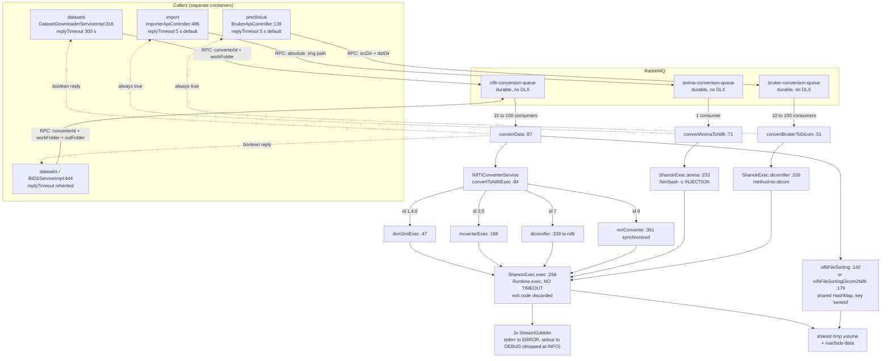

# Engineering audit — `shanoir-ng-nifti-conversion`

**Audited commit:** `867e53290` (develop line), Shanoir-NG 3.4.0
**Module path:** `shanoir-ng-nifti-conversion/`
**Size:** 2 829 LOC across 26 main classes, **0 test classes**
**Auditor note:** every claim below is backed by a `path:LINE` citation against the working tree at the audited commit. Where I could not verify a runtime behaviour statically (converter CLI semantics, binary behaviour), I say so explicitly and mark it *[inferred]*.

---

## 1. Executive summary

### Purpose

`shanoir-ng-nifti-conversion` is a headless Spring Boot 3.4.0 microservice whose entire job is to consume three RabbitMQ queues, shell out to one of seven external image-conversion binaries, and report a boolean back to the caller over AMQP RPC. It converts DICOM → NIfTI (dcm2nii, dcm2niix, MCVERTER, dicomifier, MRIConvert), Bruker → DICOM (dicomifier), and Analyze → NIfTI (Anima). It owns no database, exposes no REST API, publishes no messages, and communicates with peers exclusively through a **shared `/tmp` Docker volume** plus AMQP RPC.

### Health verdict

**Poor / high risk — this is the weakest module in the platform relative to its blast radius.**

It is the only component in Shanoir-NG that executes external processes on operator-controlled paths, it does so as `root`, with **no timeout, no process destruction, no exit-code propagation, and one confirmed shell-injection sink**. Its three RPC entry points are structurally incapable of reporting failure: two of them return a hard-coded `true`, and the third derives "success" from a substring search for a log message that is never in the string it searches. The module has **zero tests**, has received no functional change since November 2023 (`git log` shows only Checkstyle/whitespace commits since), and 14 of its 26 classes are unreachable dead code copied from `shanoir-ng-import`.

The good news: it is small enough to fix completely in about two weeks, and the correct target design (a job worker with timeouts, a `ProcessRunner` seam, and a structured result DTO) is straightforward.

### Top findings, ranked

| # | Severity | Finding | Location |
|---|---|---|---|
| 1 | **Critical** | Shell command injection via `/bin/bash -c` string concatenation of an AMQP-supplied file path, reachable from an authenticated file upload whose original filename is preserved on disk. Container runs as root. | `utils/ShanoirExec.java:238`; source `shanoir-ng-import/.../ImporterApiController.java:504,529,486` |
| 2 | **Critical** | **Conversion failures are reported as success.** `convertToNiftiExec` decides success by `!logs.contains("an error has probably occured")`, but that phrase is only ever written to the logger (`ShanoirExec.java:298`), never into the returned string. Non-zero exit codes, missing binaries and crashed converters all return `true`. | `service/NIfTIConverterService.java:110`, `utils/ShanoirExec.java:295-299` |
| 3 | **Critical** | **No timeout and no process destruction.** `proc.waitFor()` blocks forever; child stdin is never closed; on exception the child is never `destroy()`ed. A single hung converter permanently consumes a consumer thread; 10 hang the whole service (default `concurrentConsumers=10`). | `utils/ShanoirExec.java:282,295,307-317` |
| 4 | **High** | Bruker and Anima paths return a **hard-coded `true`**, so `preclinical` and `import` can never detect a failed conversion. | `service/RabbitMqNiftiConversionService.java:61`, `utils/ShanoirExec.java:241`, `service/NIfTIConverterService.java:68-70` |
| 5 | **High** | **Caller-side AMQP RPC timeout is 5 s by default** for `import` and `preclinical`; on timeout `convertSendAndReceive` returns `null` and the `(boolean)` unboxing cast throws `NullPointerException` while the conversion keeps running orphaned. | `shanoir-ng-preclinical/.../BrukerApiController.java:139`, `shanoir-ng-import/.../ImporterApiController.java:486`, `shanoir-ng-datasets/.../BIDSServiceImpl.java:444` |
| 6 | **High** | Shared mutable `HashMap` on a singleton service, mutated by up to 100 concurrent AMQP consumers, keyed by the literal string `"serieId"`. Unbounded memory growth, cross-job contamination, and a delete loop that re-targets files from previous jobs on every conversion. | `service/NIfTIConverterService.java:64,122,116-134,163` |
| 7 | **High** | Path traversal / arbitrary filesystem write: `workFolder` and `workFolderResult` come verbatim from the AMQP payload, are `mkdirs()`-ed and `chmod 0777`-ed with no validation, as root. | `service/RabbitMqNiftiConversionService.java:93-109` |
| 8 | **Medium** | **Reproducibility:** `mri_conv` is fetched from `master` HEAD, `dicomifier` from conda-forge unpinned, `dcm2niix` pinned to a 2021 tag and downloaded without checksum; two 2008/2014 Pascal `dcm2nii` binaries and two proprietary `mcverter` binaries are committed to git with no version metadata and (for mcverter/anima) no licence file. No provenance record of which converter/version produced any NIfTI. | `docker-compose/Dockerfile:157-169,189-198` |

---

## 2. Purpose & domain responsibilities

### What it does

Three responsibilities, one per queue:

| Responsibility | Queue | Converter |
|---|---|---|
| DICOM → NIfTI (import-time conversion and user-requested re-conversion / download-as-NIfTI / BIDS export) | `nifti-conversion-queue` | dcm2nii (2008, 2014), MCVERTER 2.0.7 / 2.1.0, dcm2niix, dicomifier, MRIConvert |
| Bruker (preclinical raw) → DICOM | `bruker-conversion-queue` | dicomifier `to-dicom` |
| Analyze (`.hdr`/`.img`) → NIfTI | `anima-conversion-queue` | `animaConvertImage` |

The domain rationale is real: NIfTI conversion is scientifically load-bearing in a neuroimaging platform, the converters are heavyweight native binaries with conflicting system dependencies (MCVERTER needs 2010-era `libpng12`/`libjpeg8`/`libtiff4`; MRIConvert needs GTK2 and an X server via `xvfb`; dicomifier needs a full Miniconda environment), and `docker-compose/README.md:13-14,35` confirms the resulting image is the largest and slowest to extract in the platform.

### Does it justify being a separate service?

**Yes as a container, no as its current shape.** Isolating ~500 MB of mutually incompatible native toolchains out of `import` and `datasets` is the right call and is the documented motivation. But the module is *not* a service in any meaningful sense — it has no state, no API, no domain logic, and no autonomy. It is a **remote `exec()` proxy** wearing a Spring Boot web stack: it inherits `spring-boot-starter-web`, `-security`, `-oauth2-resource-server` and `-data-jpa` from `shanoir-ng-back/pom.xml:75-91`, explicitly re-declares `spring-boot-starter-data-jpa` in `pom.xml:39-42` while excluding both JPA auto-configurations at `NiftiConversionApplication.java:30`, and boots a Tomcat on port 9903 (`src/main/resources/application.yml:17`) that nothing ever connects to and that `docker-compose.yml:325-340` does not even publish.

The correct shape is a **job worker**: same container, same isolation, but an async job protocol with timeouts, retries, structured results and captured converter logs. See §14.

---

## 3. Architecture & code structure

### Full class inventory (26 main classes)

| Package / class | LOC | Reachable? | Role |
|---|---:|---|---|
| `org.shanoir.ng.NiftiConversionApplication` | 36 | ✅ | Spring Boot entry point; excludes `DataSourceAutoConfiguration`, `HibernateJpaAutoConfiguration`; `@EnableWebMvc` (anti-pattern, disables Boot's MVC auto-config) |
| `configuration.ShanoirNiftiConversionConfiguration` | 47 | ✅ (bean) | Declares an `asyncExecutor` `ThreadPoolTaskExecutor` (100/100/100) that **nothing uses** — there is no `@Async` anywhere in the module |
| `service.RabbitMqNiftiConversionService` | 130 | ✅ | The only entry point: three `@RabbitListener` methods |
| `service.NIfTIConverterService` | 232 | ✅ | Converter dispatch + post-conversion file sorting |
| `utils.ShanoirExec` | 390 | ✅ | Command construction and `Runtime.exec` — the highest-risk file |
| `utils.StreamGobbler` | 100 | ✅ | Stdout/stderr pump thread. **Byte-identical copy** of `shanoir-ng-import/src/main/java/org/shanoir/ng/utils/StreamGobbler.java` |
| `model.NiftiConverter` | 77 | ✅ | Enum: converter id → absolute binary path |
| `model.Dataset` | 119 | ✅ (name only) | Only `setName`/`getName` are used (`RabbitMqNiftiConversionService.java:118-120`) |
| `model.ExpressionFormat` | 44 | ⚠️ via `Dataset` | Unused fields |
| `model.DatasetFile` | 56 | ⚠️ via `ExpressionFormat` | Unused |
| `model.DiffusionGradient` | 61 | ⚠️ via `Dataset` | Unused |
| `model.EchoTime` | 55 | ⚠️ via `Dataset`/`Image` | Unused; `hashCode()` NPEs on null `echoTime`/`echoNumber` (`EchoTime.java:51-52`) |
| `model.Patient` | 146 | ❌ dead | Unreferenced root of a dead DTO cluster |
| `model.Study` | 94 | ❌ dead | Referenced only by `Patient` |
| `model.Serie` | 330 | ❌ dead | Referenced only by `Study`; largest class in the module and entirely unreachable |
| `model.Subject` | 107 | ❌ dead | Referenced only by `Patient` |
| `model.SubjectStudy` | 59 | ❌ dead | Referenced only by `Subject` |
| `model.Instance` | 82 | ❌ dead | Referenced only by `Serie` |
| `model.Image` | 101 | ❌ dead | Referenced only by `Serie` |
| `model.ImageDicom` | 30 | ❌ dead | Two private fields, no accessors, referenced by nothing |
| `model.InstitutionDicom` | 49 | ❌ dead | Referenced only by `Serie` |
| `model.EquipmentDicom` | 80 | ❌ dead | Referenced only by `Serie` |
| `utils.DiffusionUtil` | 227 | ❌ dead | **Byte-identical copy** of `shanoir-ng-import/.../DiffusionUtil.java`; converts dcm2nii `.prop` → `.bval`/`.bvec`, never called here |
| `utils.ImportUtils` | 70 | ❌ dead | `wildcardToRegex` — never called |
| `shared.exception.ShanoirImportException` | 71 | ❌ dead | Never thrown or caught |
| `shared.exception.ImportErrorModelCode` | 36 | ❌ dead | Never referenced |

**14 of 26 classes (≈1 400 LOC, ~50 % of the module) are unreachable dead code.** Verified by exhaustive reverse-reference search: `Patient`, `ImageDicom`, `DiffusionUtil`, `ImportUtils`, `ImportErrorModelCode` and `ShanoirImportException` have **zero** inbound references anywhere in the module, and `Study`/`Serie`/`Subject`/`SubjectStudy`/`Instance`/`Image`/`InstitutionDicom`/`EquipmentDicom` are reachable only from those dead roots.

### Layering

There is no layering to speak of, and what exists is inverted: `utils.ShanoirExec` imports `service.NIfTIConverterService` for two string constants (`ShanoirExec.java:20,341`) while `NIfTIConverterService` `@Autowired`s `ShanoirExec` (`NIfTIConverterService.java:60-61`). The `DICOM_TO_NIFTI_METHOD`/`BRUKER_TO_DICOM_METHOD` constants (`NIfTIConverterService.java:57-58`) belong on the converter enum or in `ShanoirExec`.

### Persistence

None. `application.yml:49` sets `shanoir.database: disable` and `NiftiConversionApplication.java:30` excludes both JPA auto-configurations. The `spring-boot-starter-data-jpa` dependency at `pom.xml:39-42` is dead weight. Note that the shared entrypoint still processes `SHANOIR_MIGRATION` and sets `spring.jpa.*` properties for this service (`docker-compose/nifti-conversion/entrypoint:8,12` → `docker-compose/common/entrypoint_common:206-235`), which are meaningless here.

### Runtime container environment

Built from `docker-compose/Dockerfile:126-216`, three stages:

- **`nifti-conversion-conda`** (`:128-142`): `debian:bookworm` + Miniconda `Miniconda3-py311_24.1.2-0` + `conda install -c conda-forge dicomifier` — **no version pin**.
- **`nifti-conversion-builder`** (`:145-169`): compiles **dcm2niix `v1.0.20210317`** from a GitHub tarball (`:157-162`, no checksum), and fetches **`mri_conv` from `refs/heads/master`** (`:167`) — completely unpinned — then `chmod 0777` on the resulting `MRIManager.jar` (`:169`).
- **`nifti-conversion`** (`:172-216`): `base-microservice` (Debian bookworm + `temurin-21-jre`) + `libgdcm-tools locales locales-all jq libgtk2.0-0 temurin-21-jre pigz xvfb` (unversioned apt install), plus the vendored binaries.

Vendored binaries committed to git under `docker-compose/nifti-conversion/external/` (~38 MB):

| File | Size | Installed to | Notes |
|---|---:|---|---|
| `dcm2nii/linux/31MARCH2008/dcm2nii` | 519 KB | `/opt/nifti-converters/dcm2nii_2008-03-31` | 2008 Pascal binary, BSD licence present |
| `dcm2nii/linux/dcm2nii` | 910 KB | `/opt/nifti-converters/dcm2nii_2014-08-04` | 2014 Pascal binary |
| `mcverter/linux/mcverter_2.0.7` | 4.6 MB | `/opt/nifti-converters/` | **No licence file** — proprietary MRIConvert |
| `mcverter/linux/mcverter_2.1.0` | 11 MB | `/opt/nifti-converters/` | **No licence file** |
| `mcverter/linux/lib/lib{jpeg.so.8,png12.so.0,tiff.so.4}` | 818 KB | **`/usr/local/lib/x86_64-linux-gnu/`** + `ldconfig` | 2010-era EOL libraries injected **globally** into the container linker path (`Dockerfile:192,205`) — every process in the container, not just mcverter, may resolve against them |
| `anima/animaConvertImage` | 20 MB | `/usr/local/bin/` | **No licence file, no version metadata** |
| `dcm2niix/linux/dcm2niix` | 229 KB | — | **Dead file**: the Dockerfile builds dcm2niix from source instead |
| `dicomifier/dicomifier.ws/**` | 8 KB | — | **Dead files**: an obsolete Werkzeug REST wrapper for a pre-2.x dicomifier CLI (`bruker2dicom convert …`, `dicom2nifti …`), never installed or invoked |

`Dockerfile:193-195` pre-creates world-writable settings directories `/.dcm2nii_2008-03-31` and `/.dcm2nii_2014-08-04` (`mkdir -m 1777`) for the legacy binaries' `.ini` files — these are **process-global mutable state shared by all concurrent conversions** *[inferred: legacy dcm2nii persists CLI options to its ini file; I could not run the binary to confirm]*.

Container hardening (`docker-compose.yml:325-340`, `docker-compose-dev.yml:345-363`):

- **Runs as `root`** — no `USER` directive anywhere in the nifti-conversion stages.
- **CWD is `/`** — no `WORKDIR`; relative paths passed to converters resolve at the filesystem root.
- No `mem_limit`, `cpus`, `pids_limit`, `read_only`, `cap_drop`, `security_opt`, `tmpfs`, or `healthcheck`.
- No `depends_on: rabbitmq` (every other microservice has one) — startup ordering relies on Spring AMQP reconnect.
- Volumes: `logs:/var/log/shanoir-ng-logs`, `datasets-data:/var/datasets-data`, `bids-data:/var/bids-data`, `tmp:/tmp`.
- Prod pins the image to `ghcr.io/fli-iam/shanoir-ng/nifti-conversion:NG_v2.12.0` (`docker-compose.yml:327`).
- Locale forced to `fr_FR.UTF-8` (`Dockerfile:211-213`) — differs from `datasets`, which uses `en_US.UTF-8` (`Dockerfile:95-97`). Decimal-comma locales have historically broken numeric parsing in native imaging tools; worth verifying against MCVERTER/MRIConvert output.

---

## 4. The conversion pipeline

### End-to-end walkthrough (`nifti-conversion-queue`)

1. A caller (`datasets` or, for BIDS export, `datasets`) publishes a `String` payload `"<converterId>;<workFolder>"` or `"<converterId>;<workFolder>;<outputFolder>"` via `RabbitTemplate.convertSendAndReceive` — an **RPC** call using AMQP direct-reply-to.
2. `RabbitMqNiftiConversionService.convertData` (`:87`) splits on `;` (`:89`), parses `converterId` with `Integer.parseInt` (`:90`), logs it **at ERROR level** (`:91`).
3. Output folder = `workFolder + "/result"`, overridden by `messageSplit[2]` when present (`:93-99`) — the BIDS case writes straight into the BIDS tree on `bids-data`.
4. `NiftiConverter.getType(converterId)` (`:101`) — throws `IllegalArgumentException` for unknown ids, caught by the blanket `catch (Exception)` at `:124`.
5. If the output dir does not exist: `mkdirs()` + `setReadable/Executable/Writable(true, false)` → **mode 0777** (`:103-109`).
6. `NIfTIConverterService.convertToNiftiExec` (`:111` → `NIfTIConverterService.java:84`) switches on the converter (`:92-106`) and calls the matching `ShanoirExec` method.
7. `ShanoirExec` builds a `String[]`, calls `Runtime.getRuntime().exec(cmd, envp)` (`ShanoirExec.java:282`), starts two `StreamGobbler` threads (`:285-292`), `waitFor()`s with **no timeout** (`:295`), joins the gobblers (`:301-302`), and returns their concatenated text.
8. `convertToNiftiExec` logs the whole output at ERROR (`NIfTIConverterService.java:108`) and returns `!logs.contains("an error has probably occured")` (`:110`) — see Bug **B2**.
9. Back in `convertData`, failure is declared only if the boolean is false **or** the result directory is empty (`:113-115`).
10. Post-processing: dicomifier → `niftiFileSortingDicom2Nifti` (`:120`), which recursively finds `*.nii|*.json|*.nii.gz` and copies them flat into the result dir with names `<random int><dataset name>_<original>` where the dataset name is the literal string `"name"` (`:119`, `NIfTIConverterService.java:187-188`). All other converters → `niftiFileSorting(emptyList, result, new File("serieId"))` (`:122`), which registers the outputs in the shared `outputFiles` map under the literal key `"serieId"` and runs `removeUnusedFiles()`.
11. The method returns `true`/`false`; Spring AMQP serialises it to the reply queue. **The work folder is never cleaned up by this service** — cleanup is the caller's job (`datasets` does it at `DatasetDownloaderServiceImpl.java:289-292`; `preclinical` and `import` do not).

### Diagram



### Supported converters and format paths

| id | Enum constant | Binary / path (`model/NiftiConverter.java:19-31`) | Format path | Invoked from |
|---:|---|---|---|---|
| 1 | `DCM2NII_2008_03_31` | `/opt/nifti-converters/dcm2nii_2008-03-31` | DICOM → `.nii.gz` (+`.prop` on error) | `ShanoirExec.java:104-165` |
| 2 | `MCVERTER_2_0_7` | `/opt/nifti-converters/mcverter_2.0.7` | DICOM → `.nii` | `ShanoirExec.java:188` |
| 4 | `DCM2NII_2014_08_04` | `/opt/nifti-converters/dcm2nii_2014-08-04` | DICOM → `.nii.gz` | `ShanoirExec.java:104-165` |
| 5 | `MCVERTER_2_1_0` | `/opt/nifti-converters/mcverter_2.1.0` | DICOM → `.nii` | `ShanoirExec.java:188` |
| 6 | `DCM2NIIX` | `dcm2niix` (PATH) | DICOM → `.nii.gz` + BIDS `.json` sidecar | `ShanoirExec.java:53-101` |
| 7 | `DICOMIFIER` | `dicomifier` (PATH → `/opt/miniconda3/bin`) | DICOM → NIfTI+JSON; Bruker → DICOM | `ShanoirExec.java:339` |
| 8 | `MRICONVERTER` | `/opt/nifti-converters/mriconverter/MRIFileManager/MRIManager.jar` | DICOM → NIfTI via `xvfb-run java` | `ShanoirExec.java:361` |
| — | Anima | `animaConvertImage` (PATH) | Analyze `.img` → `.nii.gz` | `ShanoirExec.java:233` |

**Id 3 does not exist** — the historical `clidcm` converter, still described in `docs/Shanoir-NG-Dcm2Nii.docx`. The enum, the four hard-coded Angular lists (`shanoir-ng-front/src/app/vip/execution/execution.component.ts:76-84`, `vip/execution-template/execution-template.component.ts:51-59`, `shared/mass-download/download-setup/download-setup.component.ts:57-66`, `shared/mass-download/download-setup-alt/download-setup-alt.component.ts:55-63`) and the dropped `nifticonverter` table (`docker-compose/database-migrations/db-changes/import/0004_nifti_management.sql:13`) must all be kept in sync by hand.

---

## 5. External interfaces

### (a) RabbitMQ

**Consumed — all three are synchronous RPC** (`convertSendAndReceive`), all `String` payloads, all `boolean` replies:

| Queue | Direction | Payload | Reply | Container factory | Concurrency |
|---|---|---|---|---|---|
| `nifti-conversion-queue` (`ms-common/.../RabbitMQConfiguration.java:169`) | inbound RPC | `"<converterId>;<workFolder>"` or `"<converterId>;<workFolder>;<outputFolder>"` | `boolean` | `multipleConsumersFactory` | 10 → 100 consumers, prefetch 1 (`RabbitMQConfiguration.java:41-52`) |
| `bruker-conversion-queue` (`:82`) | inbound RPC | `"<sourceDir>;<destinationDir>"` | `boolean` (**always `true`**) | `multipleConsumersFactory` | 10 → 100 |
| `anima-conversion-queue` (`:76`) | inbound RPC | absolute path to a `.img` file | `boolean` (**always `true`**) | `singleConsumerFactory` | 1 (`:54-60`) |

**Published: none.** The module contains no `RabbitTemplate`, no `convertAndSend`, and does not use `ShanoirEventService` — verified by exhaustive search. Replies travel over AMQP direct-reply-to, not a named queue.

Queue declaration (`RabbitMQConfiguration.java:284-286,294-296,449-451`): `new Queue(name, true)` — durable, **no DLX, no TTL, no max-length, no `x-dead-letter-exchange`**. There is no dead-letter queue anywhere in the platform for these three queues.

Because `RabbitMQConfiguration` is a `@Configuration` in `ms-common` under the scanned base package `org.shanoir.ng`, this service also **declares all ~60 platform queues and both topic exchanges** on startup, even though it consumes three.

**Inbound callers observed:**

| Caller | File:line | Queue | Reply timeout |
|---|---|---|---|
| `datasets` — download as NIfTI | `shanoir-ng-datasets/.../DatasetDownloaderServiceImpl.java:316-319` | `nifti-conversion-queue` | 300 000 ms, set in `@PostConstruct` (`:113-117`) **on the shared singleton `RabbitTemplate`** |
| `datasets` — BIDS export | `shanoir-ng-datasets/.../BIDSServiceImpl.java:444-446` | `nifti-conversion-queue` | inherits whatever `DatasetDownloaderServiceImpl` mutated the shared bean to |
| `import` — Analyze upload | `shanoir-ng-import/.../ImporterApiController.java:486` | `anima-conversion-queue` | **Spring AMQP default, 5 000 ms** — `import`'s `application.yml` sets no `spring.rabbitmq.template.reply-timeout` |
| `preclinical` — Bruker upload | `shanoir-ng-preclinical/.../BrukerApiController.java:139` | `bruker-conversion-queue` | **default, 5 000 ms** |

For reference, `shanoir-ng-studies/src/main/resources/application.yml:76-77` is the only module that configures `reply-timeout` declaratively (60 s), and it is not a caller here.

### (b) REST endpoints

**None.** No `@RestController`, `@Controller` or `@RequestMapping` exists in the module. A Tomcat still starts on port 9903 (`application.yml:17`) with Spring Security's default lockdown (`spring-boot-starter-security` is inherited at `shanoir-ng-back/pom.xml:79`), and `@OpenAPIDefinition` + springdoc will expose `/v3/api-docs` and `/swagger-ui`. The port is not published in either compose file, so exposure is limited to the `shanoir_ng_network` bridge.

### (c) Filesystem / volume contract

This is the **real** interface, and it is entirely implicit — no schema, no ownership rules, no cleanup contract.

| Volume | Mounted by | Used for |
|---|---|---|
| `tmp:/tmp` | nifti-conversion, import, datasets, preclinical, studies | The de-facto IPC channel. `import` writes uploads under `/tmp` (`shanoir-ng-import/src/main/resources/application.yml:110`), `preclinical` under `/tmp/` (`shanoir-ng-preclinical/.../application.yml:113`), `datasets` under `/tmp` via `DatasetFileUtils.getUserImportDir("/tmp")` (`DatasetDownloaderServiceImpl.java:303`, `BIDSServiceImpl.java:432`) |
| `datasets-data:/var/datasets-data` | nifti-conversion, datasets | Mounted but **never referenced by any code in this module** |
| `bids-data:/var/bids-data` | nifti-conversion, datasets | BIDS export writes converter output directly into the BIDS tree via `messageSplit[2]` |
| `logs:/var/log/shanoir-ng-logs` | all | `shanoir-ng-nifti-conversion.log` (`application.yml:44`) |

Fragile coupling worth calling out: `BIDSServiceImpl.java:452-457` collects results by filtering `dataFolder.listFiles()` for names starting with `dataset.getId() + "_"`. Nothing in this module produces that prefix. It works only because dcm2niix's *default* filename template starts with `%f` (the input folder name) and `BIDSServiceImpl.java:434` happens to name the input folder `<datasetId>_DCM-<timestamp>`. For CT datasets, `BIDSServiceImpl.java:429-431` selects converter 8 (MRIConvert), whose naming template is hard-coded to `PatientName-SerialNumber-SequenceName` (`ShanoirExec.java:367`) and will **never** match the filter — CT BIDS exports therefore silently produce no files *[inferred from the naming templates; not reproduced]*.

### (d) External binaries

See the table in §4. Version provenance:

- **dcm2niix `v1.0.20210317`** — the only pinned converter (`Dockerfile:157`), built from source at image build time. Roughly five years old at the time of this audit; upstream has shipped many fixes affecting Philips scaling, DWI gradients and enhanced multiframe since.
- **dicomifier** — `conda install -c conda-forge dicomifier` (`Dockerfile:142`), **unpinned**; conda-forge currently ships 2.5.3. The image build is therefore not reproducible.
- **MRIConvert (`mri_conv`)** — `curl .../refs/heads/master.tar.gz` (`Dockerfile:167`), **unpinned to a branch HEAD**.
- **dcm2nii 2008-03-31 / 2014-08-04, MCVERTER 2.0.7 / 2.1.0, animaConvertImage** — opaque prebuilt binaries committed to git, no version file, no build recipe, no upstream URL.

### (e) Shared `ms-common` entities/DTOs

| Symbol | Imported by | Live? |
|---|---|---|
| `org.shanoir.ng.shared.configuration.RabbitMQConfiguration` | `RabbitMqNiftiConversionService.java:23` | ✅ the only live dependency |
| `org.shanoir.ng.shared.dateTime.DateTimeUtils`, `LocalDateAnnotations` | `model/Patient.java:22-23`, `model/Serie.java:22-23`, `model/Study.java:23-24` | ❌ dead |
| `org.shanoir.ng.shared.core.model.IdName` | `model/SubjectStudy.java:17` | ❌ dead |
| `org.shanoir.ng.shared.exception.ShanoirException` | `shared/exception/ShanoirImportException.java:23` | ❌ dead |

Auto-scanned but unused `ms-common` beans: `CommonConfiguration` (a `RestTemplate`), `JacksonConfiguration`, `GlobalExceptionHandler`, `ShanoirEventService`, `ControllerSecurityService`, `FieldEditionSecurityManagerImpl`, `KeycloakServiceAccountUtils`, `MDCFilter`, `Spring`.

### Code duplicated with `import` / `datasets` / `preclinical`

- `utils/StreamGobbler.java` — **byte-identical** to `shanoir-ng-import/src/main/java/org/shanoir/ng/utils/StreamGobbler.java` (verified with `diff`, zero differences).
- `utils/DiffusionUtil.java` — **byte-identical** to `shanoir-ng-import/src/main/java/org/shanoir/ng/utils/DiffusionUtil.java` (verified, zero differences), and dead here.
- The `model/*` DICOM DTO cluster (`Patient`, `Study`, `Serie`, `Instance`, `Image`, `EquipmentDicom`, `InstitutionDicom`, `Subject`, `SubjectStudy`, `Dataset`, `ExpressionFormat`, `DatasetFile`, `EchoTime`, `DiffusionGradient`) mirrors equivalents in `shanoir-ng-import/.../importer/dto/` and `shanoir-ng-datasets/.../importer/dto/`.
- The converter id ↔ name mapping is duplicated in `model/NiftiConverter.java:19-31` and four Angular components (see §4).

**Good news:** the converter *invocation* logic is **not** duplicated. An exhaustive search for `dcm2nii|mcverter|dicomifier|animaConvertImage|xvfb-run|MRIManager` across all `.java` files returns hits only in this module's three files. The 2023 extraction (`git log`: `#1602 nifti management - Remove import / study card conversion`) genuinely centralised it.

---

## 6. External-process execution review

This is the highest-risk area. Everything funnels through `ShanoirExec.exec(String[], String[])` (`ShanoirExec.java:268-331`).

```java
268|    public String exec(final String[] cmd, final String[] envp) {
...
280|            Runtime rt = Runtime.getRuntime();
282|            final Process proc = rt.exec(cmd, envp);
285|            errorGobbler  = new StreamGobbler(proc.getErrorStream(), "ERROR");
288|            outputGobbler = new StreamGobbler(proc.getInputStream(), "DEBUG");
291|            errorGobbler.start();
292|            outputGobbler.start();
295|            final int exitVal = proc.waitFor();
297|            if (exitVal != 0) {
298|                LOG.error("The exit value is {}, an error has probably occured", exitVal);
299|            }
301|            errorGobbler.join();
302|            outputGobbler.join();
```

### Injection

**One confirmed shell sink.** `ShanoirExec.anima` (`:233-242`):

```java
238|        String[] command = {"/bin/bash", "-c", "animaConvertImage -i " + fileToConvert + " -o " + newImageName};
```

`fileToConvert` is the raw AMQP body (`RabbitMqNiftiConversionService.java:73` → `NIfTIConverterService.java:73` → here). The publisher is `shanoir-ng-import/.../ImporterApiController.java:486`, which sends `imageFile.getAbsolutePath()` where the file was written with the **client-supplied original filename** (`:504` `imageFile.getOriginalFilename()`, `:529` `new File(userImportDir.getAbsolutePath(), imageFileName)`, `:530` `transferTo`). The only validation is `imageFileName.endsWith(".img")` (`:507`). Shell metacharacters (`;`, `` ` ``, `$( )`, `&&`, `|`) are not path separators and survive any path sanitisation Spring performs. An authenticated user uploading `x;<command>;.img` plus a `.hdr` obtains arbitrary command execution **as root** in the nifti-conversion container. See §10 for full impact.

All other call sites build a `String[]` and go through `Runtime.exec(String[])`, which does **not** invoke a shell — so they are not injectable in the classic sense. They are, however, **argument-injectable and space-fragile**:

- `dicomifier` (`:345-347`) and `mriConverter` (`:366-371`) build a single string and then `execString.split(" ")`. **Any space in an input or output path splits the argument.** Given that these paths derive from `dataset.getName()` and user directory names elsewhere in the platform, this is a live correctness bug, not a theoretical one. It also means a path containing a space can inject an extra argument (e.g. `--layout` for dicomifier) into the command line.
- `mcverterExec` (`:214-218`) embeds literal single quotes in the `-F` value for the 2.0.x variant. With no shell involved, MCVERTER receives `'-PatientName,…,+ProtocolName'` **including the quote characters**, so the first field is `'-PatientName`. Output filenames from MCVERTER 2.0.7 are therefore wrong *[inferred: I could not run the proprietary binary]*.

### Working directory and environment

- **No working directory is ever set** — `Runtime.exec(cmd, envp)` inherits the JVM's CWD, which is `/` (no `WORKDIR` in the Dockerfile). Any relative path a converter emits lands at the filesystem root, as root.
- `envp` is always `null` (`:252`), so the child inherits the JVM environment including `PATH=/opt/miniconda3/bin:…` and `LC_ALL=fr_FR.UTF-8`.
- The two `dicomifier` and one `mriConverter` invocations pass unresolvable literal positional arguments. Per the dicomifier documentation the signature is `dicomifier to-nifti [options] source [source…] destination`, so `ShanoirExec.java:345` produces `dicomifier to-nifti source <in> destination <out>` — i.e. **`sources = ["source", <in>, "destination"]`**, with two bogus entries scanned relative to CWD `/`. At best they are ignored with warnings; at worst they abort the run. The literal words almost certainly come from the JSON keys of the obsolete `dicomifier.ws` wrapper still vendored at `docker-compose/nifti-conversion/external/dicomifier/dicomifier.ws/dicomifier_ws/application.py:47-56`. **This needs a runtime check before anything else in this file is touched.**

### Timeouts

**There are none, anywhere.** `proc.waitFor()` (`:295`) has no overload with a duration. Consequences:

- A converter that hangs (corrupt DICOM, an `xvfb` display conflict, MCVERTER waiting on a missing shared library, a prompt on stdin) pins its consumer thread forever.
- **The child's stdin is never closed.** `proc.getOutputStream()` is neither written to nor closed at any point (only `getInputStream()` and `getErrorStream()` are closed, `:304-305`). Legacy `dcm2nii` is an interactive Pascal program; if it ever prompts, it blocks indefinitely.
- With `multipleConsumersFactory` (`concurrentConsumers=10`, `maxConcurrentConsumers=100`), ten hung conversions on `nifti-conversion-queue` exhaust the initial consumer pool; the elastic scaling to 100 only delays total wedging. `anima-conversion-queue` uses `singleConsumerFactory` (1 consumer) — **one hung Anima conversion permanently disables Analyze uploads platform-wide.**
- There is no supervisory watchdog, no `pids_limit`, and no container restart policy configured.

### Stream handling

Correct in the happy path, broken on the error path.

- ✅ Both pipes are drained on dedicated threads started **before** `waitFor()` (`:285-295`), so the classic pipe-buffer deadlock is avoided.
- ❌ `StreamGobbler.stringDisplay` accumulates with `+=` inside the read loop (`StreamGobbler.java:67,70,73`) — O(n²) allocation. dcm2niix on a large series, or MRIConvert, emits thousands of lines.
- ❌ In the `catch` block (`ShanoirExec.java:309-315`) the gobblers are read **without `join()`** — an unsynchronised read of a non-`volatile` field (`StreamGobbler.java:39`) written by another thread. Torn/stale reads are legal here.
- ❌ Child **stdout is logged at DEBUG** (`StreamGobbler.java:69`) while the effective level is `INFO` (`application.yml:47`). In production, converter stdout is silently discarded. Only stderr survives, at ERROR (`:66`).
- ❌ The command line itself is logged at DEBUG (`ShanoirExec.java:168,274`), so an operator cannot see what was executed.

### Exit codes

**Discarded.** `exitVal` is logged (`:298`) and then goes out of scope — `exec()` returns only the gobblers' text. This directly causes Bug **B2**: `NIfTIConverterService.java:110` searches the *returned string* for the phrase written by `LOG.error` at `:298`, which is never in that string. Unless a converter happens to print `an error has probably occured` on stderr, **every DICOM→NIfTI conversion is reported as successful.**

A second path makes it worse: if `rt.exec` itself throws (binary missing, `ENOENT`, no exec permission) before the gobblers exist, the `catch` at `:307` finds both `null`, falls through both `if`s at `:318,324`, and returns **`null`**. `NIfTIConverterService.java:104` then does `"" + null` → `"null"`, and `:110` returns `true`. **A missing converter binary is reported as a successful conversion.**

### Orphaned processes

`Process.destroy()` / `destroyForcibly()` appear nowhere. On `InterruptedException` (container shutdown, thread pool drain) the `catch` at `:307` swallows it, does **not** restore the interrupt flag, and leaves the child running. Since Java 8, `Runtime.exec` children are not reaped by the JVM on exit; on container stop they are killed by the runtime, but during normal operation an interrupted conversion leaks a native process holding open file descriptors on the shared `/tmp` volume.

### Concurrency limits

- `mriConverter` is `synchronized` (`:361`) on the singleton `ShanoirExec` bean — this serialises MRIConvert against itself (correct, since `xvfb-run` is invoked without `-a`), but since no other method takes that monitor it does **not** serialise MRIConvert against concurrent dcm2niix/dicomifier runs.
- Everything else is unbounded up to the AMQP consumer count (100). There is no semaphore, no per-converter concurrency cap, and no container CPU/memory limit — 100 concurrent dcm2niix processes on a large series will OOM the host, not just the container.
- The legacy `dcm2nii` binaries share one world-writable settings directory each (`Dockerfile:193-195`), so concurrent runs of converter 1 or 4 race on the same `.ini` file *[inferred]*.

---

## 7. Code quality assessment

| Issue | Evidence |
|---|---|
| ~50 % dead code | 14 unreachable classes, ~1 400 LOC (see §3 inventory) |
| Two byte-identical copies of `import` utilities | `utils/StreamGobbler.java`, `utils/DiffusionUtil.java` |
| Stringly-typed AMQP protocol with no schema or validation | `RabbitMqNiftiConversionService.java:53-55,89-99` — `split(";")` then positional indexing; `ArrayIndexOutOfBoundsException` and `NumberFormatException` are "handled" by a blanket `catch (Exception)` returning `false` |
| Blanket `catch (Exception)` on every entry point | `:57,74,124` — no distinction between a bad payload, a missing binary and a disk-full condition |
| `LOG.error` used for normal operation | `RabbitMqNiftiConversionService.java:91` ("Starting conversion…"), `NIfTIConverterService.java:108` (full converter log), `ShanoirExec.java:240,373`. Makes ERROR-level alerting useless |
| Copy-pasted log message | `RabbitMqNiftiConversionService.java:75` logs "Could not convert data from bruker to dicom" inside the **Anima** handler |
| `String.concat` results discarded | `ShanoirExec.java:346,369` — `logs.concat(execString);` on an immutable `String`, return value dropped. The command line is silently omitted from the returned log |
| Magic strings as map keys / entity names | `new File("serieId")` (`RabbitMqNiftiConversionService.java:122`), `dataset.setName("name")` (`:119`) |
| Dead configuration | `application.yml:50-52,84-88` define `shanoir.conversion.converters.*`, but there is **no `@Value` or `@ConfigurationProperties` anywhere in the module**; the paths are hard-coded in `model/NiftiConverter.java:19-31` |
| Meaningless configuration | `application.yml:36-39` sets 5 000 MB multipart limits for a service with no endpoints |
| Unused bean | `ShanoirNiftiConversionConfiguration.java:35-45` builds a 100-thread executor; there is no `@Async` in the module. It also mutates global `SecurityContextHolder` strategy as a side effect of a bean factory method (`:37`) |
| `@EnableWebMvc` on a Spring Boot app | `NiftiConversionApplication.java:29` — disables Boot's WebMvc auto-configuration |
| Inverted dependency | `utils.ShanoirExec` imports `service.NIfTIConverterService` (`ShanoirExec.java:20`) while the service autowires the util (`NIfTIConverterService.java:60-61`) |
| Dead method | `ShanoirExec.convertFilePath` (`:386-388`) — never called |
| Unused local | `ShanoirExec.java:236` — `File imgFile = new File(fileToConvert);` never read |
| Comments contradict the flags they document | `ShanoirExec.java:73-74` says "Philips precise float (**not** display) scaling" but passes `-p n` (= display scaling, the opposite of dcm2niix's default); `:129-130` says "no event name in the output file name" but passes `-e y`; `:60-61` says "ignore derived and 2D images" but passes `-i n` |
| Dead parameter | `is4D` is hard-coded `true` at both call sites (`NIfTIConverterService.java:95,104`), so the 24-element `dcm2nii` branch (`ShanoirExec.java:106-107,163-165`) and the 9-element `mcverter` branch (`:196`) are unreachable |
| Fragile version detection | `ShanoirExec.java:214` — `mcverterPath.contains("2.0")` as a proxy for "MCVERTER 2.0.x" |
| French comment in an English codebase | `NIfTIConverterService.java:127` — `// TODO : ne marche pas` |
| Frozen module | Last functional change to `ShanoirExec.java`: `d51ba5e04`, 2023-11-23. Everything since is Checkstyle/whitespace |

**Positives, for balance:** Checkstyle passes cleanly (0 violations in `target/checkstyle-result.xml`, and the module is in the CI gate at `.github/workflows/checkstyle.yml:63`); GPL headers are consistent; the stream-gobbler pattern correctly avoids the pipe deadlock; `mriConverter` correctly serialises around `xvfb`; the 2023 extraction really did de-duplicate converter invocation across the platform.

---

## 8. Test coverage analysis

### Confirmed state

`shanoir-ng-nifti-conversion/src/` contains exactly one directory: `main`. **There is no `src/test` at all** — not an empty one, not a disabled one. No JUnit, no Mockito, no Testcontainers, no fixture DICOM. `mvn install` in CI (`.github/workflows/maven.yml:52`) therefore only compiles this module.

### Why that is worse here than elsewhere

The zero-test state is not merely "untested code" — it is the direct cause of findings B1–B4:

- **B2 (success is always reported) is a one-line unit test.** A fake `ShanoirExec` returning `"ERROR : dcm2niix: command not found"` and asserting `convertToNiftiExec(...) == false` would have failed on day one.
- **B4 (`anima` returns hard-coded `true`)** is caught by reading the method, and by any test that asserts a failing conversion returns `false`.
- **B6 (shared `HashMap`)** is caught by any two-message test on the same service instance.
- The **AMQP payload format is a positional, delimiter-separated string with three producers in two other modules and no schema**. A contract test is the only thing that can stop the fourth producer from getting the field order wrong.
- Every behaviour here is *observable* — files on disk, a boolean reply, a process exit code. There is no hard-to-test domain logic. The absence of tests is a choice, not a consequence of the design.

Compare: `preclinical` has 58 test classes for 152 main classes; `studies` has 52/188. This module has 0/26 while being the only one that runs `Runtime.exec` as root.

### Prioritised test strategy

**Prerequisite refactor — introduce one seam.** Extract an interface and inject it, so `ShanoirExec` becomes testable without spawning processes:

```java
public interface ProcessRunner {
    ProcessResult run(List<String> command, Path workingDir, Duration timeout);
}
public record ProcessResult(int exitCode, String stdout, String stderr, boolean timedOut) { }
```

`ShanoirExec` then builds `List<String>` argv and delegates; `NIfTIConverterService` consumes `ProcessResult.exitCode()` instead of grepping strings. This single change makes tiers 1–3 below possible and simultaneously fixes B2, B3 and B4.

**Tier 1 — pure unit tests, no I/O (target: ~1 day, ~40 tests).**

| Target | Assertions |
|---|---|
| `ShanoirExec.dcm2niiExec` | Exact argv for each of ids 1, 4 (legacy branch) and 6 (dcm2niix branch); assert `-o` precedes the output folder; assert the input folder is the final argument; assert no element is `null` or contains a space |
| `ShanoirExec.mcverterExec` | Exact argv for 2.0.7 vs 2.1.0; **assert the `-F` value contains no `'` characters** (regression test for the quoting bug) |
| `ShanoirExec.dicomifier` / `mriConverter` | Assert argv is built as a list, never by `split(" ")`; feed a path containing a space and assert it stays one argument |
| `ShanoirExec.anima` | **Assert the command never contains `/bin/bash` or `-c`**; feed `evil;touch /tmp/pwned.img` and assert it is passed as a single argv element |
| `NIfTIConverterService.convertToNiftiExec` | With a fake runner: exit 0 → `true`; exit 1 → `false`; timeout → `false`; runner throws → `false`; unknown converter id → `false` (not an unhandled `IllegalArgumentException`) |
| `RabbitMqNiftiConversionService` | Malformed payloads: `""`, `"abc;/tmp"`, `"6"`, `"6;/tmp;/out;extra"`, a 10 MB payload — all must return `false` without throwing |
| `NiftiConverter.getType` | ids 1,2,4,5,6,7,8 resolve; 0, 3, 9, `null`, `Integer.MAX_VALUE` behave as documented |

**Tier 2 — filesystem tests with `@TempDir` (target: ~1 day, ~15 tests).**

- `niftiFileSorting` / `niftiFileSortingDicom2Nifti` / `diff` / `removeUnusedFiles` against a synthetic output tree.
- **A regression test for B6:** call `niftiFileSorting` twice with two different temp directories and assert the second call does not see or delete the first call's files.
- `diff` against an empty directory and a non-existent directory (currently NPEs — `NIfTIConverterService.java:209`).
- Assert the result directory is not created with mode 0777.

**Tier 3 — golden-file conversion tests (target: ~3 days, high value).**

- Commit a tiny anonymised DICOM series — a 4-slice, 64×64 phantom is ~200 KB. `dcm4che` (already a dependency at `shanoir-ng-back/pom.xml:173-206`) can synthesise one at build time if no shareable clinical fixture exists.
- Tag with JUnit 5 `@EnabledIf` on binary presence so they run in the container image and skip on developer laptops.
- Assert: exit code 0; expected `.nii.gz` + `.json` filenames; NIfTI header fields (dimensions, voxel size, `sform`/`qform`, datatype) parsed with a NIfTI reader; **and the dcm2niix version string**, so an unpinned toolchain bump fails CI loudly rather than silently changing scientific output.
- One golden test per converter id that is actually offered in the UI. This is also the only realistic way to verify the dicomifier `source`/`destination` argument question from §6.

**Tier 4 — AMQP contract tests (target: ~1 day).**

- Payload-format tests shared between producer and consumer. Best done by replacing the `;`-delimited string with a JSON DTO in `ms-common` (see §14) and round-tripping it; until then, assert the exact string format produced by `DatasetDownloaderServiceImpl.java:318`, `BIDSServiceImpl.java:446` and `BrukerApiController.java:137` matches what `RabbitMqNiftiConversionService` parses.
- With Testcontainers RabbitMQ: assert `convertSendAndReceive` returns `false` (not `null`, not an exception) when the handler fails, and that a reply arrives within the caller's configured timeout.

**Tier 5 — container smoke test (target: ~0.5 day, run in `docker.yml`).**

A single script executed against the built image asserting each expected binary exists, is executable, and reports its version:

```
dcm2niix --version | grep -q 'v1.0.20210317'
dicomifier --version
/opt/nifti-converters/dcm2nii_2008-03-31 -h
/opt/nifti-converters/mcverter_2.1.0 --help
xvfb-run java -cp /opt/nifti-converters/mriconverter/MRIFileManager/MRIManager.jar DicomToNifti
animaConvertImage --help
```

This alone would catch the entire class of "binary missing → reported as success" failures, and is the highest value-per-hour item in this whole section.

---

## 9. Bugs & correctness risks

| ID | Severity | Summary | Location |
|---|---|---|---|
| B1 | Critical | Shell command injection via `/bin/bash -c` | `utils/ShanoirExec.java:238` |
| B2 | Critical | Conversion success determined by a substring that is never present; exit code discarded | `service/NIfTIConverterService.java:110`, `utils/ShanoirExec.java:295-299` |
| B3 | Critical | No process timeout, stdin never closed, child never destroyed | `utils/ShanoirExec.java:282,295,307-317` |
| B4 | High | Bruker and Anima handlers return hard-coded `true` | `RabbitMqNiftiConversionService.java:61`, `ShanoirExec.java:241`, `NIfTIConverterService.java:68-70` |
| B5 | High | `exec()` returns `null` when the binary is missing → treated as success | `utils/ShanoirExec.java:278,307-317,318-326` |
| B6 | High | Shared mutable `HashMap` across 10–100 consumers; unbounded growth; cross-job deletion | `service/NIfTIConverterService.java:64,116-134,142-169` |
| B7 | High | Caller-side 5 s RPC timeout → `NullPointerException` on the unboxing cast | `BrukerApiController.java:139`, `ImporterApiController.java:486`, `BIDSServiceImpl.java:444` |
| B8 | High | Unvalidated paths from AMQP → `mkdirs()` + `chmod 0777` anywhere, as root | `RabbitMqNiftiConversionService.java:93-109` |
| B9 | Medium | `dicomifier` receives two bogus positional arguments (`source`, `destination`) | `utils/ShanoirExec.java:345` |
| B10 | Medium | `split(" ")` breaks any path containing a space | `utils/ShanoirExec.java:347,371` |
| B11 | Medium | MCVERTER 2.0.x `-F` value wrapped in literal single quotes | `utils/ShanoirExec.java:215` |
| B12 | Medium | `diff()` NPEs when the directory is missing or unreadable | `service/NIfTIConverterService.java:209` |
| B13 | Medium | `Random.nextInt()` can be negative and can collide in generated filenames | `service/NIfTIConverterService.java:187-188` |
| B14 | Medium | `DatasetDownloaderServiceImpl` iterates a possibly-null array, and NPEs in `finally` | `DatasetDownloaderServiceImpl.java:290,327-332` |
| B15 | Medium | `new File(parent, absolutePath)` produces a doubled path | `ImporterApiController.java:492` |
| B16 | Low | `setReplyTimeout` mutates the shared singleton `RabbitTemplate` from `@PostConstruct` | `DatasetDownloaderServiceImpl.java:113-117` |
| B17 | Low | `EchoTime.hashCode()` NPEs on null fields | `model/EchoTime.java:51-52` |
| B18 | Low | Converter stdout logged at DEBUG, effective level INFO → discarded | `StreamGobbler.java:69`, `application.yml:47` |
| B19 | Low | Non-`volatile` field read across threads without `join()` in the error path | `ShanoirExec.java:309-315`, `StreamGobbler.java:39` |
| B20 | Low | No DLQ / poison-message handling on any of the three queues | `RabbitMQConfiguration.java:284-286,294-296,449-451` |

### B1 — Command injection (Critical)

**Location:** `utils/ShanoirExec.java:233-242`, reachable from `RabbitMqNiftiConversionService.java:71-78`.

**What's wrong:** the only code path in the platform that builds a shell command by string concatenation.

```java
233|    public boolean anima(String fileToConvert) {
235|        String newImageName = fileToConvert.replace(".img", ".nii.gz");
238|        String[] command = {"/bin/bash", "-c", "animaConvertImage -i " + fileToConvert + " -o " + newImageName};
239|        String result = this.exec(command);
241|        return true;
```

**How it manifests:** `POST /importer/upload_processed_dataset` with an `image` part named `x;id>/tmp/pwned;.img` and any `.hdr` header part. `ImporterApiController.java:507` validates only the `.img` suffix; `:529-530` writes the file under that name; `:486` publishes the absolute path; this method interpolates it into `bash -c`. Executes as **root** in a container that mounts the shared `tmp` volume (readable/writable by `import`, `datasets`, `preclinical`, `studies`), the persistent `datasets-data` volume, and the `bids-data` volume — i.e. the platform's imaging corpus.

**Fix:** never use a shell. Replace with an argv array and validate the input:

```java
String[] command = {"animaConvertImage", "-i", fileToConvert, "-o", newImageName};
```

Additionally: reject any path that is not canonically inside the expected import root, and sanitise `getOriginalFilename()` in `ImporterApiController` to a generated safe name.

### B2 — Failures reported as success (Critical)

**Location:** `service/NIfTIConverterService.java:110`.

```java
108|        LOG.error(conversionLogs);
110|        return !conversionLogs.contains("an error has probably occured");
```

**What's wrong:** the phrase `"an error has probably occured"` is produced only by `LOG.error("The exit value is {}, an error has probably occured", exitVal)` at `ShanoirExec.java:298`. That is a *logger* call — the string never enters `result`, which is built exclusively from the two `StreamGobbler` buffers (`ShanoirExec.java:318-326`). The predicate is therefore true for every possible converter output that does not coincidentally contain that exact English sentence.

**How it manifests:** dcm2niix exits 1 on unreadable input → `convertToNiftiExec` returns `true`. MCVERTER segfaults → `true`. dicomifier raises a Python traceback → `true`. The only remaining guard is `ArrayUtils.isEmpty(result.listFiles())` at `RabbitMqNiftiConversionService.java:113`, which catches *total* failure but not partial failure — a series where 3 of 10 acquisitions converted looks identical to full success, and the user silently receives an incomplete NIfTI download or BIDS export. **For a research data platform, silently truncated exports are the worst possible failure mode.**

**Fix:** return the exit code from `exec()` (see the `ProcessResult` record in §8) and branch on `exitCode == 0 && !timedOut`. Additionally validate the expected output count per converter.

### B3 — No timeout, no destroy, stdin never closed (Critical)

**Location:** `utils/ShanoirExec.java:282,295,304-317`.

**What's wrong:** `proc.waitFor()` with no bound; `proc.getOutputStream()` (the child's stdin) is neither closed nor written; no `destroy()`/`destroyForcibly()` on any path; `InterruptedException` swallowed at `:307-317` without restoring the interrupt flag.

**How it manifests:** covered in §6. Worst case: `anima-conversion-queue` has exactly one consumer (`RabbitMQConfiguration.java:54-60`), so a single hung Anima conversion disables Analyze upload for the whole platform until the container is restarted, with no log line indicating why.

**Fix:**

```java
Process proc = new ProcessBuilder(cmd).redirectErrorStream(false).start();
proc.getOutputStream().close();                 // signal EOF on child stdin
if (!proc.waitFor(timeout.toMillis(), MILLISECONDS)) {
    proc.destroyForcibly();
    proc.waitFor(10, SECONDS);
    return ProcessResult.timedOut(...);
}
```

Make the timeout per-converter and configurable (`shanoir.conversion.timeout.<converter>`), defaulting to something generous (30–60 min) since large series are legitimately slow.

### B4 — Bruker and Anima always report success (High)

**Locations:** `service/NIfTIConverterService.java:68-70` (`brukerToDicomExec` returns `void` and drops the log string from `ShanoirExec.dicomifier`); `RabbitMqNiftiConversionService.java:56-61` (returns `true` unless an exception escapes); `ShanoirExec.java:241` (`anima` returns a literal `true` regardless of `result`).

**How it manifests:** `BrukerApiController.java:140-142` and `ImporterApiController.java:488-490` both contain `if (!result) throw new ShanoirException(...)` — dead branches. Users see "success" and an empty or corrupt output directory. For Bruker, `BrukerApiController.java:104-107` then zips whatever is (not) in the result folder and returns it.

**Fix:** propagate exit codes end-to-end (same fix as B2); make `brukerToDicomExec` return the result.

### B5 — Missing binary reads as success (High)

**Location:** `utils/ShanoirExec.java:278,307-317,318-326`.

`result` is initialised to `null` (`:278`). If `rt.exec` throws (`ENOENT`, `EACCES`), both gobblers are still `null`, so the guard at `:309` is false, both `if`s at `:318,324` are skipped, and the method returns `null`. `NIfTIConverterService.java:104` concatenates it to `""`, producing the literal `"null"`, and `:110` returns `true`.

**Fix:** return a `ProcessResult` with an explicit failure state; never return `null`. Also note the latent `result += …` at `:325` would produce the string `"null…"` if `errorGobbler` were null while `outputGobbler` were not.

### B6 — Shared mutable state across concurrent consumers (High)

**Location:** `service/NIfTIConverterService.java:64,116-134,142-169`.

```java
 64|    private HashMap<String, List<String>> outputFiles = new HashMap<>();
```

Four distinct problems on one field:

1. **Not thread-safe.** `@Service` is a singleton; `multipleConsumersFactory` runs 10–100 consumer threads. Concurrent `HashMap` mutation can lose entries or (historically) spin on a corrupted bucket chain. `removeUnusedFiles()` iterates `outputFiles.values()` (`:118`) while other threads may be inserting → `ConcurrentModificationException`.
2. **Single literal key.** `RabbitMqNiftiConversionService.java:122` passes `new File("serieId")`, so every non-dicomifier conversion in the process's lifetime writes to the key `"serieId"` (`NIfTIConverterService.java:145,150,163`). The first job takes the `else` branch and creates the list; every subsequent job takes the `if` branch and **appends to the same list**.
3. **Unbounded memory growth.** Nothing ever removes entries — `outputFiles.remove(toBeRemovedFile)` at `:128` passes a `File` to a `Map<String, …>` and is a guaranteed no-op, as the author noted (`:127` `// TODO : ne marche pas`). Absolute paths from every conversion since startup are retained forever.
4. **Cross-job deletion.** `removeUnusedFiles()` (`:116-134`) walks that accumulated list on **every** conversion and calls `delete()` on any file whose basename starts with `o` or `x` — a dcm2nii-specific heuristic (reoriented/cropped outputs) applied globally to paths belonging to other jobs, other users, and the shared BIDS tree. Because the entry is never removed, each such file is re-deleted and re-error-logged on every subsequent conversion, producing O(n²) ERROR-level log growth.

In current deployments the delete is *usually* a no-op because dcm2niix's default `%f`-prefixed filenames start with a digit (the caller-supplied folder names begin with a dataset id) — but that is luck, not design, and it does not hold for MCVERTER or MRIConvert naming.

**Fix:** make `niftiFileSorting` a pure function returning `List<File>`; delete `outputFiles` and `removeUnusedFiles` entirely. If the `o`/`x` cleanup is genuinely needed for converters 1 and 4, scope it to the current job's output directory and gate it on the converter id.

### B7 — 5-second RPC timeout → NullPointerException (High)

**Locations:** `BrukerApiController.java:139`, `ImporterApiController.java:486`, `BIDSServiceImpl.java:444`.

All three do `boolean result = (boolean) rabbitTemplate.convertSendAndReceive(...)`. Spring AMQP's `RabbitTemplate.DEFAULT_REPLY_TIMEOUT` is 5 000 ms, and neither `import`'s nor `preclinical`'s `application.yml` overrides `spring.rabbitmq.template.reply-timeout`. On timeout `convertSendAndReceive` returns `null`, and unboxing `null` to `boolean` throws `NullPointerException` — which surfaces to the user as an opaque 500, not "conversion timed out". Meanwhile the conversion continues in the nifti-conversion container and its reply is discarded.

`BIDSServiceImpl` is in `datasets`, so it *happens* to inherit the 300 s value that `DatasetDownloaderServiceImpl.java:113-117` sets on the shared bean — an accidental, ordering-dependent dependency (B16). Only `DatasetDownloaderServiceImpl.java:316` is null-safe (`Boolean.TRUE.equals(...)`).

**Fix:** set `spring.rabbitmq.template.reply-timeout` explicitly per module; use `Boolean.TRUE.equals(...)`; better, move to the async job protocol in §14 so no HTTP request ever blocks on a conversion.

### B8 — Unvalidated filesystem paths from AMQP (High)

**Location:** `RabbitMqNiftiConversionService.java:93-109`.

```java
 93|            String workFolder = messageSplit[1];
 94|            String workFolderResult = workFolder + File.separator + "result";
 98|                workFolderResult = messageSplit[2];
103|            File result = new File(workFolderResult);
104|            if (!result.exists()) {
105|                result.mkdirs();
106|                result.setReadable(true, false);
107|                result.setExecutable(true, false);
108|                result.setWritable(true, false);
```

No canonicalisation, no allow-list of roots, no rejection of `..`. Any principal able to publish to `nifti-conversion-queue` can make a root process create a **world-writable** directory anywhere in the container (`/etc/cron.d`, `/opt/miniconda3/bin`, …) and point a converter's output there. `chmod 0777` also applies to the BIDS export target when `dataFolder` does not yet exist.

**Fix:** resolve `workFolder` and `workFolderResult` with `Path.toRealPath()` and assert `startsWith` an allow-list (`/tmp`, `/var/bids-data`, `/var/datasets-data`); create directories with explicit `PosixFilePermissions` of `rwxr-x---` or tighter.

### B9 — Spurious dicomifier positional arguments (Medium)

**Location:** `utils/ShanoirExec.java:345`.

```java
345|        String execString = dicomifierPath + " " + method + " source " + inputFolder + " destination " + outputFolder + " " + dicomdir;
```

Per the dicomifier CLI reference the signature is `dicomifier to-nifti [options] source [source …] destination` where `source` and `destination` are *metavariables*, not literals. The generated command therefore passes `["source", inputFolder, "destination"]` as the source list. The literals almost certainly originate from the JSON keys of the vendored `dicomifier.ws` wrapper (`external/dicomifier/dicomifier.ws/dicomifier_ws/application.py:47-56`), which is itself dead and targets a pre-2.x CLI. *[Inferred — I could not execute dicomifier. Verify with `dicomifier to-nifti source /tmp/x destination /tmp/y` in the built image before changing anything.]*

Note also: with `dicomdir = ""` for the `to-nifti` method (`:340-343`), `execString` ends with a trailing space; Java's `String.split(" ")` drops trailing empty tokens, so no empty argument is passed. That part is accidentally fine.

### B10 — `split(" ")` breaks paths containing spaces (Medium)

**Locations:** `utils/ShanoirExec.java:347,371`. Affects converters 7 (dicomifier) and 8 (MRIConvert). A single space anywhere in the input or output path silently changes the argument list. The `dcm2niiExec`/`mcverterExec` paths correctly build `String[]` and are immune. **Fix:** build `List<String>` everywhere.

### B11 — MCVERTER 2.0.x format string quoting (Medium)

**Location:** `utils/ShanoirExec.java:214-218`. The `'…'` wrapper is only meaningful to a shell; with `Runtime.exec(String[])` MCVERTER receives the quote characters as data. **Fix:** drop the quotes.

### B12 — `diff()` NPE (Medium)

**Location:** `service/NIfTIConverterService.java:209` — `Arrays.asList(new File(destinationFolder).listFiles())`. `listFiles()` returns `null` if the path is not a directory or is unreadable, and `Arrays.asList(null)` throws. Reachable when a converter deletes or never creates its output directory. **Fix:** `Optional.ofNullable(...).orElse(new File[0])`.

### B13 — Random filename generation (Medium)

**Location:** `service/NIfTIConverterService.java:187-188`.

```java
187|                Files.copy(file.toPath(), Paths.get(directory.getPath() + File.separator + rand.nextInt()
188|                        + dataset.getName() + "_" + file.getName()), StandardCopyOption.REPLACE_EXISTING);
```

`Random.nextInt()` spans the full `int` range, so ~50 % of generated names begin with `-` — awkward for downstream CLI tools that treat a leading `-` as an option. With `REPLACE_EXISTING` and a 32-bit space, collisions silently overwrite. And `dataset.getName()` is the literal `"name"` (`RabbitMqNiftiConversionService.java:119`), so names look like `-1483920571name_sub-01_T1w.nii.gz`. **Fix:** derive names deterministically from the source relative path, or use a UUID.

### B14 — Caller-side NPEs in `datasets` (Medium)

**Location:** `shanoir-ng-datasets/.../DatasetDownloaderServiceImpl.java`.

- `:327-332` — `if (files == null || files.length == 0) downloadResult.update(...)` records an error but does **not** return; the very next statement is `for (File file : files)`, which NPEs when `files` is null.
- `:289-292` — the `finally` block dereferences `tempDir.getAbsolutePath()`; if `convertToNifti` threw before returning, `tempDir` is null and the NPE in `finally` **replaces** the original exception, destroying the diagnostic.

### B15 — Doubled path in `import` (Medium)

**Location:** `shanoir-ng-import/.../ImporterApiController.java:481-492`. `newImageName` is absolute (derived from `imageFile.getAbsolutePath()` at `:481-482`), and `new File(parentFolder, newImageName)` resolves the child *against* the parent, yielding `/tmp/<uid>/<n>/tmp/<uid>/<n>/foo.nii.gz`. The endpoint returns that non-existent path to the client (`:539`).

### B16 — Mutating the shared `RabbitTemplate` (Low)

`DatasetDownloaderServiceImpl.java:113-117` calls `setReplyTimeout(300000)` in `@PostConstruct` on the autowired singleton, changing the reply timeout for **every** RPC in the `datasets` microservice. `BIDSServiceImpl` silently depends on this side effect.

### B17–B20 (Low)

- **B17** `model/EchoTime.java:51-52` — `prime * result + echoNumber` unboxes a possibly-null `Integer`; `echoTime.hashCode()` on a possibly-null `Double`. Dead code today, a trap tomorrow.
- **B18** Converter stdout is logged at DEBUG (`StreamGobbler.java:69`) below the effective INFO level (`application.yml:47`) — see §10/§7.
- **B19** `StreamGobbler.stringDisplay` (`:39`) is non-`volatile` and is read at `ShanoirExec.java:310-314` without a `join()` in the catch path.
- **B20** Queues are declared with no `x-dead-letter-exchange`, no TTL, no max-length (`RabbitMQConfiguration.java:284-286,294-296,449-451`), and the listeners never reject a message. Malformed payloads are consumed and answered `false`, so there is no redelivery storm — but there is also no record of what failed and no way to replay.

---

## 10. Security review

**Overall: the weakest security posture in the platform.** One remote-code-execution path, arbitrary filesystem write, root execution, no resource limits, and no container hardening.

### Command injection — Critical

See **B1**. Attack chain, fully verified against the code:

1. Authenticated Shanoir user calls `POST` `uploadProcessedDataset` (`ImporterApiController.java:499`).
2. `imageFileName = imageFile.getOriginalFilename()` (`:504`); the only check is `.endsWith(".img")` (`:507`).
3. The file is written under that exact name (`:529-530`).
4. Its absolute path is published to `anima-conversion-queue` (`:486`).
5. `ShanoirExec.anima:238` interpolates it into `/bin/bash -c`.
6. Arbitrary commands run **as root** in a container with `/tmp`, `/var/datasets-data` and `/var/bids-data` mounted, on the `shanoir_ng_network` bridge with reachability to RabbitMQ (`guest`/`guest`, `application.yml:31-32`), MariaDB, Keycloak, Solr and dcm4chee.

Impact: full compromise of the imaging corpus, lateral movement to every backend service, and — because the container can publish to any queue — the ability to drive `datasets`, `studies` and `users` operations.

### Path traversal / arbitrary write — High

See **B8**. Beyond the AMQP entry point, note that a compromised or buggy caller can direct output into `/var/bids-data` (shared with `datasets`) or over another user's `/tmp` working directory.

### Denial of service — High

- No timeout (**B3**) — one hung process per consumer thread; one hangs Anima permanently.
- No concurrency cap beyond `maxConcurrentConsumers=100`, and no `mem_limit`/`cpus`/`pids_limit` in either compose file → 100 concurrent dcm2niix processes can exhaust **host** memory, not just the container's.
- No disk quota. Converters write into shared volumes (`tmp`, `bids-data`, `datasets-data`) with no free-space check; a NIfTI expansion of a large 4D series can fill the volume and take down every service that shares it.
- Unbounded memory growth in `outputFiles` (**B6**).
- `StreamGobbler`'s O(n²) string concatenation on a chatty converter.

### Untrusted DICOM input — High

DICOM files arriving from PACS or user upload are fed directly to five native C/C++/Pascal binaries, two of which (`dcm2nii` 2008 and 2014) are unmaintained Pascal programs with no CVE process, and two of which (MCVERTER) are proprietary closed-source binaries from ~2013. A malformed DICOM triggering a heap overflow in any of them yields code execution as root, with no sandbox, no seccomp profile, no `cap_drop`, and no `no-new-privileges`. This is the classic "parse hostile input in a privileged native process" pattern.

### Container hardening — High

| Control | Status |
|---|---|
| Non-root user | ❌ no `USER` directive (`Dockerfile:172-216`) |
| `read_only` root filesystem | ❌ |
| `cap_drop: [ALL]` | ❌ |
| `security_opt: no-new-privileges` | ❌ |
| seccomp / AppArmor profile | ❌ default only |
| `mem_limit` / `cpus` / `pids_limit` | ❌ |
| Healthcheck | ❌ |
| World-writable artefacts | ❌ `chmod 0777 MRIManager.jar` (`Dockerfile:169`); `mkdir -m 1777 /.dcm2nii_*` (`:193-195`) — a root-executed jar that any process in the container can rewrite |
| EOL shared libraries on the global linker path | ❌ `libpng12.so.0`, `libjpeg.so.8`, `libtiff.so.4` copied to `/usr/local/lib/x86_64-linux-gnu/` + `ldconfig` (`:192,205`) — these are 2010-era libraries with many known CVEs, and they are resolvable by **every** binary in the container, not just MCVERTER |

### Secrets

- `application.yml:31-32` and `:62-63` hard-code `username: guest` / `password: guest` for RabbitMQ. Consistent with the rest of the platform, but it means anyone reaching port 5672 on the bridge network can publish to `nifti-conversion-queue` and trigger **B8**.
- No other credentials in the module. Container env is limited to `SHANOIR_PREFIX`, `SHANOIR_URL_SCHEME`, `SHANOIR_URL_HOST`, `SHANOIR_MIGRATION` (`docker-compose.yml:328-332`) — appropriately minimal.
- Spring Security is on the classpath with no explicit `SecurityFilterChain`, so Boot's default applies and a random password is printed to the log at startup. Harmless because port 9903 is unpublished, but it should be disabled outright.

### Supply chain

- `mri_conv` pulled from branch HEAD (`Dockerfile:167`) — anyone with commit access upstream can change what runs as root here.
- `dcm2niix` and Miniconda downloaded over HTTPS with **no checksum verification** (`:136,159`).
- `dicomifier` installed unpinned from conda-forge (`:142`).
- ~38 MB of opaque prebuilt binaries in git with no provenance, no build recipe, and (for `mcverter_*` and `animaConvertImage`) **no licence file** — a compliance question for a GPLv3 project.

---

## 11. Reproducibility & scientific-validity concerns

NIfTI conversion is where DICOM becomes analysable data. Differences between dcm2niix versions in slice timing, DWI gradient sign conventions, Philips intensity scaling and enhanced-multiframe handling are documented sources of downstream analysis divergence. This module currently offers **no provenance guarantee whatsoever**.

### Version pinning

| Converter | Pinned? | Reference |
|---|---|---|
| dcm2niix | ✅ `v1.0.20210317` (~2021, five years stale) | `Dockerfile:157` |
| dicomifier | ❌ unpinned conda-forge | `Dockerfile:142` |
| MRIConvert | ❌ branch HEAD | `Dockerfile:167` |
| dcm2nii 2008/2014, MCVERTER 2.0.7/2.1.0, animaConvertImage | ⚠️ frozen binaries in git, no version metadata, no build recipe | `external/**` |
| Debian base, apt packages (`libgdcm-tools`, `pigz`, `xvfb`, `libgtk2.0-0`) | ❌ `debian:bookworm` floating tag, no apt pins | `Dockerfile:16,176-186` |

Two images built from the same commit six months apart can contain different dicomifier and MRIConvert versions and therefore produce different NIfTI. The docker image is tagged in production (`docker-compose.yml:327`), which mitigates this **at deploy time** but not at build time — and the tag does not tell you which converter versions are inside.

### Output determinism

- `-z y` for dcm2niix (`ShanoirExec.java:81-82`) delegates gzip to `pigz` when present, and `pigz` **is** installed (`Dockerfile:185`). pigz and zlib produce different compressed bytes for identical input, and gzip embeds an mtime — so `.nii.gz` files are **not byte-reproducible**, even from the same input and the same converter. Uncompressed NIfTI payloads should still match; nothing verifies this.
- Generated filenames embed `Random.nextInt()` for the dicomifier path (`NIfTIConverterService.java:187`) — non-deterministic by construction.
- Legacy `dcm2nii` reads and writes a settings `.ini` in a shared world-writable directory (`Dockerfile:193-195`); concurrent or sequential runs can pick up state from previous runs *[inferred]*.
- `LC_ALL=fr_FR.UTF-8` (`Dockerfile:211`) differs from other services; decimal-comma locales are a known source of numeric-parsing divergence in native imaging tools. Unverified here, but worth a check.

### Deviation from converter defaults

`ShanoirExec.java:73-74` passes `-p n` to dcm2niix while the comment says *"Philips precise float (not display) scaling"*. dcm2niix's default is `-p y` (precise scaling); `n` selects display scaling. So the flag does the **opposite** of what the comment claims, and deviates from upstream defaults, changing intensity values for Philips-acquired data. Either the comment or the value is wrong, and nothing in the repo records which was intended. Same class of problem at `:60-61` (`-i n`) and `:129-130` (`-e y`).

### Provenance capture

**None.** After conversion, nothing records the converter id, the binary version, the exact argv, the exit code, the duration, or the input DICOM checksums. `NiftiConverter` has an id and a path but no version field. The dcm2niix BIDS sidecar (`-b y`, `ShanoirExec.java:57-58`) does embed `ConversionSoftware`/`ConversionSoftwareVersion` — so for converter 6 the provenance exists **in the output JSON** but is never surfaced in Shanoir's own metadata, and the other six converters emit nothing comparable. Historically `DatasetExpression` carried a `nifti_converter_id`, but `docker-compose/database-migrations/db-changes/import/0004_nifti_management.sql:13` dropped the `nifticonverter` table entirely.

**Recommendation (highest scientific value in this document):** emit a `conversion-provenance.json` next to every output containing converter id and name, `--version` output of the binary, full argv, exit code, start/end timestamps, host image digest, and SHA-256 of each input and output file. Persist a reference to it on the `DatasetExpression`. This is roughly a day of work and it is the difference between a reproducible research platform and one that cannot answer "which dcm2niix produced this?".

---

## 12. Performance & scalability

**Throughput.** Bounded by the converters, not by this code. The dominant costs are process startup, DICOM parsing, and gzip. `pigz` is installed, which is the right call for `-z y`.

**Parallelism.** `nifti-conversion-queue` and `bruker-conversion-queue`: 10 consumers scaling to 100, prefetch 1 (`RabbitMQConfiguration.java:41-52`). `anima-conversion-queue`: exactly 1 (`:54-60`) — a hard serialisation point and a single point of failure (**B3**). `mriConverter` is `synchronized` (`ShanoirExec.java:361`), correctly serialising `xvfb-run`, but only against itself.

**Resource limits.** None at any layer: no JVM `-Xmx` (the entrypoint at `docker-compose/common/entrypoint_common:245-257` passes no heap flags), no `mem_limit`/`cpus`/`pids_limit` in compose, no semaphore in code. 100 concurrent native converters, each potentially holding a full 4D volume in memory, against a container with no memory ceiling, on a host shared with MariaDB, Solr, dcm4chee and Keycloak.

**Backpressure.** `prefetch=1` gives basic per-consumer backpressure, but consumers scale to 100 so the effective ceiling is 100 in-flight conversions. There is no queue length limit (**B20**) and no rejection path — the queue absorbs unbounded load and the service degrades by exhausting host resources rather than by shedding.

**Memory leaks.** `outputFiles` grows without bound (**B6**). `StreamGobbler`'s `+=` accumulation is O(n²) in output lines and the full text is retained through `convertToNiftiExec`.

**Disk.** No free-space check anywhere. Conversion output goes to volumes shared with other services; exhaustion cascades.

**Wasted footprint.** The service boots Tomcat, Spring Security, springdoc and a 100-thread executor it never uses, for a 3-queue consumer. The packaged jar is 83 MB (`docker-compose/nifti-conversion/nifti-conversion.jar`), and the image is the platform's largest — `docker-compose/README.md:35` notes extraction alone takes ~50 seconds.

---

## 13. Technical debt inventory

| # | Item | Impact | Effort |
|---:|---|---|---|
| 1 | No tests at all | Blocks safe change to every other item | 1 day (tiers 1–2) + 3 days (golden files) |
| 2 | Exit codes not propagated; success detected by substring | Silent data loss | 0.5 day |
| 3 | No process timeout / destroy / stdin close | Permanent service wedge | 0.5 day |
| 4 | `/bin/bash -c` injection sink | RCE as root | 1 hour |
| 5 | 14 dead classes (~1 400 LOC, 50 % of module) | Doubles the apparent surface; misleads readers | 2 hours |
| 6 | `StreamGobbler` + `DiffusionUtil` duplicated verbatim from `import` | Divergent bug fixes | 0.5 day (move to `ms-common`) |
| 7 | Stringly-typed `;`-delimited AMQP payload, no schema | Cross-service breakage on any field change | 1 day (JSON DTO in `ms-common`) |
| 8 | Shared mutable `outputFiles` map | Races, leak, cross-job deletion | 0.5 day (delete it) |
| 9 | `split(" ")` command building | Breaks on paths with spaces | 2 hours |
| 10 | Converter versions unpinned (dicomifier, MRIConvert, apt) | Non-reproducible science | 0.5 day |
| 11 | No provenance record | Cannot answer "which converter made this file?" | 1 day |
| 12 | Container runs as root, no limits, no hardening | Amplifies every other issue | 1 day |
| 13 | Converter paths hard-coded in an enum; `shanoir.conversion.*` config read by nobody | Cannot swap or add a converter without a rebuild | 0.5 day |
| 14 | Converter list duplicated in the enum + 4 Angular components | Drifts silently | 0.5 day |
| 15 | Unused web/JPA/security stack; 83 MB jar | Startup cost, attack surface, image size | 0.5 day |
| 16 | `LOG.error` for normal flow; converter stdout at DEBUG | Alerting is useless; failures undiagnosable | 2 hours |
| 17 | Dead vendored artefacts (`external/dcm2niix`, `external/dicomifier/dicomifier.ws`) | Misleads maintainers about what is installed | 15 minutes |
| 18 | No DLQ / retry / idempotency | No failure forensics, no replay | 0.5 day |
| 19 | Stale design doc (`docs/Shanoir-NG-Dcm2Nii.docx`, ~2017, describes `clidcm` and a DB-backed converter table dropped in migration 0004) | Actively misleading | 2 hours |

---

## 14. Improvement roadmap

### Quick wins (< 1 day each)

1. **Kill the injection sink.** `ShanoirExec.java:238` → `{"animaConvertImage", "-i", fileToConvert, "-o", newImageName}`. *(1 hour, Critical)*
2. **Add a timeout and destroy the child.** `ProcessBuilder` + `waitFor(timeout)` + `destroyForcibly()` + `getOutputStream().close()`. *(3 hours, Critical)*
3. **Return the exit code.** Change `ShanoirExec.exec` to return a `ProcessResult` record; branch on `exitCode == 0` at `NIfTIConverterService.java:110`; make `brukerToDicomExec` and `anima` return real booleans. *(4 hours, Critical — fixes B2, B4, B5 together)*
4. **Delete the dead code.** 14 classes, plus `ShanoirExec.convertFilePath`, plus `external/dcm2niix/` and `external/dicomifier/dicomifier.ws/`. *(2 hours)*
5. **Fix logging levels.** Demote `LOG.error` at `RabbitMqNiftiConversionService.java:91`, `NIfTIConverterService.java:108`, `ShanoirExec.java:240,373` to INFO/DEBUG; promote the command line (`ShanoirExec.java:168`) and child stdout (`StreamGobbler.java:69`) to INFO. *(2 hours — biggest observability win per hour spent)*
6. **Set caller reply timeouts and stop unboxing null.** Add `spring.rabbitmq.template.reply-timeout` to `import` and `preclinical`; replace `(boolean) …` with `Boolean.TRUE.equals(…)` at the three call sites. *(2 hours)*
7. **Build argv as `List<String>`** in `dicomifier` and `mriConverter`; drop the literal quotes in `mcverterExec`. *(2 hours)*
8. **Delete `outputFiles` and `removeUnusedFiles`;** make `niftiFileSorting` pure. *(4 hours)*
9. **Verify the dicomifier arguments** against the built image and remove `source`/`destination` if they are indeed spurious. *(1 hour — do this before item 7)*
10. **Add the container smoke test** to `docker.yml` (see §8 tier 5). *(3 hours)*
11. **Add `USER`, `mem_limit`, `cpus`, `pids_limit`, `cap_drop`, `no-new-privileges`, and a healthcheck.** *(4 hours)*
12. **Pin dicomifier and MRIConvert;** add SHA-256 verification for the dcm2niix and Miniconda downloads. *(4 hours)*

### Medium (1–2 weeks)

13. **Introduce the `ProcessRunner` seam and write tiers 1–2 of the test suite** (~55 tests). This is the enabling change for everything else.
14. **Replace the `;`-delimited payload with a JSON DTO in `ms-common`** (`NiftiConversionRequest { converterId, inputFolder, outputFolder, jobId, timeoutSeconds }` / `NiftiConversionResult { success, exitCode, outputFiles, log, converterVersion, durationMs }`), with contract tests. Keeps AMQP RPC for now but makes errors reportable.
15. **Move `StreamGobbler` and `DiffusionUtil` into `ms-common`** and delete the copies in `import` and this module.
16. **Externalise converter definitions** into `@ConfigurationProperties` (`shanoir.conversion.converters[]` with id, name, path, args template, timeout) and make the already-present-but-unread `application.yml:50-52` config actually do something.
17. **Add golden-file conversion tests** with a synthetic DICOM fixture and version assertions (§8 tier 3).
18. **Emit a provenance record** per conversion (§11) and surface it on `DatasetExpression`.
19. **Add path validation** (`toRealPath()` + root allow-list) and stop `chmod 0777`.
20. **Strip the unused web/security/JPA stack;** remove `@EnableWebMvc`, exclude `WebMvcAutoConfiguration` and Spring Security, delete the unused `asyncExecutor`.

### Large (refactors)

21. **Re-architect as a proper job worker.** Replace the RPC with: caller publishes a job → worker acknowledges → worker converts with a timeout → worker publishes a result event to `events-exchange` → caller reacts. Add a DLQ with a bounded retry policy, idempotency keyed on `jobId`, a job-status store, and a `ShanoirEvent` so the UI can show live progress and the real converter log. This removes the 5-second-timeout class of bugs entirely and makes long conversions a first-class case rather than an accident.
22. **Per-conversion sandboxing.** Run each converter in a short-lived, unprivileged, resource-capped, read-only-except-output sandbox (a nested container via a socket-proxied Docker/Podman, or `bubblewrap`/`systemd-run` inside the container). This is the only structural answer to "we parse hostile DICOM in unmaintained native binaries as root".
23. **Retire the legacy converters.** dcm2nii 2008/2014 and MCVERTER 2.0.7/2.1.0 are unmaintained and, for MCVERTER, of unclear licence. Keep them behind an explicit `shanoir.conversion.legacy.enabled=false` flag for historical reproducibility, default them off, and hide them in the UI.

**Merge, keep, or re-architect?** **Keep it separate, re-architect it as a job worker.** The container boundary earns its keep — Miniconda, GTK2 + xvfb, and 2010-era shared libraries injected into the global linker path have no business inside `import` or `datasets`, and the security case for isolating hostile-input native parsing is stronger still. What does not earn its keep is the *service* shape: a synchronous RPC facade over `Runtime.exec` with a 5-second default timeout is the wrong protocol for a job that routinely takes minutes. Convert the AMQP contract to async jobs with results and retries (item 21), keep the Dockerfile essentially as-is, and drop the web stack.

---

## 15. Future work & feature directions

1. **Containerised per-conversion sandboxing** — see item 22. The highest-leverage security investment available.
2. **Pluggable converters via configuration** — declare converters (id, image or binary, argv template, timeout, output glob) in YAML so adding dcm2niix v1.0.20250101 alongside the 2021 build is a config change, not a code change. Enables A/B comparison of converter versions on the same input, which is directly useful for the reproducibility work in §11.
3. **BIDS-native output** — dcm2niix already emits BIDS sidecars (`-b y`). Today `BIDSServiceImpl` reconstructs BIDS naming *after* conversion by string-matching filenames (`BIDSServiceImpl.java:452-491`). Passing a `-f` template derived from the BIDS entities would let the converter produce correct names directly and eliminate the fragile `dataset.getId() + "_"` coupling (and the probable CT/MRIConvert data-loss case).
4. **Provenance records as first-class entities** — persist the §11 provenance JSON, expose it in the UI next to each NIfTI, and include it in downloads and BIDS exports (`dataset_description.json` `GeneratedBy`). Makes conversions citable.
5. **Job queue with retries, priorities and progress** — item 21, extended: a job-status API so the UI can show "converting 3/12 series", cancellation, and an admin view of failed conversions with the captured converter stderr.
6. **Converter output validation** — parse the produced NIfTI header (dimensions, voxel size, orientation, datatype) and cross-check against the DICOM metadata Shanoir already holds. Catches silent partial conversion, which is currently invisible.
7. **Deterministic gzip** — use `gzip -n` semantics (no mtime) and a fixed compressor so `.nii.gz` files are byte-reproducible; publish checksums.
8. **Converter benchmark and regression corpus** — a small public phantom set converted by every supported converter on every release, with output diffed against the previous release. Turns "did the dcm2niix bump change our data?" from an unanswerable question into a CI artefact.

---

## 16. Appendix

### A. File inventory

Java sources (26 files, 2 829 LOC; total `src/` including resources: 2 963):

| LOC | File | Live |
|---:|---|:-:|
| 390 | `src/main/java/org/shanoir/ng/utils/ShanoirExec.java` | ✅ |
| 330 | `src/main/java/org/shanoir/ng/model/Serie.java` | ❌ |
| 232 | `src/main/java/org/shanoir/ng/service/NIfTIConverterService.java` | ✅ |
| 227 | `src/main/java/org/shanoir/ng/utils/DiffusionUtil.java` | ❌ |
| 146 | `src/main/java/org/shanoir/ng/model/Patient.java` | ❌ |
| 130 | `src/main/java/org/shanoir/ng/service/RabbitMqNiftiConversionService.java` | ✅ |
| 119 | `src/main/java/org/shanoir/ng/model/Dataset.java` | ✅ |
| 107 | `src/main/java/org/shanoir/ng/model/Subject.java` | ❌ |
| 101 | `src/main/java/org/shanoir/ng/model/Image.java` | ❌ |
| 100 | `src/main/java/org/shanoir/ng/utils/StreamGobbler.java` | ✅ |
| 94 | `src/main/java/org/shanoir/ng/model/Study.java` | ❌ |
| 82 | `src/main/java/org/shanoir/ng/model/Instance.java` | ❌ |
| 80 | `src/main/java/org/shanoir/ng/model/EquipmentDicom.java` | ❌ |
| 77 | `src/main/java/org/shanoir/ng/model/NiftiConverter.java` | ✅ |
| 71 | `src/main/java/org/shanoir/ng/shared/exception/ShanoirImportException.java` | ❌ |
| 70 | `src/main/java/org/shanoir/ng/utils/ImportUtils.java` | ❌ |
| 61 | `src/main/java/org/shanoir/ng/model/DiffusionGradient.java` | ⚠️ |
| 59 | `src/main/java/org/shanoir/ng/model/SubjectStudy.java` | ❌ |
| 56 | `src/main/java/org/shanoir/ng/model/DatasetFile.java` | ⚠️ |
| 55 | `src/main/java/org/shanoir/ng/model/EchoTime.java` | ⚠️ |
| 49 | `src/main/java/org/shanoir/ng/model/InstitutionDicom.java` | ❌ |
| 47 | `src/main/java/org/shanoir/ng/configuration/ShanoirNiftiConversionConfiguration.java` | ⚠️ bean unused |
| 44 | `src/main/java/org/shanoir/ng/model/ExpressionFormat.java` | ⚠️ |
| 36 | `src/main/java/org/shanoir/ng/NiftiConversionApplication.java` | ✅ |
| 36 | `src/main/java/org/shanoir/ng/shared/exception/ImportErrorModelCode.java` | ❌ |
| 30 | `src/main/java/org/shanoir/ng/model/ImageDicom.java` | ❌ |
| 88 | `src/main/resources/application.yml` | ✅ |
| 46 | `src/main/resources/logback-spring.xml` | ✅ |
| 87 | `pom.xml` | ✅ |

**`src/test/`: does not exist.**

Related files outside the module:

| File | LOC / size | Role |
|---|---:|---|
| `docker-compose/Dockerfile:126-216` | 91 lines | Three build stages |
| `docker-compose/nifti-conversion/entrypoint` | 18 | Wraps `entrypoint_common` |
| `docker-compose.yml:325-340` | 16 | Prod service definition |
| `docker-compose-dev.yml:345-363` | 19 | Dev service definition |
| `docker-compose/nifti-conversion/external/**` | ~38 MB | Vendored binaries (see §3) |
| `docker-compose/nifti-conversion/nifti-conversion.jar` | 83 MB | Build output, **git-ignored** (produced by `pom.xml:66-84`) |

### B. TODO / FIXME / XXX / HACK inventory

Complete — an exhaustive search of `src/` for `TODO|FIXME|XXX|HACK` returns exactly two hits:

| File:line | Marker | Text | Assessment |
|---|---|---|---|
| `service/NIfTIConverterService.java:127` | `TODO` | `// TODO : ne marche pas` | Accurate. `outputFiles.remove(toBeRemovedFile)` passes a `File` to a `Map<String, List<String>>` and can never match a key. See **B6**. French comment in an otherwise English codebase. |
| `model/Serie.java:90` | `TODO` | `// TODO rename to frameCount, as can be 1 too` | Inherited from the `import` DTO; the class is dead here. |

The near-absence of markers is not a sign of health — the real debt (B1–B8) is entirely unmarked.

### C. Dependency observations

**Declared** (`pom.xml:33-43`): `shanoir-ng-ms-common:3.4.0`, `spring-boot-starter-data-jpa`.

The JPA starter is **unused**: `NiftiConversionApplication.java:30` excludes `DataSourceAutoConfiguration` and `HibernateJpaAutoConfiguration`, and `application.yml:49` sets `shanoir.database: disable`. Remove it.

**Inherited from `shanoir-ng-back/pom.xml` (all unused by this module's code):** `spring-boot-starter-web` (`:75`), `-security` (`:79`), `-oauth2-resource-server` (`:83`), `-amqp` (`:91`, the only genuinely needed one), `-mail` (`:95`), `-validation` (`:99`), `mariadb-java-client 3.5.2` (`:126`), `hibernate-ant` (`:131`), `mapstruct 1.5.3` (`:137`), `keycloak-admin-client 26.0.5` (`:144`), `springdoc-openapi-starter-webmvc-ui 2.8.5` (`:166`), `dcm4che-core/-dcmr/-emf/-tool-storescu/-json 5.31.1` (`:173-206`), `h2` (`:212`), `commons-lang3` (`:157`), `jackson-datatype-joda` (`:162`). Test scope: `spring-boot-starter-test` (`:103`), `spring-rabbit-test` (`:114`), `spring-security-test` (`:119`) — all present, none used.

The only compile-time API this module actually needs is `spring-boot-starter-amqp`, `commons-io`, `commons-lang3`, `slf4j`, and `RabbitMQConfiguration` from `ms-common`. A dedicated slim parent would cut the 83 MB jar substantially.

**Notes:**
- `dcm4che` is imported only by the dead `model.Serie`, `model.Patient`, `model.Study`, `model.Instance` classes — deleting them removes the dependency entirely.
- `log4j-bom 2.17.1` is pinned in `dependencyManagement` (`shanoir-ng-back/pom.xml:64-65`) — a 2021 pin, worth revisiting platform-wide.
- Dependabot is configured for the repo; nothing module-specific.

**CI coverage for this module:**
- `.github/workflows/maven.yml:52` — `mvn install`, which for this module is compile-only (no tests exist).
- `.github/workflows/checkstyle.yml:63` — Checkstyle gate, currently passing with 0 violations.
- `.github/workflows/docker.yml` — image build via `docker buildx bake` from `docker-compose-dev.yml`; no smoke test of the built image.
