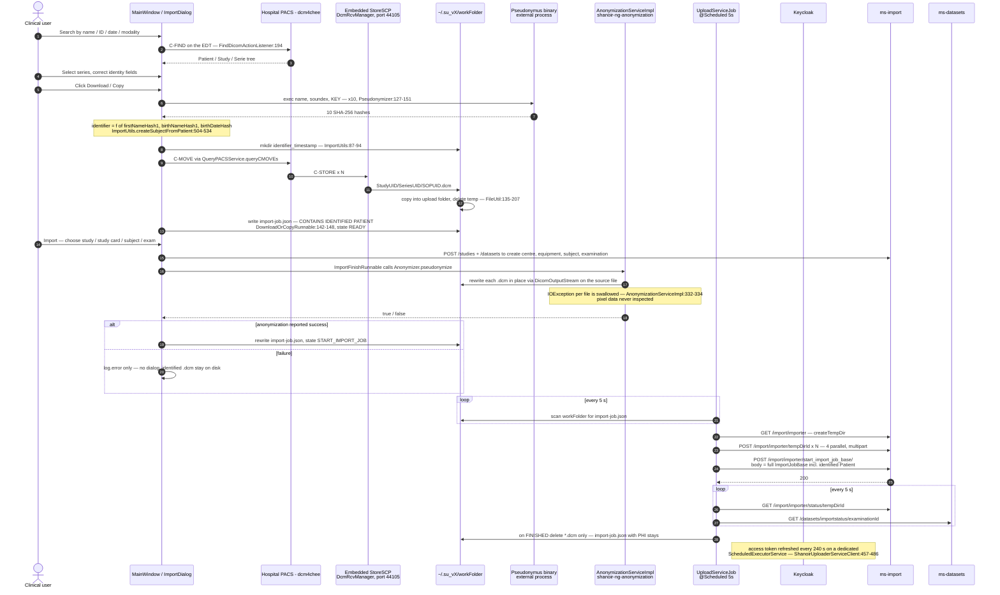

# `shanoir-uploader` (ShUp) — Deep Engineering Audit

**Scope:** `/shanoir-uploader` at commit `867e53290` (develop line), Shanoir-NG 3.4.0.
**Method:** static reading of every source file in the module plus the shared modules it consumes
(`shanoir-ng-anonymization`, `shanoir-ng-import`, `shanoir-ng-ms-common`), the resource/config tree,
`.github/workflows/shup_release.yml`, and the anonymization rule spreadsheet
(`shanoir-ng-anonymization/src/main/resources/anonymization.xlsx`, extracted programmatically).
No builds were run. Every claim below carries a `file:line` citation; inferences are labelled.

---

## 1. Executive summary

### What it is

ShanoirUploader ("ShUp") is a **Java 21 / Swing desktop application** (`org.shanoir.uploader.ShanoirUploader`,
`shanoir-uploader/pom.xml:441`) installed on clinical workstations *inside hospitals*. Staff use it to:

1. Query a hospital PACS by DIMSE C-FIND, or read a CD/DVD/local folder via `DICOMDIR`, or receive
   a DICOM C-STORE push into an embedded mini-PACS SCP (`DcmRcvManager.java:63`).
2. Verify/correct patient identity in a GUI form.
3. Compute pseudonym hashes with the external OFSEP **Pseudonymus** binary (OFSEP profile only).
4. Pseudonymize the DICOM files locally via the shared `shanoir-ng-anonymization` library.
5. Upload the resulting files to a Shanoir server and drive the server-side import job.

It is **26,349 LOC** (24,040 main / 2,309 test) across **163 main** and **10 test** classes.
It is a Maven module of the same reactor as the server (`shanoir-ng-parent/pom.xml:34`) and compiles
against server code at a pinned version (`3.4.0`).

### Health verdict

**Unsafe to ship as-is for a PHI-handling, hospital-deployed client.** The DICOM pixel/tag
de-identification itself is competent and correctly delegated to the shared server library (no
duplicate implementation — good). But the surrounding plumbing defeats it in three independent ways,
and the transport security has a genuine hostname-verification bypass. Structurally the code is a
2010-era Swing app: no MVC, ~115 public static mutable fields, blocking network I/O on the Event
Dispatch Thread, and a test suite that cannot execute a single assertion without a live server.

Quality by area:

| Area | Verdict |
|---|---|
| De-identification of DICOM tags | Good rules, **fail-open per file**, no pixel-data scrubbing |
| Identity leakage outside DICOM | **Broken** — cleartext PHI in JSON on disk, in logs, and POSTed to the server |
| Transport security (TLS) | **Broken** — hostname verification disabled in production |
| Credentials at rest | Weak (plaintext password option; 14-bit "encryption" key) |
| Threading / UI | Poor — EDT blocked by PACS and REST calls; Swing touched off-EDT |
| Robustness | Poor — no resumability, lock leak stops all uploads, temp cleanup silently fails |
| Tests | Effectively **zero automated coverage** (all tests are live-server integration tests, skipped by default, and `-DskipTests` in CI) |
| Release integrity | **Unsigned** installers for Windows/macOS/Linux, no checksums |

### Top findings (ranked)

| # | Severity | Finding | Evidence |
|---|---|---|---|
| 1 | **Critical** | **TLS hostname verification is disabled for every production HTTPS connection.** `CustomHostnameVerifier.verify(String, X509Certificate)` is an empty method, and Apache HttpClient 5.1 calls exactly that overload for `HttpClientHostnameVerifier` implementations. | `CustomHostnameVerifier.java:34-36`, used at `HttpService.java:338` and `KeycloakAuthCodeLoginService.java:442` |
| 2 | **Critical** | **Fully identified patient data is POSTed to the server in cleartext JSON** on every ShUp import, alongside the pseudonymized DICOM. `ImportJobBase.patient` (name, birth name, first/last name, exact birth date, hospital patient ID) is serialized without `@JsonIgnore`. A stale code comment shows this was *supposed* to be nulled. | `UploadServiceJob.java:368-373`, `ImportJobBase.java:74`, `Patient.java:37-57`, stale comment `ImportFromTableRunner.java:205` |
| 3 | **Critical** | **Per-file fail-open in anonymization.** `AnonymizationServiceImpl.performAnonymization` catches `IOException` and returns normally; the batch then reports success and the *un-anonymized* file is uploaded with the rest. | `AnonymizationServiceImpl.java:332-334` → `Anonymizer.java:24-30` → `ImportFinishRunnable.java:51-64` → `UploadServiceJob.java:121-125` |
| 4 | **High** | **PHI written to disk and never deleted.** `import-job.json` containing the identified patient is written into the work folder before anonymization and is *not* removed on success (only `.dcm` files are). Un-anonymized DICOM is also left behind whenever anonymization fails. | `DownloadOrCopyRunnable.java:142-148`, `UploadServiceJob.java:353-356`, `ImportFinishRunnable.java:65-67` |
| 5 | **High** | **PHI in log files.** The DICOM-push path logs the raw patient name; `startImportJob` logs the entire import-job JSON (with identity) on any server error; `Pseudonymizer.exec` DEBUG-logs the patient name *and the Pseudonymus secret key*. Logs live 60 days / up to 1 GB in `~/.su_<version>/`. | `DicomPushServiceJob.java:264-266`, `ShanoirUploaderServiceClient.java:1016`, `Pseudonymizer.java:245,289`, `logback.xml` file appender |
| 6 | **High** | **Pseudonymus secret key passed as a process argument**, visible to any local user via `ps`/Task Manager. | `Pseudonymizer.java:209-214` |
| 7 | **High** | **A lock leak permanently stops all uploads.** `ExaminationConsistencyServiceJob.execute()` takes `UploadServiceJob.LOCK` with no `try/finally`; any exception leaves it held forever and `UploadServiceJob.tryLock()` then always fails, silently. | `ExaminationConsistencyServiceJob.java:56-63` |
| 8 | **High** | **No release signing.** `jpackage` produces `.exe`/`.dmg`/`.deb` with no Authenticode, no macOS notarization, no GPG, and no published checksums — for software installed on hospital machines. | `shup_release.yml:97-109,167-184,235-247,262-270` |
| 9 | **High** | **Effectively no automated tests.** All 28 `@Test` methods are integration tests requiring a live Shanoir server + Keycloak credentials; `AbstractTest` skips everything via `Assumptions` when unconfigured, and the release build runs `-DskipTests`. | `AbstractTest.java:133`, `shup_release.yml:76,145,214` |
| 10 | **Medium-High** | **Blocking I/O on the EDT.** PACS C-FIND, all import-dialog REST calls, and the GitHub update check (with no timeouts) run on the Event Dispatch Thread; conversely `SwingWorker.doInBackground` mutates Swing widgets off-EDT. | `FindDicomActionListener.java:194`, `ImportDialogOpener.java:122`, `UpdateCheckerService.java:43-47`, `ImportFromTableRunner.java:87-92,149-157` |

---

## 2. Purpose, users & deployment context

### Users

Radiology technicians, clinical research associates (ARCs) and imaging-platform staff at ~40 French
MRI centres (OFSEP multiple-sclerosis cohort, Neurinfo/Rennes platform). Non-developers. The UI
default language is French (`language.properties: shanoir.uploader.language=FRENCH`).

### Where it runs

On a hospital workstation with:

- Network access to the local PACS (DIMSE, default `localhost:11112`, AET `DCM4CHEE` —
  `dicom_server.properties`).
- An **inbound listening port 44105** with AET `SHANOIR-UPLOADER` — ShUp runs its own DICOM SCP
  ("mini-PACS") continuously so C-MOVE results and ad-hoc pushes land in the work folder
  (`DcmRcvManager.java:63-79`).
- Outbound HTTPS (often through an authenticating hospital proxy — `proxy.properties`,
  `HttpService.java:263-297`) to the Shanoir server.

All state lives under `~/.su_v<version>/`:

```
~/.su_v3.4.0/
├── basic.properties        # profile, username, password (plaintext), random.seed
├── language.properties
├── proxy.properties        # proxy.password "encrypted"
├── dicom_server.properties # PACS AET/host/port, keystore passwords
├── endpoint.properties     # copied fresh from jar on every start
├── profiles.properties     # copied fresh from jar on every start
├── profile.<NAME>/         # profile.properties + keycloak.json per profile
├── pseudonymus/            # OFSEP binaries per OS/arch (NOT in the repo)
├── su.log + archived_logs/ # 60 days, up to 1 GB
└── workFolder/
    └── <subjectIdentifier>_<timestamp>/
        ├── import-job.json     # ← contains identified patient
        └── *.dcm               # ← identified until anonymization runs
```

There is **no embedded database**. Everything is properties files + one JSON per import job, with a
`ReentrantLock` per file path (`NominativeDataImportJobManager.java:43,72-74`) for in-process
serialization only (no cross-process locking).

### The profile mechanism

`profiles.properties` lists seven profiles: `OFSEP, OFSEP-Qualif, OFSEP-VHD, OFSEP-VHD-Qualif,
Neurinfo, Neurinfo-Qualif, dev`. Each is a resource directory `profile.<NAME>/` holding
`profile.properties` + `keycloak.json`, copied out of the jar into `~/.su_*` on first run
(`InitialStartupState.java:191-207`). The user picks one at startup
(`SelectProfilePanelActionListener.java:44-57`).

Behaviour keys (`ShUpConfig.java:47-57`, `ShUpConfig.java:140-154`):

| Key | OFSEP | OFSEP-VHD | Neurinfo | dev |
|---|---|---|---|---|
| `mode.pseudonymus` | `true` | `false` | `false` | `false` |
| `mode.subject.common.name` | `auto-increment` | `manual` | `manual` | `manual` |
| `mode.subject.study.identifier` | `false` | `false` | `true` | `true` |
| `anonymization.profile` | `Profile OFSEP` | `Profile OFSEP` | `Profile Neurinfo` | `Profile Neurinfo` |
| `shanoir.server.url` | `https://shanoir-ofsep.irisa.fr` | same | `https://shanoir.irisa.fr` | `https://localhost` |

Note the coupling documented in the profile files themselves: `mode.pseudonymus` "implicitly triggers
this flag which profile is used for anonymization" — but that is **no longer true**; the
anonymization profile is now an independent key (`ImportFinishRunnable.java:50`). The comment in all
seven `profile.properties` files is stale.

**Build-profile coupling.** The Pseudonymus key files (`profile.OFSEP/key`, …) are excluded from the
default Maven resource set and only included by `-Pofsep` (`pom.xml:356-479`). `READ_ME.txt` warns:
*"If not, it will not work for OFSEP and an error will be thrown during imports."* The CI workflow
never passes `-Pofsep` (`shup_release.yml:76,145,214`) — **the released binaries are therefore broken
for the OFSEP profile** (they will hit the `System.exit(0)` at `ReadyState.java:72`). This is either
an undocumented manual release step for OFSEP or a live defect; from the repository alone it looks
like a defect.

---

## 3. Architecture & code structure

### Package tree

| Package | Classes | LOC | Role |
|---|---:|---:|---|
| `org.shanoir.uploader` | 4 | 396 | `main()`, Spring config, two global static config holders |
| `…/action` | 26 | 4,255 | Swing listeners **plus** most business logic |
| `…/action/init` | 21 | 1,696 | Startup state machine (`State`/`StartupStateContext`) |
| `…/check` | 2 | 284 | Post-import server-side consistency check (DICOMweb) |
| `…/cryptography` | 1 | 82 | Blowfish wrapper |
| `…/dicom` | 7 | 557 | PACS client facade, tree node model |
| `…/dicom/anonymize` | 2 | 339 | `Anonymizer` (delegates to shared lib), `Pseudonymizer` (Pseudonymus exec) |
| `…/dicom/query` | 6 | 1,287 | DICOM tree model (`Media`/`PatientTreeNode`/`StudyTreeNode`/`SerieTreeNode`), `ConfigBean` |
| `…/dicom/retrieve` | 1 | 104 | `DcmRcvManager` — embedded StoreSCP |
| `…/exception` | 1 | 24 | `PseudonymusException` |
| `…/gui` | 19 | 4,808 | Swing windows/dialogs/panels |
| `…/gui/customcomponent` | 2 | 82 | Combo-box item wrappers |
| `…/model` + `dto` + `mapper` + `rest` | 50 | 3,735 | REST DTOs (duplicated from server) + MapStruct mappers |
| `…/nominativeData` | 4 | 811 | "Current uploads" table model/controller, DICOM-push watcher |
| `…/service/rest` (+`dto`) | 9 | 2,948 | `ShanoirUploaderServiceClient` (1,550 LOC), `HttpService`, Keycloak login, update check |
| `…/upload` | 1 | 388 | `UploadServiceJob` — the scheduled upload state machine |
| `…/utils` | 7 | 2,244 | `Util`, `ImportUtils`, `FileUtil`, `Encryption`, `QualityUtils`, … |
| **main total** | **163** | **24,040** | |
| **test total** | **10** | **2,309** | |

### Layering (or lack of it)

There is no layering discipline. The de-facto structure is:

```
gui/*  ──uses──▶  action/*  ──uses──▶  utils/ImportUtils (static)  ──uses──▶  ShUpOnloadConfig (static)
                     │                          │                                    │
                     └──────────────────────────┴────────────────────────────────────┴──▶ service/rest/*
```

Concrete symptoms:

- **God classes.** `ShanoirUploaderServiceClient` is 1,550 LOC with **44 `serviceURL*` string fields**
  and ~45 endpoint methods (`ShanoirUploaderServiceClient.java:172-252`). `MainWindow` is 1,049 LOC
  with **75 public fields** — every text field, radio button and listener is public and reached into
  from listeners (e.g. `DownloadOrCopyActionListener.java:175-199` reads
  `mainWindow.firstNameTF.getText()` directly).
- **Business logic in UI listeners.** `ImportFinishActionListener.actionPerformed` (295 LOC) performs
  study-card resolution, centre/equipment creation via REST, quality-card evaluation, subject
  creation and examination creation before handing off (`ImportFinishActionListener.java:68-273`).
- **Global mutable state.** 21 `public static` fields on `ShUpConfig` (`ShUpConfig.java:106-138`) plus
  9 static fields behind static getters/setters on `ShUpOnloadConfig`. Spring is used
  (`@ComponentScan`, `@EnableScheduling` — `ShanoirUploaderSpringConfig.java`), but wiring is bypassed
  by these statics: e.g. `ImportUtils.manageSubject` reaches for
  `ShUpOnloadConfig.getShanoirUploaderServiceClient()` (`ImportUtils.java:288`) instead of receiving
  it. This is the single biggest obstacle to unit testing the module.
- **Duplicated DTOs.** `…/model/rest` (27 classes, 2,253 LOC) re-declares `Study`, `Subject`,
  `Center`, `StudyCard`, `Examination`, `AcquisitionEquipment`… which also exist server-side, while
  *other* models (`ImportJobBase`, `Patient`, `Serie`, `Instance`) are imported directly from
  `shanoir-ng-import`. Two contradictory strategies coexist. `model/rest/package-info.java:22-26`
  admits this ("Very unnecessary copy operations… In version 7.0 the ImportDialogOpenerNG will be
  renamed…") — a migration abandoned mid-flight.

### Threading model

Counts across `src/main`: `SwingWorker` ×4, `invokeLater` ×1, `invokeAndWait` ×0, `new Thread(` ×4,
`Executors.` ×4, `@Scheduled` ×3.

**Blocking the EDT (UI freezes):**

| Location | Blocking call on EDT |
|---|---|
| `FindDicomActionListener.java:194` | `dicomServerClient.queryDicomServer(...)` — DIMSE C-FIND against the hospital PACS |
| `ImportDialogOpener.java:122` and following | `findStudiesNamesAndCenters()`, study cards, subjects, examinations — 4+ serial HTTPS round trips, invoked from a `mouseClicked` handler (`CurrentNominativeDataController.java:148`) |
| `UpdateCheckerService.java:43-47` | `HttpURLConnection` to `api.github.com` with **no connect/read timeout and no proxy support**, invoked from the Help menu listener (`MainWindow.java:307-310`). Behind a black-holing hospital firewall this hangs the UI indefinitely. |
| `ImportFinishActionListener.java:142-160, 200-226` | centre/equipment/subject/examination creation + quality-card check, all synchronous REST |

**Touching Swing off the EDT:**

| Location | Off-EDT Swing mutation |
|---|---|
| `ImportFromTableRunner.java:87-92` | `openButton.setEnabled`, `progressBar.setString/setVisible` inside `doInBackground()` |
| `ImportFromTableRunner.java:126-127, 149-157` | progress + `frame.setVisible(false)` + `frame.dispose()` inside `doInBackground()` |
| `ImportUtils.java:274` | `progressBar.setValue(...)` from `DownloadOrCopyRunnable`'s plain `Thread` |
| `DownloadOrCopyRunnable.java:164-175` | builds a `JTextArea`/`JScrollPane` and shows a modal `JOptionPane` from a plain `Thread` |

**Background execution:**

- Three `@Scheduled` beans share Spring's **default single-threaded** `TaskScheduler`:
  `UploadServiceJob` (5 s, `UploadServiceJob.java:73`), `ExaminationConsistencyServiceJob` (30 min,
  `ExaminationConsistencyServiceJob.java:51`), `DicomPushServiceJob` (1 h,
  `DicomPushServiceJob.java:79`). A multi-gigabyte upload therefore *starves the other two jobs
  entirely* for its whole duration. No `ThreadPoolTaskScheduler` is configured.
- Per-folder uploads use a fixed pool of 4 (`UploadServiceJob.java:65, 201-202`) with fail-fast
  cancellation (`:222-240`) — this part is well written.
- `ImportFinishActionListener` uses a shared bounded pool sized `max(2, cores/2)`
  (`ImportFinishActionListener.java:44-45`) with a duplicate-submission guard
  (`:53, 76-80`) — also well written.

**Cancellation:** there is none for the user. No cancel button exists for a running
download/anonymize/upload. `DownloadOrCopyActionListener` guards re-entry with a `ReentrantLock`
(`:143-154`) but if the lock is held it only writes a log line — **the user's click is silently
discarded** (`:152-154`).

### Configuration & profiles

`InitialStartupState.load()` (`InitialStartupState.java:75-98`) is the boot sequence: migrate old
`~/.su*` folders → load properties → set language → copy `pseudonymus` → init profiles → init profile
→ init credentials → show startup dialog. Then a state machine walks
`SelectProfileConfigurationState → ProxyConfigurationState → PacsConfigurationState →
AuthenticationConfigurationState → (OtpInputState/OtpSetupState) → ReadyState`.

Two files are re-copied from the jar on every start so new endpoints always win:
`profiles.properties` and `endpoint.properties` (`InitialStartupState.java:266-279`). Everything else
(including `dicom_server.properties`) is preserved. Reasonable design.

### Dependencies from `pom.xml`

Shared Shanoir modules reused (all with a **wildcard exclusion of every transitive dependency**,
`pom.xml:54-104`):

| Module | Version | What ShUp uses from it |
|---|---|---|
| `shanoir-ng-ms-common` | 3.4.0 | `StreamGobbler`, `Utils.sha256`, `KeycloakUtil`, shared DICOM DTOs |
| `shanoir-ng-import` | 3.4.0 | `ImportJobBase`, `Patient`, `Serie`, `Instance`, `QueryPACSService`, `DicomDirToModelService`, `ImagesCreatorAndDicomFileAnalyzerService` |
| `shanoir-ng-datasets` | 3.4.0 | `DatasetAcquisition`, `QualityCard`, study-card DTOs |
| `anonymization` | 3.4.0 | `AnonymizationServiceImpl` — **the de-identification engine** |
| `shanoir-ng-exchange` | 3.4.0 | `IdentifierCalculator` |

The wildcard exclusions mean the uploader hand-redeclares every library those modules need. If a
server module starts using a class from a jar ShUp does not declare, **ShUp compiles fine and fails
at runtime with `NoClassDefFoundError`** — there is no test that would catch it (see §11).

Third-party (selected), with age/risk notes:

| Dependency | Version | Note |
|---|---|---|
| `dcm4che-core/net/dcmr` | 5.31.1 | current |
| `weasis-dicom-tools` | 5.31.1 | fetched from `https://raw.github.com/nroduit/mvn-repo/master/` (`pom.xml:344-350`) — a **personal GitHub raw URL used as a Maven repository**, no signature/checksum policy. Supply-chain risk. |
| `httpclient5` | 5.1 (2021) | 3+ years behind (5.4.x current); the server side already resolves 5.4.1 locally |
| `jackson-databind` | **2.13.4** | EOL branch; CVE-2022-42003 was only fixed in 2.13.4.**2**. Spring Boot 3.4.0 (server) ships Jackson 2.18.x → **client/server serialize the same DTOs with different Jackson majors** |
| `commons-lang` | **2.3** (2007) | 18-year-old EOL library, used alongside `commons-lang3:3.17.0` — both present |
| `lombok` | **1.18.26** | JDK 21 support landed in lombok 1.18.30; the pom targets Java 21 (`pom.xml:29,386-387`) |
| `mapstruct` | 1.5.3.Final | 1.5.5+ recommended for JDK 21 |
| `swingx-all` | 1.6.4 | abandoned upstream (2013) |
| `jdatepicker` | 1.3.4 | 2016 |
| `org.json` | 20231013 | ~2 years behind |
| `flatlaf` | 3.2 | 2023 |
| `poi` / `poi-ooxml` | 5.4.0 | current |

Also committed: **`src/main/resources/dcm4che2-tool-dcmqr-custom-1.0.0.jar` (46 KB)** — an unversioned,
unattributed, *dcm4che **2*** binary blob that is **never referenced by any code** (grep across
`*.java`/`*.xml`/`*.properties` finds no reference) yet is packaged into the shipped fat jar and
every installer. Dead weight and an unauditable binary in a privacy-critical distribution.

---

## 4. The upload & de-identification pipeline

### End-to-end sequence



### Stage-by-stage

| Stage | Entry point | Notes |
|---|---|---|
| **Query PACS** | `FindDicomActionListener.java:89-210` → `DicomServerClient.queryDicomServer` (`:114-136`) → `QueryPACSService` (in `shanoir-ng-import`) | On the EDT. Modalities MR/CT/PT/NM, patient-root or study-root. |
| **Read CD/DVD/folder** | `ImportUtils.getPatientsFromDir` (`:536-552`) | Generates a `DICOMDIR` if absent, then `DicomDirToModelService`. |
| **Receive DICOM push** | `DcmRcvManager.configureAndStartSCPServer` (`:63-79`), watched by `DicomPushServiceJob` (`:79-108`) hourly | Storage pattern `{StudyUID}/{SeriesUID}/{SOPUID}.dcm` (`:59`). |
| **Identity verification** | `DownloadOrCopyActionListener.adjustPatientWithPatientVerificationGUIValues` (`:174-201`) | Requires non-empty first/last/birth name; GUI values override DICOM values (`ImportUtils.java:370-385`). |
| **Pseudonym hashes** | `Pseudonymizer.createHashValuesWithPseudonymus` (`:127-191`) | 10 external process invocations per patient. |
| **Subject identifier** | `ImportUtils.createSubjectFromPatient` (`:504-534`) | OFSEP: `IdentifierCalculator.calculateIdentifierWithHashs(firstNameHash1, birthNameHash1, birthDateHash)`. Neurinfo: `calculateIdentifier(firstName, lastName, birthDate)` — a local hash, Pseudonymus not used. Birth date is truncated to Jan 1 of the year (`:528-532`). |
| **Download / copy** | `ImportUtils.downloadOrCopyFilesIntoUploadFolder` (`:218-238`), `FileUtil.readAndCopyDicomFilesToUploadFolder` (`:135-207`) | PACS: files land in per-series subfolders. Disk: flattened, path separators replaced by `_` (`ImportUtils.java:256-266`). |
| **Anonymize** | `ImportFinishRunnable.run` (`:46-73`) → `Anonymizer.pseudonymize` (`:17-31`) → `AnonymizationServiceImpl.anonymizeForShanoir` (`:110-140`) | Files are rewritten **in place** (`AnonymizationServiceImpl.java:329-330`). |
| **Archive** | — | **There is no archive step.** ShUp uploads individual `.dcm` files by multipart POST; no zip, no compression, no manifest, no checksum. |
| **Authenticate** | `ShanoirUploaderServiceClient.loginWithKeycloakForToken` (`:383-442`, ROPC grant) or `KeycloakAuthCodeLoginService` (`:128-357`, Authorization Code + PKCE + OTP) | Both are used; ROPC remains the default path via `AuthenticationManualConfigurationState`. |
| **Upload + drive import** | `UploadServiceJob` (`:73-387`) | State machine `START_IMPORT_JOB → SERVER_PROCESSING → FINISHED / ERROR`, polling both ms-import and ms-datasets (`:263-344`). |

---

## 5. Pseudonymization & anonymization deep-dive

### 5.1 The definitive fail-open / fail-closed answer

**Layered answer: fail-closed at the batch boundary, fail-OPEN at the per-file boundary — and
fail-open for identity carried outside the DICOM files.**

**(a) Pseudonymus availability — fail-CLOSED.** `ReadyState.load()` constructs the `Pseudonymizer`
when `mode.pseudonymus=true` and, on any exception (missing key, missing folder), logs and calls
`System.exit(0)` (`ReadyState.java:63-74`). The app refuses to start. Good. Two caveats:

- `Pseudonymizer`'s constructor does **not** throw on an unsupported OS/architecture; it logs an error
  and leaves `pseudonymusExePath == null` (`Pseudonymizer.java:98-109`). The object is created
  successfully. The failure only surfaces later when `Runtime.exec(null)` throws inside
  `exec(...)` (`:251`), which returns `null`, which `createHashValuesWithPseudonymus` detects and turns
  into a `PseudonymusException` (`:178-189`) — caught by `DownloadOrCopyActionListener` with a dialog
  (`:107-113`). So it *is* ultimately fail-closed, but by three accidents rather than by design.
- The hash-validity check rejects `null`, `""` and any value containing the literal `"DEBUG"`
  (`Pseudonymizer.java:178-187`). This is a **string sniff on subprocess stdout**, not a status check.
  `exec()` never inspects the process exit code for the caller (`:260,266` — it is only logged), and
  the hash is extracted by `result.substring(result.length()-65, result.length()-1)`
  (`Pseudonymizer.java:216-219`). If Pseudonymus ever emits a 64-char-or-longer diagnostic without the
  word "DEBUG", a garbage "hash" is accepted silently.

**(b) DICOM tag anonymization of a whole folder — fail-CLOSED at the *upload trigger*.**
`Anonymizer.pseudonymize` returns `false` on any `Exception` (`Anonymizer.java:26-29`), and
`ImportFinishRunnable` then **does not write** `import-job.json` in state `START_IMPORT_JOB`
(`ImportFinishRunnable.java:56-67`). `UploadServiceJob.processFolderForServer` only uploads folders
whose job is in `START_IMPORT_JOB` (`UploadServiceJob.java:131`). So a hard failure does not upload.
But:

- The user is told **nothing**. The only output is `logger.error(uploadFolder.getName() + ": Error
  during anonymization.")` (`ImportFinishRunnable.java:66`) on a background executor thread. The GUI
  has already shown *"import started"* (`ImportFinishActionListener.java:265-267`). The clinical user
  believes the import succeeded.
- The identified `.dcm` files and the identified `import-job.json` **remain on the hospital disk
  indefinitely** (nothing deletes them on the failure path).

**(c) DICOM tag anonymization of an individual file — fail-OPEN. This is the critical one.**

```java
// shanoir-ng-anonymization/.../AnonymizationServiceImpl.java:332-334
} catch (final IOException exc) {
    LOG.error("performAnonymization : error while anonimizing file " + dicomFile.toString() + " : ", exc);
}
```

`performAnonymization` swallows `IOException` and returns normally. The batch loop
(`AnonymizationServiceImpl.java:129-137`) continues, `anonymizeForShanoir` returns normally,
`Anonymizer.pseudonymize` returns `true` (`Anonymizer.java:30`), `import-job.json` is written in
`START_IMPORT_JOB`, and `UploadServiceJob` then uploads **every `*.dcm` in the folder tree**
regardless of which ones were actually rewritten (`UploadServiceJob.java:121-125`).

**Consequence: a single unreadable/unwritable/locked/corrupt DICOM file in a study results in a fully
identified DICOM instance being uploaded to the Shanoir server, with no error surfaced anywhere except
one line in `su.log`.** Realistic triggers: antivirus holding a file handle (very common on hospital
Windows), disk full mid-rewrite, a truncated C-STORE, a network drive hiccup, a read-only CD file
copied with read-only permissions.

Worse, the write is destructive-in-place: `dos = new DicomOutputStream(dicomFile)` truncates the very
file just read (`AnonymizationServiceImpl.java:329`). If `writeDataset` throws part-way, the file is
left **truncated and corrupt**, the exception is swallowed, and the corrupt file is uploaded.

**(d) Identity outside the DICOM files — fail-OPEN by construction.** Even when everything succeeds,
the patient's real identity leaves the hospital anyway. See §5.4.

### 5.2 Key management

| Question | Answer | Evidence |
|---|---|---|
| Where does the Pseudonymus key come from? | It is **fetched from the Shanoir server at startup**: `findValueByKey("PSEUDONYMUS")` → `GET /shanoir-ng/studies/keys/PSEUDONYMUS` | `ReadyState.java:66`, `endpoint.properties:35` |
| Is it in the repo? | No — `src/main/resources/key`, `profile.OFSEP/key`, `profile.OFSEP-Qualif/key` are gitignored and absent. The `pom.xml` `ofsep` profile bundles them into the jar for OFSEP builds. | `.gitignore:28-31`, `pom.xml:468-479` |
| Is the key protected in memory/at rest? | It is a plain `String` field (`Pseudonymizer.java:69`), and for OFSEP builds it is a **plaintext resource inside the shipped jar** (trivially extractable). | `pom.xml:474-476` |
| Is it exposed at runtime? | **Yes.** It is `cmd[3]` of the child process (`Pseudonymizer.java:213`), so it appears in `ps aux` / Windows Task Manager / process-accounting logs for every one of the 10 invocations per patient. It is additionally written to `su.log` at DEBUG (`Pseudonymizer.java:245`). | |
| Determinism / reversibility | Deterministic and keyed: same (name, soundex mode, key) → same SHA-256-length hash. Not reversible by design, but **fully enumerable**: the space of French surnames/first names/birth dates is small, so anyone holding the key can brute-force the mapping. The key is therefore the whole security boundary. | `Pseudonymizer.java:205-222` |
| Rotation | None. Nothing in the codebase versions or rotates the key. Rotating it invalidates every existing subject identifier. | |
| Neurinfo profile | Does **not** use Pseudonymus at all; `IdentifierCalculator.calculateIdentifier(firstName, lastName, birthDateString)` is an unkeyed local hash (`ImportUtils.java:520-521`) — trivially brute-forceable with no secret required. | |

Two additional secrets-adjacent items:

- The **local "encryption" of the proxy password** uses a key derived from `random.seed`, which is
  `new Random().nextInt(10000)` (`InitialStartupState.java:251-253`) — **~13.3 bits of entropy** — and
  is stored **in plaintext in the same file as the ciphertext** (`basic.properties`). The Blowfish
  wrapper uses ECB with no IV (`Cipher.getInstance("Blowfish")`, `BlowfishAlgorithm.java:68,75`) and
  derives the key by seeding `SHA1PRNG` (`:56-58`) — an antipattern that is not guaranteed
  reproducible across JDK/provider versions. `symmetricKey` is `private static`
  (`BlowfishAlgorithm.java:38`) while `encrypt`/`decrypt` are `static` — a second `Encryption`
  instance silently overwrites the first instance's key.
- `dicom_server.properties` ships `dicom.server.keystore.password=password` and
  `dicom.server.truststore.password=password` as defaults (lines 29, 32).

### 5.3 Anonymization: shared or duplicated?

**Shared, not duplicated.** `Anonymizer.pseudonymize` instantiates the server's
`org.shanoir.anonymization.anonymization.AnonymizationServiceImpl` directly
(`Anonymizer.java:9-10, 23-24`) from the `anonymization:3.4.0` artifact (`pom.xml:83-93`), and reads
the same `anonymization.xlsx` rule sheet. There is **no second implementation to diff** — this is the
single best architectural decision in the module and it should be preserved.

The uploader-side wrapper is 46 lines and adds only: a recursive `.dcm` file collector
(`Anonymizer.java:33-44`) and the `boolean` success flag. Note `folder.listFiles()` is dereferenced
without a null check (`Anonymizer.java:34-35`) — an unreadable directory yields an NPE, which *is*
caught upstream and produces a fail-closed `false`.

### 5.4 What actually leaves the hospital (the real de-identification gap)

Even on the happy path, **the patient's real identity is transmitted to the server in cleartext JSON**:

1. `ImportUtils.createNewImportJob` copies `patientName`, `patientID`, `patientLastName`,
   `patientFirstName`, `patientBirthDate`, `patientBirthName`, `patientSex` into the job
   (`ImportUtils.java:106-127`).
2. `ImportJobBase.patient` has **no `@JsonIgnore`** (`ImportJobBase.java:74, 290-296`) and every
   `Patient` field is an explicit `@JsonProperty` (`Patient.java:37-57`).
3. `UploadServiceJob.setTempDirIdAndStartImport` serializes the whole job and POSTs it
   (`UploadServiceJob.java:368-373` → `ShanoirUploaderServiceClient.startImportJob:1009-1021`).
4. The server accepts it verbatim and never strips it
   (`shanoir-ng-import/.../ImporterApiController.java:311-333`).

The intent was clearly the opposite. `ImportFromTableRunner.java:205` still carries the comment
*"DownloadOrCopyRunnable sets patient and study to NULL: reduce size of import-job.json"* — but
`DownloadOrCopyRunnable` no longer does that anywhere (`DownloadOrCopyRunnable.java:89-177`). Git
history shows `setPatient(null)` calls existing in earlier commits (`git log -S 'setPatient(null)'`
→ `ce68d557c`, `923fcafbf`, …), removed during the `ImportJobBase` migration (`73a79d53d`, `b4bfd3239`).
**This is a regression, not a design choice.**

Same object, same fields, written to disk at `DownloadOrCopyRunnable.java:142-148` (state `READY`,
before any anonymization) and never deleted: `markFinished` deletes only `*.dcm`
(`UploadServiceJob.java:353-356, 375-387`), and only when `check.on.server=false`.

### 5.5 Tag-level analysis (extracted from `anonymization.xlsx`)

The sheet defines **622 tag rules** across 4 profiles. Action distribution:

| Profile | X (remove) | Z (blank) | D (dummy) | U (new UID) | K (keep) | multi-action | empty |
|---|---:|---:|---:|---:|---:|---:|---:|
| Basic | 383 | 42 | 92 | 56 | 0 | 49 | 0 |
| MR | 404 | 47 | 89 | 55 | 2 | 22 | 3 |
| **OFSEP** | 394 | 44 | 89 | 55 | **15** | 22 | 3 |
| **Neurinfo** | 392 | 44 | 89 | 55 | **17** | 22 | 3 |

Core identifiers are handled correctly in the two production profiles: `PatientName` Z, `PatientID` Z,
`PatientBirthDate` Z, `PatientBirthName` X, `PatientAddress`/`Telephone`/`EthnicGroup`/`Occupation`/
`PatientComments` X, all physician-name tags X, `AccessionNumber` Z, `StudyID` Z, and
`SOPInstanceUID`/`StudyInstanceUID`/`SeriesInstanceUID`/`FrameOfReferenceUID` regenerated (U) with
consistent per-batch mapping (`AnonymizationServiceImpl.java:616-641`). Patient name/ID/birth date are
then re-set to the pseudonym (`anonymizePatientMetaData`, `:148-168`; birth date coarsened to
`YYYY0101`, `:161-165`).

**Gap 1 — private tags are KEPT.** `0xggggeeee → K` in both OFSEP and Neurinfo. The only protection is
`checkForPHIInPrivateTags` (`AnonymizationServiceImpl.java:389-414`), a substring scan for the
patient's own name parts / ID / birth name / birth date **exactly as spelled in that file**, plus a
per-manufacturer deny-list from sheet 2. This misses: private tags holding the *referring physician*,
the *accession number*, an MRN in a different format, an operator's name, a study-specific comment,
Siemens CSA blobs from any manufacturer string not in the sheet, and any value shorter than 3 chars
(`:408`). Private-tag retention is the single largest residual re-identification surface.

**Gap 2 — dates and quasi-identifiers are KEPT.** OFSEP keeps: `StudyDate`, `SeriesDate`,
`AcquisitionDate`, `AcquisitionTime`, `StudyDescription`, `SeriesDescription`, `ProtocolName`,
`InstitutionName`, `InstitutionAddress`, `DeviceSerialNumber`, `PatientSex`, `PatientWeight`,
`ContrastBolusAgent`, `RequestedContrastAgent`. Neurinfo additionally keeps `PatientAge` and
`PatientSize` (but removes `InstitutionName`/`InstitutionAddress`). Exact exam date + institution +
sex + weight + scanner serial number is a strong quasi-identifier set. This is a deliberate
research-utility trade-off, but it means **the output is pseudonymized, not anonymized**, and the
codebase/UI never says so.

**Gap 3 — DICOM PS3.15 de-identification attributes are absent.** `0x00120062 PatientIdentityRemoved`
and `0x00120063 DeidentificationMethod` do **not appear anywhere in the sheet**. The output therefore
does not declare itself de-identified, in violation of the DICOM Basic Application Level
Confidentiality Profile. Downstream tools cannot distinguish ShUp output from raw clinical data.

**Gap 4 — burned-in annotation is not addressed.** `0x00280301 BurnedInAnnotation` is absent from the
sheet, and `AnonymizationServiceImpl` never touches `PixelData` beyond copying it through
(`:245, 330`). Secondary-capture images, dose reports, screenshots and scanned forms with the patient
name rendered into pixels are uploaded intact. No detection, no warning, no rejection.

**Gap 5 — 22 tags have actions the code does not understand.** The sheet uses DICOM-standard compound
actions (`X/Z`, `X/D`, `X/Z/D`, `Z/D`) for 22 OFSEP/Neurinfo rows, but `getFinalValueForTag` only
recognises `X`, `Z`, `D`, `U`, `K` (`AnonymizationServiceImpl.java:527-549`); anything else falls
through to `result = ""` and is silently **blanked instead of removed**. Affected rows include
`0x00080012 InstanceCreationDate`, `0x00080013 InstanceCreationTime`, `0x00189516/17 Start/End
AcquisitionDateTime`, `0x22000002 LabelText`, `0x22000005 BarcodeValue`, `0x30080105 SourceSerialNumber`.
Blanking is *usually* privacy-equivalent here, but it silently produces zero-length values in Type-1
elements (invalid DICOM), and for any integer/float-VR tag it would raise `NumberFormatException`
from `Integer.decode("")` / `Double.valueOf("")` (`:570,573`) — an unchecked exception that escapes the
`catch (IOException)` and aborts the whole batch mid-way, leaving some files anonymized and some not.
Three more rows (`0x21000140 DestinationAE`, `0x00402004 IssueDateOfImagingServiceRequest`,
`0x00401104 Person'sTelecomInformation`) have **empty** action cells and are likewise blanked.

**Gap 6 — sequences.** Nested sequence items are not traversed. `AnonymizationServiceImpl` iterates
only `datasetAttributes.tags()` at the top level (`:275`); a `VR.SQ` tag is only nulled if the sheet
names it (`:581-582`). PHI nested inside e.g. `RequestAttributesSequence`, `SourceImageSequence`,
`ReferencedPatientSequence` or `OriginalAttributesSequence` items is untouched unless the top-level
sequence tag happens to be listed.

### 5.6 PHI in logs and temp files

Log configuration (`logback.xml`): root `INFO`, appenders `stdout` + a rolling file at
`${user.home}/.su_${app.version:-dev}/su.log`, 10 MB per file, 1 GB total cap, **60 days retention**,
gzip-archived. No encryption, no OS-level protection, world-readable on most Linux/macOS setups.

Confirmed PHI-bearing log statements:

| Location | What is logged |
|---|---|
| `DicomPushServiceJob.java:264-266` | `importJob.getPatient().getPatientName()` — **raw patient name at INFO** |
| `ShanoirUploaderServiceClient.java:1016` | the **entire import-job JSON** (name, birth name, birth date, patient ID) whenever `start_import_job_base` returns non-200 |
| `Pseudonymizer.java:245` | `"exec : Executing " + <exePath> <patientNameOrBirthDate> <soundex> <SECRET KEY>` at DEBUG |
| `Pseudonymizer.java:289` | `"exec : return result " + result` at DEBUG |
| `Pseudonymizer.java:170-173` | all 10 pseudonym hashes at INFO — deliberate ("Log all created hash values into su.log file"), and directly re-identifying if the key ever leaks |
| `Util.java:316,327` | patient birth date at DEBUG |
| `AnonymizationServiceImpl.java:489-490` | old→new value for **every** modified tag at DEBUG (documented as PHI-bearing at `:479-483`) |
| `AnonymizationServiceImpl.java:410` | private-tag value at **WARN** when a PHI match is found — i.e. the PHI it just detected is written to the log |
| `DicomServerClient.java:61` | `dicomServerProperties.toString()` including keystore/truststore passwords |

By contrast, `DownloadOrCopyRunnable.java:154` and `ImportFromTableRunner.java:133` correctly use
`Utils.sha256(...)`, and `Patient.toString()` hashes its fields (`Patient.java:173-193`). The codebase
clearly *tried* to remove PHI from logs (branch name `Laurent_issue#2800_remove_PHI` appears in
history) but the job is incomplete and there is no lint/test preventing regression.

Temp/residual files on the hospital machine:

| Path | Contents | Cleaned? |
|---|---|---|
| `workFolder/<StudyUID>/<SeriesUID>/*.dcm` | raw identified DICOM from C-MOVE | deleted after copy (`FileUtil.java:160, 209-218`) — but only on the success path |
| `workFolder/<identifier>_<ts>/*.dcm` | identified until anonymization runs | deleted on `FINISHED` **only if `check.on.server=false`** (`UploadServiceJob.java:353-356`) |
| `workFolder/<identifier>_<ts>/import-job.json` | **identified patient, always** | **never deleted** |
| `workFolder/<identifier>_<ts>/DICOMDIR` | generated for consistency checks | conditionally deleted (`ImportUtils.java:548-550`) |
| `su.log` + `archived_logs/*.gz` | see table above | 60-day rotation only |

`FileUtil.cleanTempFolders` (`:127-133`) calls `File.delete()` on a **directory**, which silently
fails unless empty, then logs *"Temp folder of last download found and cleaned"*. Stale identified
DICOM from a previously failed C-MOVE therefore survives — and will be picked up by the next
`readAndCopyDicomFilesToUploadFolder` for the same StudyInstanceUID.

There is **no uninstall/purge routine** and no retention policy for `workFolder`.

---

## 6. Server contract & compatibility

### Endpoints called

Base URL from `profile.properties: shanoir.server.url`; paths from `endpoint.properties` (re-copied
from the jar on every start, `InitialStartupState.java:271-273`).

| Method | Path | Payload / params | Calling code |
|---|---|---|---|
| POST | `/auth/realms/shanoir-ng/protocol/openid-connect/token` | form: `client_id=shanoir-uploader&grant_type=password&username&password&scope=offline_access` | `ShanoirUploaderServiceClient.java:383-392` |
| POST | same | form: `grant_type=refresh_token` (every 240 s) | `:457-486`, `KeycloakAuthCodeLoginService.java:331-356` |
| GET | `/auth/realms/shanoir-ng/protocol/openid-connect/auth` | PKCE S256, `redirect_uri=http://localhost:12345/callback` | `KeycloakAuthCodeLoginService.java:160-166` |
| GET | `/shanoir-ng/studies/studies` | — | `findStudies:488` |
| POST | `/shanoir-ng/studies/studies` | `Study` | `createStudy:1096` |
| GET | `/shanoir-ng/studies/studies/namesAndCenters` | — | `findStudiesNamesAndCenters:506` |
| GET | `/shanoir-ng/studies/studies/public/data` | — | `findStudiesPublicData:524` |
| PUT | `/shanoir-ng/studies/studies/approveDraftStudy/{studyId}` | — | `approveDraftStudy:1118` |
| POST | `/shanoir-ng/studies/studies/studyUser/{studyId}` | `StudyUser` | `addStudyUser:544` |
| DELETE | `/shanoir-ng/studies/studies/studyUser/{studyId}/{userId}` | — | `removeStudyUser:568` |
| GET | `/shanoir-ng/studies/subjects/filter?page=0&size=20&sort=name,ASC&name=` | — | `findSubjects:587` |
| GET | `/shanoir-ng/studies/subjects/findByIdentifier/{identifier}` | — | `findSubjectBySubjectIdentifier:650` |
| GET | `/shanoir-ng/studies/subjects/{studyId}/allSubjects?preclinical=null` | — | `findSubjectsByStudy:671` |
| POST | `/shanoir-ng/studies/subjects[?centerId=]` | `Subject` (+`pseudonymusHashValues` in OFSEP mode) | `createSubject:1297` |
| GET | `/shanoir-ng/studies/keys/{key}` | key = `PSEUDONYMUS` | `findValueByKey:1328` ← **Pseudonymus secret** |
| POST | `/shanoir-ng/studies/centers` | `Center` | `createCenter:1160` |
| POST | `/shanoir-ng/studies/centers/byDicom/{studyId}` | `InstitutionDicom` | `findCenterOrCreateByInstitutionDicom:1181` |
| GET/POST | `/shanoir-ng/studies/acquisitionequipments` | `AcquisitionEquipment` | `:827, 1205` |
| GET | `/shanoir-ng/studies/acquisitionequipments/bySerialNumber/{sn}` | — | `:846` |
| POST | `/shanoir-ng/studies/acquisitionequipments/byDicom/{centerId}` | `EquipmentDicom` | `:866` |
| GET/POST | `/shanoir-ng/studies/manufacturers` | `Manufacturer` | `:1227, 1243` |
| POST | `/shanoir-ng/studies/manufacturermodels` | `ManufacturerModel` | `:1265` |
| GET/POST | `/shanoir-ng/datasets/studycards` | `StudyCard` | `:628, 1138` |
| POST | `/shanoir-ng/datasets/studycards/search` | `IdList` | `:605` |
| GET | `/shanoir-ng/datasets/studycards/apply_on_study/{studyCardId}` | — | `:1369` |
| GET | `/shanoir-ng/datasets/qualitycards/byStudy/{studyId}` | — | `:1384` |
| GET/POST | `/shanoir-ng/datasets/examinations` | `Examination` | `:729, 1347` |
| GET | `/shanoir-ng/datasets/examinations/subjectid/{subjectId}` | — | `:707` |
| GET | `/shanoir-ng/datasets/datasetacquisition?page=0&size=20&sort=id,DESC` | — | `:748` |
| GET | `/shanoir-ng/datasets/datasets/subject/{id}[/study/{id}]` | — | `:793, 809` |
| GET | `/shanoir-ng/datasets/datasets/download/{id}?format=` | — | `:1039` |
| POST | `/shanoir-ng/datasets/datasets/massiveDownload?datasetIds=&format=` | — | `:1057` |
| GET | `/shanoir-ng/datasets/datasets/massiveDownloadByStudy?studyId=&format=` | — | `:1077` |
| GET | `/shanoir-ng/datasets/datasets/examination/{examinationId}` | — | `:1503` |
| GET | `/shanoir-ng/datasets/importstatus/{examinationId}` | — | `:1488` |
| GET/POST | `/shanoir-ng/datasets/dicomweb/studies[/{uid}/series/{uid}/instances/{uid}]` | STOW-RS multipart / WADO-RS | `:1409, 1448` |
| GET | `/shanoir-ng/import/importer` | → `tempDirId` (String) | `createTempDir:693` |
| POST | `/shanoir-ng/import/importer/{tempDirId}` | multipart `file` (one `.dcm`) | `uploadFile:895` |
| POST | `/shanoir-ng/import/importer/start_import_job_base/` | **`ImportJobBase` JSON incl. identified `Patient`** | `startImportJob:1009` |
| GET | `/shanoir-ng/import/importer/status/{tempDirId}` | → `ImportJobStatus` | `getImportJobStatus:1023` |
| POST | `/shanoir-ng/import/importer/upload_dicom/` | multipart zip | `uploadDicom:909` |
| POST | `/shanoir-ng/import/importer/upload_multiple_dicom/study/{id}/studyName/{n}/studyCard/{id}/center/{id}/equipment/{id}/` | multipart zip | `uploadMultipleDicom:934` |
| POST | `/shanoir-ng/import/importer/upload_eeg/` | multipart zip | `uploadEEGZip:960` |
| POST | `/shanoir-ng/import/importer/start_analysis_eeg_job/` | `EegImportJob` | `:977` |
| POST | `/shanoir-ng/import/importer/start_import_eeg_job/` | `EegImportJob` | `:995` |
| POST | `/shanoir-ng/import/bidsImporter/{studyId}/{studyName}/{centerId}` | multipart zip | `uploadBIDSDataset:1473` |
| GET | `https://api.github.com/repos/fli-iam/shanoir-ng/releases` | — | `UpdateCheckerService.java:43` |

### Authentication flow

Two flows coexist:

- **ROPC (default).** `POST /token` with `grant_type=password` (`:383-392`). The user's Keycloak
  password travels in the request body from the desktop app. OAuth 2.1 deprecates this grant.
- **Authorization Code + PKCE**, driven entirely in-process by scraping Keycloak's HTML login pages
  with regexes (`KeycloakAuthCodeLoginService.java:361-398`) and POSTing the form. It handles OTP
  input and TOTP enrolment (`:280-294`). It is **extremely brittle**: it depends on Keycloak theme
  internals — `id="kc-totp-settings-form"`, `id="kc-otp-login-form"`, `name="totpSecret"`,
  `id="kc-totp-secret-qr-code"`. Any Keycloak upgrade or theme customisation silently downgrades every
  outcome to `AuthResult.badCredentials()` (`:292`), i.e. **"wrong password"** shown to the user for
  what is actually a parser failure.
- The access token is decoded **without signature verification** to read `userId`/`preferred_username`
  (`:405-427`) — explicitly acknowledged in the comment. Acceptable given TLS *would* protect it, but
  see the hostname-verification finding in §7.
- Two independent 240 s refresh loops exist (`ShanoirUploaderServiceClient.java:457-486` and
  `KeycloakAuthCodeLoginService.java:331-356`), each on its own `newScheduledThreadPool(1)` that is
  **never shut down** — a permanent non-daemon thread leak per login attempt.

### Client/server version-compatibility risk — **HIGH**

There is **no version negotiation of any kind**. The client never sends its version and never queries
a server API version; nothing in `ShanoirUploaderServiceClient` inspects a version header or
`/actuator/info`. Specific hazards:

1. **Compile-time coupling to a pinned server version.** The pom hard-codes
   `shanoir-ng-import:3.4.0`, `shanoir-ng-datasets:3.4.0`, `shanoir-ng-ms-common:3.4.0`,
   `anonymization:3.4.0` (`pom.xml:53,64,75,86,97`) while declaring its own version `2.7.2`
   (`pom.xml:21`) — which CI then overwrites with the latest `NG_vX.Y.Z` (`shup_release.yml:66`).
   When the reactor bumps to 3.5.0, the uploader pom must be edited by hand or the build breaks.
2. **Wire-format coupling with a different Jackson.** The client serializes `ImportJobBase` with
   Jackson 2.13.4 (`pom.xml:37`); the server deserializes it with Spring Boot 3.4.0's Jackson 2.18.x.
   Any new required field on the server, or any change in `@JsonProperty` naming, breaks installed
   clients with a 4xx and a generic "Error in startImportJob" (`:1018`).
3. **Endpoint paths are refreshed from the jar, not from the server.** `endpoint.properties` is
   overwritten from the installed jar on every start (`InitialStartupState.java:271-273`), so a server
   URL change requires a **client reinstall on every hospital workstation**. There is no
   server-published endpoint manifest.
4. **No graceful degradation.** Non-200 responses are mapped through a 5-entry message map
   (`:263-268`) and surfaced as `"unknown status code"` for anything else. A `404`/`410` from a removed
   endpoint is indistinguishable from a network error.
5. **Update mechanism is advisory only** (see §7), so old clients keep running indefinitely against a
   moving server. In practice hospital IT change windows mean multi-month version skew is normal.

**Recommendation for the platform synthesis:** the `import` service needs an explicit, versioned
contract (`/shanoir-ng/import/importer/api-version` or a `X-Shanoir-Api-Version` header) plus a
minimum-supported-client check that returns a distinguishable 426/409 with a human-readable upgrade
message; ShUp should refuse to start (or refuse to upload) below the minimum.

---

## 7. Security review

### 7.1 TLS — **Critical: hostname verification is disabled in production**

```java
// service/rest/CustomHostnameVerifier.java:26-38
public class CustomHostnameVerifier implements HttpClientHostnameVerifier {
    @Override
    public boolean verify(String host, SSLSession session) {
        HostnameVerifier hv = HttpsURLConnection.getDefaultHostnameVerifier();
        return hv.verify(host, session);
    }
    @Override
    public void verify(String host, X509Certificate cert) throws SSLException {
    }   // ← empty: accepts any certificate for any hostname
}
```

Apache HttpClient 5.1's `TlsSessionValidator.verifySession(String, SSLSession, HostnameVerifier)`
branches on `instanceof HttpClientHostnameVerifier` and calls the
`verify(String, X509Certificate)` overload; only for a plain `HostnameVerifier` does it call the
`SSLSession` boolean variant. (Verified from the constant pool of
`~/.m2/repository/org/apache/httpcomponents/client5/httpclient5/5.1/httpclient5-5.1.jar`:
`TlsSessionValidator.class` references both
`verify(Ljava/lang/String;Ljava/security/cert/X509Certificate;)V` and
`verify(Ljava/lang/String;Ljavax/net/ssl/SSLSession;)Z`, plus the
`HttpClientHostnameVerifier` type.) Since `CustomHostnameVerifier implements
HttpClientHostnameVerifier`, **the empty method is the one that runs.**

Corroborating evidence that the empty overload is the live path: the JDK's
`HttpsURLConnection.getDefaultHostnameVerifier()` returns a verifier that **always returns `false`**
(hostname checking for `HttpsURLConnection` is done inside the TLS layer, not by that object). If the
`SSLSession` overload were the one being invoked, every HTTPS request from ShUp would fail with
`SSLPeerUnverifiedException` and the product would not work at all.

This verifier is installed on:

- the main REST/upload client for all non-`https://localhost` URLs (`HttpService.java:337-341`);
- the Keycloak login client for all non-`https://localhost` URLs
  (`KeycloakAuthCodeLoginService.java:441-442`).

**Impact:** an attacker on the hospital network (or operating a TLS-terminating proxy, which many
hospitals do) who holds *any* CA-trusted certificate for *any* domain can transparently
man-in-the-middle ShUp. That yields the user's **Keycloak username and password** (ROPC posts them in
the body, `:383-392`), the **access and refresh tokens**, the **Pseudonymus secret key**
(`GET /studies/keys/PSEUDONYMUS`, `:1328`), the **identified patient JSON** and the whole DICOM stream.
Certificate-chain validation against the default truststore still applies, so this is not "trust
everything" — but it is a complete defeat of certificate *binding*.

Git history shows this was introduced deliberately as a workaround: commit `058642c06`
*"Bug fix for GitHub issue: ShUp: certificate issue #582"* (2020-10-13) added `CustomHostnameVerifier`
and rewired `HttpService`. The right fix was to install the hospital/Inria CA into the truststore.

**Fix:** delete `CustomHostnameVerifier` and pass nothing (HttpClient defaults to
`DefaultHostnameVerifier`), or delegate: `new DefaultHostnameVerifier().verify(host, cert)`.

Secondary TLS notes:

- The explicit trust-all `TrustStrategy` blocks are correctly gated to `https://localhost`
  (`HttpService.java:251-260`, `KeycloakAuthCodeLoginService.java:428-439`) — but `HttpService` uses
  `url.equals("https://localhost")` while Keycloak uses `startsWith`, so `https://localhost:8443`
  gets trust-all in one client and not the other. Inconsistent, low impact.
- TLS 1.2/1.3 only (`HttpService.java:333,339`) — good. But the launch scripts force
  `-Dhttps.protocols=TLSv1.2` (`start-shup-linux-mac-java.sh:26,32`), which caps *`HttpsURLConnection`*
  (i.e. the GitHub update check) at TLS 1.2.
- `proxy.properties` advertises `tls.cipherSuites=TLS_ECDHE_RSA_WITH_AES_128_CBC_SHA256` — a CBC suite
  — but nothing in the code reads `tls.protocols`/`tls.cipherSuites`. Dead config.
- Proxy credentials are sent with `BasicScheme` preemptively (`HttpService.java:307-316`).

### 7.2 Credentials at rest

| Item | Storage | Protection |
|---|---|---|
| Shanoir username | `~/.su_v*/basic.properties` `username=` | **none — plaintext** (`InitialStartupState.java:298-306`) |
| Shanoir password | `~/.su_v*/basic.properties` `password=` | **none — plaintext, read as-is, never decrypted** (`InitialStartupState.java:300-303`) |
| Proxy password | `~/.su_v*/proxy.properties` | Blowfish/ECB with a key derived from `random.seed` (0–9999) **stored in plaintext next to it** (`InitialStartupState.java:246-261`, `Encryption.java:52-81`) |
| PACS keystore/truststore passwords | `~/.su_v*/dicom_server.properties` | plaintext; defaults shipped as `password` |
| Access/refresh tokens | in-memory only (`ShanoirUploaderServiceClient.java:260`) | not persisted — good |
| Pseudonymus key | in-memory `String`; **plaintext in the jar for `-Pofsep` builds** | (`pom.xml:474-476`) |

No use of the OS keystore (Windows DPAPI, macOS Keychain, libsecret) anywhere.

### 7.3 Auto-update — advisory only (good) but flawed

`UpdateCheckerService` is **not** an auto-updater: it queries the GitHub Releases API, compares
`SHUP_vX.Y.Z` tags, and shows a dialog with a clickable link (`UpdateCheckerService.java:41-120`). It
never downloads or executes anything. **This is the correct design and removes the worst class of
desktop-updater risk.** Remaining issues:

- No connect/read timeout on the `HttpURLConnection` (`:44`) and it runs on the EDT
  (`MainWindow.java:307-310`) → indefinite UI hang behind a black-holing firewall.
- No proxy support, unlike every other HTTP call in the app → will simply fail at most hospital sites.
- It is **manual only** (Help menu); nothing prompts users on an outdated version at startup, so
  version skew persists silently.
- `isNewerVersion` uses `Integer.parseInt` on each tag segment (`:133-134`) with no guard — a release
  tagged `SHUP_v3.4.0-rc1` throws `NumberFormatException`, caught by the outer `catch (Exception)`
  (`:117`), and the check silently reports nothing.

### 7.4 Secrets in the repository

Nothing that is *live* is committed. The gitignored `key` / `pseudonymus` paths are genuinely absent
from the tree (verified). `test.properties` ships placeholder usernames (`dummy-admin`, …) with empty
passwords, and `AbstractTest` prefers environment variables (`AbstractTest.java:194-206`). The
`keycloak.json` files are public-client configs with no secret. The only concerns are the
**default `password` values in `dicom_server.properties`** and the **unreferenced 46 KB
`dcm4che2-tool-dcmqr-custom-1.0.0.jar`** binary blob.

### 7.5 Other security observations

- `ShanoirUploader.displayAllBeans` prints every Spring bean name to stdout on every start
  (`ShanoirUploader.java:73-78`) — the only `System.out` in the codebase; debug residue.
- `System.setProperty("jdk.http.auth.tunneling.disabledSchemes", "")` (`InitialStartupState.java:87`)
  **re-enables Basic authentication over HTTPS CONNECT tunnels**, a JDK protection disabled since 8u111.
  Pragmatic for hospital proxies, but it should be conditional on `proxy.enabled` and documented.
- `Media`/`ImportUtils.copyFilesToUploadFolder` builds destination filenames from
  `sourceFile.getAbsolutePath().replace(File.separator, "_")` (`ImportUtils.java:255-266`) — path
  components from a *user-supplied CD/DVD* end up in filenames. `:` is stripped on Windows only; no
  handling of `..`, control characters, or the 260-char `MAX_PATH` limit.
- The embedded StoreSCP listens on 0.0.0.0:44105 with `maxOpsInvoked/Performed = 0` (unlimited)
  and **no calling-AET allow-list** (`DcmRcvManager.java:63-79`): any host on the hospital network can
  push arbitrary DICOM into the user's work folder, where `DicomPushServiceJob` will pick it up and
  stage it for upload (`DicomPushServiceJob.java:79-108`).

---

## 8. Robustness & failure-mode review

| Scenario | Behaviour | Verdict |
|---|---|---|
| **Malformed DICOM** | `DicomInputStream` failures are caught per file and swallowed (`AnonymizationServiceImpl.java:332`). `FileUtil.readAndCopyDicomFilesToUploadFolder:150` lets `IOException` escape to `DicomServerClient:154`, aborting the whole study download and returning `null`. | Inconsistent: aborts on download, silently continues (fail-open) on anonymization |
| **Huge studies (multi-GB)** | Files uploaded individually, 4 at a time (`UploadServiceJob.java:65`). `-Xmx2g` (`shup_release.yml:108`). `AnonymizationServiceImpl` reads each full dataset incl. `PixelData` into memory (`:245`) — a single large enhanced-MR object can approach the heap cap. Progress = percentage of files, not bytes. | Adequate for typical MR, risky for large CT/enhanced objects |
| **CD/DVD read errors** | `FileUtil.copyFile` logs and returns on `IOException`/`FileNotFoundException` (`:98-101`), then `copyFilesToUploadFolder` **still records the filename as copied** (`ImportUtils.java:268`). | **Bug** — a failed copy is reported as success; the study is uploaded short of images with no error |
| **Network interruption mid-upload** | First failure cancels the rest, folder → `ERROR` (`UploadServiceJob.java:222-240, 175-181`). | Correct but coarse |
| **Resumability** | **None.** No chunking, no range requests, no per-file completion ledger. A 9-GB study that fails at 95 % restarts at 0 %. `tempDirId` is not reused; a new one is created each attempt (`:156`) — orphaning the server-side temp dir. | Missing; a real operational problem for hospital uplinks |
| **Retry / backoff** | Only for *status polling* (fixed 5 s, unbounded, `:293-296, 339-343`). No retry for uploads. No exponential backoff anywhere. A folder in `SERVER_PROCESSING` whose server-side job vanished polls **forever** — there is no timeout or give-up. | Missing |
| **Disk full** | Not handled. `FileUtil.copyFile` logs; `AnonymizationServiceImpl` swallows → **fail-open upload of unanonymized data**. | **Dangerous** |
| **Concurrent instances** | No single-instance lock. A second instance fails to bind port 44105 — logged at `DcmRcvManager.java:100` and **swallowed**, so the app runs happily with a dead SCP: PACS downloads silently return zero files. Both instances also scan the same `workFolder` on a 5 s timer with only in-process locking (`NominativeDataImportJobManager.java:43`) → interleaved reads/writes of `import-job.json`. | **Bug** |
| **PACS timeouts** | `ConnectOptions` are created with defaults and only `maxOpsInvoked/Performed` set (`DcmRcvManager.java:71-75`); no connect/response timeout is configured. C-FIND runs on the EDT → an unresponsive PACS freezes the UI with no cancel. | **Bug** |
| **Startup before login** | `UploadServiceJob` is `@Scheduled(fixedRate=5000)` from context refresh (`ShanoirUploader.java:42`), long before `AuthenticationConfigurationState` calls `configure()` (`:47`). Any folder left in `START_IMPORT_JOB` from a previous session is processed with a null `httpService`/null token → exception → **flipped to `ERROR` within 5 s of launch**, before the user has even logged in. | **Bug** |
| **Lock leak** | `ExaminationConsistencyServiceJob.execute()` does `if (!LOCK.isLocked()) { LOCK.lock(); … LOCK.unlock(); }` with **no `try/finally`** (`:56-63`). Any exception from `processWorkFolder` (declared `throws Exception`) leaves the lock permanently held → `UploadServiceJob.execute()`'s `tryLock()` fails forever → **all uploads stop silently for the rest of the session**. The `isLocked()`-then-`lock()` pattern is also a TOCTOU race. | **High-severity bug** |
| **Scheduler starvation** | Three `@Scheduled` beans on Spring's default single-thread scheduler; a multi-GB upload blocks the other two entirely. | Bug |
| **Busy-wait** | `ImportFromTableRunner.java:409-411`: `while (importThread.isAlive()) { }` — a bare spin loop that pins one CPU core for the entire anonymization of every line of a mass import. | Bug |

### Error surfacing to a clinical user

- The **highest-consequence failure has no UI at all**: anonymization failure is a single
  `logger.error` (`ImportFinishRunnable.java:66`), while the user has already been told the import
  started (`ImportFinishActionListener.java:265-267`).
- Upload failures appear only as the string `ERROR` in the "Current uploads" table
  (`CurrentUploadsWindowTable.java:57`, populated from `import-job.json`). No reason, no retry button,
  no "show details" — the delete action is the only affordance (`:50, 157`).
- Some messages are raw English strings bypassing i18n:
  `"Something went wrong when loading study and study cards, please retry later."`
  (`UpdateFolderImportStudyListener.java:93`, `UpdateTableImportStudyListener.java:78`),
  `"Equipment not found or created."` / `"Center not found or created."`
  (`ImportFinishActionListener.java:153,158`), `"No serie selected."`
  (`DownloadOrCopyActionListener.java:86`), and the close-confirmation dialog
  (`ReadyState.java:106-111`).
- 78 `catch (Exception …)` blocks in `src/main`; the dominant pattern is log-and-return-null
  (93 `return null;` statements), so most failures surface as an empty combo box or a silent no-op.
- **Partial uploads are not detectable by the user.** The optional `check.on.server` mode
  (`ExaminationConsistencyServiceJob` + `DicomInstanceConsistencyChecker`) compares local instances
  against the server via DICOMweb and is the only real verification — and it defaults to `false`
  (`basic.properties`).

---

## 9. Code quality assessment (quantified)

`rg` counts over `shanoir-uploader/src/main` (163 files, 24,040 LOC):

| Metric | Count | Comment |
|---|---:|---|
| `catch (Exception` | 78 | ~1 per 2 classes; almost all log-and-swallow |
| `catch (Throwable` | 0 | good |
| Truly empty catch blocks | 0 | good |
| `return null;` | 93 | pervasive null-as-error-signal |
| `LOG/logger.error(` | 249 | error logging ≈ error handling |
| `LOG/logger.info(` | 213 | |
| `LOG/logger.warn(` | 26 | |
| `LOG/logger.debug(` | 57 | |
| Log calls using `"…" + var` concatenation | 191 | no SLF4J placeholders → PHI is formatted even when the level is disabled |
| `printStackTrace()` | 6 | `AboutWindow` ×3, `CurrentNominativeDataController`, `LanguageConfigurationListener`, `DicomServerConfigurationListener` |
| `System.out/err.print` | 1 | `ShanoirUploader.java:76` (bean dump) |
| `System.exit(` | 7 in main | incl. 3 in `ReadyState`, 2 in `DeleteDirectory`, 1 in `LanguageConfigurationListener`, 1 in `DicomServerConfigurationListener` |
| `public static` members | 115 | of which 21 are mutable fields on `ShUpConfig` |
| `private static` non-final | 50 | incl. `BlowfishAlgorithm.symmetricKey`, `AnonymizationServiceImpl.tagsToDeleteForManufacturer` |
| `new File(` | 58 | no `java.nio.file.Path`, no `Files.createTempDirectory` |
| `TODO` | 2 | `CurrentNominativeDataModel.java:61`, `CurrentNominativeDataController.java:284` |
| `FIXME` / `XXX` / `HACK` | 0 | |
| `@Deprecated` | 0 | |
| `SwingWorker` / `invokeLater` / `invokeAndWait` | 4 / 1 / 0 | |

Themed observations:

**Global mutable state.** `ShUpConfig` (`:106-138`) and `ShUpOnloadConfig` (`:34-44`) are static
service locators. Spring `@Autowired` and these statics are used interchangeably, sometimes in the
same class (`ReadyState` autowires two beans and reads four statics).

**Nulls as control flow.** `ImportUtils.manageSubject` (`:279-298`), `createExamination` (`:339-354`),
`findOrCreateCenterWithInstitutionDicom` (`:564-577`) and ~40 `ShanoirUploaderServiceClient` methods
all return `null` on failure, forcing null checks at every call site — several of which are missing
(e.g. `ImportFromTableRunner.java:264-266` dereferences `center` without a null check although
`findOrCreateCenterWithInstitutionDicom` can return `null`).

**Unchecked container access.** `File.listFiles()` is dereferenced without a null check at
`Anonymizer.java:34-35`, `Util.java:495-496` and `InitialStartupState.java:104`;
`Util.listFolders(null)` returns before initialising `result` and then calls
`Collections.sort(null, …)` (`Util.java:491-508`); `Util.readStringBuffer` uses `rd` after the
`BufferedReader` construction may have failed (`:518-531`).

**Copy-paste.** `ShanoirUploaderServiceClient` repeats the same 12-line try/response/status/log block
~45 times. Two constants map to the same property key:
`SERVICE_SUBJECTS_FIND_BY_IDENTIFIER` and `SERVICE_SUBJECTS_FIND_BY_NAME_AND_STUDY` are both
`"service.subjects.find.by.identifier"` (`ShanoirUploaderServiceClient.java:124,126`), so
`serviceURLSubjectsFindBySubjectNameAndStudy` silently points at the wrong endpoint (currently
unused, but a landmine).

**Dead code and stale comments.** Commented-out `deleteFolder` (`FileUtil.java:116-125`); a
commented-out `@Test` inside production code (`ImportFromTableRunner.java:576-593`); a commented-out
`new File(...)` (`DicomPushServiceJob.java:84`); the "sets patient and study to NULL" comment
(`ImportFromTableRunner.java:205`); `model/rest/package-info.java:22-26` describing a class
(`ImportDialogOpenerNG`) that no longer exists; the `mode.pseudonymus` comment in all seven
`profile.properties`; `logback.xml` still configures loggers for `UploadStatusServiceJob` and
`NominativeDataUploadJobManager`, neither of which exists.

**Formatting/encoding.** `commons-lang` 2.3 and `commons-lang3` are both imported, sometimes in the
same file (`ImportUtils.java:17-18` uses `org.apache.commons.lang.StringUtils` and
`SystemUtils`; `ImportFromTableRunner.java:23-24` uses `lang.StringUtils` and `lang.time.DateUtils`).

---

## 10. Bugs & correctness risks

| # | Sev | Title | Location |
|---|---|---|---|
| B1 | Critical | TLS hostname verification disabled in production | `CustomHostnameVerifier.java:34-36` |
| B2 | Critical | Identified patient JSON POSTed to server and written to disk | `UploadServiceJob.java:368-373`, `DownloadOrCopyRunnable.java:142-148` |
| B3 | Critical | Per-file anonymization failure is swallowed → identified DICOM uploaded | `AnonymizationServiceImpl.java:332-334` |
| B4 | High | `ExaminationConsistencyServiceJob` leaks `UploadServiceJob.LOCK` → all uploads stop | `ExaminationConsistencyServiceJob.java:56-63` |
| B5 | High | Raw patient name logged at INFO on the DICOM-push path | `DicomPushServiceJob.java:264-266` |
| B6 | High | Full import-job JSON (PHI) logged on any `start_import_job_base` error | `ShanoirUploaderServiceClient.java:1016` |
| B7 | High | Pseudonymus secret key passed as `argv[3]` and DEBUG-logged | `Pseudonymizer.java:213, 245` |
| B8 | High | Failed CD/DVD file copy is counted as a successful copy | `FileUtil.java:98-101` + `ImportUtils.java:267-268` |
| B9 | High | `UploadServiceJob` runs before login and flips leftover jobs to `ERROR` | `UploadServiceJob.java:73-85` vs `AuthenticationConfigurationState.java:47` |
| B10 | High | NPE in `checkForPHIInPrivateTags` when `PatientName` is absent/empty | `AnonymizationServiceImpl.java:250-258, 393` |
| B11 | Medium | Unsupported OS leaves `pseudonymusExePath == null` without throwing | `Pseudonymizer.java:98-109` |
| B12 | Medium | `FileUtil.cleanTempFolders` cannot delete a non-empty dir but logs success | `FileUtil.java:127-133` |
| B13 | Medium | `import-job.json` (with PHI) never deleted after a successful import | `UploadServiceJob.java:346-357` |
| B14 | Medium | Busy-wait spin loop pegs a CPU core during mass import | `ImportFromTableRunner.java:409-411` |
| B15 | Medium | Swing widgets mutated from `SwingWorker.doInBackground()` and plain threads | `ImportFromTableRunner.java:87-92,149-157`; `ImportUtils.java:274`; `DownloadOrCopyRunnable.java:164-175` |
| B16 | Medium | Blocking PACS/REST/GitHub I/O on the EDT, GitHub call has no timeouts | `FindDicomActionListener.java:194`, `ImportDialogOpener.java:122`, `UpdateCheckerService.java:44` |
| B17 | Medium | NPE when a patient-verification field is empty | `DownloadOrCopyActionListener.java:101-135` |
| B18 | Medium | Second instance silently runs without a DICOM SCP | `DcmRcvManager.java:99-101` |
| B19 | Medium | Two `ScheduledExecutorService` token-refresh threads leaked per login | `ShanoirUploaderServiceClient.java:462`, `KeycloakAuthCodeLoginService.java:336` |
| B20 | Medium | 22 compound anonymization actions silently degrade to "blank" | `AnonymizationServiceImpl.java:527-549` + `anonymization.xlsx` |
| B21 | Low | `SERVICE_SUBJECTS_FIND_BY_NAME_AND_STUDY` maps to the identifier endpoint | `ShanoirUploaderServiceClient.java:124,126` |
| B22 | Low | `isNewerVersion` throws on non-numeric tag segments | `UpdateCheckerService.java:133-134` |
| B23 | Low | `System.out` dump of every Spring bean at startup | `ShanoirUploader.java:73-78` |
| B24 | Low | i18n key `shanoir.uploader.importStartButton` exists only in FR | `messages_fr.properties` |

### Details

**B1 — TLS hostname verification disabled.** See §7.1 for the full analysis and bytecode evidence.
*Manifests as:* nothing visible; the app works normally while accepting any CA-issued certificate for
any hostname. *Fix:* remove `CustomHostnameVerifier` entirely and let HttpClient use
`DefaultHostnameVerifier`; import the site CA into a bundled truststore if `#582` recurs.

**B2 — Identified patient sent to the server.** See §5.4. *Manifests as:* the OFSEP/Neurinfo server
receives, and `ms-import` logs/persists into its temp dir, the patient's surname, birth name, first
name, exact birth date and hospital ID — precisely what the local pseudonymization exists to prevent.
*Fix:* (a) annotate `ImportJobBase.patient` with `@JsonIgnore` or, better, introduce a
`PseudonymizedPatient` DTO carrying only `patientID` (the pseudonym), `patientSex`, the year-truncated
birth date and the hash values; (b) restore the `setPatient(null)` step before writing
`import-job.json` on disk; (c) add a server-side assertion in `startImportJobBase` that rejects a
`fromShanoirUploader` job whose `patient.patientName` is non-null.

**B3 — Per-file fail-open.** See §5.1(c). *Fix:* make `performAnonymization` `throw` on `IOException`,
or return a per-file status and have `anonymizeForShanoir` collect failures and throw at the end;
additionally write files to a temp path and atomically move on success so a partial write cannot leave
a truncated or unanonymized file in place; and have `UploadServiceJob` upload only the file list
recorded in `import-job.json` rather than everything matching `*.dcm`.

**B4 — Lock leak.** `execute()` is declared `throws Exception` and calls `processWorkFolder`, which is
also `throws Exception`. Any DICOMweb/parse failure escapes after `LOCK.lock()`.
*Manifests as:* uploads simply stop; the "Current uploads" table freezes at a percentage; nothing is
logged after `"ExaminationConsistencyServiceJob started..."`. Requires an app restart.
*Fix:* `if (!LOCK.tryLock()) return; try { … } finally { LOCK.unlock(); }`.

**B8 — Silent partial copy from CD/DVD.** `FileUtil.copyFile` returns `void` and swallows both
`FileNotFoundException` and `IOException` (`:98-101`); the caller unconditionally does
`newFileNamesOfSerie.add(dicomFileName)` and `instance.setReferencedFileID(...)`
(`ImportUtils.java:268-269`). *Manifests as:* a scratched CD produces an import that the server
accepts with fewer images than the DICOMDIR claims, and the copy report says everything was copied.
*Fix:* make `copyFile` return `boolean` or throw; count failures into `downloadOrCopyReport` and abort
the study.

**B9 — Upload job runs before authentication.** `@Scheduled(fixedRate = 5000)` starts when the Spring
context refreshes in `main()` (`ShanoirUploader.java:42`); `shanoirUploaderServiceClient.configure()`
only runs several states later (`AuthenticationConfigurationState.java:47`).
*Manifests as:* after a crash mid-upload, restarting ShUp marks the interrupted folder `ERROR` before
the login dialog is even answered; the user must delete and redo the whole import.
*Fix:* gate `execute()` on `ShUpOnloadConfig.getShanoirUploaderServiceClient() != null &&
getAccessToken() != null`, and treat leftover `START_IMPORT_JOB` folders as resumable rather than
failed.

**B10 — NPE on missing PatientName.** `performAnonymization` explicitly tolerates a missing
`PatientName` by inserting a null value (`:250-251`), leaving `patientNameArrayAttr == null`
(`:255-258`). For any private tag with a non-empty value and action `K` (the default in OFSEP and
Neurinfo), `checkForPHIInPrivateTags` then dereferences it at `:393`.
*Manifests as:* an already-de-identified or phantom DICOM series aborts the batch with an NPE that
escapes the `catch (IOException)`, is caught by `Anonymizer` (`:26`) → `false` → fail-closed, but with
some files already rewritten and some not, all left on disk.
*Fix:* `if (patientNameArrayAttr != null)` guard; also null-guard `anonymizationMap.get(PRIVATE_TAGS)`
at `:283`.

**B17 — NPE on empty verification field.** `adjustPatientWithPatientVerificationGUIValues` returns
`null` after showing a dialog (`:180, 186, 196`); the caller assigns it to `patient` and then calls
`ImportUtils.createSubjectFromPatient(patient, …)` (`:105`), which dereferences it at
`ImportUtils.java:506`. Only `PseudonymusException`, `UnsupportedEncodingException` and
`NoSuchAlgorithmException` are caught (`:107-128`), so the NPE escapes onto the EDT.
*Fix:* `if (patient == null) return;` after the call at `:101`.

**B20 — Compound actions degrade to blank.** See §5.5 Gap 5. *Fix:* implement the DICOM
`X/Z`, `X/D`, `X/Z/D`, `Z/D` semantics (choose the most conservative branch) and make an unrecognised
action a **hard error at singleton load time** rather than a silent blank.

---

## 11. Test coverage analysis

### Are the tests runnable?

**They compile and execute, but they assert nothing without a live Shanoir server — so in practice the
module has zero automated regression protection.**

- **The gitignored fixtures are stale, not missing dependencies.** `.gitignore:32-35` lists
  `sample1`, `sample1_stowrs`, `sample_healthy_archive`, `sample_healthy_archive_stowrs`. All four are
  absent from the working tree, **and no test references them any more**. The current tests use
  fixtures that *are* committed: `acr_phantom_t1/` (27 DICOM instances), `acr_phantom_t1.zip`,
  `TEST_MET_0001.zip`, `testEDF.zip`, `testBIDS.zip`, `DICOMSR.dcm`, `template_pacs_import.xlsx`.
  The `.gitignore` entries should be deleted.
- **The real blocker is `AbstractTest`.** `@BeforeAll setup()` logs in three role-specific clients
  against `profile=dev` (`https://localhost`) using credentials from `test.properties` (shipped with
  **empty passwords**) or `ADMIN_PASSWORD`/`EXPERT_PASSWORD`/`USER_PASSWORD` environment variables
  (`AbstractTest.java:111-137, 194-206`). With none configured,
  `Assumptions.assumeTrue(anyClientAvailable, …)` (`:133`) aborts every test as *skipped*.
- **`System.exit(0)` inside a test fixture.** If Pseudonymus initialisation fails,
  `AbstractTest.java:149` kills the JVM — which in Surefire means "The forked VM terminated without
  properly saying goodbye", not a test failure.
- **The release pipeline runs `mvn clean package -DskipTests`** on all three OS jobs
  (`shup_release.yml:76,145,214`). There is no CI job anywhere that runs `shanoir-uploader` tests.

### What the 10 test classes cover

| Class | `@Test` | Nature | Covers |
|---|---:|---|---|
| `AbstractTest` | 0 | fixture | Keycloak login for 3 roles, study/subject/exam helpers |
| `importer/ImportTests` | 10 | live integration, `@Order`ed | zip import, ShUp-style import (incl. `Anonymizer.pseudonymize` at `:199-212, 296, 521`), no-study-card variants, multi-exam zip, EEG, BIDS, PACS import, massive download |
| `importer/CenterAndEquipmentTest` | 2 | live | find-or-create centre / equipment by DICOM |
| `importer/TestDicomServer` / `TestDicomServerSeeder` | 0 | helpers | embedded `DcmQRSCP` for the PACS test |
| `study/StudyDraftTest` | 5 | live, `@Order`ed | draft study creation → approval → study-user management |
| `datasets/studycard/StudyCardTest` | 1 | live | study-card creation |
| `datasets/dicom/web/StowRSDicomTest` | 2 | live | STOW-RS post + WADO-RS instance retrieval |
| `DicomPushTest` | 1 | live-ish | pushes `acr_phantom_t1` into the embedded SCP |
| `PerformanceTests` | 7 | live | timing of `findStudies`, `findSubjects`, `findExaminations`, … |

**Total: 28 `@Test` methods, 0 unit tests, 0 mocks, 0 assertions reachable offline.**

### The untested surface

Everything that matters:

- **`Pseudonymizer`** — hash extraction (`substring(len-65, len-1)`), the `"DEBUG"` sniff, OS/arch
  path selection, behaviour on non-zero exit. Zero tests.
- **`AnonymizationServiceImpl` tag rules** — there is exactly one test in the whole reactor
  (`shanoir-ng-anonymization/src/test/.../AnonymizationTest.java`) and none in ShUp. No golden-file
  test proves that `PatientName` is actually blanked after a run.
- **The fail-open path** — no test writes a read-only/locked DICOM file and asserts that
  `pseudonymize` returns `false`.
- **`import-job.json` contents** — no test asserts the absence of PHI in the serialized job. This
  single test would have caught B2.
- **`ImportFromTableRunner.searchField`** — the wildcard/AND/OR filter language. A ready-made unit
  test exists but is **commented out inside the production class** (`:576-593`).
- **`UploadServiceJob` state machine** — no test for `START_IMPORT_JOB → SERVER_PROCESSING →
  FINISHED/ERROR`, the parallel-upload fail-fast, or the lock behaviour.
- **`Encryption` / `BlowfishAlgorithm`**, `HttpService` client construction, proxy handling, the
  Keycloak HTML scraper, `UpdateCheckerService.isNewerVersion`, `Util.computeFirstName/LastName`,
  `FileUtil` — all untested.

### Prioritised test strategy

**P0 — privacy golden-file tests (offline, no server).** Add `src/test/resources/phi_sample/` with 3–5
synthetic DICOM instances built at test time via dcm4che `Attributes` (no real patient data, so
committable): one MR with a full PHI header, one with private tags containing the patient name, one
with no `PatientName` (regression for B10), one Secondary Capture, one enhanced multi-frame.

1. `AnonymizationGoldenFileTest` — run `anonymizeForShanoir` with `Profile OFSEP` and `Profile
   Neurinfo`, then assert per-tag: `PatientName == pseudonym`, `PatientID == pseudonym`,
   `PatientBirthDate == YYYY0101`, `PatientBirthName` absent, all physician tags absent, UIDs changed
   and consistent across files, and the full kept-tag set matches a checked-in expectation file.
   Fail the build when the spreadsheet changes without updating the expectation.
2. `AnonymizationFailClosedTest` — make one file unreadable (`setReadable(false)`) / a directory /
   zero-length, assert `Anonymizer.pseudonymize` returns **false**.
3. `ImportJobSerializationTest` — build an `ImportJobBase` the way the pipeline does, serialize with
   `Util.objectWriter`, assert the JSON contains **no** `patientName`, `patientBirthName`,
   `patientFirstName`, `patientLastName`, or full `patientBirthDate`.
4. `LogPhiTest` — attach a Logback `ListAppender`, run the download→anonymize→serialize path with a
   patient named `ZZTESTNAME`, assert the string never appears in any event at any level.

**P1 — pure unit tests (no fixtures needed).** `searchField`/`filterWildCard` (uncomment
`ImportFromTableRunner.java:576-593`), `UpdateCheckerService.isNewerVersion` (incl. `-rc1`, `dev`,
shorter/longer segment counts), `Util.computeFirstName/computeLastName` (0/1/2/5-component DICOM PN),
`ImportUtils.createSubjectFromPatient` with a null birth date, `Encryption` round-trip,
`Pseudonymizer` hash extraction against a stubbed `exec`.

**P2 — component tests with a fake server.** Introduce WireMock (or a `HttpService` seam) so
`ShanoirUploaderServiceClient` can be tested against canned responses: 200/204/401/404/500 for each
endpoint, malformed JSON, and — critically — a `TlsHostnameVerificationTest` that starts an HTTPS
server with a certificate for `wrong.host` and asserts the client **refuses** to connect (this test
fails today).

**P3 — restructure the existing integration tests.** Tag them `@Tag("integration")`, exclude them from
the default Surefire run, keep them for a nightly job against the qualif server, and remove
`System.exit(0)` from `AbstractTest.java:149`. Add `mvn -pl shanoir-uploader test` to a PR CI workflow
(none exists today).

**P4 — testability refactor.** Replace `ShUpOnloadConfig`/`ShUpConfig` static access in
`ImportUtils`, `ImportFinishRunnable` and `UploadServiceJob` with constructor injection. Without this,
P2 is largely unreachable.

---

## 12. Build, release & distribution

### `.github/workflows/shup_release.yml`

Trigger: `workflow_dispatch` only (manual). Four jobs: `setup-version` → `build-linux` /
`build-windows` / `build-macos` (in parallel) → `release`.

**Versioning.** `setup-version` queries the GitHub Releases API for the newest `NG_v*` tag, extracts
`X.Y.Z`, and emits `SHUP_vX.Y.Z` (`:34-50`). Each build job then runs `mvn versions:set
-DnewVersion=X.Y.Z` (`:66,135,204`). So **the uploader version always mirrors the server version**,
and the `2.7.2` in the committed pom (`pom.xml:21`) is vestigial. Reasonable intent, but:

- Line 37 contains a stray escaped space: `curl -s <url> \ | jq …`. The `\ ` passes a literal space as
  a second argument to `curl`. It survives only because there is no `set -euo pipefail` and `jq` reads
  the first response from stdout. Fragile.
- The three OS jobs each independently run `mvn versions:set` and `mvn clean package`, so the version
  is derived three times; a release published between job starts yields inconsistent artifacts.

**Build.** `mvn clean package -DskipTests` from `shanoir-ng-parent` — the entire server reactor is
built to produce the uploader. **Tests are never run.** `-Pofsep` is never passed, so the released
artifact lacks the Pseudonymus keys (see §2).

**Runtime.** A custom `jlink` image with an explicit `--add-modules` list (`:80-87`), `--strip-debug`,
`--compress zip-6`. The list omits **`jdk.localedata`**, so only the root/English locale data is
present in the runtime — French date/number formatting will fall back to root even though the UI
strings come from `messages_fr.properties`. The default `cacerts` truststore is copied in explicitly
(`:89-91`) — necessary, and it means **hospital-internal CAs must be added post-install**, which is
plausibly the original driver behind the hostname-verification hack.

**Packaging.** `jpackage` produces `.deb`, `.exe` (WiX, per-user install, `--win-menu --win-shortcut
--win-dir-chooser`) and `.dmg`, each embedding the jlink runtime and the fat jar, with
`--java-options "-Xmx2g -Dapp.version=vX.Y.Z"` (the `app.version` property drives the `~/.su_v*` log
path in `logback.xml`).

**Signing — absent.**

- No `--win-...` signing options and no `signtool` step → the `.exe` is unsigned. Windows SmartScreen
  will warn on every install; hospital application-allowlisting (AppLocker/WDAC) will typically block
  it outright.
- No `--mac-sign`, no `--mac-signing-key-user-name`, no notarization step → the `.dmg` is ad-hoc
  signed. On macOS 10.15+ Gatekeeper quarantines it; users must right-click→Open or run
  `xattr -d com.apple.quarantine`.
- No GPG signature, no `.sha256` files, no SBOM. The release step just uploads `artifacts/**/*`
  (`:262-270`) with the default `GITHUB_TOKEN`.

**For a privacy-critical application installed on hospital workstations, unsigned installers are the
single most consequential distribution finding after the TLS issue.** They also make the (advisory)
update dialog's "download the new release" instruction unverifiable by the user.

**Reproducibility — poor.**

- The zip's `finalName` embeds `${maven.build.timestamp}` (`pom.xml:457`), so the artifact name — and
  the upload glob at `:120` — differ per run.
- `mvn versions:set` rewrites the pom in the workspace (and leaves `pom.xml.versionsBackup`).
- `actions/cache@v3` on `~/.m2/repository` with a `hashFiles('**/pom.xml')` key, plus `actions/*@v4`
  and `softprops/action-gh-release@v2` referenced by floating major tags rather than commit SHAs.
- Dependencies are resolved from `maven.dcm4che.org` and `raw.github.com/nroduit/mvn-repo` at build
  time with no checksum/signature enforcement.
- `build-macos` line 247 ends with a dangling `\` continuation before the next YAML key.

**Alternative distribution.** `mvn package` also produces
`shanoir-uploader-<v>-<timestamp>.zip` containing the fat jar plus `start-shup-*.{sh,bat}`
(`src/main/assembly/zip.xml`), for sites that supply their own JRE. Those scripts force
`-Dhttps.protocols=TLSv1.2` and parse the version out of the jar filename with `sed`/`FOR /F`,
which breaks for any non-`X.Y.Z` version string.

---

## 13. UX & internationalization review

### Clinical-user usability

**Strengths.** The task flow matches the clinical workflow (search → verify identity → select series →
choose study/study card → import). The "Current uploads" table gives per-row progress
(`CurrentUploadsWindowTable.java`). Study cards auto-match on manufacturer model + serial number, and
centres/equipment/study cards are auto-created when missing (`ImportUtils.java:397-458`) — this
removes a lot of manual configuration. FlatLaf gives a modern look (`pom.xml:290-294`). Quality-card
checks run at import and block on error with a report dialog
(`ImportFinishActionListener.java:229-257`). The Excel-driven mass import
(`ImportFromTableRunner`) with a CSV result file is genuinely useful for batch sites.

**Weaknesses.**

1. **The most important failure is invisible.** Anonymization failure produces no dialog while a
   success dialog has already been shown (§5.1(b)).
2. **No cancel, anywhere.** No way to abort a C-MOVE, an anonymization run or an upload.
3. **The UI freezes** during PACS queries and import-dialog loading (§3), with only a wait cursor
   (`FindDicomActionListener.java:140`).
4. **`ERROR` with no reason and no retry** in the uploads table; the only action is delete.
5. **`System.exit(0)` as error handling.** Changing the language (`LanguageConfigurationListener.java:133`),
   changing the PACS configuration (`DicomServerConfigurationListener.java:233`) and a Pseudonymus
   failure (`ReadyState.java:72`) all terminate the application. For the first two this is presented
   as a restart requirement; for the third the user sees the app vanish.
6. **PHI on screen.** The uploads table shows the patient name in column 2
   (`CurrentUploadsWindowTable.java:51`) for as long as the job row exists — a shoulder-surfing and
   screenshot exposure in a shared reading room.
7. **`printStackTrace()` in the About dialog** (`AboutWindow.java`, ×3) — stack traces go to a console
   the user cannot see.

### Internationalization

- Two bundles, `messages_en.properties` (340 lines / 331 keys) and `messages_fr.properties`
  (353 lines / 333 keys), selected by `language.properties`
  (`InitialStartupState.java:281-288`). Default is **French**.
- Key sets differ by exactly one: `shanoir.uploader.importStartButton` exists only in French. Missing
  keys throw `MissingResourceException` from `ResourceBundle.getString`, so an English user hitting
  that path gets an exception rather than a fallback.
- Only two locales; no `messages.properties` root bundle, so an unmatched locale falls through to
  `Locale.ENGLISH` explicitly (`:286`) — acceptable.
- **287 `resourceBundle.getString(...)` calls vs 34 `JOptionPane.show*` calls** — most user-visible
  text is externalised, which is better than typical. But the hardcoded English strings listed in §8
  remain, plus `"Download or copy report"` (`DownloadOrCopyRunnable.java:174`), `"Import"`
  (`ImportFinishActionListener.java:267`), `"Error"` (`:289`), `"Confirmation"` (`ReadyState.java:110`)
  and the progress-bar strings `"Preparing import..."`, `"Success !"`
  (`ImportFromTableRunner.java:91,149`).
- Dates are formatted with a **static, non-thread-safe `SimpleDateFormat`**
  (`ShUpConfig.FORMATTER`, `:37`) and a hardcoded `dd/MM/yyyy` pattern
  (`Util.java:84, 624-632`) rather than a locale-aware formatter. With the jlink runtime missing
  `jdk.localedata`, locale-aware formatting would not work anyway.

---

## 14. Technical debt inventory

| # | Item | Impact | Effort |
|---|---|---|---|
| D1 | `ShUpConfig`/`ShUpOnloadConfig` static service locators (30 static fields) | Blocks all unit testing; hidden coupling | L (3–4 wks) |
| D2 | `ShanoirUploaderServiceClient` 1,550 LOC / 44 URL fields / 45 near-identical methods | Every endpoint change touches 3 places | M (1–2 wks) |
| D3 | `MainWindow` 1,049 LOC with 75 public fields; logic in listeners | Nothing in the UI layer is testable or reusable | L (4+ wks) |
| D4 | Duplicated REST DTOs (`model/rest`, 27 classes) coexisting with imported server models | Drift between client and server representations | M (1–2 wks) |
| D5 | No unit tests / no PR CI for the module | Every change is a live-fire test | M (1 wk for P0+P1) |
| D6 | EDT discipline (blocking I/O on EDT; Swing off-EDT) | Freezes, sporadic repaint corruption | M (1 wk) |
| D7 | Null-as-error across ~93 sites | Latent NPEs; unactionable errors | M (2 wks) |
| D8 | 191 string-concatenated log statements | PHI formatted even when disabled; no structured logging | S (2–3 d, mechanical) |
| D9 | Wildcard `<exclusions>` on all 5 shared modules | Runtime `NoClassDefFoundError` risk on server refactors | S (2 d) |
| D10 | `commons-lang` 2.3 alongside `commons-lang3` | Confusion, dead 2007 code on the classpath | S (1 d) |
| D11 | Dependency drift (Jackson 2.13.4, httpclient5 5.1, lombok 1.18.26 on JDK 21) | CVE exposure; client/server wire skew | S (2 d) + regression risk |
| D12 | Unreferenced `dcm4che2-tool-dcmqr-custom-1.0.0.jar` in resources | Unauditable binary in every installer | XS (10 min) |
| D13 | Stale `.gitignore` fixture entries, stale comments, dead loggers in `logback.xml` | Misleads every new contributor (and this audit's premise) | XS (1 h) |
| D14 | Two parallel auth flows (ROPC + PKCE HTML scraper) | Doubled maintenance; scraper breaks on Keycloak upgrades | M (1 wk to drop ROPC) |
| D15 | `.docx`/`.xlsx` documentation in `docs/ShanoirUploader/` | Not diffable, not reviewable, undated | S (1 wk to port to Markdown) |

---

## 15. Improvement roadmap

### Quick wins (< 1 day each)

1. **Delete `CustomHostnameVerifier`** and remove both `.setHostnameVerifier(...)` calls
   (`HttpService.java:338`, `KeycloakAuthCodeLoginService.java:442`). Restores hostname verification.
   *(B1 — do this first.)*
2. **Add `@JsonIgnore` to `ImportJobBase.patient`** (or introduce the pseudonymized DTO) and restore
   `importJob.setPatient(null)` before writing `import-job.json`. *(B2)*
3. **Make `AnonymizationServiceImpl.performAnonymization` rethrow** the `IOException`. *(B3)*
4. **Wrap `ExaminationConsistencyServiceJob` in `tryLock` + `try/finally`.** *(B4)*
5. **Hash or drop the patient name** at `DicomPushServiceJob.java:266`; remove the JSON body from
   `ShanoirUploaderServiceClient.java:1016`; remove the command line and the key from
   `Pseudonymizer.java:245, 289`. *(B5, B6, B7)*
6. **Delete `import-job.json` (and the work folder) on `FINISHED`.** *(B13)*
7. **Replace the busy-wait** at `ImportFromTableRunner.java:409-411` with `importThread.join()`. *(B14)*
8. **Guard `UploadServiceJob.execute()`** on an authenticated client. *(B9)*
9. **Null-guard** `patientNameArrayAttr` (`AnonymizationServiceImpl.java:393`) and `patient`
   (`DownloadOrCopyActionListener.java:101`). *(B10, B17)*
10. **Set connect/read timeouts** on `UpdateCheckerService`'s connection and move the call to a
    `SwingWorker`. *(B16)*
11. **Delete** `dcm4che2-tool-dcmqr-custom-1.0.0.jar`, the stale `.gitignore` fixture lines, the
    `System.out` bean dump, and the dead `logback.xml` loggers. *(B23, D12, D13)*
12. **Fix `FileUtil.cleanTempFolders`** to use `FileUtils.deleteDirectory` and log the real outcome.
    *(B12)*
13. **Add the missing `shanoir.uploader.importStartButton` key** to `messages_en.properties`. *(B24)*

### Medium (1–2 weeks each)

14. **Golden-file privacy test suite (P0/P1 from §11)** plus a PR CI workflow that runs
    `mvn -pl shanoir-uploader test`. This is the single highest-leverage investment; items 2, 3 and 5
    above are one-line regressions without it.
15. **Sign the releases.** Windows Authenticode (Azure Trusted Signing or an EV cert in a GitHub
    secret), macOS Developer ID + `xcrun notarytool`, `.deb` `dpkg-sig`, plus `sha256sum` files and a
    CycloneDX SBOM (`cyclonedx-maven-plugin`) attached to each release.
16. **Fix the release workflow:** pass `-Pofsep` (or split into a separate OFSEP job), stop using
    `-DskipTests`, pin actions to commit SHAs, add `set -euo pipefail`, fix the `curl \ |` typo, add
    `jdk.localedata` to the jlink module list.
17. **EDT hygiene:** move PACS C-FIND and all `ImportDialogOpener` REST calls into `SwingWorker`s;
    move the off-EDT Swing mutations in `ImportFromTableRunner`/`DownloadOrCopyRunnable` into
    `publish`/`process`/`done` or `SwingUtilities.invokeLater`. Add a debug-mode EDT violation
    detector (a `RepaintManager` subclass) to catch regressions.
18. **Dependency refresh:** Jackson to the Spring Boot 3.4 line, httpclient5 to 5.4.x, lombok ≥1.18.30,
    mapstruct ≥1.5.5, remove `commons-lang` 2.3. Add `dependency-check-maven` or Dependabot to CI.
19. **Robustness pass:** configure `ConnectOptions` timeouts for DIMSE; add exponential backoff and a
    give-up timeout to the `SERVER_PROCESSING` poll; add a single-instance lock (file lock on
    `~/.su_*/.lock`) and surface the SCP bind failure as a modal error; make `FileUtil.copyFile`
    report failures. *(B8, B18)*
20. **Error surfacing:** an `ERROR` row in the uploads table should expose the stored
    `importJob.errorMessage` in a tooltip/detail dialog and offer a "retry" that re-enters
    `START_IMPORT_JOB`.
21. **Credential storage:** drop the plaintext `username`/`password` in `basic.properties`; if
    "remember me" is required, store the Keycloak **offline refresh token** (the code already requests
    `scope=offline_access`) in the OS keystore instead of the password.

### Large

22. **Extract a headless core (`shup-core`).** Everything from "select series" to "upload finished" —
    `ImportUtils`, `Anonymizer`, `Pseudonymizer`, `UploadServiceJob`, `ShanoirUploaderServiceClient` —
    with constructor-injected dependencies and no `ShUpConfig` statics. This unlocks unit testing,
    a CLI, and eventually a replacement UI. *(4–6 weeks; prerequisite for 23 and 24.)*
23. **Replace Swing.** Once `shup-core` exists, the UI is a thin client. Options: JavaFX (keeps the
    Java/jpackage pipeline), or a small local web UI. ~2,900 LOC of `gui/` + ~4,300 LOC of `action/`
    would be rewritten. *(8–12 weeks.)*
24. **Unify the de-identification contract with the server.** Today the client and the server both
    call `AnonymizationServiceImpl` but with no shared assertion of the result. Add a
    `DeIdentificationReport` (tags modified, tags kept, profile name, library version) emitted by the
    library, written into `0x00120063 DeidentificationMethod`, carried in the import job, and
    **verified server-side** before datasets are created. Also set `0x00120062
    PatientIdentityRemoved = YES`. This makes the whole platform's de-identification auditable and
    makes B3-class bugs detectable at the server boundary. *(3–4 weeks across ShUp + `ms-import`.)*

---

## 16. Future work & feature directions

1. **Headless / CLI mode** (`shup-cli --profile OFSEP --table imports.xlsx --credentials-from-env`)
   for the batch sites that already drive ShUp from Excel. Depends on roadmap item 22. Also enables
   scheduled overnight imports and makes the whole pipeline testable in CI against a docker-compose
   Shanoir.
2. **Resumable, chunked upload.** Replace the per-file multipart POST with a tus.io-style or
   `Content-Range` protocol against `ms-import`, keyed on a stable `tempDirId` recorded in
   `import-job.json`, plus a per-file SHA-256 manifest so the server can verify completeness and the
   client can skip already-transferred files. This is the top operational ask for multi-GB studies on
   hospital uplinks.
3. **DICOMweb-only mode.** The STOW-RS/WADO-RS plumbing already exists
   (`ShanoirUploaderServiceClient.java:1409-1460`, `StowRSDicomTest`). A profile flag that replaces
   DIMSE C-FIND/C-MOVE with QIDO-RS/WADO-RS would remove the need for an inbound listening port
   (44105) — a recurring hospital-firewall obstacle — and eliminate the AET registration step.
4. **Signed, verifiable releases with in-app verification.** Beyond item 15: have the update dialog
   display and check the SHA-256 of the release asset, and publish a Sigstore/cosign attestation.
5. **Pixel-data de-identification.** Integrate an OCR-based burned-in-text detector (or at minimum,
   refuse to upload `SecondaryCaptureImageStorage` / `BurnedInAnnotation=YES` objects without an
   explicit operator override that is logged). Closes §5.5 Gap 4.
6. **Recursive sequence traversal** in `AnonymizationServiceImpl` and a private-tag **allow-list**
   (rather than the current keep-by-default + heuristic scan). Closes Gaps 1 and 6.
7. **A "what will be sent" preflight dialog** showing the pseudonym, the tags that will be kept, and a
   diff of the first file before/after — turning an invisible privacy decision into an informed one.
8. **Local audit trail**: an append-only, PHI-free record (subject pseudonym, study UID, tag counts,
   timestamps, operator) that a data-protection officer can review, separate from `su.log`.
9. **Telemetry-free health reporting**: an optional "send diagnostics" button that packages the last
   N log lines **after PHI scrubbing** — today, supporting a site means asking for `su.log`, which
   currently contains patient names.

---

## 17. Appendix

### A. Largest files

| LOC | File |
|---:|---|
| 1,550 | `service/rest/ShanoirUploaderServiceClient.java` |
| 1,049 | `gui/MainWindow.java` |
| 950 | `test/importer/ImportTests.java` |
| 833 | `gui/ImportDialog.java` |
| 634 | `utils/Util.java` |
| 620 | `action/ImportFromTableRunner.java` |
| 579 | `utils/ImportUtils.java` |
| 493 | `service/rest/KeycloakAuthCodeLoginService.java` |
| 476 | `utils/IShanoirConfigBean.java` |
| 461 | `test/AbstractTest.java` |
| 388 | `upload/UploadServiceJob.java` |
| 386 | `service/rest/HttpService.java` |
| 351 | `gui/CurrentUploadsWindowTable.java` |
| 335 | `nominativeData/CurrentNominativeDataController.java` |
| 311 | `gui/ImportFromTableWindow.java` |
| 308 | `action/init/InitialStartupState.java` |

### B. Complexity hotspots

| Method | Approx. LOC | Why |
|---|---:|---|
| `ImportFinishActionListener.actionPerformed` | 205 | 12+ early-return branches, 6 REST calls, quality-card handling, all on the EDT |
| `ImportFromTableRunner.importData` | 249 | PACS query → filtering → download → equipment → study card → subject → exam → anonymize, one method |
| `AnonymizationServiceImpl.performAnonymization` | 134 | nested loops over meta + dataset tags with a 5-way `switch` and private-tag heuristics |
| `MainWindow` constructor / `initialize` | ~700 | entire Swing tree built inline |
| `ShanoirUploaderServiceClient.configure` | 95 | 44 sequential string concatenations |
| `KeycloakAuthCodeLoginService.LoginSession` | 220 | HTTP + regex HTML parsing + PKCE + OTP state machine |
| `ImportFromTableRunner.searchField` | 41 | 3-level nested boolean filter language, no tests |

### C. `rg` metric table

The code-quality counts are in §9 and are not repeated here. Additional module-level metrics:

| Metric | Value | Note |
|---|---:|---|
| `.java` files (main / test) | 163 / 10 | |
| LOC (main / test) | 24,040 / 2,309 | |
| `resourceBundle.getString` | 287 | vs 34 `JOptionPane.show*` |
| `TrustManager`/`TrustStrategy` trust-all blocks | 2 | both gated to `https://localhost` |
| No-op hostname verifier | 1 | `CustomHostnameVerifier.java:35` — **not** gated, production path |
| i18n keys EN / FR | 331 / 333 | 1 key FR-only |
| Anonymization tag rules per profile | 622 | 15 `K` in OFSEP, 17 in Neurinfo |
| `@Test` methods (all live-server) | 28 | 0 unit tests, 0 mocks |
| Shanoir server endpoints called | 46 | see §6 |

### D. Full TODO/FIXME/XXX/HACK inventory

| Marker | Location | Text |
|---|---|---|
| TODO | `nominativeData/CurrentNominativeDataModel.java:61` | `// TODO : delete this` (on the `FINISHED` percentage comparison) |
| TODO | `nominativeData/CurrentNominativeDataController.java:284` | `// TODO : delete this method` |
| FIXME | — | none |
| XXX | — | none |
| HACK | — | none |

Two markers in 24,040 LOC is not a sign of health here — the misleading and stale comments catalogued
in §9 ("Dead code and stale comments") are the real debt markers, and none of them carry a tag.

### E. Dependency table

| GroupId:ArtifactId | Version | Scope | Risk |
|---|---|---|---|
| `org.shanoir-ng:shanoir-ng-ms-common` | 3.4.0 | compile | pinned server version, all transitives excluded |
| `org.shanoir-ng:shanoir-ng-datasets` | 3.4.0 | compile | idem |
| `org.shanoir-ng:shanoir-ng-import` | 3.4.0 | compile | idem — supplies `ImportJobBase`, `QueryPACSService` |
| `org.shanoir.anonymization:anonymization` | 3.4.0 | compile | idem — **the de-identification engine** |
| `org.shanoir-ng:shanoir-ng-exchange` | 3.4.0 | compile | idem |
| `org.springframework:spring-context` | 6.2.0 | compile | matches Spring Boot 3.4.0 |
| `ch.qos.logback:logback-classic` | 1.5.3 | compile | current-ish |
| `org.dcm4che:dcm4che-core` | 5.31.1 | compile | current |
| `org.dcm4che:dcm4che-net` | 5.31.1 | compile | current |
| `org.dcm4che:dcm4che-dcmr` | 5.31.1 | compile | current |
| `org.dcm4che.tool:dcm4che-tool-dcmqrscp` | 5.31.1 | test | |
| `org.dcm4che.tool:dcm4che-tool-storescu` | 5.31.1 | test | |
| `org.weasis:weasis-dicom-tools` | 5.31.1 | compile | from `raw.github.com/nroduit/mvn-repo` — **supply-chain risk** |
| `org.apache.poi:poi` / `poi-ooxml` | 5.4.0 | compile | current |
| `org.apache.httpcomponents.client5:httpclient5` | **5.1** | compile | 2021; 5.4.x current |
| `com.sun.mail:jakarta.mail` | 2.0.1 | compile | used only for multipart DICOMweb parsing |
| `commons-io:commons-io` | 2.18.0 | compile | current |
| `org.apache.commons:commons-lang3` | 3.17.0 | compile | current |
| `commons-lang:commons-lang` | **2.3** | compile | **2007, EOL** |
| `commons-codec:commons-codec` | 1.17.1 | compile | current |
| `com.fasterxml.jackson.core:jackson-databind` | **2.13.4** | compile | EOL branch; CVE-2022-42003 fixed only in 2.13.4.2; **skew vs server's 2.18.x** |
| `jackson-datatype-jsr310` / `-jdk8` | 2.13.4 | compile | idem |
| `org.projectlombok:lombok` | **1.18.26** | provided | JDK 21 support requires ≥1.18.30 |
| `org.json:json` | 20231013 | compile | ~2 years behind |
| `org.jdatepicker:jdatepicker` | 1.3.4 | compile | 2016 |
| `com.formdev:flatlaf` | 3.2 | compile | 2023 |
| `org.mapstruct:mapstruct` (+processor) | 1.5.3.Final | compile | 1.5.5+ for JDK 21 |
| `com.opencsv:opencsv` | 5.7.1 | compile | |
| `org.swinglabs.swingx:swingx-all` | 1.6.4 | compile | abandoned (2013) |
| `org.junit.jupiter:*` | 5.8.2 | test | 5.10+ current |
| `org.junit.platform:junit-platform-suite` | 1.8.2 | test | |
| *(unmanaged)* `dcm4che2-tool-dcmqr-custom-1.0.0.jar` | — | resource | **46 KB binary blob, unreferenced, shipped** |

Declared repositories: `https://maven.dcm4che.org/` and
`https://raw.github.com/nroduit/mvn-repo/master/` (`pom.xml:338-351`).
